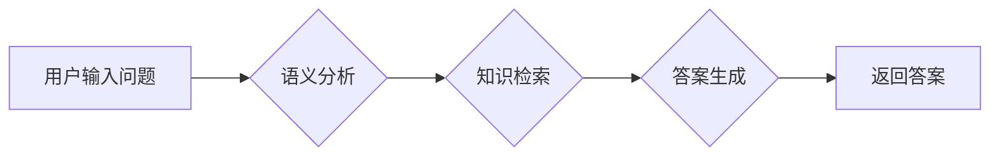

> 大模型、问答机器人、语义理解、自然语言处理、Transformer模型、BERT、GPT

## 1. 背景介绍

近年来，人工智能技术取得了飞速发展，其中自然语言处理（NLP）领域取得了突破性进展。大模型问答机器人作为NLP领域的重要应用之一，能够理解人类语言，并以自然流畅的方式进行对话和回答问题。然而，让机器人真正理解语义，而不是仅仅进行基于关键词匹配的简单响应，仍然是一个巨大的挑战。

传统的问答系统主要依赖于规则引擎和知识库，需要人工构建大量的规则和知识，难以应对复杂、开放式的问答场景。而大模型问答机器人则通过训练海量文本数据，学习语言的语义和结构，能够更好地理解用户意图，并生成更准确、更自然的回答。

## 2. 核心概念与联系

**2.1 语义理解**

语义理解是指机器能够理解文本的深层含义，识别词语之间的关系和上下文信息，从而获取文本的真实意图。

**2.2 自然语言处理（NLP）**

NLP是人工智能的一个分支，致力于使计算机能够理解、处理和生成人类语言。

**2.3 大模型**

大模型是指参数量巨大、训练数据量庞大的深度学习模型。大模型能够学习到更丰富的语言表示，从而提升语义理解能力。

**2.4 Transformer模型**

Transformer模型是一种新型的深度学习架构，其核心是注意力机制，能够有效地捕捉文本中的长距离依赖关系，显著提升了语言模型的性能。

**2.5 BERT、GPT**

BERT和GPT都是基于Transformer模型的预训练语言模型，分别擅长于理解上下文信息和生成文本。

**2.6 问答机器人**

问答机器人是一种能够与用户进行对话，并根据用户的问题提供答案的智能系统。

**2.7 流程图**



## 3. 核心算法原理 & 具体操作步骤

**3.1 算法原理概述**

大模型问答机器人通常采用以下核心算法：

* **词嵌入:** 将词语映射到低维向量空间，捕捉词语之间的语义关系。
* **句子编码:** 将句子编码为固定长度的向量，表示句子的语义信息。
* **注意力机制:** 捕捉句子中不同词语之间的关系，突出重要信息。
* **解码:** 根据输入问题和上下文信息，生成最合适的答案。

**3.2 算法步骤详解**

1. **预处理:** 对用户输入的问题进行预处理，例如分词、去停用词等。
2. **词嵌入:** 将预处理后的词语映射到词嵌入空间。
3. **句子编码:** 使用Transformer模型或其他编码器，将问题和上下文信息编码为向量表示。
4. **注意力机制:** 使用注意力机制，计算问题和上下文信息之间的相关性，突出关键信息。
5. **解码:** 使用解码器，根据编码后的信息生成答案。
6. **后处理:** 对生成的答案进行后处理，例如去重、规范化等。

**3.3 算法优缺点**

* **优点:** 能够理解复杂的语义关系，生成更自然流畅的答案。
* **缺点:** 训练成本高，需要大量的训练数据和计算资源。

**3.4 算法应用领域**

* **聊天机器人:** 提供更自然、更智能的对话体验。
* **搜索引擎:** 理解用户搜索意图，提供更精准的搜索结果。
* **问答系统:** 回答用户提出的各种问题，提供信息服务。

## 4. 数学模型和公式 & 详细讲解 & 举例说明

**4.1 数学模型构建**

大模型问答机器人通常使用Transformer模型作为其核心架构。Transformer模型由编码器和解码器组成，每个部分由多层Transformer模块构成。

**4.2 公式推导过程**

Transformer模型的核心是注意力机制，其计算公式如下：

$$
Attention(Q, K, V) = softmax(\frac{QK^T}{\sqrt{d_k}})V
$$

其中：

* $Q$：查询矩阵
* $K$：键矩阵
* $V$：值矩阵
* $d_k$：键向量的维度
* $softmax$：softmax函数

**4.3 案例分析与讲解**

假设我们有一个句子“我爱吃苹果”，我们要计算每个词语对句子的整体语义的影响。

* $Q$：每个词语的查询向量
* $K$：每个词语的键向量
* $V$：每个词语的值向量

通过计算注意力权重，我们可以得到每个词语对句子的贡献度。例如，“爱”这个词语的注意力权重可能比“吃”更高，因为它更直接地表达了情感。

## 5. 项目实践：代码实例和详细解释说明

**5.1 开发环境搭建**

* Python 3.7+
* PyTorch 1.7+
* Transformers 4.0+

**5.2 源代码详细实现**

```python
from transformers import AutoModelForQuestionAnswering, AutoTokenizer

# 加载预训练模型和分词器
model_name = "bert-base-uncased"
model = AutoModelForQuestionAnswering.from_pretrained(model_name)
tokenizer = AutoTokenizer.from_pretrained(model_name)

# 输入问题和上下文
question = "What is the capital of France?"
context = "France is a country in Europe. Its capital is Paris."

# 对问题和上下文进行编码
inputs = tokenizer(question, context, return_tensors="pt")

# 使用模型进行推理
outputs = model(**inputs)

# 获取答案
start_logits = outputs.start_logits
end_logits = outputs.end_logits
start_index = torch.argmax(start_logits).item()
end_index = torch.argmax(end_logits).item()

# 从上下文文本中提取答案
answer = context[start_index:end_index+1]

# 打印答案
print(answer)
```

**5.3 代码解读与分析**

* 我们首先加载预训练的BERT模型和分词器。
* 然后，我们将问题和上下文输入到模型中进行编码。
* 模型输出两个logits向量，分别表示答案的起始位置和结束位置。
* 我们通过argmax函数找到logits向量中的最大值，从而确定答案的起始和结束位置。
* 最后，我们从上下文文本中提取出对应的答案。

**5.4 运行结果展示**

```
Paris
```

## 6. 实际应用场景

大模型问答机器人已经应用于多个领域，例如：

* **客服机器人:** 自动回答用户常见问题，提高客服效率。
* **教育机器人:** 为学生提供个性化的学习辅导，解答学习疑问。
* **搜索引擎:** 理解用户搜索意图，提供更精准的搜索结果。

**6.4 未来应用展望**

随着大模型技术的不断发展，大模型问答机器人将有更广泛的应用场景，例如：

* **医疗诊断:** 辅助医生诊断疾病，提供个性化的治疗方案。
* **法律咨询:** 为用户提供法律咨询服务，解答法律问题。
* **金融分析:** 分析金融数据，提供投资建议。

## 7. 工具和资源推荐

**7.1 学习资源推荐**

* **书籍:**
    * 《深度学习》
    * 《自然语言处理》
* **在线课程:**
    * Coursera: Natural Language Processing Specialization
    * edX: Artificial Intelligence

**7.2 开发工具推荐**

* **PyTorch:** 深度学习框架
* **Transformers:** 预训练语言模型库
* **HuggingFace:** 预训练模型和数据集平台

**7.3 相关论文推荐**

* BERT: Pre-training of Deep Bidirectional Transformers for Language Understanding
* GPT: Generative Pre-trained Transformer

## 8. 总结：未来发展趋势与挑战

**8.1 研究成果总结**

近年来，大模型问答机器人取得了显著进展，能够理解更复杂的语义关系，生成更自然流畅的答案。

**8.2 未来发展趋势**

* **模型规模更大:** 训练更大规模的模型，提升语义理解能力。
* **多模态理解:** 融合文本、图像、音频等多模态信息，实现更全面的理解。
* **个性化定制:** 根据用户需求，定制个性化的问答机器人。

**8.3 面临的挑战**

* **数据标注:** 高质量的标注数据是训练大模型的关键，但标注成本高昂。
* **模型解释性:** 大模型的决策过程难以解释，缺乏透明度。
* **伦理问题:** 大模型问答机器人可能被用于传播虚假信息或进行恶意攻击，需要关注伦理问题。

**8.4 研究展望**

未来，大模型问答机器人将朝着更智能、更安全、更可解释的方向发展，为人类社会带来更多价值。

## 9. 附录：常见问题与解答

**9.1 如何训练自己的大模型问答机器人？**

需要准备大量的文本数据，并使用深度学习框架（如PyTorch）训练Transformer模型。

**9.2 如何评估大模型问答机器人的性能？**

可以使用标准的评估指标，例如准确率、F1-score等。

**9.3 大模型问答机器人有哪些伦理问题？**

* **虚假信息传播:** 大模型可能被用于生成虚假信息，误导用户。
* **偏见和歧视:** 大模型的训练数据可能包含偏见和歧视，导致模型输出结果存在偏见。
* **隐私泄露:** 大模型可能泄露用户隐私信息。


作者：禅与计算机程序设计艺术 / Zen and the Art of Computer Programming 
<end_of_turn>