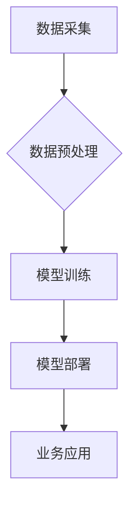

> 大模型、深度学习、自然语言处理、计算机视觉、商业智能、数据分析、人工智能

## 1. 背景介绍

近年来，人工智能（AI）技术取得了飞速发展，其中大模型作为AI领域的重要突破口，正在深刻地改变着我们生活和工作方式。大模型是指参数规模庞大、训练数据海量的人工智能模型，其强大的学习能力和泛化能力使其能够在自然语言处理、计算机视觉、语音识别等多个领域取得突破性进展。

商业智能（BI）作为企业决策支持的重要工具，一直致力于帮助企业从海量数据中挖掘价值，洞察市场趋势，优化运营效率。随着数据量的爆炸式增长和AI技术的成熟，大模型为BI领域带来了新的机遇和挑战。

## 2. 核心概念与联系

大模型的核心概念在于利用海量数据和强大的计算能力，训练出参数规模庞大的神经网络模型。这些模型能够学习到数据的复杂模式和规律，从而实现对数据的理解、分析和预测。

**大模型与商业智能的联系：**

大模型可以为商业智能提供更强大的数据分析能力，帮助企业从海量数据中挖掘更深层的洞察。例如：

* **预测分析：** 大模型可以学习历史数据中的模式，预测未来的趋势和事件，帮助企业做出更明智的决策。
* **客户画像：** 大模型可以分析客户的行为数据，构建更精准的客户画像，帮助企业更好地理解客户需求，提供个性化服务。
* **市场分析：** 大模型可以分析市场数据，识别市场趋势和竞争对手动态，帮助企业制定更有效的市场策略。

**大模型与商业智能的架构：**



## 3. 核心算法原理 & 具体操作步骤

### 3.1  算法原理概述

大模型的核心算法是深度学习，其主要原理是利用多层神经网络来模拟人类大脑的学习过程。深度学习模型通过不断学习和调整神经网络的权重，最终能够学习到数据的复杂模式和规律。

### 3.2  算法步骤详解

1. **数据收集和预处理：** 收集大量相关数据，并进行清洗、转换、格式化等预处理操作，以确保数据质量和模型训练的有效性。
2. **模型构建：** 根据具体任务需求，选择合适的深度学习模型架构，例如Transformer、BERT、GPT等。
3. **模型训练：** 使用训练数据对模型进行训练，通过调整模型参数，使模型能够准确地预测或分类数据。
4. **模型评估：** 使用测试数据对模型进行评估，衡量模型的准确率、召回率、F1-score等指标，并根据评估结果进行模型调优。
5. **模型部署：** 将训练好的模型部署到生产环境中，用于实际应用。

### 3.3  算法优缺点

**优点：**

* **强大的学习能力：** 深度学习模型能够学习到数据的复杂模式和规律，实现对数据的理解和分析。
* **泛化能力强：** 经过充分训练的深度学习模型能够应用于不同的数据和任务，具有较强的泛化能力。
* **自动化程度高：** 深度学习模型的训练和部署过程可以自动化，降低了人工成本。

**缺点：**

* **数据依赖性强：** 深度学习模型的性能取决于训练数据的质量和数量，数据不足或数据质量低会影响模型的性能。
* **计算资源需求高：** 训练大模型需要大量的计算资源，成本较高。
* **可解释性差：** 深度学习模型的决策过程较为复杂，难以解释模型的决策逻辑。

### 3.4  算法应用领域

深度学习算法广泛应用于各个领域，例如：

* **自然语言处理：** 文本分类、情感分析、机器翻译、对话系统等。
* **计算机视觉：** 图像识别、物体检测、图像分割、视频分析等。
* **语音识别：** 语音转文本、语音合成、语音助手等。
* **推荐系统：** 商品推荐、内容推荐、用户画像等。

## 4. 数学模型和公式 & 详细讲解 & 举例说明

### 4.1  数学模型构建

深度学习模型的核心是神经网络，其结构由多个层组成，每一层包含多个神经元。每个神经元接收来自上一层的输入信号，并通过激活函数进行处理，输出到下一层。

**神经网络模型的数学表示：**

* **输入层：** $x = [x_1, x_2, ..., x_n]$
* **隐藏层：** $h = f(W_1x + b_1)$
* **输出层：** $y = f(W_2h + b_2)$

其中：

* $x$ 是输入向量
* $h$ 是隐藏层激活值
* $y$ 是输出向量
* $W_1$, $W_2$ 是权重矩阵
* $b_1$, $b_2$ 是偏置向量
* $f$ 是激活函数

### 4.2  公式推导过程

深度学习模型的训练过程是通过优化模型参数来最小化损失函数的过程。损失函数衡量模型预测结果与真实结果之间的差异。常用的损失函数包括均方误差（MSE）、交叉熵损失等。

**均方误差损失函数：**

$$L = \frac{1}{n}\sum_{i=1}^{n}(y_i - \hat{y}_i)^2$$

其中：

* $y_i$ 是真实值
* $\hat{y}_i$ 是模型预测值
* $n$ 是样本数量

**梯度下降算法：**

梯度下降算法是一种常用的优化算法，其原理是通过计算损失函数的梯度，不断调整模型参数，使损失函数逐渐减小。

### 4.3  案例分析与讲解

**图像分类案例：**

假设我们训练一个图像分类模型，用于识别猫和狗的图片。我们可以使用深度学习模型，例如卷积神经网络（CNN），来实现这个任务。

CNN模型能够学习图像的特征，例如边缘、纹理等，并将其用于分类。训练过程中，我们会使用大量的猫狗图片，并标注它们的类别。模型会根据这些数据学习到猫和狗的特征，并能够识别新的猫狗图片。

## 5. 项目实践：代码实例和详细解释说明

### 5.1  开发环境搭建

* **操作系统：** Linux
* **编程语言：** Python
* **深度学习框架：** TensorFlow 或 PyTorch
* **硬件环境：** GPU

### 5.2  源代码详细实现

```python
# 使用 TensorFlow 框架实现一个简单的图像分类模型

import tensorflow as tf

# 定义模型结构
model = tf.keras.models.Sequential([
    tf.keras.layers.Conv2D(32, (3, 3), activation='relu', input_shape=(28, 28, 1)),
    tf.keras.layers.MaxPooling2D((2, 2)),
    tf.keras.layers.Conv2D(64, (3, 3), activation='relu'),
    tf.keras.layers.MaxPooling2D((2, 2)),
    tf.keras.layers.Flatten(),
    tf.keras.layers.Dense(10, activation='softmax')
])

# 编译模型
model.compile(optimizer='adam',
              loss='sparse_categorical_crossentropy',
              metrics=['accuracy'])

# 训练模型
model.fit(x_train, y_train, epochs=10)

# 评估模型
loss, accuracy = model.evaluate(x_test, y_test)
print('Test loss:', loss)
print('Test accuracy:', accuracy)
```

### 5.3  代码解读与分析

* **模型结构：** 代码定义了一个简单的卷积神经网络模型，包含两层卷积层、两层池化层、一层全连接层和一层输出层。
* **激活函数：** 使用ReLU激活函数，可以提高模型的学习能力。
* **损失函数：** 使用稀疏类别交叉熵损失函数，适合多分类问题。
* **优化器：** 使用Adam优化器，可以加速模型训练。
* **训练过程：** 使用训练数据训练模型，并设置训练轮数（epochs）。
* **评估过程：** 使用测试数据评估模型的性能，并打印测试损失和准确率。

### 5.4  运行结果展示

训练完成后，我们可以使用测试数据评估模型的性能。测试结果会显示模型的测试损失和准确率。

## 6. 实际应用场景

### 6.1  预测分析

大模型可以用于预测未来的趋势和事件，例如：

* **销售预测：** 根据历史销售数据，预测未来的销售额。
* **客户流失预测：** 根据客户行为数据，预测哪些客户可能会流失。
* **故障预测：** 根据设备运行数据，预测设备可能出现的故障。

### 6.2  客户画像

大模型可以分析客户的行为数据，构建更精准的客户画像，例如：

* **客户兴趣爱好：** 分析客户浏览历史、购买记录等数据，了解客户的兴趣爱好。
* **客户消费习惯：** 分析客户的购买频率、消费金额等数据，了解客户的消费习惯。
* **客户价值：** 根据客户的购买记录、互动行为等数据，评估客户的价值。

### 6.3  市场分析

大模型可以分析市场数据，识别市场趋势和竞争对手动态，例如：

* **市场趋势分析：** 分析市场数据，识别市场增长趋势和潜在机会。
* **竞争对手分析：** 分析竞争对手的产品、价格、营销策略等数据，了解竞争对手的优势和劣势。
* **产品开发：** 根据市场需求和竞争对手分析，开发新的产品或服务。

### 6.4  未来应用展望

随着大模型技术的不断发展，其在商业智能领域的应用将更加广泛和深入。例如：

* **个性化推荐：** 基于客户画像，提供更精准的个性化推荐。
* **智能客服：** 利用大模型训练的聊天机器人，提供更智能的客服服务。
* **数据可视化：** 利用大模型分析数据，生成更直观的图表和报告。

## 7. 工具和资源推荐

### 7.1  学习资源推荐

* **书籍：**
    * 《深度学习》
    * 《机器学习》
    * 《自然语言处理》
* **在线课程：**
    * Coursera
    * edX
    * Udacity

### 7.2  开发工具推荐

* **深度学习框架：** TensorFlow, PyTorch
* **数据处理工具：** Pandas, NumPy
* **可视化工具：** Matplotlib, Seaborn

### 7.3  相关论文推荐

* **Attention Is All You Need**
* **BERT: Pre-training of Deep Bidirectional Transformers for Language Understanding**
* **GPT-3: Language Models are Few-Shot Learners**

## 8. 总结：未来发展趋势与挑战

### 8.1  研究成果总结

大模型技术取得了显著的进展，在自然语言处理、计算机视觉等领域取得了突破性成果。大模型为商业智能提供了强大的数据分析能力，推动了商业智能的创新发展。

### 8.2  未来发展趋势

* **模型规模更大：** 未来大模型的规模将继续扩大，参数数量将达到数万亿甚至数千亿级别。
* **模型架构更复杂：** 未来大模型的架构将更加复杂，例如Transformer、GPT等模型架构将得到进一步发展。
* **多模态学习：** 未来大模型将能够处理多种数据类型，例如文本、图像、音频等，实现多模态学习。
* **边缘计算：** 未来大模型将部署到边缘设备上，实现更实时、更低延迟的应用。

### 8.3  面临的挑战

* **数据安全和隐私：** 大模型的训练需要大量数据，如何保证数据安全和隐私是一个重要的挑战。
* **模型可解释性：** 大模型的决策过程