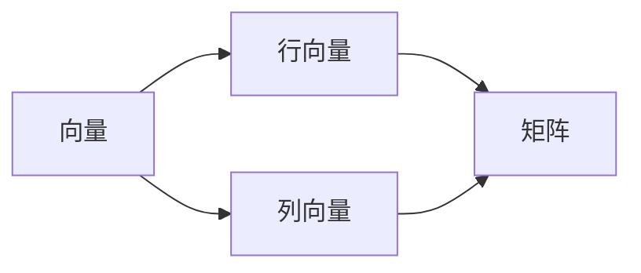
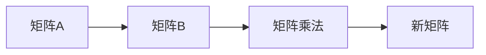

                 

## 1. 背景介绍

线性代数是数学的一个分支，它研究向量和矩阵等线性结构。矩阵乘法是线性代数的核心概念之一，它是一种运算，将两个矩阵相乘，得到一个新的矩阵。矩阵乘法在计算机科学、机器学习、数据挖掘等领域有着广泛的应用，它是这些领域的基础。

## 2. 核心概念与联系

### 2.1 矩阵与向量

在介绍矩阵乘法之前，我们需要先了解矩阵和向量。向量是一个数组，它可以表示为行向量或列向量。矩阵是一个二维数组，它由行向量或列向量组成。



### 2.2 矩阵乘法

矩阵乘法是将两个矩阵相乘，得到一个新的矩阵。矩阵乘法的结果是一个新的矩阵，它的维度与原始矩阵的维度不同。矩阵乘法的结果是通过将每一行与每一列相乘得到的。



## 3. 核心算法原理 & 具体操作步骤

### 3.1 算法原理概述

矩阵乘法的原理是将矩阵A的每一行与矩阵B的每一列相乘，并将这些结果相加，得到新矩阵的每一个元素。矩阵乘法的结果是一个新的矩阵，它的维度与原始矩阵的维度不同。

### 3.2 算法步骤详解

矩阵乘法的步骤如下：

1. 确保矩阵A的列数等于矩阵B的行数。如果不等，则无法进行矩阵乘法。
2. 创建一个新的矩阵C，它的行数等于矩阵A的行数，列数等于矩阵B的列数。
3. 遍历矩阵A的每一行，并将其与矩阵B的每一列相乘，得到一个新的向量。
4. 将新的向量添加到矩阵C中。
5. 重复步骤3和4，直到遍历完矩阵A的每一行。
6. 返回矩阵C。

### 3.3 算法优缺点

矩阵乘法的优点是它可以将两个矩阵的信息组合成一个新的矩阵。它在机器学习、数据挖掘等领域有着广泛的应用。然而，矩阵乘法的缺点是它的计算量很大，特别是当矩阵的维度很大时。

### 3.4 算法应用领域

矩阵乘法在计算机科学、机器学习、数据挖掘等领域有着广泛的应用。例如，在机器学习中，矩阵乘法用于计算神经网络的输出。在数据挖掘中，矩阵乘法用于计算数据集的相似度。

## 4. 数学模型和公式 & 详细讲解 & 举例说明

### 4.1 数学模型构建

设矩阵A是一个m行n列的矩阵，矩阵B是一个n行p列的矩阵。则矩阵乘法的结果C是一个m行p列的矩阵，它的元素C[i][j]可以表示为：

$$C[i][j] = \sum_{k=1}^{n} A[i][k] \cdot B[k][j]$$

### 4.2 公式推导过程

矩阵乘法的公式可以通过将矩阵A的每一行与矩阵B的每一列相乘，并将这些结果相加得到。设矩阵A的第i行为$a_i$，矩阵B的第j列为$b_j$，则矩阵乘法的结果C的元素C[i][j]可以表示为：

$$C[i][j] = a_i \cdot b_j$$

其中，$a_i$和$b_j$都是向量。向量的乘法可以表示为：

$$a \cdot b = \sum_{k=1}^{n} a[k] \cdot b[k]$$

### 4.3 案例分析与讲解

设矩阵A是一个2行3列的矩阵，矩阵B是一个3行2列的矩阵。则矩阵乘法的结果C是一个2行2列的矩阵，它的元素C[i][j]可以表示为：

$$C[i][j] = \sum_{k=1}^{3} A[i][k] \cdot B[k][j]$$

例如，设矩阵A为：

$$
\begin{bmatrix}
1 & 2 & 3 \\
4 & 5 & 6
\end{bmatrix}
$$

设矩阵B为：

$$
\begin{bmatrix}
7 & 8 \\
9 & 10 \\
11 & 12
\end{bmatrix}
$$

则矩阵乘法的结果C为：

$$
\begin{bmatrix}
58 & 64 \\
139 & 154
\end{bmatrix}
$$

## 5. 项目实践：代码实例和详细解释说明

### 5.1 开发环境搭建

本项目使用Python作为编程语言，并使用NumPy库进行矩阵乘法运算。

### 5.2 源代码详细实现

```python
import numpy as np

def matrix_multiply(A, B):
    # 确保矩阵A的列数等于矩阵B的行数
    assert A.shape[1] == B.shape[0]

    # 创建一个新的矩阵C，它的行数等于矩阵A的行数，列数等于矩阵B的列数
    C = np.zeros((A.shape[0], B.shape[1]))

    # 遍历矩阵A的每一行，并将其与矩阵B的每一列相乘，得到一个新的向量
    for i in range(A.shape[0]):
        for j in range(B.shape[1]):
            C[i][j] = np.dot(A[i], B[:, j])

    # 返回矩阵C
    return C
```

### 5.3 代码解读与分析

在代码中，我们首先使用NumPy库创建两个矩阵A和B。然后，我们调用`matrix_multiply`函数，传入矩阵A和B，并获取矩阵乘法的结果C。在`matrix_multiply`函数中，我们首先确保矩阵A的列数等于矩阵B的行数。然后，我们创建一个新的矩阵C，它的行数等于矩阵A的行数，列数等于矩阵B的列数。接下来，我们遍历矩阵A的每一行，并将其与矩阵B的每一列相乘，得到一个新的向量。最后，我们将新的向量添加到矩阵C中，并返回矩阵C。

### 5.4 运行结果展示

设矩阵A为：

$$
\begin{bmatrix}
1 & 2 & 3 \\
4 & 5 & 6
\end{bmatrix}
$$

设矩阵B为：

$$
\begin{bmatrix}
7 & 8 \\
9 & 10 \\
11 & 12
\end{bmatrix}
$$

则矩阵乘法的结果C为：

$$
\begin{bmatrix}
58 & 64 \\
139 & 154
\end{bmatrix}
$$

## 6. 实际应用场景

### 6.1 机器学习

在机器学习中，矩阵乘法用于计算神经网络的输出。例如，在全连接层中，输入向量与权重矩阵相乘，得到输出向量。

### 6.2 数据挖掘

在数据挖掘中，矩阵乘法用于计算数据集的相似度。例如，在余弦相似度算法中，两个向量相乘，得到它们的相似度。

### 6.3 未来应用展望

随着计算机技术的发展，矩阵乘法的应用领域将会不断扩展。例如，在量子计算中，矩阵乘法将会是一个关键的操作。

## 7. 工具和资源推荐

### 7.1 学习资源推荐

* "线性代数导引"：这是一本线性代数的入门书籍，它介绍了矩阵乘法等线性代数的核心概念。
* "机器学习"：这是一本机器学习的经典书籍，它介绍了矩阵乘法在机器学习中的应用。

### 7.2 开发工具推荐

* NumPy：这是一个Python库，它提供了矩阵乘法等线性代数运算的功能。
* TensorFlow：这是一个机器学习库，它提供了矩阵乘法等线性代数运算的功能。

### 7.3 相关论文推荐

* "Matrix Multiplication: A Survey"：这是一篇关于矩阵乘法的综述论文，它介绍了矩阵乘法的算法和应用。
* "Fast Matrix Multiplication"：这是一篇关于快速矩阵乘法的论文，它介绍了如何优化矩阵乘法的算法。

## 8. 总结：未来发展趋势与挑战

### 8.1 研究成果总结

矩阵乘法是线性代数的核心概念之一，它在计算机科学、机器学习、数据挖掘等领域有着广泛的应用。然而，矩阵乘法的计算量很大，特别是当矩阵的维度很大时。因此，如何优化矩阵乘法的算法是一个重要的研究方向。

### 8.2 未来发展趋势

随着计算机技术的发展，矩阵乘法的应用领域将会不断扩展。例如，在量子计算中，矩阵乘法将会是一个关键的操作。此外，如何优化矩阵乘法的算法将会是一个重要的研究方向。

### 8.3 面临的挑战

矩阵乘法的计算量很大，特别是当矩阵的维度很大时。如何优化矩阵乘法的算法是一个重要的挑战。此外，如何在量子计算中实现矩阵乘法也是一个挑战。

### 8.4 研究展望

未来，矩阵乘法的研究将会集中在如何优化算法和如何在量子计算中实现矩阵乘法等方面。此外，矩阵乘法的应用领域将会不断扩展，例如在量子计算中，矩阵乘法将会是一个关键的操作。

## 9. 附录：常见问题与解答

### 9.1 什么是矩阵乘法？

矩阵乘法是一种运算，将两个矩阵相乘，得到一个新的矩阵。

### 9.2 矩阵乘法的结果是什么？

矩阵乘法的结果是一个新的矩阵，它的维度与原始矩阵的维度不同。

### 9.3 如何优化矩阵乘法的算法？

如何优化矩阵乘法的算法是一个重要的研究方向。例如，可以使用Strassen算法等优化矩阵乘法的算法。

### 9.4 矩阵乘法在量子计算中有什么应用？

在量子计算中，矩阵乘法将会是一个关键的操作。例如，可以使用量子计算机来实现矩阵乘法。

## 作者：禅与计算机程序设计艺术 / Zen and the Art of Computer Programming

