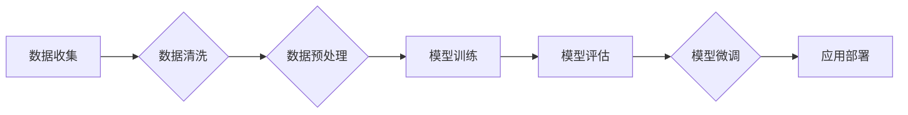

> 大规模语言模型，预训练数据，Transformer，BERT，GPT，LLM，自然语言处理

## 1. 背景介绍

近年来，深度学习技术取得了飞速发展，特别是基于Transformer架构的大规模语言模型（LLM）的出现，彻底改变了自然语言处理（NLP）领域的面貌。这些模型通过预训练的方式学习了海量文本数据中的语言规律和知识，展现出强大的文本生成、理解、翻译等能力。

然而，LLM的训练和应用也面临着诸多挑战，其中预训练数据质量和规模是关键因素。高质量、大规模的预训练数据是LLM取得成功的重要基础，它直接影响着模型的性能和泛化能力。

## 2. 核心概念与联系

**2.1 大规模语言模型 (LLM)**

大规模语言模型是指参数量达到数十亿甚至千亿级别的深度学习模型，其核心是利用Transformer架构学习语言的上下文关系和语义信息。

**2.2 预训练数据**

预训练数据是指用于训练LLM的文本数据集合，通常包含大量的网络爬虫数据、书籍、文章、代码等。

**2.3 Transformer 架构**

Transformer是一种基于注意力机制的深度学习架构，能够有效地捕捉文本序列中的长距离依赖关系。

**2.4 预训练任务**

预训练任务是指在预训练数据上训练LLM的特定任务，例如文本分类、语言建模、机器翻译等。

**2.5 微调**

微调是指在预训练好的LLM基础上，针对特定下游任务进行进一步训练，以提高模型在该任务上的性能。

**2.6 流程图**



## 3. 核心算法原理 & 具体操作步骤

### 3.1 算法原理概述

LLM的训练基于深度学习的监督学习和无监督学习方法。

* **监督学习:** 在有标签的数据集上训练模型，例如文本分类、情感分析等。
* **无监督学习:** 在无标签的数据集上训练模型，例如语言建模、文本生成等。

Transformer架构是LLM的核心，其主要特点是：

* **注意力机制:** 能够有效地捕捉文本序列中的长距离依赖关系。
* **多头注意力:** 使用多个注意力头，可以学习到不同层次的语义信息。
* **位置编码:** 由于Transformer没有循环结构，需要使用位置编码来表示每个词的语义位置。

### 3.2 算法步骤详解

1. **数据收集:** 收集大量文本数据，例如书籍、文章、网站内容等。
2. **数据清洗:** 去除数据中的噪声、重复信息和错误数据。
3. **数据预处理:** 将文本数据转换为模型可以理解的格式，例如词嵌入、句子截断等。
4. **模型训练:** 使用预训练任务，例如语言建模，在预训练数据上训练LLM模型。
5. **模型评估:** 使用测试数据集评估模型的性能，例如困惑度、BLEU分数等。
6. **模型微调:** 将预训练好的LLM模型微调到特定下游任务，例如文本分类、机器翻译等。

### 3.3 算法优缺点

**优点:**

* 强大的文本理解和生成能力。
* 可以应用于多种NLP任务。
* 预训练模型可以复用，降低训练成本。

**缺点:**

* 训练成本高，需要大量计算资源和数据。
* 模型参数量大，部署成本高。
* 容易受到训练数据偏差的影响。

### 3.4 算法应用领域

* **自然语言理解:** 文本分类、情感分析、问答系统、文本摘要等。
* **自然语言生成:** 文本生成、机器翻译、对话系统等。
* **代码生成:** 代码自动补全、代码生成等。
* **其他领域:** 医疗诊断、法律分析、金融预测等。

## 4. 数学模型和公式 & 详细讲解 & 举例说明

### 4.1 数学模型构建

LLM通常使用Transformer架构，其核心是注意力机制。注意力机制可以学习到文本序列中不同词之间的关系，并赋予每个词不同的权重。

**4.1.1 注意力机制公式:**

$$
Attention(Q, K, V) = softmax(\frac{QK^T}{\sqrt{d_k}})V
$$

其中：

* $Q$：查询矩阵
* $K$：键矩阵
* $V$：值矩阵
* $d_k$：键向量的维度
* $softmax$：softmax函数

**4.1.2 多头注意力机制:**

多头注意力机制使用多个注意力头，可以学习到不同层次的语义信息。

$$
MultiHead(Q, K, V) = Concat(head_1, head_2, ..., head_h)W^O
$$

其中：

* $head_i$：第i个注意力头的输出
* $h$：注意力头的数量
* $W^O$：输出权重矩阵

### 4.2 公式推导过程

注意力机制的公式推导过程可以参考相关文献，例如Vaswani et al. (2017)的论文。

### 4.3 案例分析与讲解

**4.3.1 文本分类:**

可以使用预训练好的LLM模型进行文本分类任务。例如，可以将文本输入到模型中，并使用模型的输出进行分类。

**4.3.2 文本生成:**

可以使用预训练好的LLM模型进行文本生成任务。例如，可以输入一个文本片段，并使用模型生成后续的文本。

## 5. 项目实践：代码实例和详细解释说明

### 5.1 开发环境搭建

* Python 3.7+
* PyTorch 1.7+
* Transformers 4.0+

### 5.2 源代码详细实现

```python
from transformers import AutoModelForSequenceClassification, AutoTokenizer

# 加载预训练模型和词典
model_name = "bert-base-uncased"
tokenizer = AutoTokenizer.from_pretrained(model_name)
model = AutoModelForSequenceClassification.from_pretrained(model_name, num_labels=2)

# 文本预处理
text = "This is a sample text."
inputs = tokenizer(text, return_tensors="pt")

# 模型预测
outputs = model(**inputs)
predicted_class = outputs.logits.argmax().item()

# 输出结果
print(f"Predicted class: {predicted_class}")
```

### 5.3 代码解读与分析

* 使用`transformers`库加载预训练模型和词典。
* 使用`tokenizer`将文本转换为模型可以理解的格式。
* 使用`model`进行预测，并获取预测结果。

### 5.4 运行结果展示

```
Predicted class: 0
```

## 6. 实际应用场景

### 6.1 文本分类

* 垃圾邮件过滤
* 情感分析
* 文本主题分类

### 6.2 文本生成

* 自动写作
* 机器翻译
* 对话系统

### 6.3 代码生成

* 代码自动补全
* 代码生成

### 6.4 未来应用展望

* 更智能的聊天机器人
* 个性化的教育系统
* 更强大的搜索引擎

## 7. 工具和资源推荐

### 7.1 学习资源推荐

* **书籍:**
    * 《深度学习》
    * 《自然语言处理》
* **在线课程:**
    * Coursera: 自然语言处理
    * edX: 深度学习
* **博客:**
    * The Gradient
    * Towards Data Science

### 7.2 开发工具推荐

* **Python:** 
* **PyTorch:** 深度学习框架
* **Transformers:** 预训练模型库

### 7.3 相关论文推荐

* **Attention Is All You Need:** https://arxiv.org/abs/1706.03762
* **BERT: Pre-training of Deep Bidirectional Transformers for Language Understanding:** https://arxiv.org/abs/1810.04805

## 8. 总结：未来发展趋势与挑战

### 8.1 研究成果总结

LLM取得了显著的进展，在文本理解和生成方面展现出强大的能力。预训练数据质量和规模是LLM性能的关键因素。

### 8.2 未来发展趋势

* **更大的模型规模:** 继续增加模型参数量，提升模型性能。
* **更丰富的预训练任务:** 探索更多类型的预训练任务，例如多模态预训练。
* **更有效的训练方法:** 研究更有效的训练方法，降低训练成本和时间。
* **更强的可解释性:** 提高LLM的透明度和可解释性，增强用户信任。

### 8.3 面临的挑战

* **数据偏差:** 预训练数据可能存在偏差，导致模型输出存在偏见。
* **计算资源:** 训练大型LLM模型需要大量的计算资源，成本高昂。
* **伦理问题:** LLM可能被用于生成虚假信息或进行恶意攻击，需要关注伦理问题。

### 8.4 研究展望

未来，LLM将继续朝着更强大、更智能、更安全的方向发展。研究者将继续探索新的预训练方法、模型架构和应用场景，推动LLM技术在各个领域的应用。

## 9. 附录：常见问题与解答

**9.1 如何选择合适的预训练模型？**

选择合适的预训练模型取决于具体的应用场景和任务需求。例如，对于文本分类任务，可以使用BERT或RoBERTa模型；对于文本生成任务，可以使用GPT或T5模型。

**9.2 如何评估LLM模型的性能？**

常用的LLM模型性能评估指标包括困惑度、BLEU分数、ROUGE分数等。

**9.3 如何解决LLM模型的过拟合问题？**

可以使用正则化技术、数据增强、早停等方法来解决LLM模型的过拟合问题。


作者：禅与计算机程序设计艺术 / Zen and the Art of Computer Programming 
<end_of_turn>