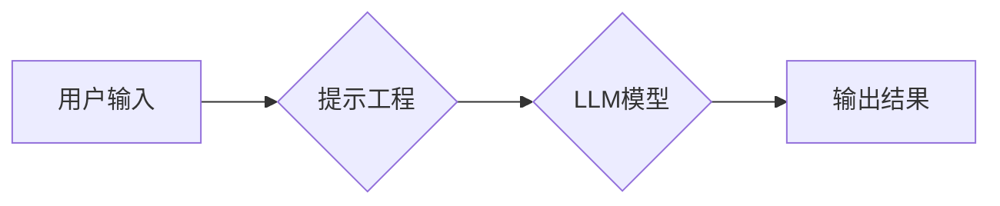

> 大规模语言模型，LLM，提示工程，Few-Shot Learning，Fine-Tuning，Transformer，自然语言处理，NLP

## 1. 背景介绍

近年来，大规模语言模型（Large Language Models，LLMs）在自然语言处理（Natural Language Processing，NLP）领域取得了令人瞩目的成就。从 GPT-3 到 LaMDA，这些模型展现出惊人的文本生成、翻译、问答和代码生成能力。然而，LLMs 的强大功能往往需要大量的训练数据和计算资源，并且在实际应用中，往往需要针对特定任务进行微调。

提示工程（Prompt Engineering）作为一种新的技术范式，为 LLMs 的应用提供了新的思路。通过精心设计和优化输入提示，我们可以引导 LLMs 生成更准确、更符合预期结果的输出，甚至无需进行大量的数据微调。

## 2. 核心概念与联系

提示工程的核心在于利用 LLMs 的强大的语义理解和文本生成能力，通过精心设计的提示引导模型生成期望的输出。

**提示（Prompt）**：是指输入给 LLMs 的文本信息，它包含了模型需要完成的任务描述、输入数据以及其他相关信息。

**Few-Shot Learning**：是指在少量示例数据下，通过学习模式和规律，能够对新数据进行预测或分类。提示工程可以有效地利用 Few-Shot Learning 的原理，通过提供少量示例数据，引导 LLMs 学习特定任务的规则。

**Fine-Tuning**：是指在预训练模型的基础上，针对特定任务进行微调，以提高模型在该任务上的性能。提示工程可以作为 Fine-Tuning 的替代方案，在某些情况下，通过精心设计的提示，可以达到与 Fine-Tuning 相似的效果，而无需进行大量的参数更新。

**Mermaid 流程图**



## 3. 核心算法原理 & 具体操作步骤

### 3.1  算法原理概述

提示工程的核心算法原理是基于 Transformer 模型的 self-attention 机制。

Transformer 模型通过 self-attention 机制，能够捕捉文本序列中单词之间的语义关系，理解上下文信息。通过精心设计的提示，我们可以引导模型关注特定的信息，并生成符合预期结果的输出。

### 3.2  算法步骤详解

1. **定义任务：**首先需要明确 LLMs 需要完成的任务，例如文本分类、文本生成、问答等。

2. **设计提示：**根据任务需求，设计合适的提示，包含任务描述、输入数据以及其他相关信息。

3. **输入提示：**将设计好的提示输入到 LLMs 中。

4. **模型生成输出：**LLMs 根据提示信息进行处理，生成相应的输出结果。

5. **评估结果：**评估输出结果的质量，并根据需要进行提示的调整和优化。

### 3.3  算法优缺点

**优点：**

* **无需大量数据：**提示工程可以有效地利用 Few-Shot Learning 的原理，在少量示例数据下，引导 LLMs 学习特定任务。
* **降低训练成本：**相比于 Fine-Tuning，提示工程不需要进行大量的参数更新，可以降低训练成本。
* **提高灵活性：**通过调整提示，可以引导 LLMs 生成不同的输出结果，提高模型的灵活性。

**缺点：**

* **提示设计难度：**设计有效的提示需要一定的经验和技巧，并非易事。
* **提示效果不稳定：**对于某些任务，提示效果可能不稳定，需要进行多次调整和优化。

### 3.4  算法应用领域

提示工程在 NLP 领域有着广泛的应用，例如：

* **文本分类：**通过设计合适的提示，可以引导 LLMs 对文本进行分类，例如情感分析、主题分类等。
* **文本生成：**可以通过提示引导 LLMs 生成不同风格的文本，例如诗歌、小说、新闻报道等。
* **问答系统：**通过设计问答提示，可以引导 LLMs 回答用户的问题，例如搜索引擎、聊天机器人等。
* **代码生成：**可以通过提示引导 LLMs 生成代码，例如代码补全、代码翻译等。

## 4. 数学模型和公式 & 详细讲解 & 举例说明

### 4.1  数学模型构建

LLMs 通常基于 Transformer 模型架构，其核心是 self-attention 机制。

**Self-Attention 机制**

Self-attention 机制可以理解为一种“注意力机制”，它允许模型关注文本序列中不同单词之间的关系。

**公式：**

$$
Attention(Q, K, V) = \frac{exp(Q \cdot K^T / \sqrt{d_k})}{exp(Q \cdot K^T / \sqrt{d_k})} \cdot V
$$

其中：

* $Q$：查询矩阵
* $K$：键矩阵
* $V$：值矩阵
* $d_k$：键向量的维度

**解释：**

该公式计算每个单词与其他单词之间的注意力权重，然后根据这些权重对值矩阵进行加权求和，得到最终的输出。

### 4.2  公式推导过程

Self-attention 机制通过以下步骤计算注意力权重：

1. 将输入序列中的每个单词分别转换为查询向量 $Q$、键向量 $K$ 和值向量 $V$。

2. 计算查询向量与每个键向量的点积，并进行归一化处理，得到注意力权重。

3. 根据注意力权重对值向量进行加权求和，得到最终的输出。

### 4.3  案例分析与讲解

假设我们有一个句子：“The cat sat on the mat”。

我们可以将每个单词分别转换为查询向量、键向量和值向量。然后，计算每个单词的注意力权重，例如，“cat” 的注意力权重会比较高，因为它与 “sat” 和 “on” 相关。

最终，通过加权求和，我们可以得到每个单词的输出向量，这些输出向量包含了单词之间的语义关系和上下文信息。

## 5. 项目实践：代码实例和详细解释说明

### 5.1  开发环境搭建

* Python 3.7+
* PyTorch 或 TensorFlow
* Transformers 库

### 5.2  源代码详细实现

```python
from transformers import AutoModelForSeq2SeqLM, AutoTokenizer

# 加载预训练模型和词典
model_name = "t5-base"
tokenizer = AutoTokenizer.from_pretrained(model_name)
model = AutoModelForSeq2SeqLM.from_pretrained(model_name)

# 定义提示
prompt = "翻译以下句子：Hello, world!"

# 将提示转换为输入格式
inputs = tokenizer(prompt, return_tensors="pt")

# 生成输出
outputs = model.generate(**inputs)

# 将输出转换为文本
translation = tokenizer.decode(outputs[0], skip_special_tokens=True)

# 打印结果
print(translation)
```

### 5.3  代码解读与分析

* 该代码首先加载预训练的 T5 模型和词典。
* 然后定义一个提示，并将其转换为模型输入格式。
* 使用模型生成输出，并将其转换为文本。
* 最后打印翻译结果。

### 5.4  运行结果展示

```
Bonjour le monde!
```

## 6. 实际应用场景

### 6.1  文本生成

* **小说、诗歌创作：**通过设计合适的提示，可以引导 LLMs 生成不同风格的文本，例如小说、诗歌、剧本等。
* **广告文案撰写：**LLMs 可以根据产品信息和目标客户群体，生成吸引人的广告文案。
* **新闻报道生成：**LLMs 可以根据事件信息，自动生成新闻报道。

### 6.2  文本分类

* **情感分析：**LLMs 可以分析文本的情感倾向，例如正面、负面、中性等。
* **主题分类：**LLMs 可以根据文本内容，将其分类到不同的主题类别。
* **垃圾邮件过滤：**LLMs 可以识别垃圾邮件，并将其过滤掉。

### 6.3  问答系统

* **搜索引擎：**LLMs 可以理解用户查询意图，并返回相关结果。
* **聊天机器人：**LLMs 可以与用户进行自然语言对话，回答用户的问题。
* **知识问答系统：**LLMs 可以根据知识库中的信息，回答用户的问题。

### 6.4  未来应用展望

* **个性化教育：**LLMs 可以根据学生的学习进度和需求，提供个性化的学习内容和辅导。
* **医疗诊断辅助：**LLMs 可以辅助医生进行疾病诊断，提高诊断准确率。
* **法律文本分析：**LLMs 可以分析法律文本，并提供法律建议。

## 7. 工具和资源推荐

### 7.1  学习资源推荐

* **Hugging Face Transformers 库文档：**https://huggingface.co/docs/transformers/index
* **OpenAI API 文档：**https://beta.openai.com/docs/api-reference/introduction
* **Google AI Blog：**https://ai.googleblog.com/

### 7.2  开发工具推荐

* **Jupyter Notebook：**https://jupyter.org/
* **Google Colab：**https://colab.research.google.com/

### 7.3  相关论文推荐

* **Attention Is All You Need：**https://arxiv.org/abs/1706.03762
* **BERT: Pre-training of Deep Bidirectional Transformers for Language Understanding：**https://arxiv.org/abs/1810.04805
* **GPT-3: Language Models are Few-Shot Learners：**https://arxiv.org/abs/2005.14165

## 8. 总结：未来发展趋势与挑战

### 8.1  研究成果总结

近年来，LLMs 在 NLP 领域取得了显著进展，提示工程作为一种新的技术范式，为 LLMs 的应用提供了新的思路。

### 8.2  未来发展趋势

* **更强大的 LLMs：**随着计算资源的不断发展，我们将看到更强大、更复杂的 LLMs。
* **更有效的提示设计：**研究人员将继续探索更有效的提示设计方法，以提高 LLMs 的性能。
* **更广泛的应用场景：**LLMs 将在更多领域得到应用，例如医疗、教育、法律等。

### 8.3  面临的挑战

* **数据安全和隐私：**LLMs 的训练需要大量数据，如何保证数据安全和隐私是一个重要的挑战。
* **模型可解释性：**LLMs 的决策过程往往难以理解，如何提高模型的可解释性是一个重要的研究方向。
* **伦理问题：**LLMs 的应用可能带来一些伦理问题，例如信息操纵、偏见等，需要引起足够的重视。

### 8.4  研究展望

未来，LLMs 将继续朝着更强大、更智能、更安全的方向发展。提示工程将成为 LLMs 应用的重要组成部分，并推动 LLMs 在更多领域得到应用。

## 9. 附录：常见问题与解答

**Q1：如何设计有效的提示？**

A1：设计有效的提示需要考虑以下因素：

* **任务描述：**清晰地描述 LLMs 需要完成的任务。
* **输入数据：**提供足够的输入数据，帮助 LLMs 理解任务要求。
* **示例数据：**提供一些示例数据，引导 LLMs 学习任务规则。
* **语气和风格：**根据任务需求，调整提示的语气和风格。

**Q2：提示工程与 Fine-Tuning 的区别是什么？**

A2：提示工程和 Fine-Tuning 都是用于提高 LLMs 性能的方法，但它们的工作方式不同：

* **提示工程：**通过设计合适的提示，引导 LLMs 生成期望的输出，无需进行参数更新。
* **Fine-Tuning：**在预训练模型的基础上，针对特定任务进行参数更新，以提高模型在该任务上的性能。

**Q3：提示工程的局限性是什么？**

A3：提示工程的局限性包括：

* **提示设计难度：**设计有效的提示需要一定的经验和技巧。
* **提示效果不稳定：**对于某些任务