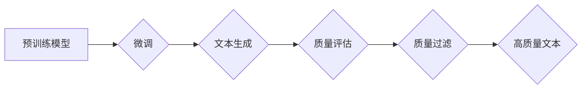

> 大规模语言模型，质量过滤，文本生成，机器学习，自然语言处理，预训练模型，微调

## 1. 背景介绍

大规模语言模型（LLM）近年来取得了令人瞩目的成就，在文本生成、机器翻译、问答系统等领域展现出强大的能力。然而，LLM生成的文本也可能存在质量问题，例如逻辑错误、事实错误、偏见和毒性等。因此，高质量的文本生成成为LLM研究和应用的关键挑战之一。

质量过滤是指在LLM文本生成过程中，对生成的文本进行评估和筛选，以确保其质量符合预期标准。高质量的文本应具备以下特点：

* **准确性:** 文本内容准确无误，符合事实。
* **连贯性:** 文本结构清晰，逻辑流畅，语义连贯。
* **相关性:** 文本内容与用户需求或上下文相关。
* **多样性:** 文本表达丰富多样，避免重复和单调。
* **客观性:** 文本避免表达个人观点或偏见，保持客观公正。

## 2. 核心概念与联系

质量过滤是一个多方面的技术问题，涉及到自然语言处理（NLP）、机器学习（ML）和人工智能（AI）等多个领域。

**2.1 核心概念**

* **预训练模型:**  LLM通常基于预训练模型，例如GPT-3、BERT等，这些模型在海量文本数据上进行预训练，学习了语言的语法和语义知识。
* **微调:**  根据特定任务，对预训练模型进行微调，使其能够生成符合特定需求的文本。
* **质量指标:** 用于评估文本质量的指标，例如BLEU、ROUGE、PERPLEXITY等。
* **过滤策略:** 用于筛选高质量文本的策略，例如基于规则、基于机器学习、基于人类评估等。

**2.2 架构图**



## 3. 核心算法原理 & 具体操作步骤

### 3.1 算法原理概述

质量过滤算法通常基于以下原理：

* **基于规则:**  定义一组规则，用于检测文本中的错误或不符合规范的内容。
* **基于机器学习:**  训练机器学习模型，用于预测文本质量，并根据预测结果进行筛选。
* **基于人类评估:**  由人类专家对文本进行评估，并根据评估结果进行筛选。

### 3.2 算法步骤详解

**3.2.1 基于规则的质量过滤**

1. 定义一组规则，例如检测语法错误、拼写错误、重复语句等。
2. 使用正则表达式或其他文本处理工具，对文本进行匹配。
3. 根据匹配结果，对文本进行过滤或修改。

**3.2.2 基于机器学习的质量过滤**

1. 收集大量文本数据，并对数据进行标注，例如标记文本的质量等级。
2. 选择合适的机器学习模型，例如支持向量机（SVM）、随机森林（RF）、深度神经网络（DNN）等。
3. 使用训练数据训练机器学习模型。
4. 使用训练好的模型对新的文本进行预测，并根据预测结果进行筛选。

**3.2.3 基于人类评估的质量过滤**

1. 邀请人类专家对文本进行评估，并根据评估结果进行评分。
2. 根据评分结果，对文本进行筛选。

### 3.3 算法优缺点

| 算法类型 | 优点 | 缺点 |
|---|---|---|
| 基于规则 | 简单易实现，效率高 | 规则难以覆盖所有情况，容易出现漏检或误检 |
| 基于机器学习 | 可以学习复杂的文本特征，准确率高 | 需要大量训练数据，训练时间长 |
| 基于人类评估 | 准确率高，可以捕捉到一些规则和机器学习模型无法捕捉到的细节 | 成本高，效率低 |

### 3.4 算法应用领域

质量过滤算法广泛应用于以下领域：

* **搜索引擎:**  过滤搜索结果中的低质量网页。
* **社交媒体:**  过滤垃圾信息、恶意评论和谣言。
* **新闻媒体:**  过滤虚假新闻和不实信息。
* **教育:**  过滤学生作业中的抄袭和错误。
* **医疗:**  过滤医疗信息中的错误和误导性内容。

## 4. 数学模型和公式 & 详细讲解 & 举例说明

### 4.1 数学模型构建

质量过滤算法通常基于以下数学模型：

* **概率模型:**  使用概率模型来预测文本质量，例如贝叶斯网络、隐马尔可夫模型等。
* **深度学习模型:**  使用深度学习模型来学习文本特征，例如循环神经网络（RNN）、长短期记忆网络（LSTM）、Transformer等。

### 4.2 公式推导过程

**4.2.1 贝叶斯网络**

贝叶斯网络是一种概率图模型，用于表示随机变量之间的依赖关系。在质量过滤中，可以构建一个贝叶斯网络，其中节点代表文本的特征，边代表特征之间的依赖关系。

**公式:**

$$P(Q|F) = \frac{P(F|Q)P(Q)}{P(F)}$$

其中：

* $P(Q|F)$ 是给定特征 $F$ 的情况下文本质量 $Q$ 的概率。
* $P(F|Q)$ 是给定文本质量 $Q$ 的情况下特征 $F$ 的概率。
* $P(Q)$ 是文本质量 $Q$ 的先验概率。
* $P(F)$ 是特征 $F$ 的边缘概率。

**4.2.2 深度学习模型**

深度学习模型可以学习文本的复杂特征，并预测文本质量。例如，可以使用Transformer模型来学习文本的语义和结构信息，并预测文本的质量得分。

**公式:**

$$Score = f(Input, Parameters)$$

其中：

* $Score$ 是文本的质量得分。
* $Input$ 是文本的输入序列。
* $Parameters$ 是模型的参数。
* $f$ 是模型的激活函数。

### 4.3 案例分析与讲解

**4.3.1 基于规则的质量过滤案例**

假设我们想要过滤掉包含敏感词的文本。我们可以定义一个规则，例如检测文本中是否包含“暴力”、“色情”等敏感词。

**4.3.2 基于机器学习的质量过滤案例**

假设我们想要过滤掉低质量的新闻文章。我们可以收集大量新闻文章数据，并对数据进行标注，例如标记文章的质量等级。然后，我们可以使用机器学习模型，例如SVM，来训练一个质量过滤模型。

## 5. 项目实践：代码实例和详细解释说明

### 5.1 开发环境搭建

* **操作系统:**  Linux/macOS/Windows
* **编程语言:**  Python
* **深度学习框架:**  TensorFlow/PyTorch
* **文本处理库:**  NLTK/spaCy

### 5.2 源代码详细实现

```python
# 基于规则的质量过滤示例

import re

def filter_text(text):
  """
  使用正则表达式过滤文本中的敏感词。
  """
  sensitive_words = ["暴力", "色情"]
  for word in sensitive_words:
    if re.search(word, text):
      return False
  return True

# 示例使用
text = "这是一篇关于暴力的文章。"
if filter_text(text):
  print("文本通过过滤")
else:
  print("文本被过滤")
```

### 5.3 代码解读与分析

* 该代码定义了一个 `filter_text` 函数，用于过滤文本中的敏感词。
* 函数使用正则表达式 `re.search` 来检测文本中是否包含敏感词。
* 如果文本包含敏感词，则返回 `False`，否则返回 `True`。

### 5.4 运行结果展示

```
文本被过滤
```

## 6. 实际应用场景

### 6.1 搜索引擎

质量过滤可以帮助搜索引擎过滤掉低质量的网页，例如包含垃圾内容、重复内容或恶意代码的网页。

### 6.2 社交媒体

质量过滤可以帮助社交媒体平台过滤掉垃圾信息、恶意评论和谣言，营造一个更健康、更安全的网络环境。

### 6.3 新闻媒体

质量过滤可以帮助新闻媒体过滤掉虚假新闻和不实信息，提高新闻的准确性和可靠性。

### 6.4 未来应用展望

随着大规模语言模型的不断发展，质量过滤技术将得到更广泛的应用，例如：

* **个性化内容推荐:**  根据用户的偏好和兴趣，过滤出高质量的推荐内容。
* **自动写作辅助:**  帮助用户生成高质量的文本，例如文章、报告、邮件等。
* **机器翻译:**  提高机器翻译的准确性和流畅度。

## 7. 工具和资源推荐

### 7.1 学习资源推荐

* **书籍:**
    * 《深度学习》
    * 《自然语言处理》
* **在线课程:**
    * Coursera: 自然语言处理
    * edX: 深度学习
* **博客:**
    * Jay Alammar's Blog
    * Google AI Blog

### 7.2 开发工具推荐

* **深度学习框架:**
    * TensorFlow
    * PyTorch
* **文本处理库:**
    * NLTK
    * spaCy
* **代码编辑器:**
    * VS Code
    * PyCharm

### 7.3 相关论文推荐

* **BERT: Pre-training of Deep Bidirectional Transformers for Language Understanding**
* **GPT-3: Language Models are Few-Shot Learners**
* **XLNet: Generalized Autoregressive Pretraining for Language Understanding**

## 8. 总结：未来发展趋势与挑战

### 8.1 研究成果总结

近年来，质量过滤技术取得了显著进展，例如：

* **模型性能提升:**  深度学习模型的性能不断提升，能够更好地学习文本特征，提高质量过滤的准确率。
* **算法多样化:**  出现了多种质量过滤算法，例如基于规则、基于机器学习、基于人类评估等，可以根据不同的应用场景选择合适的算法。
* **应用场景扩展:**  质量过滤技术应用于越来越多的领域，例如搜索引擎、社交媒体、新闻媒体等。

### 8.2 未来发展趋势

* **更强大的模型:**  未来将开发更强大的大规模语言模型，能够更好地理解和生成高质量文本。
* **更智能的算法:**  将开发更智能的质量过滤算法，能够自动学习和适应不同的文本类型和应用场景。
* **更广泛的应用:**  质量过滤技术将应用于更多领域，例如教育、医疗、法律等。

### 8.3 面临的挑战

* **数据标注:**  高质量的文本数据标注是训练高质量质量过滤模型的关键，但数据标注成本高，效率低。
* **模型解释性:**  深度学习模型的决策过程难以解释，这使得质量过滤结果难以被理解和信任。
* **公平性与偏见:**  质量过滤模型可能存在公平性问题和偏见问题，需要进行仔细的评估和改进。

### 8.4 研究展望

未来研究将重点关注以下几个方面：

* **无监督学习:**  开发无需人工标注数据的质量过滤算法。
* **可解释性:**  提高深度学习模型的解释性，使得质量过滤结果更易于理解和信任。
* **公平性与偏见:**  研究和解决质量过滤模型中的公平性问题和偏见问题。

## 9. 附录：常见问题与解答

**9.1 如何评估质量过滤模型的性能？**

常用的质量过滤模型性能评估指标包括：

* **准确率:**  正确分类的文本数量占总文本数量的比例。
* **召回率:**  正确分类的正例文本数量占所有正例文本数量的比例。
* **F1-score:**  准确率和召回率的调和平均值。

**9.2 如何解决数据标注问题？**

*