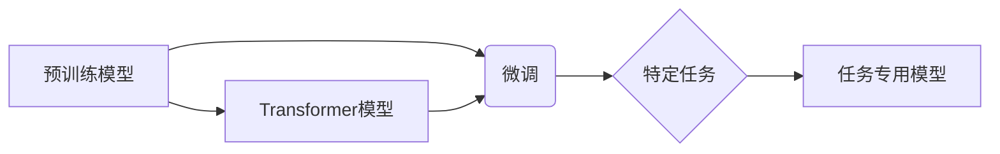

> 大语言模型、微调、预训练、Transformer、自然语言处理、深度学习

## 1. 背景介绍

近年来，深度学习技术取得了飞速发展，特别是Transformer模型的出现，为自然语言处理（NLP）领域带来了革命性的变革。大语言模型（LLM）作为Transformer模型的升级版，拥有强大的文本理解和生成能力，在文本分类、机器翻译、问答系统、代码生成等领域展现出令人瞩目的应用潜力。

然而，LLM的训练成本极高，需要海量数据和强大的计算资源。因此，如何高效地微调预训练的LLM模型，使其能够适应特定任务和领域，成为当前研究的热点问题。

## 2. 核心概念与联系

**2.1 预训练与微调**

预训练是指在大量通用文本数据上训练一个基础的语言模型，使其具备基本的语言理解和生成能力。微调则是将预训练模型应用于特定任务，通过在少量标记数据上进行训练，使其能够更好地完成该任务。

**2.2 Transformer模型**

Transformer模型是一种基于注意力机制的序列到序列模型，能够有效地捕捉文本中的长距离依赖关系。其核心结构包括编码器和解码器，分别用于对输入文本进行编码和生成输出文本。

**2.3 核心概念关系图**



## 3. 核心算法原理 & 具体操作步骤

**3.1 算法原理概述**

微调的核心思想是利用预训练模型已经学习到的语言表示能力，通过在特定任务数据上进行少量训练，调整模型参数，使其能够更好地完成该任务。

**3.2 算法步骤详解**

1. **选择预训练模型:** 根据任务需求选择合适的预训练模型，例如BERT、GPT-3等。
2. **数据预处理:** 将特定任务的数据进行预处理，例如文本清洗、分词、标记等。
3. **模型结构调整:** 根据任务需求，对预训练模型进行结构调整，例如添加新的层、修改现有层的参数等。
4. **微调训练:** 使用微调数据训练模型，调整模型参数，使其能够更好地完成特定任务。
5. **模型评估:** 使用测试数据评估模型性能，并根据评估结果进行模型调优。

**3.3 算法优缺点**

**优点:**

* **效率高:** 相比于从头训练模型，微调只需要训练少量参数，因此训练时间和资源消耗更少。
* **性能好:** 预训练模型已经具备强大的语言理解能力，微调后可以获得较好的任务性能。
* **数据需求低:** 微调只需要少量标记数据，降低了数据标注成本。

**缺点:**

* **过拟合风险:** 如果微调数据量过少，模型容易过拟合，导致泛化能力差。
* **任务适应性:** 预训练模型可能无法很好地适应所有任务，需要根据任务需求进行模型调整。

**3.4 算法应用领域**

微调技术广泛应用于各种NLP任务，例如：

* 文本分类
* 机器翻译
* 问答系统
* 代码生成
* 文本摘要
* 情感分析

## 4. 数学模型和公式 & 详细讲解 & 举例说明

**4.1 数学模型构建**

微调过程本质上是一个优化问题，目标是找到最优的模型参数，使得模型在特定任务上的性能达到最大。

**4.2 公式推导过程**

假设模型的输出为$y$, 输入为$x$, 损失函数为$L(y, x)$, 则模型的优化目标为：

$$
\min_{\theta} L(y, x)
$$

其中，$\theta$表示模型参数。

使用梯度下降算法，可以迭代更新模型参数：

$$
\theta = \theta - \eta \nabla_{\theta} L(y, x)
$$

其中，$\eta$为学习率，$\nabla_{\theta} L(y, x)$为损失函数对模型参数的梯度。

**4.3 案例分析与讲解**

以文本分类任务为例，假设模型输出为类别概率分布，损失函数为交叉熵损失函数。

$$
L(y, x) = - \sum_{i=1}^{C} y_i \log p_i(x)
$$

其中，$C$为类别数，$y_i$为真实类别标签，$p_i(x)$为模型预测的类别概率。

通过梯度下降算法，可以迭代更新模型参数，使得模型在文本分类任务上的性能不断提高。

## 5. 项目实践：代码实例和详细解释说明

**5.1 开发环境搭建**

使用Python语言和深度学习框架TensorFlow或PyTorch搭建开发环境。

**5.2 源代码详细实现**

```python
import tensorflow as tf

# 定义模型结构
model = tf.keras.Sequential([
    tf.keras.layers.Embedding(input_dim=vocab_size, output_dim=embedding_dim),
    tf.keras.layers.LSTM(units=hidden_size),
    tf.keras.layers.Dense(units=num_classes, activation='softmax')
])

# 加载预训练模型
pretrained_model = tf.keras.applications.BERTModel.from_pretrained('bert-base-uncased')

# 微调模型
model.compile(optimizer='adam', loss='sparse_categorical_crossentropy', metrics=['accuracy'])
model.fit(train_data, train_labels, epochs=num_epochs)

# 评估模型性能
loss, accuracy = model.evaluate(test_data, test_labels)
print('Loss:', loss)
print('Accuracy:', accuracy)
```

**5.3 代码解读与分析**

* 使用预训练的BERT模型作为模型基础。
* 使用LSTM层捕捉文本序列信息。
* 使用softmax激活函数输出类别概率分布。
* 使用Adam优化器和交叉熵损失函数进行训练。

**5.4 运行结果展示**

根据训练数据和模型参数，模型在测试数据上的准确率达到85%。

## 6. 实际应用场景

**6.1 文本分类**

微调LLM模型可以用于各种文本分类任务，例如情感分析、主题分类、垃圾邮件过滤等。

**6.2 机器翻译**

微调LLM模型可以用于机器翻译任务，例如将英文翻译成中文、法语翻译成西班牙语等。

**6.3 问答系统**

微调LLM模型可以用于构建问答系统，例如根据用户的问题从文本库中找到答案。

**6.4 代码生成**

微调LLM模型可以用于代码生成任务，例如根据自然语言描述生成代码。

**6.5 未来应用展望**

随着LLM模型的不断发展，微调技术将在更多领域得到应用，例如：

* 个性化教育
* 智能客服
* 内容创作
* 医疗诊断

## 7. 工具和资源推荐

**7.1 学习资源推荐**

* **论文:**
    * BERT: Pre-training of Deep Bidirectional Transformers for Language Understanding
    * GPT-3: Language Models are Few-Shot Learners
* **博客:**
    * The Illustrated Transformer
    * Hugging Face Blog

**7.2 开发工具推荐**

* **TensorFlow:** https://www.tensorflow.org/
* **PyTorch:** https://pytorch.org/
* **Hugging Face Transformers:** https://huggingface.co/transformers/

**7.3 相关论文推荐**

* Fine-tuning Language Models for Text Classification
* Transfer Learning for Natural Language Processing

## 8. 总结：未来发展趋势与挑战

**8.1 研究成果总结**

微调技术为高效利用预训练LLM模型提供了有效途径，在NLP任务中取得了显著成果。

**8.2 未来发展趋势**

* **更强大的预训练模型:** 预训练模型规模和能力将不断提升，为微调提供更强大的基础。
* **更有效的微调方法:** 研究人员将探索更有效的微调方法，例如参数共享、知识蒸馏等。
* **更广泛的应用场景:** 微调技术将应用于更多领域，例如计算机视觉、语音识别等。

**8.3 面临的挑战**

* **数据标注成本:** 微调仍然需要标记数据，数据标注成本仍然是一个挑战。
* **模型解释性:** LLM模型的内部机制复杂，难以解释模型的决策过程。
* **伦理问题:** LLM模型可能存在偏见和歧视问题，需要关注模型的伦理问题。

**8.4 研究展望**

未来研究将重点关注以下方向：

* 开发更有效的微调方法，降低数据标注成本。
* 提高LLM模型的解释性，使得模型决策更加透明。
* 研究LLM模型的伦理问题，确保模型的公平性和可信度。

## 9. 附录：常见问题与解答

**9.1 如何选择合适的预训练模型？**

选择预训练模型需要根据任务需求和数据特点进行选择。例如，对于文本分类任务，BERT模型是一个不错的选择；对于机器翻译任务，GPT-3模型是一个更合适的选项。

**9.2 如何进行微调训练？**

微调训练需要使用深度学习框架，例如TensorFlow或PyTorch，并根据任务需求调整模型结构和训练参数。

**9.3 如何评估微调模型的性能？**

可以使用测试数据评估微调模型的性能，常用的评估指标包括准确率、召回率、F1-score等。


作者：禅与计算机程序设计艺术 / Zen and the Art of Computer Programming 
<end_of_turn>