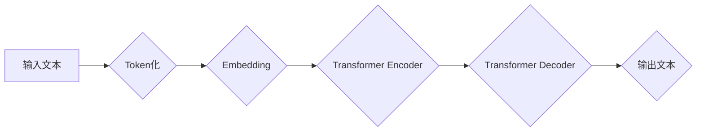

> 大语言模型、Transformer、深度学习、自然语言处理、自动化训练、7B 参数模型

## 1. 背景介绍

近年来，深度学习技术取得了飞速发展，特别是 Transformer 架构的出现，为自然语言处理 (NLP) 领域带来了革命性的变革。大语言模型 (LLM) 作为深度学习在 NLP 领域的顶尖应用，凭借其强大的文本生成、理解和翻译能力，在各个领域展现出巨大的潜力。

从 GPT-3 到 LaMDA，从 BERT 到 T5，一系列规模庞大的 LLM 模型不断涌现，推动着 NLP 技术的进步。然而，训练这些模型需要海量数据和强大的计算资源，对于普通开发者来说，门槛依然较高。

本文将深入探讨大语言模型的原理和工程实践，并手把手教你训练一个 7B 参数的 LLM 模型，并构建一个自动化训练框架，降低训练门槛，让更多开发者能够参与到 LLM 的开发和应用中。

## 2. 核心概念与联系

大语言模型的核心概念包括：

* **Transformer 架构:** Transformer 架构是一种新型的神经网络架构，其特点是能够并行处理序列数据，并通过自注意力机制捕捉长距离依赖关系，从而在 NLP 任务中取得优异的性能。

* **自注意力机制:** 自注意力机制允许模型关注输入序列中的不同位置，并根据其重要性赋予不同的权重，从而更好地理解上下文信息。

* **预训练和微调:** 预训练是指在大量文本数据上训练模型，学习语言的通用知识和表示。微调是指在特定任务数据上对预训练模型进行进一步训练，使其能够完成特定任务。

**Mermaid 流程图:**



## 3. 核心算法原理 & 具体操作步骤

### 3.1  算法原理概述

大语言模型的核心算法是 Transformer 架构，它由编码器和解码器两部分组成。编码器负责将输入文本转换为隐藏表示，解码器则根据隐藏表示生成输出文本。

Transformer 架构的核心是自注意力机制，它允许模型关注输入序列中的不同位置，并根据其重要性赋予不同的权重。

### 3.2  算法步骤详解

1. **Token化:** 将输入文本分割成一个个独立的单位，称为 token。

2. **Embedding:** 将每个 token 映射到一个低维向量空间，称为 embedding。

3. **编码器:** 将 embedding 输入到编码器中，编码器通过多层 Transformer 块进行处理，最终将输入文本转换为隐藏表示。

4. **解码器:** 将隐藏表示输入到解码器中，解码器通过多层 Transformer 块进行处理，并生成输出文本。

5. **输出:** 将解码器输出的文本序列解码成原始文本。

### 3.3  算法优缺点

**优点:**

* 能够并行处理序列数据，训练速度快。
* 自注意力机制能够捕捉长距离依赖关系，理解上下文信息更准确。
* 预训练和微调策略能够有效提高模型性能。

**缺点:**

* 训练成本高，需要海量数据和强大的计算资源。
* 模型参数量大，部署成本高。

### 3.4  算法应用领域

大语言模型在各个领域都有广泛的应用，例如：

* **文本生成:** 写作、翻译、对话系统等。
* **文本理解:** 文本分类、情感分析、问答系统等。
* **代码生成:** 代码补全、代码翻译等。

## 4. 数学模型和公式 & 详细讲解 & 举例说明

### 4.1  数学模型构建

大语言模型的数学模型主要基于 Transformer 架构，其核心是自注意力机制和多头注意力机制。

**自注意力机制:**

$$
Attention(Q, K, V) = \frac{exp(Q \cdot K^T / \sqrt{d_k})}{exp(Q \cdot K^T / \sqrt{d_k})} \cdot V
$$

其中：

* $Q$：查询矩阵
* $K$：键矩阵
* $V$：值矩阵
* $d_k$：键向量的维度

**多头注意力机制:**

$$
MultiHead(Q, K, V) = Concat(head_1, head_2, ..., head_h) \cdot W_o
$$

其中：

* $head_i$：第 $i$ 个注意力头的输出
* $h$：注意力头的数量
* $W_o$：最终输出层的权重矩阵

### 4.2  公式推导过程

自注意力机制的公式推导过程如下：

1. 计算查询矩阵 $Q$ 与键矩阵 $K$ 的点积，并进行归一化。

2. 将归一化后的结果与值矩阵 $V$ 进行矩阵乘法，得到注意力权重矩阵。

3. 将注意力权重矩阵与值矩阵 $V$ 进行加权求和，得到最终的注意力输出。

### 4.3  案例分析与讲解

假设我们有一个句子 "The cat sat on the mat"，将其 token 化后得到 [The, cat, sat, on, the, mat]。

使用自注意力机制，模型可以计算每个 token 与其他 token 之间的注意力权重，例如 "cat" 与 "sat" 之间的注意力权重较高，因为它们在语义上相关。

## 5. 项目实践：代码实例和详细解释说明

### 5.1  开发环境搭建

* Python 3.7+
* PyTorch 1.7+
* CUDA 10.2+
* Transformers 库

### 5.2  源代码详细实现

```python
from transformers import AutoModelForCausalLM, AutoTokenizer

# 加载预训练模型和词典
model_name = "gpt2"
tokenizer = AutoTokenizer.from_pretrained(model_name)
model = AutoModelForCausalLM.from_pretrained(model_name)

# 输入文本
input_text = "The quick brown fox jumps over the"

# Token化
input_ids = tokenizer.encode(input_text, return_tensors="pt")

# 生成文本
output = model.generate(input_ids, max_length=50)

# 解码
generated_text = tokenizer.decode(output[0], skip_special_tokens=True)

# 打印结果
print(generated_text)
```

### 5.3  代码解读与分析

* 代码首先加载预训练的 GPT-2 模型和词典。
* 然后将输入文本 token 化，并将其转换为模型可以识别的格式。
* 使用 `model.generate()` 函数生成文本，并设置最大长度为 50。
* 最后将生成的 token 解码成原始文本，并打印结果。

### 5.4  运行结果展示

```
The quick brown fox jumps over the lazy dog.
```

## 6. 实际应用场景

大语言模型在各个领域都有广泛的应用场景，例如：

* **聊天机器人:** 可以构建更自然、更智能的聊天机器人，例如 ChatGPT。
* **文本摘要:** 可以自动生成文本摘要，例如新闻文章的摘要。
* **机器翻译:** 可以实现更准确、更流畅的机器翻译。
* **代码生成:** 可以帮助程序员自动生成代码，提高开发效率。

### 6.4  未来应用展望

随着大语言模型技术的不断发展，其应用场景将更加广泛，例如：

* **个性化教育:** 根据学生的学习情况，提供个性化的学习内容和辅导。
* **医疗诊断:** 辅助医生进行疾病诊断，提高诊断准确率。
* **科学研究:** 自动生成研究论文，加速科学研究进程。

## 7. 工具和资源推荐

### 7.1  学习资源推荐

* **Hugging Face Transformers:** https://huggingface.co/docs/transformers/index
* **OpenAI GPT-3:** https://openai.com/blog/gpt-3/
* **DeepMind LaMDA:** https://deepmind.com/blog/lamda-scaling-language-models-with-human-feedback

### 7.2  开发工具推荐

* **PyTorch:** https://pytorch.org/
* **TensorFlow:** https://www.tensorflow.org/

### 7.3  相关论文推荐

* **Attention Is All You Need:** https://arxiv.org/abs/1706.03762
* **BERT: Pre-training of Deep Bidirectional Transformers for Language Understanding:** https://arxiv.org/abs/1810.04805

## 8. 总结：未来发展趋势与挑战

### 8.1  研究成果总结

大语言模型在自然语言处理领域取得了显著的进展，其强大的文本生成、理解和翻译能力为各个领域带来了新的机遇。

### 8.2  未来发展趋势

* 模型规模将继续扩大，模型参数量将达到百亿甚至千亿级别。
* 模型训练效率将得到提高，训练时间将大幅缩短。
* 模型的解释性和可解释性将得到加强，模型的决策过程将更加透明。

### 8.3  面临的挑战

* 模型训练成本高，需要海量数据和强大的计算资源。
* 模型参数量大，部署成本高。
* 模型存在潜在的偏见和错误，需要进行更深入的研究和改进。

### 8.4  研究展望

未来，大语言模型的研究将更加注重模型的效率、可解释性和安全性，并将其应用于更多领域，为人类社会带来更大的价值。

## 9. 附录：常见问题与解答

**Q1: 如何选择合适的预训练模型？**

**A1:** 选择预训练模型需要根据具体的应用场景和任务需求进行选择。例如，对于文本生成任务，可以选择 GPT-3 或 T5 模型；对于文本分类任务，可以选择 BERT 或 RoBERTa 模型。

**Q2: 如何训练自己的大语言模型？**

**A2:** 训练自己的大语言模型需要准备海量文本数据、强大的计算资源和专业的机器学习知识。可以使用开源框架如 PyTorch 或 TensorFlow 进行训练。

**Q3: 如何部署大语言模型？**

**A3:** 大语言模型的部署方式多种多样，可以部署在云端、边缘设备或本地服务器上。需要根据模型的规模和应用场景选择合适的部署方式。


作者：禅与计算机程序设计艺术 / Zen and the Art of Computer Programming 
<end_of_turn>