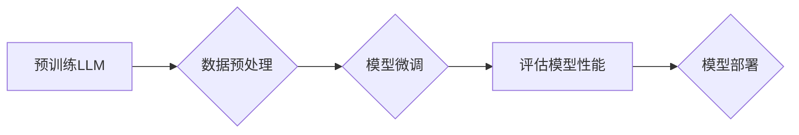

> 大语言模型、有监督微调、Transformer、BERT、GPT、自然语言处理、深度学习

## 1. 背景介绍

近年来，深度学习技术取得了飞速发展，尤其是在自然语言处理（NLP）领域取得了突破性进展。大语言模型（LLM）作为深度学习在NLP领域的代表性成果，凭借其强大的文本理解和生成能力，在机器翻译、文本摘要、问答系统、对话系统等众多领域展现出巨大的应用潜力。

LLM的训练通常需要海量文本数据和强大的计算资源，而有监督微调则是LLM在特定任务上的高效训练方法。通过在特定任务数据集上进行微调，LLM可以进一步提升在该任务上的性能，并适应不同的应用场景。

## 2. 核心概念与联系

**2.1  大语言模型（LLM）**

大语言模型是指参数量巨大、训练数据海量、能够理解和生成人类语言的深度学习模型。它们通常基于Transformer架构，能够捕捉文本中的长距离依赖关系，并学习复杂的语言模式。

**2.2  Transformer架构**

Transformer是一种专门设计用于处理序列数据的深度学习架构，其核心是自注意力机制（Self-Attention）。自注意力机制能够捕捉文本中不同词语之间的关系，即使这些词语相隔很远，也能有效地学习到它们之间的语义联系。

**2.3  有监督微调**

有监督微调是指在预训练好的LLM的基础上，使用标记数据进行进一步训练，以提升模型在特定任务上的性能。

**2.4  流程图**



## 3. 核心算法原理 & 具体操作步骤

**3.1  算法原理概述**

有监督微调的核心原理是利用预训练好的LLM的知识，在特定任务数据集上进行进一步训练，从而提升模型在该任务上的性能。

**3.2  算法步骤详解**

1. **数据预处理:** 将任务数据集进行清洗、格式化和编码，使其能够被模型理解。
2. **模型加载:** 加载预训练好的LLM模型。
3. **模型微调:** 使用微调策略，例如学习率衰减、权重冻结等，在任务数据集上进行模型训练。
4. **模型评估:** 使用验证集评估模型的性能，并根据评估结果调整模型参数。
5. **模型部署:** 将训练好的模型部署到实际应用场景中。

**3.3  算法优缺点**

**优点:**

* 能够有效提升模型在特定任务上的性能。
* 训练时间和资源消耗相对较少，比从头训练模型更经济高效。
* 可以利用预训练模型的知识，减少训练数据需求。

**缺点:**

* 需要标记数据进行训练，数据标注成本较高。
* 模型性能仍然依赖于预训练模型的质量和训练数据的大小。

**3.4  算法应用领域**

* 机器翻译
* 文本摘要
* 问答系统
* 对话系统
* 代码生成
* 文本分类

## 4. 数学模型和公式 & 详细讲解 & 举例说明

**4.1  数学模型构建**

LLM通常使用Transformer架构，其核心是自注意力机制。自注意力机制可以表示为以下公式：

$$
Attention(Q, K, V) = softmax(\frac{QK^T}{\sqrt{d_k}})V
$$

其中：

* $Q$：查询矩阵
* $K$：键矩阵
* $V$：值矩阵
* $d_k$：键向量的维度
* $softmax$：softmax函数

**4.2  公式推导过程**

自注意力机制通过计算查询向量与键向量的点积，并使用softmax函数进行归一化，得到每个键向量对查询向量的注意力权重。然后，将注意力权重与值向量相乘，得到最终的输出。

**4.3  案例分析与讲解**

例如，在机器翻译任务中，查询向量可以表示源语言句子中的每个词，键向量和值向量可以表示目标语言词典中的每个词。通过自注意力机制，模型可以学习到源语言句子中每个词与目标语言词典中每个词之间的关系，从而进行准确的翻译。

## 5. 项目实践：代码实例和详细解释说明

**5.1  开发环境搭建**

* Python 3.7+
* PyTorch 1.7+
* Transformers 4.0+

**5.2  源代码详细实现**

```python
from transformers import AutoModelForSequenceClassification, AutoTokenizer

# 加载预训练模型和词典
model_name = "bert-base-uncased"
tokenizer = AutoTokenizer.from_pretrained(model_name)
model = AutoModelForSequenceClassification.from_pretrained(model_name, num_labels=2)

# 数据加载和预处理
# ...

# 模型训练
optimizer = torch.optim.AdamW(model.parameters(), lr=2e-5)
for epoch in range(3):
    for batch in dataloader:
        input_ids = batch["input_ids"]
        attention_mask = batch["attention_mask"]
        labels = batch["labels"]

        outputs = model(input_ids=input_ids, attention_mask=attention_mask, labels=labels)
        loss = outputs.loss
        loss.backward()
        optimizer.step()
        optimizer.zero_grad()

# 模型评估
# ...

# 模型保存
model.save_pretrained("my_model")
tokenizer.save_pretrained("my_model")
```

**5.3  代码解读与分析**

* 使用`transformers`库加载预训练模型和词典。
* 数据加载和预处理步骤根据具体任务进行调整。
* 使用AdamW优化器进行模型训练。
* 模型评估和保存步骤根据实际需求进行调整。

**5.4  运行结果展示**

* 模型训练过程中的损失曲线
* 模型在验证集上的准确率

## 6. 实际应用场景

**6.1  机器翻译**

LLM可以用于机器翻译，将一种语言的文本翻译成另一种语言。

**6.2  文本摘要**

LLM可以用于文本摘要，将长篇文本压缩成短篇摘要。

**6.3  问答系统**

LLM可以用于问答系统，回答用户提出的问题。

**6.4  对话系统**

LLM可以用于对话系统，与用户进行自然语言对话。

**6.5  未来应用展望**

LLM在未来将有更广泛的应用场景，例如：

* 代码生成
* 文本分类
* 情感分析
* 创作写作

## 7. 工具和资源推荐

**7.1  学习资源推荐**

* **书籍:**
    * 《深度学习》
    * 《自然语言处理》
* **在线课程:**
    * Coursera: 自然语言处理
    * edX: 深度学习
* **博客:**
    * The Gradient
    * Towards Data Science

**7.2  开发工具推荐**

* **Python:** 
* **PyTorch:** 深度学习框架
* **Transformers:** 预训练模型库

**7.3  相关论文推荐**

* BERT: Pre-training of Deep Bidirectional Transformers for Language Understanding
* GPT-3: Language Models are Few-Shot Learners
* T5: Text-to-Text Transfer Transformer

## 8. 总结：未来发展趋势与挑战

**8.1  研究成果总结**

近年来，LLM取得了显著进展，在文本理解和生成方面展现出强大的能力。

**8.2  未来发展趋势**

* 模型规模进一步扩大
* 训练数据质量和多样性提升
* 算法效率和泛化能力增强
* 跨模态理解和生成

**8.3  面临的挑战**

* 数据标注成本高
* 模型训练资源消耗大
* 伦理和安全问题

**8.4  研究展望**

未来研究将重点关注：

* 更高效的训练方法
* 更强大的模型架构
* 更加安全可靠的应用场景


## 9. 附录：常见问题与解答

**9.1  常见问题**

* 如何选择合适的预训练模型？
* 如何进行数据预处理？
* 如何评估模型性能？

**9.2  解答**

* 选择预训练模型需要根据具体任务和数据特点进行选择。
* 数据预处理步骤根据具体任务进行调整，例如文本清洗、格式化、编码等。
* 模型性能可以使用准确率、召回率、F1-score等指标进行评估。


作者：禅与计算机程序设计艺术 / Zen and the Art of Computer Programming 
<end_of_turn>