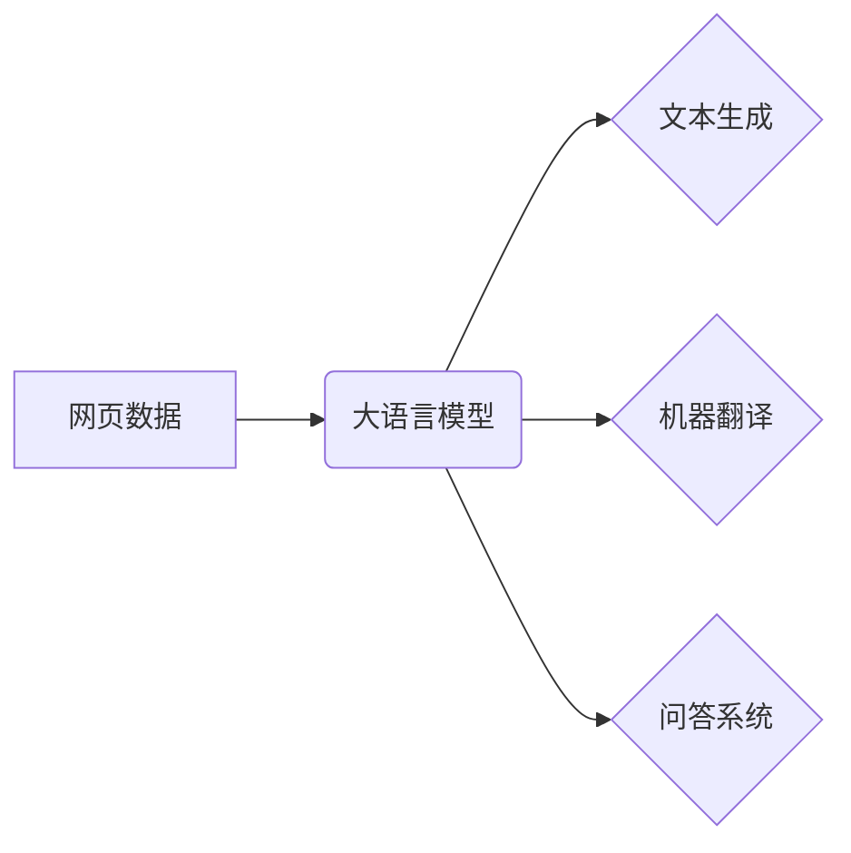

> 大语言模型、网页数据、自然语言处理、Transformer、BERT、GPT、Fine-tuning

## 1. 背景介绍

近年来，深度学习技术取得了飞速发展，特别是大语言模型（Large Language Model，LLM）的出现，为自然语言处理（Natural Language Processing，NLP）领域带来了革命性的变革。大语言模型是指参数量巨大、训练数据海量的人工智能模型，能够理解和生成人类语言，并完成各种复杂的任务，例如文本生成、翻译、问答、摘要等。

网页数据作为互联网上最丰富、最活跃的数据源之一，蕴含着大量的语言信息和知识。利用网页数据训练大语言模型，可以有效提升模型的语言理解能力和泛化能力。本文将深入探讨大语言模型原理与工程实践，重点关注网页数据在训练过程中的作用。

## 2. 核心概念与联系

### 2.1 大语言模型

大语言模型是指具有数十亿甚至千亿参数的深度学习模型，通过学习海量文本数据，能够理解和生成人类语言。其核心特点包括：

* **规模庞大:** 参数量巨大，能够捕捉语言的复杂结构和语义关系。
* **训练数据丰富:** 基于海量文本数据进行训练，具备广泛的语言知识和理解能力。
* **多任务学习:** 可以完成多种自然语言处理任务，例如文本分类、情感分析、机器翻译等。

### 2.2 网页数据

网页数据是指互联网上网页的文本内容、结构和链接信息。其特点包括：

* **海量规模:** 互联网上拥有数以亿计的网页，蕴含着丰富的语言信息。
* **多样性:** 网页内容涵盖各个领域，语言风格和表达方式多样。
* **时效性:** 网页内容不断更新，能够反映最新的语言趋势和知识。

### 2.3 核心概念关系

网页数据作为大语言模型的训练数据，为模型提供了丰富的语言知识和理解能力。模型通过学习网页数据中的语言模式和语义关系，能够更好地理解和生成人类语言。



## 3. 核心算法原理 & 具体操作步骤

### 3.1 算法原理概述

大语言模型的核心算法是**Transformer**，它是一种基于注意力机制的深度学习模型。Transformer能够有效捕捉文本序列中的长距离依赖关系，提升模型的语言理解能力。

### 3.2 算法步骤详解

1. **词嵌入:** 将文本中的每个词转换为向量表示，捕捉词语的语义信息。
2. **多头注意力机制:** 计算每个词与其他词之间的注意力权重，捕捉词语之间的语义关系。
3. **前馈神经网络:** 对每个词的嵌入向量进行非线性变换，提取更深层的语义特征。
4. **位置编码:** 为每个词添加位置信息，解决Transformer模型无法捕捉词序信息的问题。
5. **解码器:** 基于编码器的输出，生成目标文本序列。

### 3.3 算法优缺点

**优点:**

* 能够有效捕捉长距离依赖关系，提升语言理解能力。
* 并行训练效率高，能够训练规模庞大的模型。

**缺点:**

* 计算复杂度高，训练成本较高。
* 对训练数据质量要求较高。

### 3.4 算法应用领域

Transformer模型在自然语言处理领域广泛应用，例如：

* 文本生成
* 机器翻译
* 问答系统
* 文本摘要
* 情感分析

## 4. 数学模型和公式 & 详细讲解 & 举例说明

### 4.1 数学模型构建

Transformer模型的核心是**多头注意力机制**，其数学模型可以表示为：

$$
Attention(Q, K, V) = softmax(\frac{QK^T}{\sqrt{d_k}})V
$$

其中：

* $Q$：查询矩阵
* $K$：键矩阵
* $V$：值矩阵
* $d_k$：键向量的维度
* $softmax$：softmax函数

### 4.2 公式推导过程

多头注意力机制通过计算查询向量与键向量的点积，并使用softmax函数归一化，得到每个键向量对应的注意力权重。然后，将注意力权重与值向量相乘，得到最终的输出向量。

### 4.3 案例分析与讲解

假设我们有一个句子“我爱学习编程”，将其转换为词向量表示，并分别得到查询矩阵 $Q$、键矩阵 $K$ 和值矩阵 $V$。

通过计算 $QK^T$，并进行softmax归一化，得到每个词对其他词的注意力权重。例如，"我" 对 "学习" 的注意力权重可能较高，因为它们在语义上相关。

最后，将注意力权重与值向量相乘，得到最终的输出向量，该向量包含了句子中每个词的语义信息和与其他词的关联关系。

## 5. 项目实践：代码实例和详细解释说明

### 5.1 开发环境搭建

* Python 3.7+
* TensorFlow/PyTorch
* CUDA/cuDNN

### 5.2 源代码详细实现

```python
# 使用 HuggingFace Transformers 库加载预训练模型
from transformers import AutoModelForSequenceClassification, AutoTokenizer

# 加载预训练模型和词典
model_name = "bert-base-uncased"
tokenizer = AutoTokenizer.from_pretrained(model_name)
model = AutoModelForSequenceClassification.from_pretrained(model_name)

# 输入文本序列
text = "我爱学习编程"

# 将文本序列转换为模型输入格式
inputs = tokenizer(text, return_tensors="pt")

# 使用模型进行预测
outputs = model(**inputs)

# 获取预测结果
predicted_class = outputs.logits.argmax().item()

# 打印预测结果
print(f"预测结果: {predicted_class}")
```

### 5.3 代码解读与分析

* 使用 HuggingFace Transformers 库加载预训练模型，简化模型加载和使用过程。
* 使用 `AutoTokenizer` 将文本序列转换为模型输入格式，并进行词嵌入。
* 使用 `AutoModelForSequenceClassification` 进行文本分类预测，输出预测结果。

### 5.4 运行结果展示

运行上述代码，可以得到模型对输入文本的分类预测结果。例如，如果模型训练用于情感分析任务，则可以预测文本的情感倾向，例如正面、负面或中性。

## 6. 实际应用场景

### 6.1 文本生成

大语言模型可以用于生成各种文本内容，例如：

* **小说、诗歌、剧本:** 通过学习大量文学作品，模型可以生成具有文学风格的文本。
* **新闻报道、文章:** 模型可以根据给定的主题和关键词生成新闻报道或文章。
* **对话系统:** 模型可以与用户进行自然语言对话，并提供相关信息或服务。

### 6.2 机器翻译

大语言模型可以用于将文本从一种语言翻译成另一种语言，例如：

* **网页翻译:** 将网页内容翻译成目标语言，方便用户阅读。
* **文档翻译:** 将文档翻译成目标语言，方便用户理解和使用。
* **实时翻译:** 将语音或文本实时翻译成目标语言，方便跨语言交流。

### 6.3 问答系统

大语言模型可以用于构建问答系统，例如：

* **搜索引擎问答:** 根据用户查询，从海量数据中找到相关答案。
* **聊天机器人问答:** 与用户进行对话，并回答用户提出的问题。
* **知识问答:** 根据用户查询，从知识库中找到相关答案。

### 6.4 未来应用展望

大语言模型在未来将有更广泛的应用场景，例如：

* **个性化教育:** 根据学生的学习情况，提供个性化的学习内容和辅导。
* **医疗诊断:** 辅助医生进行疾病诊断，提高诊断准确率。
* **法律服务:** 帮助律师进行法律研究和案件分析。

## 7. 工具和资源推荐

### 7.1 学习资源推荐

* **HuggingFace Transformers:** https://huggingface.co/docs/transformers/index
* **OpenAI GPT-3:** https://openai.com/blog/gpt-3/
* **Stanford NLP Group:** https://nlp.stanford.edu/

### 7.2 开发工具推荐

* **TensorFlow:** https://www.tensorflow.org/
* **PyTorch:** https://pytorch.org/
* **Jupyter Notebook:** https://jupyter.org/

### 7.3 相关论文推荐

* **Attention Is All You Need:** https://arxiv.org/abs/1706.03762
* **BERT: Pre-training of Deep Bidirectional Transformers for Language Understanding:** https://arxiv.org/abs/1810.04805
* **GPT-3: Language Models are Few-Shot Learners:** https://arxiv.org/abs/2005.14165

## 8. 总结：未来发展趋势与挑战

### 8.1 研究成果总结

近年来，大语言模型取得了显著进展，在文本生成、机器翻译、问答系统等领域取得了突破性成果。网页数据作为大语言模型的训练数据，为模型的训练和应用提供了重要支持。

### 8.2 未来发展趋势

* **模型规模进一步扩大:** 随着计算能力的提升，大语言模型的规模将进一步扩大，模型能力将得到进一步提升。
* **多模态学习:** 大语言模型将与其他模态数据，例如图像、音频、视频等进行融合，实现多模态理解和生成。
* **可解释性增强:** 研究人员将致力于提高大语言模型的可解释性，使模型的决策过程更加透明和可理解。

### 8.3 面临的挑战

* **数据安全和隐私:** 大语言模型的训练需要海量数据，如何保证数据安全和隐私是一个重要挑战。
* **模型偏见和歧视:** 大语言模型可能存在偏见和歧视，需要采取措施 mitigating 这些问题。
* **模型部署和效率:** 大语言模型的部署和推理效率仍然是一个挑战，需要进一步优化模型结构和算法。

### 8.4 研究展望

未来，大语言模型将继续朝着更强大、更智能、更安全的方向发展，为人类社会带来更多福祉。


## 9. 附录：常见问题与解答

### 9.1 如何选择合适的预训练模型？

选择预训练模型需要根据具体的应用场景和任务需求。例如，如果需要进行文本分类任务，可以选择预训练在文本分类数据集上的模型；如果需要进行文本生成任务，可以选择预训练在文本生成数据集上的模型。

### 9.2 如何 fine-tune 预训练模型？

fine-tune 预训练模型需要使用自己的数据集进行训练，调整模型参数，使其能够更好地适应具体的应用场景。

### 9.3 如何评估大语言模型的性能？

大语言模型的性能可以通过多种指标进行评估，例如准确率、召回率、F1-score、BLEU 等。

### 9.4 如何解决大语言模型的偏见和歧视问题？

解决大语言模型的偏见和歧视问题可以通过多种方法，例如：

* 使用更加公平和代表性的训练数据。
* 在训练过程中加入对抗训练，减少模型对敏感属性的依赖。
* 开发可解释性更高的模型，以便更好地理解模型的决策过程。

### 9.5 大语言模型的未来发展趋势是什么？

大语言模型的未来发展趋势包括：

* 模型规模进一步扩大。
* 多模态学习。
* 可解释性增强。
* 更广泛的应用场景。


作者：禅与计算机程序设计艺术 / Zen and the Art of Computer Programming 
<end_of_turn>