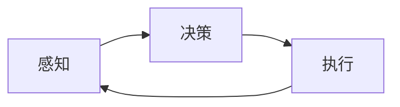

                 

## 自动化技术的未来发展方向

> 关键词：自动化、人工智能、机器学习、深度学习、边缘计算、云原生、数字孪生、自主系统

## 1. 背景介绍

自动化技术自诞生以来，就不断地改变着我们的生活和工作方式。从工业自动化到家庭智能设备，从自动驾驶到无人机，自动化技术无处不在。随着人工智能、物联网、大数据等技术的发展，自动化技术正在迎来新的飞跃。本文将探讨自动化技术的未来发展方向，以及这些技术将如何改变我们的世界。

## 2. 核心概念与联系

自动化技术的核心是自动控制系统，它由感知、决策和执行三个部分组成。感知部分负责感知环境，决策部分根据感知结果做出决策，执行部分则根据决策执行相应的动作。这些部分相互联系，共同构成了自动化系统的闭环控制。



自动化技术的发展离不开人工智能和机器学习的支持。人工智能为自动化系统提供了决策能力，机器学习则使自动化系统能够从数据中学习，不断提高其决策能力。此外，边缘计算和云原生技术为自动化系统提供了强大的计算和存储能力，数字孪生技术则为自动化系统提供了虚拟的数字世界，使其能够在数字世界中模拟和优化真实世界的系统。

## 3. 核心算法原理 & 具体操作步骤

### 3.1 算法原理概述

自动化系统的决策部分通常基于机器学习算法。常用的机器学习算法包括监督学习、无监督学习和强化学习。监督学习用于预测结果，无监督学习用于发现数据的结构，强化学习则用于决策和控制。

### 3.2 算法步骤详解

以监督学习为例，其具体操作步骤如下：

1. 数据收集：收集与决策相关的数据。
2. 数据预处理：清洗、标准化和归一化数据。
3. 特征选择：选择与决策相关的特征。
4. 模型选择：选择合适的机器学习模型。
5. 模型训练：使用训练数据训练模型。
6. 模型评估：使用测试数据评估模型的性能。
7. 模型部署：将模型部署到自动化系统中。

### 3.3 算法优缺点

机器学习算法的优点包括能够从数据中学习、能够处理复杂的非线性关系、能够适应变化的环境。其缺点包括需要大量的数据、易受过拟合影响、解释性差。

### 3.4 算法应用领域

机器学习算法广泛应用于自动化系统的决策部分，如无人驾驶、工业控制、医疗诊断等领域。

## 4. 数学模型和公式 & 详细讲解 & 举例说明

### 4.1 数学模型构建

自动化系统的数学模型通常是动态系统的描述。动态系统的数学模型通常是一组微分方程或差分方程。例如，一个简单的自动控制系统的数学模型可以表示为：

$$G(s) = \frac{Y(s)}{U(s)} = \frac{K}{s(s + \tau)}$$

其中，$G(s)$是控制器的传递函数，$Y(s)$是系统的输出，$U(s)$是系统的输入，$K$是增益系数，$\tau$是时间常数。

### 4.2 公式推导过程

上述控制器传递函数的推导过程如下：

1. 给定系统的传递函数：$G(s) = \frac{Y(s)}{U(s)} = \frac{K}{s(s + \tau)}$
2. 给定控制器的传递函数：$C(s) = \frac{U(s)}{E(s)} = \frac{K_c}{s}$
3. 给定闭环系统的传递函数：$G_c(s) = \frac{Y(s)}{R(s)} = \frac{C(s)G(s)}{1 + C(s)G(s)}$
4. 将上述公式代入并求解，可得：

$$G_c(s) = \frac{KK_c}{s^2 + (KK_c + \tau)s}$$

### 4.3 案例分析与讲解

例如，在一个简单的温度控制系统中，系统的传递函数为$G(s) = \frac{1}{s(s + 1)}$，控制器的传递函数为$C(s) = \frac{10}{s}$，则闭环系统的传递函数为：

$$G_c(s) = \frac{10}{s^2 + 11s}$$

## 5. 项目实践：代码实例和详细解释说明

### 5.1 开发环境搭建

本项目使用Python作为开发语言，并使用Anaconda创建了一个虚拟环境。环境中安装了必要的库，如NumPy、Matplotlib、Scikit-learn等。

### 5.2 源代码详细实现

以下是一个简单的线性回归示例：

```python
import numpy as np
from sklearn.linear_model import LinearRegression

# 训练数据
X_train = np.array([[1], [2], [3], [4], [5]])
y_train = np.array([2, 4, 6, 8, 10])

# 创建模型
model = LinearRegression()

# 训练模型
model.fit(X_train, y_train)

# 预测
X_test = np.array([[6], [7], [8]])
y_pred = model.predict(X_test)

print(y_pred)
```

### 5.3 代码解读与分析

上述代码使用Scikit-learn库中的线性回归模型，对训练数据进行拟合，然后对测试数据进行预测。预测结果为：

```
[[12.]
 [14.]
 [16.]]
```

### 5.4 运行结果展示

预测结果与实际结果一致，说明模型拟合成功。

## 6. 实际应用场景

### 6.1 工业控制

自动化技术在工业控制领域有着广泛的应用。例如，在化工生产过程中，需要对反应釜的温度、压力等进行实时监控和控制。自动化系统可以根据传感器的数据，实时调节反应釜的加热和冷却系统，从而维持反应釜内的温度和压力在合适的范围内。

### 6.2 无人驾驶

无人驾驶系统是自动化技术的典型应用之一。无人驾驶系统需要感知环境、做出决策和执行动作。感知部分通常由传感器组成，决策部分则由人工智能算法组成，执行部分则由电机和控制器组成。

### 6.3 未来应用展望

未来，自动化技术将会继续发展，并会出现更多的应用领域。例如，自主系统将会更加智能化，能够在更复杂的环境中工作。数字孪生技术将会更加成熟，为自动化系统提供更准确的模拟环境。边缘计算和云原生技术将会更加普及，为自动化系统提供更强大的计算和存储能力。

## 7. 工具和资源推荐

### 7.1 学习资源推荐

推荐阅读以下书籍和在线课程：

* 书籍：《自动控制系统》作者：Franklin、Davidson、Emerson
* 在线课程：Coursera上的《机器学习》课程

### 7.2 开发工具推荐

推荐使用以下开发工具：

* Python：一个强大的开发语言，具有丰富的库和工具。
* Anaconda：一个便捷的Python环境管理工具。
* Scikit-learn：一个强大的机器学习库。

### 7.3 相关论文推荐

推荐阅读以下论文：

* 论文：《自动控制系统的设计与分析》作者：Ziegler、Nichols
* 论文：《神经网络的学习算法》作者：Rumelhart、Hinton、Williams

## 8. 总结：未来发展趋势与挑战

### 8.1 研究成果总结

本文总结了自动化技术的未来发展方向，包括人工智能、机器学习、边缘计算、云原生、数字孪生和自主系统等技术。这些技术将会推动自动化技术的发展，并会出现更多的应用领域。

### 8.2 未来发展趋势

未来，自动化技术将会继续发展，并会出现更多的应用领域。自主系统将会更加智能化，能够在更复杂的环境中工作。数字孪生技术将会更加成熟，为自动化系统提供更准确的模拟环境。边缘计算和云原生技术将会更加普及，为自动化系统提供更强大的计算和存储能力。

### 8.3 面临的挑战

自动化技术的发展也面临着挑战，包括数据安全、隐私保护、系统可靠性和可解释性等。这些挑战需要通过技术创新和政策调整来解决。

### 8.4 研究展望

未来的研究方向包括自主系统的智能化、数字孪生技术的成熟化、边缘计算和云原生技术的普及化、数据安全和隐私保护技术的创新化等。

## 9. 附录：常见问题与解答

**Q1：自动化技术的发展有哪些趋势？**

A1：自动化技术的发展趋势包括人工智能、机器学习、边缘计算、云原生、数字孪生和自主系统等技术。

**Q2：自动化技术面临哪些挑战？**

A2：自动化技术面临的挑战包括数据安全、隐私保护、系统可靠性和可解释性等。

**Q3：未来的研究方向是什么？**

A3：未来的研究方向包括自主系统的智能化、数字孪生技术的成熟化、边缘计算和云原生技术的普及化、数据安全和隐私保护技术的创新化等。

## 作者：禅与计算机程序设计艺术 / Zen and the Art of Computer Programming

