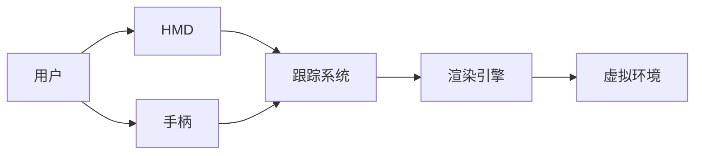

                 

**虚拟现实（VR）技术：沉浸式体验设计**

**作者：禅与计算机程序设计艺术 / Zen and the Art of Computer Programming**

## 1. 背景介绍

虚拟现实（Virtual Reality, VR）是一种计算机技术，通过创建一个三维的、互动的虚拟环境，用户可以沉浸其中，与之互动。VR技术起源于20世纪60年代，但直到最近几年，随着技术的发展和成本的降低，VR才开始进入主流市场。本文将深入探讨VR技术的核心概念、算法原理、数学模型，并提供项目实践和工具推荐。

## 2. 核心概念与联系

VR技术的核心是创建一个用户可以互动的三维空间。这个空间通常由计算机生成，用户通过头戴式显示器（HMD）和手柄等设备与之互动。VR系统的核心组件包括：

- **跟踪系统（Tracking System）**：用于跟踪用户头部和手部的位置和方向。
- **渲染引擎（Rendering Engine）**：用于实时渲染虚拟环境。
- **用户接口（User Interface）**：用户与虚拟环境互动的接口，通常包括HMD和手柄。

下图是VR系统的架构图：



## 3. 核心算法原理 & 具体操作步骤

### 3.1 算法原理概述

VR技术的核心算法是渲染算法，其目的是实时渲染虚拟环境。渲染算法的目标是创建一个用户认为是连续的、真实的三维空间。这涉及到几何学、光学、材料学等领域的知识。

### 3.2 算法步骤详解

渲染算法的步骤包括：

1. **几何学变换**：将三维模型转换为用户当前视角的二维投影。
2. **光照计算**：计算每个像素的颜色，基于光源的位置和材料的属性。
3. **抗锯齿（Antialiasing）**：消除图像中的锯齿效应。
4. **渲染**：将渲染结果显示在HMD上。

### 3.3 算法优缺点

渲染算法的优点是可以创建真实的三维空间，缺点是计算量大，需要高性能的硬件。

### 3.4 算法应用领域

渲染算法在VR技术中广泛应用，也被用于电影特效、游戏开发等领域。

## 4. 数学模型和公式 & 详细讲解 & 举例说明

### 4.1 数学模型构建

渲染算法的数学模型基于几何学和光学。几何学模型描述三维物体的形状，光学模型描述光在物体表面的反射和折射。

### 4.2 公式推导过程

渲染算法的关键公式是**渲染方程（Rendering Equation）**。渲染方程描述了每个像素的颜色，基于光源的位置和材料的属性。渲染方程的推导过程涉及到几何学和光学的基础知识。

渲染方程的形式为：

$$L(x, \omega_o) = L_e(x, \omega_o) + \int_{\Omega} f(x, \omega_o, \omega_i) L(x, \omega_i) (\omega_i \cdot n) d\omega_i$$

其中，$L(x, \omega_o)$是观察方向$\omega_o$上点$x$的辐射度，$L_e(x, \omega_o)$是环境光，$f(x, \omega_o, \omega_i)$是BRDF（反射分布函数），$\omega_i$是入射方向，$n$是法向量。

### 4.3 案例分析与讲解

例如，如果我们有一个简单的物体，其材料是理想的反射材料，那么渲染方程可以简化为：

$$L(x, \omega_o) = L_e(x, \omega_o) + \int_{\Omega} f(x, \omega_o, \omega_i) L(x, \omega_i) (\omega_i \cdot n) d\omega_i = L_e(x, \omega_o) + L(x, \omega_o) \int_{\Omega} (\omega_i \cdot n) d\omega_i$$

## 5. 项目实践：代码实例和详细解释说明

### 5.1 开发环境搭建

VR项目的开发环境包括VR设备（如Oculus Rift或HTC Vive）和开发平台（如Unity或Unreal Engine）。本文使用Unity作为开发平台。

### 5.2 源代码详细实现

以下是一个简单的VR项目的代码实现。该项目创建了一个简单的三维场景，用户可以在其中移动。

```csharp
using UnityEngine;
using UnityEngine.VR;

public class VRController : MonoBehaviour
{
    public float moveSpeed = 1.0f;

    void Update()
    {
        if (OVRInput.GetDown(OVRInput.Button.One))
        {
            transform.Translate(0, 0, moveSpeed);
        }
        if (OVRInput.GetDown(OVRInput.Button.Two))
        {
            transform.Translate(0, 0, -moveSpeed);
        }
    }
}
```

### 5.3 代码解读与分析

该代码使用Unity的VR输入系统（OVRInput）检测用户的输入。如果用户按下按钮一（OVRInput.Button.One），则向前移动；如果按下按钮二（OVRInput.Button.Two），则向后移动。

### 5.4 运行结果展示

运行该代码后，用户可以在VR设备中看到一个简单的三维场景。用户可以通过按下按钮一和按钮二来在场景中移动。

## 6. 实际应用场景

VR技术的应用场景包括：

- **游戏**：VR技术可以创建更沉浸的游戏体验。
- **教育**：VR技术可以创建互动的学习环境。
- **医疗**：VR技术可以用于治疗创伤后应激障碍（PTSD）等疾病。
- **设计**：VR技术可以用于设计建筑、汽车等。

### 6.4 未来应用展望

未来，VR技术有望在更多领域得到应用，如远程会议、虚拟旅游等。此外，VR技术与人工智能的结合也将带来新的应用场景。

## 7. 工具和资源推荐

### 7.1 学习资源推荐

- **书籍**："Real-Time Rendering" fourth edition by Tomas Akenine-Möller, Eric Haines, and Naty Hoffman。
- **在线课程**：Coursera的"Virtual Reality: Concepts and Applications"课程。

### 7.2 开发工具推荐

- **Unity**：Unity是一个流行的VR开发平台，支持Oculus、HTC Vive等VR设备。
- **Unreal Engine**：Unreal Engine是另一个流行的VR开发平台，支持更多的VR设备。

### 7.3 相关论文推荐

- "A Survey of Virtual Reality Technologies and Applications" by M. Billinghurst and A. Kato。

## 8. 总结：未来发展趋势与挑战

### 8.1 研究成果总结

本文介绍了VR技术的核心概念、算法原理、数学模型，并提供了项目实践和工具推荐。

### 8.2 未来发展趋势

未来，VR技术有望在更多领域得到应用，并与人工智能等技术结合，创造更多的可能性。

### 8.3 面临的挑战

VR技术面临的挑战包括性能要求高、成本高、用户可能出现晕动症等。

### 8.4 研究展望

未来的研究方向包括提高渲染算法的效率、降低VR设备的成本、解决晕动症等问题。

## 9. 附录：常见问题与解答

**Q：VR技术的优点是什么？**

**A**：VR技术的优点包括创建沉浸式体验、互动性强等。

**Q：VR技术的缺点是什么？**

**A**：VR技术的缺点包括性能要求高、成本高、用户可能出现晕动症等。

**Q：VR技术的应用场景有哪些？**

**A**：VR技术的应用场景包括游戏、教育、医疗、设计等。

**Q：未来VR技术的发展趋势是什么？**

**A**：未来，VR技术有望在更多领域得到应用，并与人工智能等技术结合，创造更多的可能性。

