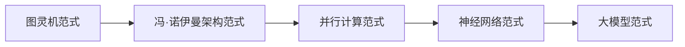

                 

## 1. 背景介绍

自从图灵提出了通用图灵机的概念以来，计算范式已经发生了翻天覆地的变化。从图灵机到冯·诺伊曼架构，再到现代的神经网络和大模型，每一次范式转换都带来了计算能力的飞跃和新的应用领域。本文将回顾计算范式的演化历程，并深入探讨当前最先进的大模型计算范式。

## 2. 核心概念与联系

### 2.1 计算范式的定义

计算范式是指一种计算模型，它定义了计算单元（如图灵机、处理器）的结构和行为，以及它们如何组成更大的系统。计算范式决定了计算机系统的架构、算法设计和软件开发方式。

### 2.2 计算范式的演化

计算范式的演化可以分为以下几个阶段：

1. **图灵机范式（Turing Machine Paradigm）**：图灵机是一种抽象的计算模型，它由一个无限长的带、一个读写头和一套转换规则组成。图灵机范式强调通过一系列简单的规则来实现复杂的计算任务。
2. **冯·诺伊曼架构范式（Von Neumann Architecture Paradigm）**：冯·诺伊曼架构是现代计算机的基础，它由处理器、内存和输入/输出设备组成。冯·诺伊曼架构范式强调并行处理和指令集架构。
3. **并行计算范式（Parallel Computing Paradigm）**：并行计算范式旨在通过同时执行多个任务来提高计算效率。它包括数据并行、任务并行和分布式计算等子范式。
4. **神经网络范式（Neural Network Paradigm）**：神经网络范式受生物神经元的启发，旨在模拟人类大脑的学习和决策过程。它包括感知机、回归神经网络、循环神经网络和转换器等子范式。
5. **大模型范式（Large Model Paradigm）**：大模型范式旨在构建规模庞大的神经网络模型，以实现更强大的学习和推理能力。它包括预训练语言模型、生成式对抗网络和Transformer等子范式。

### 2.3 Mermaid 流程图：计算范式的演化



## 3. 核心算法原理 & 具体操作步骤

### 3.1 算法原理概述

大模型范式的核心算法是Transformer，它是一种自注意力机制（Self-Attention Mechanism）的多层编码器-解码器架构。Transformer可以处理序列数据，如文本、音频和视频，并实现强大的学习和推理能力。

### 3.2 算法步骤详解

Transformer的工作原理如下：

1. **输入表示**：将输入序列（如文本）转换为向量表示，通常使用词嵌入（Word Embedding）和位置嵌入（Positional Encoding）来表示。
2. **编码器**：编码器由多个相同的层组成，每层包含自注意力子层和前馈神经网络（Feed-Forward Neural Network）子层。自注意力子层计算输入序列中每个位置的表示，前馈神经网络子层则对表示进行非线性变换。
3. **解码器**：解码器也由多个相同的层组成，每层包含自注意力子层、编码器-解码器注意力子层和前馈神经网络子层。自注意力子层和前馈神经网络子层的作用与编码器相同，编码器-解码器注意力子层则计算解码器的表示与编码器的表示之间的注意力。
4. **输出**：解码器的最后一层生成输出表示，然后通过线性层和softmax函数生成输出分布。

### 3.3 算法优缺点

优点：

* Transformer可以并行处理序列数据，提高了训练和推理的效率。
* Transformer可以学习长距离依赖关系，适合处理长序列数据。
* Transformer的表达能力强，可以实现强大的学习和推理能力。

缺点：

* Transformer的训练和推理需要大量的计算资源。
* Transformer的训练数据要求高，需要大规模的预训练数据集。
* Transformer的解释性差，模型的决策过程难以理解。

### 3.4 算法应用领域

大模型范式的应用领域包括：

* 自然语言处理（Natural Language Processing）：大模型可以用于文本生成、机器翻译、问答系统和文本分类等任务。
* 计算机视觉（Computer Vision）：大模型可以用于图像分类、目标检测和图像生成等任务。
* 语音识别（Speech Recognition）：大模型可以用于语音转文本和文本转语音等任务。
* 生物信息学（Bioinformatics）：大模型可以用于蛋白质结构预测、基因组学和药物发现等任务。

## 4. 数学模型和公式 & 详细讲解 & 举例说明

### 4.1 数学模型构建

Transformer的数学模型可以表示为：

$$
P(\mathbf{y} | \mathbf{x}) = \prod_{t=1}^{T} P(y_t | y_{t-1}, \ldots, y_1, \mathbf{x})
$$

其中，$\mathbf{x}$是输入序列，$\mathbf{y}$是输出序列，$T$是序列长度，$P(\cdot)$是条件概率分布。

### 4.2 公式推导过程

自注意力机制的数学模型可以表示为：

$$
\text{Attention}(\mathbf{Q}, \mathbf{K}, \mathbf{V}) = \text{softmax}\left(\frac{\mathbf{Q}\mathbf{K}^\top}{\sqrt{d_k}}\right) \mathbf{V}
$$

其中，$\mathbf{Q}$、$\mathbf{K}$和$\mathbf{V}$分别是查询（Query）、键（Key）和值（Value）矩阵，$\top$表示转置，$d_k$是键矩阵的维度。

前馈神经网络子层的数学模型可以表示为：

$$
\mathbf{x}_\text{out} = \max(0, \mathbf{x}_\text{in}\mathbf{W}_1 + \mathbf{b}_1)\mathbf{W}_2 + \mathbf{b}_2
$$

其中，$\mathbf{x}_\text{in}$和$\mathbf{x}_\text{out}$分别是输入和输出向量，$\mathbf{W}_1$、$\mathbf{W}_2$、$\mathbf{b}_1$和$\mathbf{b}_2$分别是权重矩阵和偏置向量。

### 4.3 案例分析与讲解

例如，假设我们要构建一个简单的Transformer模型来进行机器翻译。输入序列$\mathbf{x}$是源语言的句子，输出序列$\mathbf{y}$是目标语言的翻译。我们首先将输入序列转换为向量表示，然后通过编码器生成表示，最后通过解码器生成输出序列。在训练过程中，我们使用交叉熵损失函数来优化模型参数。

## 5. 项目实践：代码实例和详细解释说明

### 5.1 开发环境搭建

要构建Transformer模型，我们需要安装以下软件和库：

* Python 3.8+
* PyTorch 1.8+
* Transformers library 4.6+

### 5.2 源代码详细实现

以下是一个简单的Transformer模型实现示例：

```python
import torch
from transformers import TransformerModel, TransformerConfig

# 定义模型配置
config = TransformerConfig(
    vocab_size=10000,
    max_position_embeddings=512,
    num_attention_heads=8,
    num_hidden_layers=6,
    hidden_size=512,
    intermediate_size=2048,
    dropout=0.1,
)

# 创建模型实例
model = TransformerModel(config)

# 定义输入和输出
input_ids = torch.randint(0, config.vocab_size, (1, 512))
attention_mask = torch.ones_like(input_ids)
labels = torch.randint(0, config.vocab_size, (1, 512))

# 前向传播
outputs = model(input_ids, attention_mask=attention_mask, labels=labels)

# 计算损失
loss = outputs.loss

# 打印损失
print(loss.item())
```

### 5.3 代码解读与分析

在上述代码中，我们首先定义了Transformer模型的配置，然后创建了模型实例。我们定义了输入和输出，其中`input_ids`表示输入序列的词汇索引，`attention_mask`表示输入序列的长度，`labels`表示目标序列的词汇索引。我们然后进行前向传播，计算损失，并打印损失值。

### 5.4 运行结果展示

运行上述代码后，我们将看到损失值。在训练过程中，损失值应该逐渐减小，直到模型收敛。

## 6. 实际应用场景

大模型范式的实际应用场景包括：

* **搜索引擎**：大模型可以用于改进搜索结果的相关性和排序。
* **虚拟助手**：大模型可以用于构建智能虚拟助手，提供语音识别、文本理解和对话管理等功能。
* **自动驾驶**：大模型可以用于理解和预测交通环境，实现更安全和高效的自动驾驶。
* **医疗保健**：大模型可以用于疾病诊断、药物发现和个性化治疗等任务。

### 6.4 未来应用展望

未来，大模型范式将继续发展，并应用于更多的领域。例如，大模型可以用于构建更智能的机器人、更先进的自动驾驶系统和更有效的疾病预防和治疗系统。此外，大模型还可以用于解决更复杂的科学和工程问题，如气候变化、能源效率和材料设计。

## 7. 工具和资源推荐

### 7.1 学习资源推荐

* **书籍**：
	+ "Natural Language Processing with Python" by Steven Bird, Ewan Klein, and Edward Loper
	+ "Hands-On Machine Learning with Scikit-Learn, Keras, and TensorFlow" by Aurélien Géron
* **在线课程**：
	+ "Natural Language Processing in TensorFlow" by Laurence Moroney on Coursera
	+ "Transformers: State-of-the-Art Natural Language Processing" by Hugging Face on YouTube

### 7.2 开发工具推荐

* **PyTorch**和**TensorFlow**是构建大模型的流行框架。
* **Transformers library**是一个开源的Transformers模型实现库，提供了预训练模型和训练工具。
* **Hugging Face Spaces**是一个在线平台，允许用户分享和部署Transformers模型。

### 7.3 相关论文推荐

* "Attention is All You Need" by Vaswani et al. (2017)
* "BERT: Pre-training of Deep Bidirectional Transformers for Language Understanding" by Jacob Devlin and Ming-Wei Chang (2018)
* "Language Models are Few-Shot Learners" by Tom B. Brown et al. (2020)

## 8. 总结：未来发展趋势与挑战

### 8.1 研究成果总结

大模型范式已经取得了显著的研究成果，包括Transformer模型、预训练语言模型和生成式对抗网络等。这些模型和技术已经在自然语言处理、计算机视觉和其他领域取得了成功。

### 8.2 未来发展趋势

未来，大模型范式的发展趋势包括：

* **模型规模扩大**：未来的大模型将具有更多的参数和更复杂的架构，以实现更强大的学习和推理能力。
* **多模式学习**：未来的大模型将能够处理多模式数据，如文本、图像和音频，并实现跨模式的学习和推理。
* **解释性模型**：未来的大模型将具有更好的解释性，模型的决策过程将更容易理解。

### 8.3 面临的挑战

大模型范式面临的挑战包括：

* **计算资源**：大模型的训练和推理需要大量的计算资源，这是一个持续的挑战。
* **数据要求**：大模型需要大规模的预训练数据集，收集和标记这些数据是一个昂贵和耗时的过程。
* **泛化能力**：大模型的泛化能力有待提高，特别是在少样本学习和跨域泛化等领域。

### 8.4 研究展望

未来的研究将关注以下领域：

* **模型压缩**：开发新的技术来压缩大模型的规模，以便在资源受限的设备上部署。
* **多模式学习**：开发新的技术来处理多模式数据，并实现跨模式的学习和推理。
* **少样本学习**：开发新的技术来改进大模型在少样本学习任务中的表现。

## 9. 附录：常见问题与解答

**Q1：什么是大模型范式？**

大模型范式是一种计算范式，旨在构建规模庞大的神经网络模型，以实现更强大的学习和推理能力。

**Q2：大模型范式的核心算法是什么？**

大模型范式的核心算法是Transformer，它是一种自注意力机制的多层编码器-解码器架构。

**Q3：大模型范式的应用领域是什么？**

大模型范式的应用领域包括自然语言处理、计算机视觉、语音识别和生物信息学等。

**Q4：大模型范式面临的挑战是什么？**

大模型范式面临的挑战包括计算资源、数据要求和泛化能力等。

**Q5：未来的研究将关注哪些领域？**

未来的研究将关注模型压缩、多模式学习和少样本学习等领域。

## 作者：禅与计算机程序设计艺术 / Zen and the Art of Computer Programming

