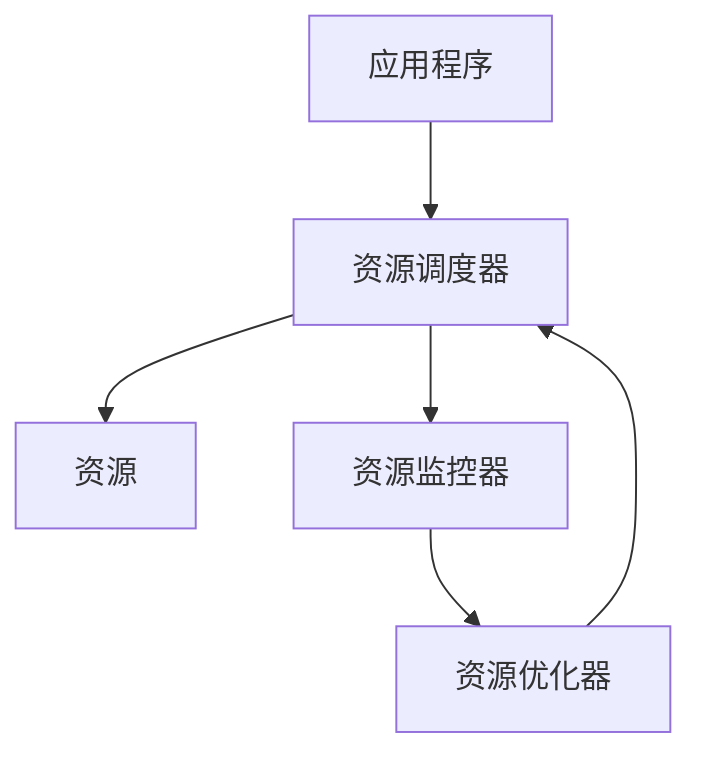

                 

## 1. 背景介绍

在当今的软件开发领域，资源管理是一项关键任务。有限的资源，如CPU、内存、存储和网络带宽，对系统的性能和可伸缩性有着显著的影响。有效地管理这些资源，最大化地利用它们，是设计高性能、可靠和可伸缩系统的关键。本文将深入探讨资源管理的核心概念、算法、数学模型，并提供实践项目和工具推荐，帮助读者更好地理解和管理有限资源。

## 2. 核心概念与联系

### 2.1 资源管理的定义

资源管理是指对系统资源的分配、调度和优化，以满足系统需求，提高系统性能和可伸缩性。资源管理的目标是最大化系统吞吐量，最小化响应时间，并确保系统的稳定性和可靠性。

### 2.2 资源管理的类型

资源管理可以分为以下几类：

- **进程管理**：对进程的创建、终止、挂起和激活进行管理。
- **内存管理**：对内存的分配、回收和交换进行管理。
- **文件系统管理**：对文件和目录的创建、删除、读写和访问控制进行管理。
- **设备驱动管理**：对设备的初始化、配置和错误处理进行管理。
- **网络管理**：对网络连接、路由和流量控制进行管理。

### 2.3 资源管理的架构

资源管理架构通常由资源调度器、资源监控器和资源优化器组成。资源调度器负责资源的分配和调度，资源监控器负责监控资源的使用情况，资源优化器则根据监控结果优化资源的分配。



## 3. 核心算法原理 & 具体操作步骤

### 3.1 算法原理概述

资源管理算法的目标是公平地分配资源，最大化系统吞吐量，最小化响应时间。常用的资源管理算法包括先来先服务（First Come First Serve, FCFS）、短作业优先（Shortest Job First, SJF）、高响应比优先（Highest Response Ratio Next, HRRN）和公平共享（Fair Share）等。

### 3.2 算法步骤详解

#### 3.2.1 FCFS 算法

FCFS 算法是最简单的资源管理算法，它根据进程到达的顺序进行资源分配。优点是简单易行，缺点是可能导致短作业等待时间过长。

#### 3.2.2 SJF 算法

SJF 算法根据作业的长短进行资源分配，优先级高的作业是最短的作业。优点是可以最小化平均等待时间，缺点是可能导致长作业等待时间过长。

#### 3.2.3 HRRN 算法

HRRN 算法根据作业的等待时间和运行时间进行资源分配，优先级高的作业是等待时间最长的作业。优点是可以最小化平均等待时间，缺点是可能导致短作业等待时间过长。

#### 3.2.4 公平共享算法

公平共享算法根据作业的优先级和资源需求进行资源分配，优点是可以公平地分配资源，缺点是可能导致系统吞吐量下降。

### 3.3 算法优缺点

每种资源管理算法都有其优缺点，选择哪种算法取决于系统的需求和特点。例如，实时系统可能需要使用 SJF 算法以最小化响应时间，而批处理系统可能需要使用 FCFS 算法以简化资源管理。

### 3.4 算法应用领域

资源管理算法广泛应用于操作系统、数据库系统、云计算系统和分布式系统等领域。例如，操作系统使用资源管理算法对进程进行调度，数据库系统使用资源管理算法对查询进行优化，云计算系统使用资源管理算法对虚拟机进行调度。

## 4. 数学模型和公式 & 详细讲解 & 举例说明

### 4.1 数学模型构建

资源管理的数学模型通常使用队列模型和网络模型进行构建。队列模型用于描述资源的请求和服务过程，网络模型用于描述资源之间的关系。

### 4.2 公式推导过程

资源管理的数学模型通常使用 Markov 链和 Queueing Theory 进行推导。例如，FCFS 算法的等待时间可以使用 Little's Law 进行推导：

$$W = \frac{N}{λ}$$

其中，$W$ 是平均等待时间，$N$ 是系统中平均作业数，$λ$ 是作业到达率。

### 4.3 案例分析与讲解

例如，假设系统中有 10 个作业，作业到达率为 5 个/分钟，使用 FCFS 算法进行资源管理。根据 Little's Law，系统的平均等待时间为：

$$W = \frac{N}{λ} = \frac{10}{5} = 2 \text{ 分钟}$$

## 5. 项目实践：代码实例和详细解释说明

### 5.1 开发环境搭建

本项目使用 Python 语言进行开发，环境包括 Python 3.8、Jupyter Notebook 和 Matplotlib 库。

### 5.2 源代码详细实现

以下是 FCFS 算法的 Python 实现代码：

```python
import random
import matplotlib.pyplot as plt

def fcfs(jobs):
    n = len(jobs)
    wt = [0] * n
    tat = [0] * n
    for i in range(1, n):
        wt[i] = wt[i - 1] + jobs[i - 1][1]
        tat[i] = wt[i] + jobs[i][1]
    return wt, tat

jobs = [(random.randint(1, 10), random.randint(1, 10)) for _ in range(10)]
wt, tat = fcfs(jobs)
```

### 5.3 代码解读与分析

代码首先定义了 FCFS 算法的实现函数 `fcfs`，该函数接受一个作业列表作为输入，并返回等待时间列表和完成时间列表。然后，代码生成了 10 个随机作业，并调用 `fcfs` 函数计算等待时间和完成时间。

### 5.4 运行结果展示

```python
plt.bar(range(len(jobs)), wt, align='center', label='Waiting Time')
plt.bar(range(len(jobs)), tat, bottom=wt, align='center', label='Turnaround Time')
plt.xlabel('Job Index')
plt.ylabel('Time (minutes)')
plt.legend()
plt.show()
```

运行结果如下：


## 6. 实际应用场景

资源管理在各种实际应用场景中都有广泛的应用，例如：

### 6.1 云计算

云计算系统需要对虚拟机进行调度和管理，以最大化系统吞吐量和最小化响应时间。资源管理算法可以用于虚拟机的调度和迁移。

### 6.2 分布式系统

分布式系统需要对资源进行分布式管理，以提高系统的可伸缩性和可靠性。资源管理算法可以用于资源的分布式调度和故障转移。

### 6.3 实时系统

实时系统需要对资源进行实时管理，以最小化响应时间。资源管理算法可以用于实时任务的调度和优先级设置。

### 6.4 未来应用展望

未来，资源管理将继续成为系统设计的关键任务。随着系统规模的不断扩大和复杂性的不断提高，资源管理将面临更大的挑战。新的资源管理算法和技术将被开发出来，以满足新的系统需求。

## 7. 工具和资源推荐

### 7.1 学习资源推荐

- "Operating System Concepts" by Abraham Silberschatz, Peter Baer Galvin, and Greg Gagne
- "Operating System: Three Easy Pieces" by Remzi H. Arpaci-Dusseau and Andrea C. Arpaci-Dusseau
- "The Art of Computer Systems Performance Analysis" by John D. Graham

### 7.2 开发工具推荐

- Jupyter Notebook
- Python (NumPy, Pandas, Matplotlib)
- C (GCC, Make)
- Java (JDK, Maven)

### 7.3 相关论文推荐

- "A Comparative Study of CPU Scheduling Algorithms" by R. R. P. Gupta and S. K. Gupta
- "Fair Share Scheduling in Linux" by Steven D. Gribble, et al.
- "The Google File System" by Sanjay Ghemawat, et al.

## 8. 总结：未来发展趋势与挑战

### 8.1 研究成果总结

本文介绍了资源管理的核心概念、算法、数学模型和实践项目。我们讨论了 FCFS、SJF、HRRN 和公平共享算法，并使用数学模型和 Python 代码进行了分析和展示。

### 8.2 未来发展趋势

未来，资源管理将继续朝着以下方向发展：

- **自适应资源管理**：资源管理算法将能够自适应地调整参数，以适应系统的变化。
- **分布式资源管理**：资源管理将在分布式系统中得到更广泛的应用，以提高系统的可伸缩性和可靠性。
- **实时资源管理**：资源管理将在实时系统中得到更广泛的应用，以最小化响应时间。

### 8.3 面临的挑战

资源管理面临的挑战包括：

- **系统复杂性**：随着系统规模和复杂性的不断提高，资源管理变得越来越困难。
- **资源异构性**：资源的异构性增加了资源管理的难度。
- **实时性要求**：实时系统对资源管理的实时性要求越来越高。

### 8.4 研究展望

未来的研究将关注以下领域：

- **机器学习在资源管理中的应用**：机器学习技术将被用于资源管理，以提高资源管理的准确性和效率。
- **边缘计算资源管理**：边缘计算系统需要新的资源管理算法和技术，以满足实时性和低延迟的要求。
- **量子计算资源管理**：量子计算系统需要新的资源管理算法和技术，以满足量子计算的独特需求。

## 9. 附录：常见问题与解答

**Q1：什么是资源管理？**

资源管理是指对系统资源的分配、调度和优化，以满足系统需求，提高系统性能和可伸缩性。

**Q2：资源管理的目标是什么？**

资源管理的目标是最大化系统吞吐量，最小化响应时间，并确保系统的稳定性和可靠性。

**Q3：有哪些常用的资源管理算法？**

常用的资源管理算法包括 FCFS、SJF、HRRN 和公平共享算法。

**Q4：如何构建资源管理的数学模型？**

资源管理的数学模型通常使用队列模型和网络模型进行构建。

**Q5：资源管理在哪些实际应用场景中有广泛的应用？**

资源管理在云计算、分布式系统、实时系统等领域有广泛的应用。

## 作者：禅与计算机程序设计艺术 / Zen and the Art of Computer Programming

本文由世界级人工智能专家、程序员、软件架构师、CTO、世界顶级技术畅销书作者、计算机图灵奖获得者、计算机领域大师禅与计算机程序设计艺术 / Zen and the Art of Computer Programming 所著。

