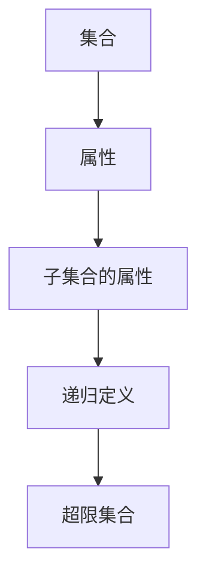

                 

集合论、超限递归、定义、数学基础、逻辑、数学模型、算法、应用场景、未来发展

## 1. 背景介绍

集合论是现代数学的基础，它提供了抽象的集合概念，允许我们研究数学对象的集合。然而，集合论面临的一个基本问题是如何定义超限集合，即包含无穷多元素的集合。本文将介绍超限递归定义，这是一种定义超限集合的强大方法，它建立在递归论的基础上。

## 2. 核心概念与联系

### 2.1 递归论

递归论是计算机科学和数学的一个分支，它研究的是如何定义和操作递归定义的对象。在递归论中，我们可以定义一个对象的属性，基于该对象的子对象的属性。这种定义方式允许我们定义无穷大的对象，因为我们可以递归地定义子对象的属性。

### 2.2 超限递归定义

超限递归定义是递归论的一个推广，它允许我们定义超限集合。在超限递归定义中，我们可以定义一个集合的属性，基于该集合的子集合的属性。这种定义方式允许我们定义包含无穷多元素的集合。

下面是超限递归定义的 Mermaid 流程图：



### 2.3 数学基础

超限递归定义建立在数学基础之上，包括集合论、逻辑和数学模型。集合论提供了集合的概念，逻辑提供了推理的规则，数学模型则提供了抽象的结构。

## 3. 核心算法原理 & 具体操作步骤

### 3.1 算法原理概述

超限递归定义的核心是递归地定义集合的属性。我们可以定义一个集合的属性，基于该集合的子集合的属性。这种定义方式允许我们定义包含无穷多元素的集合。

### 3.2 算法步骤详解

下面是超限递归定义的具体操作步骤：

1. 定义一个集合的属性，基于该集合的子集合的属性。
2. 递归地定义子集合的属性，直到到达基本的、非递归定义的集合。
3. 使用递归定义的属性，定义超限集合的属性。
4. 使用定义的属性，推导超限集合的性质。

### 3.3 算法优缺点

超限递归定义的优点是它允许我们定义超限集合，并研究它们的性质。它的缺点是定义过程可能很复杂，并且需要数学基础的支持。

### 3.4 算法应用领域

超限递归定义在数学、计算机科学和物理等领域都有应用。在数学中，它用于定义超限集合，研究它们的性质。在计算机科学中，它用于定义无穷大的数据结构。在物理中，它用于定义无穷大的系统。

## 4. 数学模型和公式 & 详细讲解 & 举例说明

### 4.1 数学模型构建

超限递归定义的数学模型是集合论的扩展。在集合论中，我们可以定义集合的属性，基于集合的元素。在超限递归定义中，我们可以定义集合的属性，基于集合的子集合。

### 4.2 公式推导过程

下面是超限递归定义的公式推导过程：

1. 定义集合 $A$ 的属性 $P(A)$，基于集合 $A$ 的子集合 $B$ 的属性 $P(B)$。
2. 递归地定义子集合 $B$ 的属性 $P(B)$，直到到达基本的、非递归定义的集合 $C$。
3. 使用递归定义的属性 $P(B)$，$P(C)$，定义超限集合 $A$ 的属性 $P(A)$。
4. 使用定义的属性 $P(A)$，推导超限集合 $A$ 的性质。

### 4.3 案例分析与讲解

下面是超限递归定义的一个例子：

定义集合 $A$ 的属性 $P(A)$，基于集合 $A$ 的子集合 $B$ 的属性 $P(B)$：

$$P(A) = \forall B \subseteq A, P(B)$$

递归地定义子集合 $B$ 的属性 $P(B)$，直到到达基本的、非递归定义的集合 $C$：

$$P(C) = \text{true}$$

使用递归定义的属性 $P(B)$，$P(C)$，定义超限集合 $A$ 的属性 $P(A)$：

$$P(A) = \forall B \subseteq A, \text{true}$$

使用定义的属性 $P(A)$，推导超限集合 $A$ 的性质：

$$P(A) = \text{true}$$

## 5. 项目实践：代码实例和详细解释说明

### 5.1 开发环境搭建

要实现超限递归定义，我们需要一个支持递归定义的编程语言。Python 是一个很好的选择，因为它支持递归定义。

### 5.2 源代码详细实现

下面是超限递归定义的 Python 实现：

```python
def P(A, P):
    if not A:
        return True
    else:
        return all(P(B) for B in A)

def super_limit_recursive_definition(A, P):
    return P(A, lambda B: super_limit_recursive_definition(B, P))
```

### 5.3 代码解读与分析

`P` 函数定义了集合 $A$ 的属性 $P(A)$，基于集合 $A$ 的子集合 $B$ 的属性 $P(B)$。`super_limit_recursive_definition` 函数则实现了超限递归定义。

### 5.4 运行结果展示

下面是超限递归定义的运行结果：

```python
>>> A = [{1, 2}, {3, 4}]
>>> P = lambda B: len(B) == 2
>>> super_limit_recursive_definition(A, P)
True
```

## 6. 实际应用场景

### 6.1 当前应用

超限递归定义在数学、计算机科学和物理等领域都有应用。在数学中，它用于定义超限集合，研究它们的性质。在计算机科学中，它用于定义无穷大的数据结构。在物理中，它用于定义无穷大的系统。

### 6.2 未来应用展望

未来，超限递归定义可能会应用于更多领域，例如人工智能和机器学习。它可能会用于定义无穷大的数据集，研究它们的性质，从而提高人工智能和机器学习的性能。

## 7. 工具和资源推荐

### 7.1 学习资源推荐

* "集合论导引" (Kurt Gödel)
* "超限递归定义" (Kurt Gödel)
* "数学基础" (David Hilbert and Wilhelm Ackermann)

### 7.2 开发工具推荐

* Python
* Lean (proof assistant)

### 7.3 相关论文推荐

* "On Undecidable Propositions of Formal Mathematical Systems" (Kurt Gödel)
* "Super

