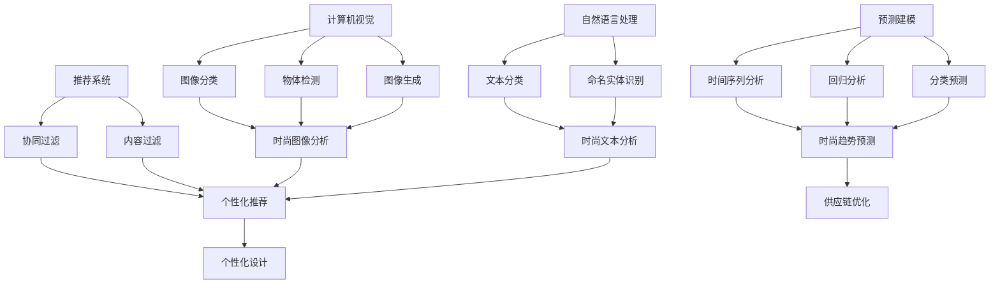

                 

**AI在时尚设计中的应用：个性化与趋势预测**

**作者：禅与计算机程序设计艺术 / Zen and the Art of Computer Programming**

## 1. 背景介绍

时尚设计是一个不断变化的领域，受到多种因素的影响，包括文化、艺术、技术和消费者偏好。随着人工智能（AI）技术的发展，它开始在时尚设计中发挥越来越重要的作用，帮助设计师预测趋势，创造个性化的设计，并优化供应链管理。

## 2. 核心概念与联系

在时尚设计中，AI的应用涉及多个领域，包括计算机视觉、自然语言处理（NLP）、推荐系统和预测建模。这些领域的技术相互关联，共同构成了AI在时尚设计中的应用架构。



## 3. 核心算法原理 & 具体操作步骤

### 3.1 算法原理概述

在时尚设计中，AI的核心算法包括卷积神经网络（CNN）、循环神经网络（RNN）、长短期记忆网络（LSTM）和注意力机制。这些算法用于图像和文本分析，预测建模，以及个性化推荐。

### 3.2 算法步骤详解

1. **图像分析**：使用CNN对时尚图像进行分类和特征提取，如服装类型、颜色、图案等。
2. **文本分析**：使用RNN和LSTM对时尚文本进行分类和实体识别，如品牌、设计师、材料等。
3. **预测建模**：使用时间序列分析、回归分析和分类预测对时尚趋势进行预测。
4. **个性化推荐**：使用协同过滤和内容过滤对个性化时尚产品进行推荐。

### 3.3 算法优缺点

**优点**：AI算法可以处理大量数据，发现模式，并提供准确的预测和个性化推荐。它们可以帮助设计师节省时间，提高创造力，并提高时尚产品的销售额。

**缺点**：AI算法需要大量数据进行训练，可能会受到数据偏见的影响。它们也可能无法理解时尚的主观性和文化敏感性。

### 3.4 算法应用领域

AI在时尚设计中的应用领域包括时尚图像和文本分析，时尚趋势预测，个性化设计，以及供应链优化。

## 4. 数学模型和公式 & 详细讲解 & 举例说明

### 4.1 数学模型构建

在时尚设计中，常用的数学模型包括线性回归模型、逻辑回归模型、支持向量机（SVM）模型和神经网络模型。

### 4.2 公式推导过程

例如，线性回归模型的公式为：

$$y = β_0 + β_1x_1 + β_2x_2 +... + β_nx_n + ε$$

其中，$y$是预测变量，$\beta_0, \beta_1, \beta_2,..., \beta_n$是回归系数，$x_1, x_2,..., x_n$是自变量，$\varepsilon$是误差项。

### 4.3 案例分析与讲解

例如，在时尚趋势预测中，可以使用自回归综合移动平均模型（ARIMA）对时尚产品的销量进行预测。该模型的公式为：

$$\phi(B)y_t = c + \theta(B)a_t$$

其中，$y_t$是时尚产品的销量，$\phi(B)$和$\theta(B)$是自回归和移动平均的多项式，$c$是常数项，$a_t$是白噪声。

## 5. 项目实践：代码实例和详细解释说明

### 5.1 开发环境搭建

在时尚设计中，常用的开发环境包括Python、TensorFlow、PyTorch和Keras。

### 5.2 源代码详细实现

以下是使用Python和TensorFlow构建时尚图像分类器的示例代码：

```python
import tensorflow as tf
from tensorflow.keras import layers

# 定义模型
model = tf.keras.Sequential([
    layers.Conv2D(32, (3, 3), activation='relu', input_shape=(150, 150, 3)),
    layers.MaxPooling2D((2, 2)),
    layers.Conv2D(64, (3, 3), activation='relu'),
    layers.MaxPooling2D((2, 2)),
    layers.Conv2D(128, (3, 3), activation='relu'),
    layers.MaxPooling2D((2, 2)),
    layers.Flatten(),
    layers.Dense(512, activation='relu'),
    layers.Dense(1, activation='sigmoid')
])

# 编译模型
model.compile(optimizer='adam',
              loss=tf.keras.losses.BinaryCrossentropy(from_logits=True),
              metrics=['accuracy'])

# 训练模型
history = model.fit(train_images, train_labels, epochs=10,
                    validation_data=(test_images, test_labels))
```

### 5.3 代码解读与分析

该代码定义了一个CNN模型，用于对时尚图像进行分类。模型由多个卷积层、池化层和全连接层组成。模型使用Adam优化器和二元交叉熵损失函数进行编译，并使用训练图像和标签进行训练。

### 5.4 运行结果展示

训练好的模型可以用于对新的时尚图像进行分类，并提供准确的预测结果。

## 6. 实际应用场景

### 6.1 个性化设计

AI可以帮助设计师创造个性化的时尚产品，根据消费者的偏好和喜好进行定制。例如，Zozotown是一家日本时尚零售商，使用AI技术为消费者提供个性化的服装设计。

### 6.2 趋势预测

AI可以帮助时尚设计师预测未来的时尚趋势，并根据这些趋势进行设计。例如，Stitch Fix是一家美国时尚零售商，使用AI技术预测时尚趋势，并为消费者提供个性化的时尚建议。

### 6.3 供应链优化

AI可以帮助时尚企业优化供应链管理，提高效率，降低成本。例如，H&M是一家瑞典时尚零售商，使用AI技术优化库存管理，并提高供应链的灵活性。

### 6.4 未来应用展望

未来，AI在时尚设计中的应用将会更加广泛，包括时尚图像和文本生成，时尚设计的自动化，以及时尚产品的个性化定制。AI还将帮助时尚企业提高可持续性，并满足消费者的个性化需求。

## 7. 工具和资源推荐

### 7.1 学习资源推荐

* "时尚设计与人工智能"课程（Coursera）
* "时尚设计与数据科学"课程（Coursera）
* "时尚设计与人工智能"书籍（Amazon）

### 7.2 开发工具推荐

* TensorFlow
* PyTorch
* Keras
* Python

### 7.3 相关论文推荐

* "Fashion-MNIST: A Novel Image Dataset for Benchmarking Machine Learning Algorithms"（arXiv）
* "DeepFashion: A New Dataset for Fashion Image Analysis"（arXiv）
* "FashionAI: A Large-Scale Dataset for Fashion Image Analysis and Retrieval"（arXiv）

## 8. 总结：未来发展趋势与挑战

### 8.1 研究成果总结

本文介绍了AI在时尚设计中的应用，包括核心概念、算法原理、数学模型和实际应用场景。我们还提供了代码实例和工具资源推荐。

### 8.2 未来发展趋势

未来，AI在时尚设计中的应用将会更加广泛，包括时尚图像和文本生成，时尚设计的自动化，以及时尚产品的个性化定制。AI还将帮助时尚企业提高可持续性，并满足消费者的个性化需求。

### 8.3 面临的挑战

AI在时尚设计中的应用面临的挑战包括数据偏见、模型解释性、时尚的主观性和文化敏感性。

### 8.4 研究展望

未来的研究将关注AI在时尚设计中的更多应用，包括时尚图像和文本生成，时尚设计的自动化，以及时尚产品的个性化定制。研究还将关注AI在时尚可持续性和消费者个性化需求方面的应用。

## 9. 附录：常见问题与解答

**Q1：AI在时尚设计中的优势是什么？**

**A1：AI在时尚设计中的优势包括预测趋势、个性化设计、供应链优化等。**

**Q2：AI在时尚设计中的挑战是什么？**

**A2：AI在时尚设计中的挑战包括数据偏见、模型解释性、时尚的主观性和文化敏感性。**

**Q3：AI在时尚设计中的未来发展趋势是什么？**

**A3：未来，AI在时尚设计中的应用将会更加广泛，包括时尚图像和文本生成，时尚设计的自动化，以及时尚产品的个性化定制。AI还将帮助时尚企业提高可持续性，并满足消费者的个性化需求。**

**作者：禅与计算机程序设计艺术 / Zen and the Art of Computer Programming**

