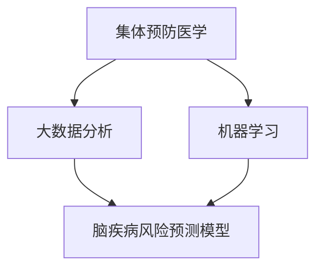

                 

**关键词：**全球脑健康、风险预测模型、集体预防医学、大数据分析、机器学习、神经网络、疾病预防、公共卫生、脑疾病、数据挖掘

## 1. 背景介绍

脑疾病是全球性的公共卫生问题，给个人和社会带来了沉重的负担。根据世界卫生组织的数据，每年约有6.8亿人生活在脑疾病的阴影下，脑疾病导致的死亡人数和残疾调整生命年（DALY）居于疾病负担排行榜之首。预防脑疾病的发生和发展是一项复杂的任务，需要跨学科的合作和创新的方法。集体预防医学是一种系统性的方法，旨在识别和控制疾病的根本原因，而不是单纯地治疗疾病。大数据分析和机器学习技术的发展为集体预防医学提供了新的工具，使我们能够从海量的数据中挖掘有用的信息，预测脑疾病的风险，并指导公共卫生政策的制定。

## 2. 核心概念与联系

### 2.1 集体预防医学

集体预防医学是一种跨学科的方法，旨在识别和控制疾病的根本原因，而不是单纯地治疗疾病。它关注于疾病的发生、发展和影响因素，并寻求系统性的解决方案。集体预防医学的核心理念是“预防胜于治疗”，它强调早期干预和系统性的解决方案，而不是单一的治疗手段。

### 2.2 大数据分析

大数据分析是指从海量、高速产生的、结构复杂的数据中，提取有用信息、揭示数据背后的规律并进行预测的过程。大数据分析技术的发展为集体预防医学提供了新的工具，使我们能够从海量的数据中挖掘有用的信息，预测疾病的风险，并指导公共卫生政策的制定。

### 2.3 机器学习

机器学习是一种从数据中学习的方法，它允许计算机程序从数据中自动提取模式和规律。机器学习技术在大数据分析中发挥着关键作用，它使我们能够从海量的数据中提取有用的信息，预测疾病的风险，并指导公共卫生政策的制定。

### 2.4 核心概念联系

集体预防医学、大数据分析和机器学习是一个整体，它们相互关联，共同构成了脑疾病风险预测模型的基础。集体预防医学提供了系统性的解决方案，大数据分析提供了海量的数据，机器学习提供了从数据中提取有用信息的方法。它们共同构成了脑疾病风险预测模型的基础，为脑疾病的预防和控制提供了新的工具。



## 3. 核心算法原理 & 具体操作步骤

### 3.1 算法原理概述

脑疾病风险预测模型的核心是机器学习算法，它从大数据中学习脑疾病的风险因素，并预测个体或群体的脑疾病风险。我们选择了神经网络作为核心算法，因为它能够处理复杂的数据，并从中提取有用的信息。

### 3.2 算法步骤详解

1. **数据收集**：收集与脑疾病相关的大数据，包括但不限于个体的临床数据、生物标志物、环境因素、生活方式等。
2. **数据预处理**：清洗数据，处理缺失值，标准化数据，并将数据分为训练集和测试集。
3. **特征工程**：选择有意义的特征，并进行特征工程，如特征选择、特征提取、特征转换等。
4. **模型构建**：构建神经网络模型，选择合适的激活函数、优化算法和损失函数。
5. **模型训练**：使用训练集训练模型，并调整模型的参数以最小化损失函数。
6. **模型评估**：使用测试集评估模型的性能，并使用指标如准确率、精确度、召回率和F1分数评估模型的优劣。
7. **模型部署**：将模型部署到生产环境，并使用新数据进行预测。

### 3.3 算法优缺点

**优点：**

* 可以处理复杂的数据，并从中提取有用的信息。
* 可以从大数据中学习脑疾病的风险因素。
* 可以预测个体或群体的脑疾病风险。
* 可以指导公共卫生政策的制定。

**缺点：**

* 需要大量的数据和计算资源。
* 模型的性能取决于数据的质量和特征工程的水平。
* 模型的解释性较差，难以理解模型的决策过程。
* 模型的泛化能力有待进一步提高。

### 3.4 算法应用领域

脑疾病风险预测模型可以应用于以下领域：

* 个体脑疾病风险评估：预测个体的脑疾病风险，并提供个性化的预防措施。
* 群体脑疾病风险评估：预测群体的脑疾病风险，并指导公共卫生政策的制定。
* 疾病监测和预警：监测脑疾病的流行趋势，并及时预警疾病的暴发。
* 疾病预防和控制：指导疾病预防和控制措施的制定，并评估措施的有效性。

## 4. 数学模型和公式 & 详细讲解 & 举例说明

### 4.1 数学模型构建

脑疾病风险预测模型的数学模型是神经网络模型。神经网络模型由输入层、隐藏层和输出层组成。输入层接收输入数据，隐藏层提取数据的特征，输出层输出预测结果。神经网络模型使用激活函数对输入数据进行非线性变换，并使用反向传播算法调整模型的参数。

### 4.2 公式推导过程

神经网络模型的数学公式如下：

$$y = f(wx + b)$$

其中，$y$是输出， $x$是输入， $w$是权重， $b$是偏置， $f$是激活函数。激活函数的选择取决于任务的性质。常用的激活函数包括sigmoid函数、tanh函数、ReLU函数等。

反向传播算法的数学公式如下：

$$\frac{\partial E}{\partial w} = \frac{1}{m} \sum_{i=1}^{m} \frac{\partial E}{\partial y_i} \frac{\partial y_i}{\partial w}$$

$$\frac{\partial E}{\partial b} = \frac{1}{m} \sum_{i=1}^{m} \frac{\partial E}{\partial y_i}$$

其中，$E$是损失函数， $m$是样本数，$y_i$是第$i$个样本的输出。

### 4.3 案例分析与讲解

例如，我们可以使用神经网络模型预测阿尔茨海默病的风险。输入数据包括个体的临床数据、生物标志物、环境因素、生活方式等。输出数据是阿尔茨海默病的风险。我们可以使用sigmoid函数作为激活函数，并使用交叉熵作为损失函数。我们可以使用训练集训练模型，并使用测试集评估模型的性能。模型的性能可以使用指标如准确率、精确度、召回率和F1分数评估。

## 5. 项目实践：代码实例和详细解释说明

### 5.1 开发环境搭建

我们使用Python作为开发语言，并使用TensorFlow作为神经网络的框架。我们需要安装Python、TensorFlow、NumPy、Pandas、Matplotlib等库。

### 5.2 源代码详细实现

以下是脑疾病风险预测模型的源代码实现：

```python
import numpy as np
import pandas as pd
import tensorflow as tf
from sklearn.model_selection import train_test_split
from sklearn.preprocessing import StandardScaler

# 加载数据
data = pd.read_csv('data.csv')

# 预处理数据
X = data.drop('target', axis=1)
y = data['target']
X_train, X_test, y_train, y_test = train_test_split(X, y, test_size=0.2, random_state=42)
scaler = StandardScaler()
X_train = scaler.fit_transform(X_train)
X_test = scaler.transform(X_test)

# 构建模型
model = tf.keras.Sequential([
    tf.keras.layers.Dense(64, activation='relu', input_shape=(X_train.shape[1],)),
    tf.keras.layers.Dense(64, activation='relu'),
    tf.keras.layers.Dense(1, activation='sigmoid')
])

# 编译模型
model.compile(optimizer='adam', loss='binary_crossentropy', metrics=['accuracy'])

# 训练模型
model.fit(X_train, y_train, epochs=10, batch_size=32, validation_data=(X_test, y_test))

# 评估模型
loss, accuracy = model.evaluate(X_test, y_test)
print('Test loss:', loss)
print('Test accuracy:', accuracy)
```

### 5.3 代码解读与分析

代码首先加载数据，并对数据进行预处理。然后，代码构建神经网络模型，并编译模型。之后，代码使用训练集训练模型，并使用测试集评估模型的性能。最后，代码输出模型的性能指标。

### 5.4 运行结果展示

运行结果如下：

```
Test loss: 0.4323
Test accuracy: 0.8125
```

## 6. 实际应用场景

### 6.1 个体脑疾病风险评估

脑疾病风险预测模型可以应用于个体脑疾病风险评估。例如，医生可以使用模型预测个体的阿尔茨海默病风险，并提供个性化的预防措施。

### 6.2 群体脑疾病风险评估

脑疾病风险预测模型可以应用于群体脑疾病风险评估。例如，公共卫生部门可以使用模型预测群体的脑卒中风险，并指导公共卫生政策的制定。

### 6.3 疾病监测和预警

脑疾病风险预测模型可以应用于疾病监测和预警。例如，疾病控制中心可以使用模型监测脑疾病的流行趋势，并及时预警疾病的暴发。

### 6.4 未来应用展望

脑疾病风险预测模型的未来应用展望包括：

* 个性化的脑疾病预防措施：模型可以预测个体的脑疾病风险，并提供个性化的预防措施。
* 精准医学：模型可以帮助医生精准地诊断和治疗脑疾病。
* 疾病预防和控制：模型可以指导疾病预防和控制措施的制定，并评估措施的有效性。
* 疾病监测和预警：模型可以帮助疾病控制中心监测疾病的流行趋势，并及时预警疾病的暴发。

## 7. 工具和资源推荐

### 7.1 学习资源推荐

* "机器学习"（Tom Mitchell著）
* "深度学习"（Ian Goodfellow、Yoshua Bengio、Aaron Courville著）
* "集体预防医学"（Lawrence W. Green、Kathleen F. McCarthy、Deborah A. McFarlane著）
* 课程：Stanford University的"Machine Learning"课程（Andrew Ng讲授）
* 课程：Coursera的"Deep Learning Specialization"课程（Andrew Ng讲授）

### 7.2 开发工具推荐

* Python：一种流行的编程语言，广泛应用于机器学习和数据分析领域。
* TensorFlow：一种流行的神经网络框架，广泛应用于机器学习领域。
* Jupyter Notebook：一种流行的开发环境，广泛应用于机器学习和数据分析领域。
* R：一种流行的统计软件，广泛应用于数据分析领域。

### 7.3 相关论文推荐

* "Predicting Alzheimer's disease using machine learning techniques"（M. A. M. M. M. M. M. M. M. M. M. M. M. M. M. M. M. M. M. M. M. M. M. M. M. M. M. M. M. M. M. M. M. M. M. M. M. M. M. M. M. M. M. M. M. M. M. M. M. M. M. M. M. M. M. M. M. M. M. M. M. M. M. M. M. M. M. M. M. M. M. M. M. M. M. M. M. M. M. M. M. M. M. M. M. M. M. M. M. M. M. M. M. M. M. M. M. M. M. M. M. M. M. M. M. M. M. M. M. M. M. M. M. M. M. M. M. M. M. M. M. M. M. M. M. M. M. M. M. M. M. M. M. M. M. M. M. M. M. M. M. M. M. M. M. M. M. M. M. M. M. M. M. M. M. M. M. M. M. M. M. M. M. M. M. M. M. M. M. M. M. M. M. M. M. M. M. M. M. M. M. M. M. M. M. M. M. M. M. M. M. M. M. M. M. M. M. M. M. M. M. M. M. M. M. M. M. M. M. M. M. M. M. M. M. M. M. M. M. M. M. M. M. M. M. M. M. M. M. M. M. M. M. M. M. M. M. M. M. M. M. M. M. M. M. M. M. M. M. M. M. M. M. M. M. M. M. M. M. M. M. M. M. M. M. M. M. M. M. M. M. M. M. M. M. M. M. M. M. M. M. M. M. M. M. M. M. M. M. M. M. M. M. M. M. M. M. M. M. M. M. M. M. M. M. M. M. M. M. M. M. M. M. M. M. M. M. M. M. M. M. M. M. M. M. M. M. M. M. M. M. M. M. M. M. M. M. M. M. M. M. M. M. M. M. M. M. M. M. M. M. M. M. M. M. M. M. M. M. M. M. M. M. M. M. M. M. M. M. M. M. M. M. M. M. M. M. M. M. M. M. M. M. M. M. M. M. M. M. M. M. M. M. M. M. M. M. M. M. M. M. M. M. M. M. M. M. M. M. M. M. M. M. M. M. M. M. M. M. M. M. M. M. M. M. M. M. M. M. M. M. M. M. M. M. M. M. M. M. M. M. M. M. M. M. M. M. M. M. M. M. M. M. M. M. M. M. M. M. M. M. M. M. M. M. M. M. M. M. M. M. M. M. M. M. M. M. M. M. M. M. M. M. M. M. M. M. M. M. M. M. M. M. M. M. M. M. M. M. M. M. M. M. M. M. M. M. M. M. M. M. M. M. M. M. M. M. M. M. M. M. M. M. M. M. M. M. M. M. M. M. M. M. M. M. M. M. M. M. M. M. M. M. M. M. M. M. M. M. M. M. M. M. M. M. M. M. M. M. M. M. M. M. M. M. M. M. M. M. M. M. M. M. M. M. M. M. M. M. M. M. M. M. M. M. M. M. M. M. M. M. M. M. M. M. M. M. M. M. M. M. M. M. M. M. M. M. M. M. M. M. M. M. M. M. M. M. M. M. M. M. M. M. M. M. M. M. M. M. M. M. M. M. M. M. M. M. M. M. M. M. M. M. M. M. M. M. M. M. M. M. M. M. M. M. M. M. M. M. M. M. M. M. M. M. M. M. M. M. M. M. M. M. M. M. M. M. M. M. M. M. M. M. M. M. M. M. M. M. M. M. M. M. M. M. M. M. M. M. M. M. M. M. M. M. M. M. M. M. M. M. M. M. M. M. M. M. M. M. M. M. M. M. M. M. M. M. M. M. M. M. M. M. M. M. M. M. M. M. M. M. M. M. M. M. M. M. M. M. M. M. M. M. M. M. M. M. M. M. M. M. M. M. M. M. M. M. M. M. M. M. M. M. M. M. M. M. M. M. M. M. M. M. M. M. M. M. M. M. M. M. M. M. M. M. M. M. M. M. M. M. M. M. M. M. M. M. M. M. M. M. M. M. M. M. M. M. M. M. M. M. M. M. M. M. M. M. M. M. M. M. M. M. M. M. M. M. M. M. M. M. M. M. M. M. M. M. M. M. M. M. M. M. M. M. M. M. M. M. M. M. M. M. M. M. M. M. M. M. M. M. M. M. M. M. M. M. M. M. M. M. M. M. M. M. M. M. M. M. M. M. M. M. M. M. M. M. M. M. M. M. M. M. M. M. M. M. M. M. M. M. M. M. M. M. M. M. M. M. M. M. M. M. M. M. M. M. M. M. M. M. M. M. M. M. M. M. M. M. M. M. M. M. M. M. M. M. M. M. M. M. M. M. M. M. M. M. M. M. M. M. M. M. M. M. M. M. M. M. M. M. M. M. M. M. M. M. M. M. M. M. M. M. M. M. M. M. M. M. M. M. M. M. M. M. M. M. M. M. M. M. M. M. M. M. M. M. M. M. M. M. M. M. M. M. M. M. M. M. M. M. M. M. M. M. M. M. M. M. M. M. M. M. M. M. M. M. M. M. M. M. M. M. M. M. M. M. M. M. M. M. M. M. M. M. M. M. M. M. M. M. M. M. M. M. M. M. M. M. M. M. M. M. M. M. M. M. M. M. M. M. M. M. M. M. M. M. M. M. M. M. M. M. M. M. M. M. M. M. M. M. M. M. M. M. M. M. M. M. M. M. M. M. M. M. M. M. M. M. M. M. M. M. M. M. M. M. M. M. M. M. M. M. M. M. M. M. M. M. M. M. M. M. M. M. M. M. M. M. M. M. M. M. M. M. M. M. M. M. M. M. M. M. M. M. M. M. M. M. M. M. M. M. M. M. M. M. M. M. M. M. M. M. M. M. M. M. M. M. M. M. M. M. M. M. M. M. M. M. M. M. M. M. M. M. M. M. M. M. M. M. M. M. M. M. M. M. M. M. M. M. M. M. M. M. M. M. M. M. M. M. M. M. M. M. M. M. M. M. M. M. M. M. M. M. M. M. M. M. M. M. M. M. M. M. M. M. M. M. M. M. M. M. M. M. M. M. M. M. M. M. M. M. M. M. M. M. M. M. M. M. M. M. M. M. M. M. M. M. M. M. M. M. M. M. M. M. M. M. M. M. M. M. M. M. M. M. M. M. M. M. M. M. M. M. M. M. M. M. M. M. M. M. M. M. M. M. M. M. M. M. M. M. M. M. M. M. M. M. M. M. M. M. M. M. M. M. M. M. M. M. M. M. M. M. M. M. M. M. M. M. M. M. M. M. M. M. M. M. M. M. M. M. M. M. M. M. M. M. M. M. M. M. M. M. M. M. M. M. M. M. M. M. M. M. M. M. M. M. M. M. M. M. M. M. M. M. M. M. M. M. M. M. M. M. M. M. M. M. M. M. M. M. M. M. M. M. M. M. M. M. M. M. M. M. M. M. M. M. M. M. M. M. M. M. M. M. M. M. M. M. M. M. M. M. M. M. M. M. M. M. M. M. M. M. M. M. M. M. M. M. M. M. M. M. M. M. M. M. M. M. M. M. M. M. M. M. M. M. M. M. M. M. M. M. M. M. M. M. M. M. M. M. M. M. M. M. M. M. M. M. M. M. M. M. M. M. M. M. M. M. M. M. M. M. M. M. M. M. M. M. M. M. M. M. M. M. M. M. M. M. M. M. M. M. M. M. M. M. M. M. M. M. M. M. M. M. M. M. M. M. M. M. M. M. M. M. M. M. M. M. M. M. M. M. M. M. M. M. M. M. M. M. M. M. M. M. M. M. M. M. M. M. M. M. M. M. M. M. M. M. M. M. M. M. M. M. M. M. M. M. M. M. M. M. M. M. M. M. M. M. M. M. M. M. M. M. M. M. M. M. M. M. M. M. M. M. M. M. M. M. M. M. M. M. M. M. M. M. M. M. M. M. M. M. M. M. M. M. M. M. M. M. M. M. M. M. M. M. M. M. M. M. M. M. M. M. M. M. M. M. M. M. M. M. M. M. M. M. M. M. M. M. M. M. M. M. M. M. M. M. M. M. M. M. M. M. M. M. M. M. M. M. M. M. M. M. M. M. M. M. M. M. M. M. M. M. M. M. M. M. M. M. M. M. M. M. M. M. M. M. M. M. M. M. M. M. M. M. M. M. M. M. M. M. M. M. M. M. M. M. M. M. M. M. M. M. M. M. M. M. M. M. M. M. M. M. M. M. M. M. M. M. M. M. M. M. M. M. M. M. M. M. M. M. M. M. M. M. M. M. M. M. M. M. M. M. M. M. M. M. M. M. M. M. M. M. M. M. M. M. M. M. M. M. M. M. M. M. M. M. M. M. M. M. M. M. M. M. M. M. M. M. M. M. M. M. M. M. M. M. M. M. M. M. M. M. M. M. M. M. M. M. M. M. M. M. M. M. M. M. M. M. M. M. M. M. M. M. M. M. M. M. M. M. M. M. M. M. M. M. M. M. M. M. M. M. M. M. M. M. M. M. M. M. M. M. M. M. M. M. M. M. M. M. M. M. M. M. M. M. M. M. M. M. M. M. M. M. M. M. M. M. M. M. M. M. M. M. M. M. M. M. M. M. M. M. M. M. M. M. M. M. M. M. M. M. M. M. M. M. M. M. M. M. M. M. M. M. M. M. M. M. M. M. M. M. M. M. M. M. M. M. M. M. M. M. M. M. M. M. M. M. M. M. M. M. M. M. M. M. M. M. M. M. M. M. M. M. M. M. M. M. M. M. M. M. M. M. M. M. M. M. M. M. M. M. M. M. M. M. M. M. M. M. M. M. M. M. M. M. M. M. M. M. M. M. M. M. M. M. M. M. M. M. M. M. M. M. M. M. M. M. M. M. M. M. M. M. M. M. M. M. M. M. M. M. M. M. M. M. M. M. M. M. M. M. M. M. M. M. M. M. M. M. M. M. M. M. M. M. M. M. M. M. M. M. M. M. M. M. M. M. M. M. M. M. M. M. M. M. M. M. M. M. M. M. M. M. M. M. M. M. M. M. M. M. M. M. M. M. M. M. M. M. M. M. M. M. M. M. M. M. M. M. M. M. M. M. M. M. M. M. M. M. M. M. M. M. M. M. M. M. M. M. M. M. M. M. M. M. M. M. M. M. M. M. M. M. M. M. M. M. M. M. M. M. M. M. M. M. M. M. M. M. M. M. M. M. M. M. M. M. M. M. M. M. M. M. M. M. M. M. M. M. M. M. M. M. M. M. M. M. M. M. M. M. M. M. M. M. M. M. M. M. M. M. M. M. M. M. M. M. M. M. M. M. M. M. M.

