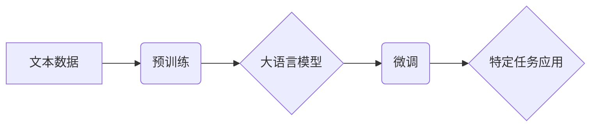

> 大语言模型、自然语言处理、Transformer、BERT、GPT、应用场景、发展趋势

## 1. 背景介绍

自然语言处理（NLP）作为人工智能领域的重要分支，致力于使计算机能够理解、处理和生成人类语言。近年来，随着深度学习技术的飞速发展，大语言模型（LLM）的出现彻底改变了NLP领域的面貌。LLM 拥有海量参数和强大的语义理解能力，能够完成各种复杂的任务，例如文本生成、翻译、问答、摘要等。

传统的NLP方法主要依赖于手工设计的特征工程和规则匹配，效率低下且难以处理复杂的任务。而LLM则通过学习海量文本数据，自动提取语言的语义特征，从而实现更准确、更灵活的自然语言理解和生成。

## 2. 核心概念与联系

**2.1 大语言模型 (LLM)**

大语言模型是指参数量巨大、训练数据海量的人工智能模型，能够理解和生成人类语言。它们通常基于Transformer架构，并通过大量的文本数据进行预训练，学习到丰富的语言知识和语义关系。

**2.2 Transformer 架构**

Transformer是一种新型的神经网络架构，专门设计用于处理序列数据，例如文本。它引入了注意力机制，能够捕捉文本中不同词语之间的长距离依赖关系，从而实现更准确的语义理解。

**2.3 预训练与微调**

预训练是指在大量文本数据上训练LLM，使其学习到通用的语言知识。微调是指在特定任务数据上对预训练的LLM进行进一步训练，使其能够完成特定任务。

**2.4 应用场景**

LLM在各个领域都有广泛的应用场景，例如：

* **文本生成:** 写作、诗歌创作、代码生成等
* **机器翻译:** 将一种语言翻译成另一种语言
* **问答系统:** 回答用户提出的问题
* **文本摘要:** 生成文本的简短摘要
* **对话系统:** 与用户进行自然语言对话

**2.5 Mermaid 流程图**



## 3. 核心算法原理 & 具体操作步骤

### 3.1 算法原理概述

Transformer架构的核心是注意力机制，它能够捕捉文本中不同词语之间的长距离依赖关系。注意力机制通过计算词语之间的相关性，赋予每个词语不同的权重，从而实现对文本的更深入理解。

### 3.2 算法步骤详解

1. **词嵌入:** 将每个词语映射到一个低维向量空间中，表示词语的语义信息。
2. **多头注意力:** 对文本序列中的每个词语进行多头注意力计算，捕捉词语之间的上下文关系。
3. **前馈神经网络:** 对每个词语的注意力输出进行非线性变换，提取更深层的语义特征。
4. **位置编码:** 将词语在序列中的位置信息编码到词向量中，解决Transformer对词序敏感的问题。
5. **堆叠层:** 将多个Transformer编码器和解码器层堆叠在一起，形成多层网络结构，进一步提升模型的表达能力。

### 3.3 算法优缺点

**优点:**

* 能够捕捉长距离依赖关系，提高文本理解能力。
* 并行计算能力强，训练速度快。
* 可迁移性强，可以应用于多种NLP任务。

**缺点:**

* 参数量大，训练成本高。
* 对训练数据质量要求高。
* 难以解释模型的决策过程。

### 3.4 算法应用领域

Transformer架构及其变体在NLP领域广泛应用，例如：

* **BERT:** 用于文本分类、问答、文本相似度计算等任务。
* **GPT:** 用于文本生成、机器翻译、对话系统等任务。
* **T5:** 用于多种NLP任务的统一框架。

## 4. 数学模型和公式 & 详细讲解 & 举例说明

### 4.1 数学模型构建

Transformer模型的核心是注意力机制，其数学模型可以表示为：

$$
Attention(Q, K, V) = softmax(\frac{QK^T}{\sqrt{d_k}})V
$$

其中：

* $Q$：查询矩阵
* $K$：键矩阵
* $V$：值矩阵
* $d_k$：键向量的维度
* $softmax$：softmax函数

### 4.2 公式推导过程

注意力机制的目的是计算每个词语与其他词语之间的相关性，并根据相关性赋予每个词语不同的权重。

1. 计算查询矩阵 $Q$ 与键矩阵 $K$ 的点积，得到一个得分矩阵。
2. 对得分矩阵进行归一化，得到一个概率分布。
3. 将概率分布与值矩阵 $V$ 进行加权求和，得到每个词语的注意力输出。

### 4.3 案例分析与讲解

假设我们有一个句子 "The cat sat on the mat"，我们想要计算 "cat" 与其他词语之间的注意力得分。

1. 将每个词语转换为词向量，得到 $Q$、$K$ 和 $V$ 矩阵。
2. 计算 $Q$ 与 $K$ 的点积，得到一个得分矩阵。
3. 对得分矩阵进行 softmax 归一化，得到每个词语对 "cat" 的注意力权重。
4. 将注意力权重与 $V$ 进行加权求和，得到 "cat" 的注意力输出。

## 5. 项目实践：代码实例和详细解释说明

### 5.1 开发环境搭建

* Python 3.7+
* PyTorch 或 TensorFlow
* CUDA 和 cuDNN (可选)

### 5.2 源代码详细实现

```python
import torch
import torch.nn as nn

class Transformer(nn.Module):
    def __init__(self, vocab_size, embedding_dim, num_heads, num_layers):
        super(Transformer, self).__init__()
        self.embedding = nn.Embedding(vocab_size, embedding_dim)
        self.encoder_layers = nn.ModuleList([EncoderLayer(embedding_dim, num_heads) for _ in range(num_layers)])

    def forward(self, x):
        x = self.embedding(x)
        for encoder_layer in self.encoder_layers:
            x = encoder_layer(x)
        return x

class EncoderLayer(nn.Module):
    def __init__(self, embedding_dim, num_heads):
        super(EncoderLayer, self).__init__()
        self.multihead_attention = MultiheadAttention(embedding_dim, num_heads)
        self.feed_forward = FeedForwardNetwork(embedding_dim)
        self.norm1 = nn.LayerNorm(embedding_dim)
        self.norm2 = nn.LayerNorm(embedding_dim)

    def forward(self, x):
        x = self.multihead_attention(x, x, x) + x
        x = self.norm1(x)
        x = self.feed_forward(x) + x
        x = self.norm2(x)
        return x

# ... 其他模块定义 ...

```

### 5.3 代码解读与分析

* Transformer 模型由 Embedding 层、Encoder 层和 Decoder 层组成。
* Encoder 层由多个 EncoderLayer 组成，每个 EncoderLayer 包含 Multihead Attention 和 FeedForwardNetwork。
* Multihead Attention 用于捕捉词语之间的长距离依赖关系。
* FeedForwardNetwork 用于提取更深层的语义特征。
* LayerNorm 用于规范化模型的输出。

### 5.4 运行结果展示

运行代码后，可以得到模型的训练结果，例如准确率、损失值等。

## 6. 实际应用场景

### 6.1 文本生成

LLM 可以用于生成各种类型的文本，例如：

* **小说、诗歌、剧本:** 通过学习大量的文本数据，LLM 可以模仿人类的写作风格，生成富有创意的文本内容。
* **新闻报道、文章摘要:** LLM 可以根据给定的信息，自动生成新闻报道或文章摘要。
* **代码生成:** LLM 可以根据自然语言描述，自动生成代码。

### 6.2 机器翻译

LLM 可以用于将一种语言翻译成另一种语言，例如：

* **英语-中文翻译:** LLM 可以准确地翻译英语文本为中文，并保留文本的语义和风格。
* **多语言翻译:** LLM 可以支持多种语言的翻译，例如英语、中文、日语、法语等。

### 6.3 问答系统

LLM 可以用于构建问答系统，例如：

* **聊天机器人:** LLM 可以与用户进行自然语言对话，回答用户的提问。
* **知识问答系统:** LLM 可以根据给定的问题，从知识库中检索相关信息，并生成准确的答案。

### 6.4 其他应用场景

LLM 还可应用于其他领域，例如：

* **文本分类:** 将文本分类到不同的类别，例如情感分析、主题分类等。
* **文本相似度计算:** 计算两个文本之间的相似度，例如文档检索、 plagiarism 检测等。
* **对话系统:** 与用户进行自然语言对话，例如虚拟助手、客服机器人等。

### 6.5 未来应用展望

随着LLM技术的不断发展，其应用场景将更加广泛，例如：

* **个性化教育:** 根据学生的学习情况，提供个性化的学习内容和辅导。
* **医疗诊断:** 辅助医生进行疾病诊断，提高诊断准确率。
* **法律服务:** 自动分析法律文件，提供法律建议。

## 7. 工具和资源推荐

### 7.1 学习资源推荐

* **书籍:**
    * 《深度学习》 by Ian Goodfellow, Yoshua Bengio, Aaron Courville
    * 《自然语言处理》 by Dan Jurafsky, James H. Martin
* **在线课程:**
    * Coursera: Natural Language Processing Specialization
    * Stanford CS224N: Natural Language Processing with Deep Learning
* **博客和网站:**
    * The Gradient
    * Towards Data Science
    * Jay Alammar's Blog

### 7.2 开发工具推荐

* **PyTorch:** 深度学习框架，支持GPU加速
* **TensorFlow:** 深度学习框架，支持GPU加速
* **Hugging Face Transformers:** 提供预训练的LLM模型和工具

### 7.3 相关论文推荐

* **Attention Is All You Need:** https://arxiv.org/abs/1706.03762
* **BERT: Pre-training of Deep Bidirectional Transformers for Language Understanding:** https://arxiv.org/abs/1810.04805
* **GPT-3: Language Models are Few-Shot Learners:** https://arxiv.org/abs/2005.14165

## 8. 总结：未来发展趋势与挑战

### 8.1 研究成果总结

近年来，LLM取得了显著的进展，在各种NLP任务上取得了优异的性能。Transformer架构及其变体成为NLP领域的主流模型，预训练和微调技术也取得了突破性进展。

### 8.2 未来发展趋势

* **模型规模更大:** 随着计算资源的不断提升，LLM的规模将进一步扩大，模型能力将得到进一步提升。
* **多模态学习:** LLM将与其他模态数据，例如图像、音频、视频等进行融合，实现多模态理解和生成。
* **可解释性增强:** 研究人员将致力于提高LLM的解释性，使模型的决策过程更加透明可理解。
* **安全性和鲁棒性:** 提高LLM的安全性，防止模型被恶意利用，并增强模型的鲁棒性，使其能够应对各种噪声和攻击。

### 8.3 面临的挑战

* **训练成本高:** 训练大型LLM需要大量的计算资源和时间，成本很高。
* **数据偏见:** LLM的训练数据可能存在偏见，导致模型输出存在偏差。
* **伦理问题:** LLM的应用可能引发伦理问题，例如信息隐私、算法歧视等。

### 8.4