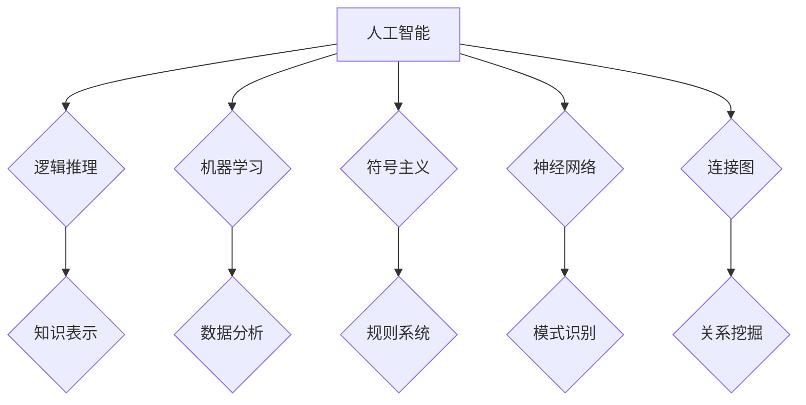

> 人工智能，达特茅斯研讨会，图灵测试，逻辑推理，机器学习，神经网络，符号主义

## 1. 背景介绍

1955年，在达特茅斯学院举办了一场具有里程碑意义的研讨会，它被认为是人工智能（AI）诞生之始。这场研讨会汇集了当时世界顶尖的计算机科学家、数学家和哲学家，他们共同探讨了人工智能的定义、可能性以及未来的发展方向。

这场研讨会的背景是二战后科技的蓬勃发展，特别是计算机技术的快速进步。电子计算机的出现为人工智能的实现提供了硬件基础。同时，逻辑学、数学和心理学等学科也为人工智能的发展提供了理论基础。

## 2. 核心概念与联系

达特茅斯研讨会期间，参与者们就人工智能的核心概念进行了深入的讨论，并提出了许多重要的观点和理论。

**2.1  人工智能的定义**

当时，人工智能的定义还没有统一的标准，但普遍认为人工智能是指机器能够像人类一样思考、学习和解决问题的能力。

**2.2  图灵测试**

英国数学家艾伦·图灵提出了著名的“图灵测试”，用来衡量机器是否具有智能。测试的规则是：如果一个人通过与机器的文字对话，无法判断出对方是人还是机器，那么机器就通过了图灵测试，被认为具有某种程度的人工智能。

**2.3  逻辑推理**

逻辑推理是人工智能的核心技术之一。它指的是根据已知的规则和事实，推导出新的结论的能力。

**2.4  机器学习**

机器学习是人工智能的一个重要分支，它指的是机器能够从数据中学习，并根据学习到的知识进行预测或决策的能力。

**2.5  符号主义**

符号主义是早期人工智能研究的主要流派，它认为人工智能可以通过符号和规则的组合来实现。

**2.6  神经网络**

神经网络是受生物神经系统启发的计算模型，它能够学习复杂的模式和关系。

**2.7  连接图**

连接图是一种数据结构，它可以用来表示知识和关系。

**Mermaid 流程图**



## 3. 核心算法原理 & 具体操作步骤

### 3.1  算法原理概述

达特茅斯研讨会期间，参与者们探讨了许多人工智能算法，例如：

* **搜索算法:** 用于在搜索空间中找到最优解。
* **启发式算法:** 利用启发式知识来加速搜索过程。
* **决策树算法:** 用于分类和预测。
* **神经网络算法:** 用于学习复杂的模式和关系。

### 3.2  算法步骤详解

以搜索算法为例，其基本步骤如下：

1. **定义搜索空间:** 确定需要搜索的范围。
2. **选择搜索策略:** 选择合适的搜索算法，例如深度优先搜索、广度优先搜索等。
3. **评估函数:** 定义一个评估函数，用于评估每个候选解的优劣。
4. **搜索过程:** 根据搜索策略，从搜索空间中逐步探索，并评估每个候选解。
5. **终止条件:** 当满足终止条件时，停止搜索过程，并返回最优解。

### 3.3  算法优缺点

每个算法都有其优缺点，需要根据具体问题选择合适的算法。

* **搜索算法:** 优点是能够找到最优解，缺点是计算复杂度高。
* **启发式算法:** 优点是计算效率高，缺点是可能无法找到最优解。
* **决策树算法:** 优点是易于理解和实现，缺点是容易过拟合。
* **神经网络算法:** 优点是能够学习复杂的模式，缺点是训练时间长，参数众多。

### 3.4  算法应用领域

人工智能算法广泛应用于各个领域，例如：

* **自然语言处理:** 机器翻译、文本摘要、情感分析等。
* **计算机视觉:** 图像识别、目标检测、图像分割等。
* **语音识别:** 语音转文本、语音合成等。
* **推荐系统:** 商品推荐、内容推荐等。
* **医疗诊断:** 疾病诊断、药物研发等。

## 4. 数学模型和公式 & 详细讲解 & 举例说明

### 4.1  数学模型构建

人工智能算法通常基于数学模型进行构建。例如，神经网络的数学模型是基于线性代数、微积分和概率论的。

### 4.2  公式推导过程

神经网络的学习过程可以看作是一个优化问题，目标是找到网络参数，使得网络的输出与真实值之间的误差最小化。

**损失函数:**

$$
L(w,b) = \frac{1}{N} \sum_{i=1}^{N} (y_i - \hat{y}_i)^2
$$

其中：

* $w$ 和 $b$ 是网络参数。
* $N$ 是样本数量。
* $y_i$ 是真实值。
* $\hat{y}_i$ 是网络预测值。

**梯度下降算法:**

$$
w = w - \alpha \frac{\partial L(w,b)}{\partial w}
$$

$$
b = b - \alpha \frac{\partial L(w,b)}{\partial b}
$$

其中：

* $\alpha$ 是学习率。

### 4.3  案例分析与讲解

例如，在图像分类任务中，我们可以使用卷积神经网络（CNN）进行模型构建。CNN 可以学习图像的特征，并将其分类到不同的类别。

## 5. 项目实践：代码实例和详细解释说明

### 5.1  开发环境搭建

可以使用 Python 语言和 TensorFlow 或 PyTorch 等深度学习框架进行项目实践。

### 5.2  源代码详细实现

```python
import tensorflow as tf

# 定义模型结构
model = tf.keras.models.Sequential([
    tf.keras.layers.Conv2D(32, (3, 3), activation='relu', input_shape=(28, 28, 1)),
    tf.keras.layers.MaxPooling2D((2, 2)),
    tf.keras.layers.Conv2D(64, (3, 3), activation='relu'),
    tf.keras.layers.MaxPooling2D((2, 2)),
    tf.keras.layers.Flatten(),
    tf.keras.layers.Dense(10, activation='softmax')
])

# 编译模型
model.compile(optimizer='adam',
              loss='sparse_categorical_crossentropy',
              metrics=['accuracy'])

# 训练模型
model.fit(x_train, y_train, epochs=5)

# 评估模型
loss, accuracy = model.evaluate(x_test, y_test)
print('Test loss:', loss)
print('Test accuracy:', accuracy)
```

### 5.3  代码解读与分析

这段代码定义了一个简单的卷积神经网络模型，用于手写数字识别任务。

* `tf.keras.models.Sequential` 创建了一个顺序模型，其中层级依次连接。
* `tf.keras.layers.Conv2D` 定义了一个卷积层，用于学习图像特征。
* `tf.keras.layers.MaxPooling2D` 定义了一个最大池化层，用于降维。
* `tf.keras.layers.Flatten` 将多维特征转换为一维向量。
* `tf.keras.layers.Dense` 定义了一个全连接层，用于分类。
* `model.compile` 编译模型，指定优化器、损失函数和评价指标。
* `model.fit` 训练模型，使用训练数据进行训练。
* `model.evaluate` 评估模型，使用测试数据进行评估。

### 5.4  运行结果展示

训练完成后，模型可以用于识别新的手写数字。

## 6. 实际应用场景

人工智能技术已经广泛应用于各个领域，例如：

* **自动驾驶:** 自动驾驶汽车利用人工智能技术进行感知、决策和控制。
* **医疗诊断:** 人工智能可以辅助医生进行疾病诊断，提高诊断准确率。
* **金融风险管理:** 人工智能可以用于识别金融风险，降低金融风险。
* **个性化推荐:** 人工智能可以根据用户的喜好进行个性化推荐，例如商品推荐、内容推荐等。

### 6.4  未来应用展望

人工智能技术的发展前景广阔，未来将有更多新的应用场景出现，例如：

* **通用人工智能:** 开发能够像人类一样思考和学习的通用人工智能。
* **人机融合:** 人工智能与人类的融合，实现人机协作。
* **智能家居:** 智能家居设备将更加智能化，能够更好地满足用户的需求。

## 7. 工具和资源推荐

### 7.1  学习资源推荐

* **在线课程:** Coursera、edX、Udacity 等平台提供丰富的 AI 课程。
* **书籍:** 《深度学习》、《人工智能：现代方法》等书籍。
* **博客:** OpenAI、Google AI 等机构的博客。

### 7.2  开发工具推荐

* **Python:** 人工智能开发的常用语言。
* **TensorFlow:** 深度学习框架。
* **PyTorch:** 深度学习框架。
* **Keras:** 深度学习框架。

### 7.3  相关论文推荐

* **《人工神经网络》:** Frank Rosenblatt
* **《感知器》:** Frank Rosenblatt
* **《深度学习》:** Ian Goodfellow, Yoshua Bengio, Aaron Courville

## 8. 总结：未来发展趋势与挑战

### 8.1  研究成果总结

达特茅斯研讨会开启了人工智能研究的新篇章，为人工智能的发展奠定了基础。

### 8.2  未来发展趋势

人工智能技术将继续快速发展，朝着更智能、更通用、更安全的方向发展。

### 8.3  面临的挑战

人工智能技术还面临着许多挑战，例如：

* **数据获取和隐私问题:** 人工智能算法需要大量数据进行训练，如何获取高质量数据并保护用户隐私是一个重要问题。
* **算法解释性和可信度:** 人工智能算法的决策过程往往难以解释，如何提高算法的透明度和可信度是一个重要挑战。
* **伦理和社会影响:** 人工智能技术的发展可能带来一些伦理和社会问题，例如就业问题、算法偏见等，需要认真思考和解决。

### 8.4  研究展望

未来人工智能研究将更加注重以下几个方面：

* **通用人工智能:** 开发能够像人类一样思考和学习的通用人工智能。
* **可解释人工智能:** 开发能够解释自身决策过程的透明人工智能。
* **安全可靠的人工智能:** 开发安全可靠的人工智能，避免算法误判和恶意攻击。

## 9. 附录：常见问题与解答

### 9.1  什么是人工智能？

人工智能是指机器能够像人类一样思考、学习和解决问题的能力。

### 9.2  人工智能有哪些应用场景？

人工智能技术广泛应用于各个领域，例如自动驾驶、医疗诊断、金融风险管理、个性化推荐等。

### 9.3  如何学习人工智能？

可以通过在线课程、书籍、博客等方式学习人工智能。

### 9.4  人工智能的未来发展趋势是什么？

人工智能技术将继续快速发展，朝着更智能、更通用、更安全的方向发展。

作者：禅与计算机程序设计艺术 / Zen and the Art of Computer Programming


<end_of_turn>