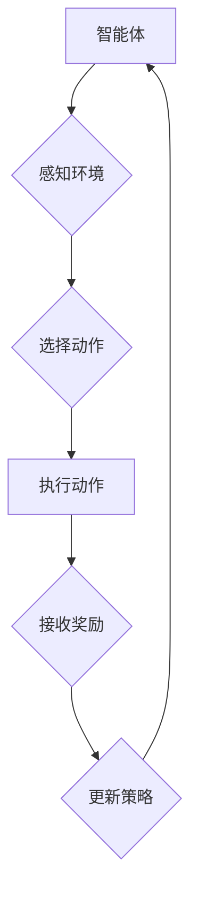

> 强化学习、深度强化学习、Q学习、SARSA、DDPG、A3C、强化学习算法、强化学习应用

## 1. 背景介绍

强化学习 (Reinforcement Learning, RL) 作为机器学习领域的重要分支，近年来取得了显著进展，并在机器人控制、游戏 AI、推荐系统等领域展现出强大的应用潜力。与监督学习和无监督学习不同，强化学习的核心在于智能体通过与环境的交互，学习最优的策略，以最大化累积的奖励。

传统的强化学习算法通常基于模型，需要事先构建环境模型，但现实世界环境往往过于复杂，难以精确建模。深度强化学习 (Deep Reinforcement Learning, DRL) 则通过引入深度神经网络，学习环境的复杂映射关系，从而能够处理更复杂的环境和任务。

## 2. 核心概念与联系

**核心概念:**

* **智能体 (Agent):** 与环境交互并采取行动的实体。
* **环境 (Environment):** 智能体所处的外部世界，提供状态和奖励信息。
* **状态 (State):** 环境的当前描述，例如游戏中的棋盘状态。
* **动作 (Action):** 智能体在特定状态下可以采取的行动，例如在游戏中移动棋子。
* **奖励 (Reward):** 环境对智能体采取的行动给予的反馈，可以是正向奖励或负向惩罚。
* **策略 (Policy):** 智能体在不同状态下选择动作的规则，可以是确定性策略或概率性策略。
* **价值函数 (Value Function):** 评估状态或状态-动作对的长期价值，例如在某个状态下采取某个动作的预期累积奖励。

**强化学习流程:**



## 3. 核心算法原理 & 具体操作步骤

### 3.1  算法原理概述

强化学习算法的核心是通过不断与环境交互，学习最优的策略，以最大化累积的奖励。常见的强化学习算法包括 Q 学习、SARSA、DDPG、A3C 等。

* **Q 学习:** 基于价值函数的算法，通过学习状态-动作对的 Q 值，选择最大 Q 值对应的动作。
* **SARSA:** 与 Q 学习类似，但 SARSA 在选择动作时考虑了当前状态和采取的动作，而不是仅仅考虑最大 Q 值。
* **DDPG:** 深度强化学习算法，使用深度神经网络估计 Q 值，并采用经验回放和目标网络等技术提高学习效率。
* **A3C:** 并行强化学习算法，多个智能体同时学习，并通过共享参数和异步更新策略进行协作。

### 3.2  算法步骤详解

以 Q 学习为例，其具体操作步骤如下：

1. 初始化 Q 值表，将所有状态-动作对的 Q 值设置为 0。
2. 在环境中进行交互，观察状态、采取动作、接收奖励。
3. 根据 Bellman 方程更新 Q 值：

```
Q(s, a) = Q(s, a) + α [r + γ max Q(s', a') - Q(s, a)]
```

其中：

* α 为学习率，控制学习速度。
* γ 为折扣因子，控制未来奖励的权重。
* r 为当前奖励。
* s' 为下一个状态。
* a' 为下一个状态下采取的动作。

4. 重复步骤 2 和 3，直到 Q 值收敛。

### 3.3  算法优缺点

**Q 学习:**

* **优点:** 算法简单易懂，易于实现。
* **缺点:** 容易陷入局部最优，需要大量的样本数据才能收敛。

**SARSA:**

* **优点:** 能够学习在线策略，避免了 Q 学习的局部最优问题。
* **缺点:** 学习速度较慢，容易受到噪声的影响。

**DDPG:**

* **优点:** 可以处理连续动作空间，学习效率高。
* **缺点:** 需要设计复杂的网络结构，训练过程较为复杂。

**A3C:**

* **优点:** 并行学习，学习速度快，能够处理复杂任务。
* **缺点:** 需要分布式计算资源，算法实现较为复杂。

### 3.4  算法应用领域

强化学习算法广泛应用于以下领域：

* **机器人控制:** 训练机器人完成复杂的任务，例如导航、抓取、运动控制等。
* **游戏 AI:** 开发智能游戏对手，例如围棋、象棋、Go 等。
* **推荐系统:** 建立个性化推荐系统，推荐用户感兴趣的内容。
* **金融交易:** 开发智能交易系统，自动进行股票交易等。
* **医疗诊断:** 辅助医生进行疾病诊断，提高诊断准确率。

## 4. 数学模型和公式 & 详细讲解 & 举例说明

### 4.1  数学模型构建

强化学习的核心数学模型是价值函数，它评估状态或状态-动作对的长期价值。常见的价值函数包括：

* **状态价值函数 (State-Value Function):** 评估状态在当前策略下获得的预期累积奖励。

$$
V^{\pi}(s) = E_{\pi}[R_t | S_t = s]
$$

* **动作价值函数 (Action-Value Function):** 评估在特定状态下采取特定动作的预期累积奖励。

$$
Q^{\pi}(s, a) = E_{\pi}[R_t + \gamma V^{\pi}(S_{t+1}) | S_t = s, A_t = a]
$$

其中：

* π 为策略。
* E 表示期望值。
* R_t 为时间 t 的奖励。
* S_t 为时间 t 的状态。
* A_t 为时间 t 的动作。
* γ 为折扣因子。

### 4.2  公式推导过程

Bellman 方程是强化学习算法的核心公式，它描述了价值函数的更新规则。

* **状态价值函数的 Bellman 方程:**

$$
V^{\pi}(s) = \max_a Q^{\pi}(s, a)
$$

* **动作价值函数的 Bellman 方程:**

$$
Q^{\pi}(s, a) = R(s, a) + \gamma \max_{a'} Q^{\pi}(s', a')
$$

其中：

* R(s, a) 为状态 s 下采取动作 a 的奖励。
* s' 为状态 s 下采取动作 a 后的下一个状态。

### 4.3  案例分析与讲解

例如，在玩游戏时，智能体需要学习如何选择最优的动作，以获得最大的奖励。

* 状态：游戏中的棋盘状态。
* 动作：移动棋子、攻击敌人等。
* 奖励：获得分数、击杀敌人等。

通过学习状态-动作对的 Q 值，智能体可以学习到在不同状态下采取不同动作的预期奖励，从而选择最优的动作。

## 5. 项目实践：代码实例和详细解释说明

### 5.1  开发环境搭建

* Python 3.x
* TensorFlow 或 PyTorch
* OpenAI Gym

### 5.2  源代码详细实现

```python
import gym
import numpy as np
from tensorflow.keras.models import Sequential
from tensorflow.keras.layers import Dense

# 定义 Q 学习算法
class QLearningAgent:
    def __init__(self, state_size, action_size, learning_rate=0.1, discount_factor=0.99, epsilon=0.1):
        self.state_size = state_size
        self.action_size = action_size
        self.learning_rate = learning_rate
        self.discount_factor = discount_factor
        self.epsilon = epsilon
        self.q_table = np.zeros((state_size, action_size))

    def choose_action(self, state):
        if np.random.uniform(0, 1) < self.epsilon:
            return np.random.randint(self.action_size)
        else:
            return np.argmax(self.q_table[state])

    def update_q_table(self, state, action, reward, next_state):
        self.q_table[state, action] = (1 - self.learning_rate) * self.q_table[state, action] + self.learning_rate * (reward + self.discount_factor * np.max(self.q_table[next_state]))

# 创建环境
env = gym.make('CartPole-v1')

# 初始化 Q 学习代理
agent = QLearningAgent(state_size=env.observation_space.shape[0], action_size=env.action_space.n)

# 训练
for episode in range(1000):
    state = env.reset()
    done = False
    total_reward = 0
    while not done:
        action = agent.choose_action(state)
        next_state, reward, done, _ = env.step(action)
        agent.update_q_table(state, action, reward, next_state)
        state = next_state
        total_reward += reward
    print(f'Episode {episode+1}, Total Reward: {total_reward}')

# 测试
state = env.reset()
while True:
    env.render()
    action = agent.choose_action(state)
    next_state, reward, done, _ = env.step(action)
    state = next_state
    if done:
        break
env.close()
```

### 5.3  代码解读与分析

* **环境搭建:** 使用 OpenAI Gym 创建 CartPole 环境，这是一个经典的强化学习环境。
* **Q 学习代理:** 定义 Q 学习代理类，包含 Q 值表、学习率、折扣因子和探索率等参数。
* **动作选择:** 使用 ε-贪婪策略选择动作，以平衡探索和利用。
* **Q 值更新:** 使用 Bellman 方程更新 Q 值表，根据奖励和下一个状态的 Q 值最大值。
* **训练和测试:** 训练代理，并测试代理在环境中的表现。

### 5.4  运行结果展示

训练完成后，代理能够在 CartPole 环境中保持平衡，并获得较高的奖励。

## 6. 实际应用场景

强化学习算法在各个领域都有着广泛的应用场景，例如：

* **游戏 AI:** 强化学习算法可以训练智能游戏对手，例如 AlphaGo、AlphaZero 等，在围棋、象棋、Go 等游戏中取得了人类难以企及的成绩。
* **机器人控制:** 强化学习算法可以训练机器人完成复杂的任务，例如导航、抓取、运动控制等，提高机器人的自主性和适应性。
* **推荐系统:** 强化学习算法可以根据用户的行为数据，学习用户的偏好，并推荐用户感兴趣的内容，提高推荐系统的准确性和个性化程度。
* **金融交易:** 强化学习算法可以开发智能交易系统，自动进行股票交易等，提高交易效率和收益。
* **医疗诊断:** 强化学习算法可以辅助医生进行疾病诊断，提高诊断准确率和效率。

### 6.4  未来应用展望

随着人工智能技术的不断发展，强化学习算法的应用场景将会更加广泛，例如：

* **自动驾驶:** 强化学习算法可以训练自动驾驶系统，使其能够在复杂路况下安全行驶。
* **个性化教育:** 强化学习算法可以根据学生的学习情况，提供个性化的学习方案，提高学习效率。
* **药物研发:** 强化学习算法可以加速药物研发过程，提高药物研发效率和成功率。

## 7. 工具和资源推荐

### 7.1  学习资源推荐

* **书籍:**
    * Reinforcement Learning: An Introduction by Richard S. Sutton and Andrew G. Barto
    * Deep Reinforcement Learning Hands-On by Maxim Lapan
* **在线课程:**
    * Deep Reinforcement Learning Specialization by DeepLearning.AI
    * Reinforcement Learning by David Silver (University of DeepMind)

### 7.2  开发工具推荐

* **Tensor