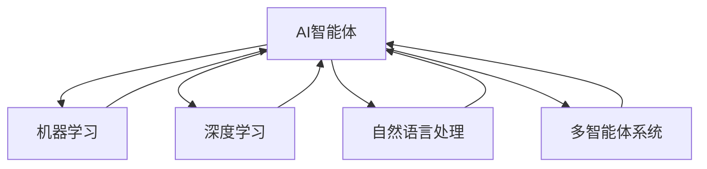

                 

- AI Agent
- Intelligent Agents
- Reinforcement Learning
- Deep Learning
- Natural Language Processing
- Multi-Agent Systems
- AI Ethics

## 1. 背景介绍

在人工智能（AI）领域，我们见证了从机器学习到深度学习，再到大型语言模型（如ChatGPT）的快速发展。然而，AI的下一个风口在哪里？本文将探讨AI智能体（AI Agent）的概念，从ChatGPT到智能体，展示AI的未来发展方向。

## 2. 核心概念与联系

### 2.1 AI智能体（AI Agent）的定义

AI智能体是一种能够感知环境、做出决策并采取行动的智能代理。它可以是软件程序、机器人或其他智能系统。智能体的目标是最大化其在环境中的表现，通常通过学习和适应环境来实现。

### 2.2 AI智能体的类型

AI智能体可以分为以下几类：

- **反应型智能体**：只根据当前感知到的信息做出决策。
- **简单智能体**：具有有限的记忆，可以考虑过去的信息。
- **序列智能体**：具有内部状态，可以在一系列决策中保持一致。
- **目标导向智能体**：具有明确的目标，并能够计划和执行任务以实现这些目标。

### 2.3 AI智能体的联系

AI智能体的发展与人工智能的其他领域密切相关，如机器学习、深度学习、自然语言处理和多智能体系统。它们共同构成了AI的生态系统，推动着AI的发展。



## 3. 核心算法原理 & 具体操作步骤

### 3.1 算法原理概述

AI智能体的核心算法是强化学习（Reinforcement Learning），它模拟了动物学习的过程。智能体通过与环境交互，学习到最佳行为以最大化其回报。

### 3.2 算法步骤详解

1. **状态（State）**：智能体感知环境的当前状态。
2. **动作（Action）**：智能体根据当前状态选择一个动作。
3. **回报（Reward）**：环境根据智能体的动作提供回报。
4. **学习（Learning）**：智能体根据回报更新其决策策略。
5. **重复（Repeat）**：智能体重复上述过程，直到达到目标或环境结束。

### 3.3 算法优缺点

**优点**：强化学习可以学习复杂的任务，无需明确的特征工程，并且可以处理不确定性。

**缺点**：强化学习需要大量的样本和计算资源，并且可能会陷入局部最优解。

### 3.4 算法应用领域

强化学习在游戏（如AlphaGo）、机器人导航、自动驾驶、电力调度等领域有着广泛的应用。

## 4. 数学模型和公式 & 详细讲解 & 举例说明

### 4.1 数学模型构建

强化学习的数学模型包括马尔可夫决策过程（Markov Decision Process，MDP）和部分可观察马尔可夫决策过程（Partially Observable Markov Decision Process，POMDP）。

### 4.2 公式推导过程

**MDP**：给定状态$s_t$和动作$a_t$，智能体转移到下一个状态$s_{t+1}$的概率为$P(s_{t+1}|s_t, a_t)$，并获得回报$R(s_t, a_t, s_{t+1})$.

**POMDP**：智能体只能观察到环境的部分信息，即观察$o_t$。智能体的目标是最大化其预期回报$V^{\pi}(s) = E[R_1 + R_2 +... | s_1 = s, \pi]$.

### 4.3 案例分析与讲解

例如，在自动驾驶中，智能体的状态$s_t$可以是车辆的位置和速度，动作$a_t$可以是加速、减速或转向，回报$R(s_t, a_t, s_{t+1})$可以是避免碰撞和到达目的地的奖励。

## 5. 项目实践：代码实例和详细解释说明

### 5.1 开发环境搭建

我们将使用Python和Stable Baselines3库来实现一个简单的强化学习算法——Q-Learning。

### 5.2 源代码详细实现

```python
import numpy as np
import gym
from stable_baselines3 import QLearningPolicy, PPO
from stable_baselines3.common.policies import MlpPolicy
from stable_baselines3.common.vec_env import DummyVecEnv

env = gym.make('CartPole-v1')
env = DummyVecEnv([lambda: env])

model = QLearningPolicy('MlpPolicy', env, n_steps=2048)
model.learn(total_timesteps=25000)

obs = env.reset()
while True:
    action, _states = model.predict(obs)
    obs, rewards, dones, info = env.step(action)
    if dones[0]:
        obs = env.reset()
```

### 5.3 代码解读与分析

我们首先导入必要的库并创建环境。然后，我们定义Q-Learning策略并学习。最后，我们使用模型预测动作并与环境交互。

### 5.4 运行结果展示

通过运行上述代码，智能体将学习如何平衡杆子，使得车子在轨道上行驶。

## 6. 实际应用场景

### 6.1 当前应用

AI智能体在各种领域都有应用，如自动驾驶、机器人导航、电力调度和游戏。

### 6.2 未来应用展望

未来，AI智能体将在更复杂的任务中发挥作用，如自主空间任务、医疗保健和人工智能道德决策。

## 7. 工具和资源推荐

### 7.1 学习资源推荐

- 书籍：《强化学习：智能代理的方法》作者：Richard S. Sutton, Andrew G. Barto
- 课程：Stanford University的CS221强化学习课程

### 7.2 开发工具推荐

- Stable Baselines3：一个强化学习库，提供了多种算法的实现。
- Gym：一个开源的机器学习环境库。

### 7.3 相关论文推荐

- [Deep Reinforcement Learning Hands On](https://www.oreilly.com/library/view/deep-reinforcement-learning/9781492032009/)
- [Reinforcement Learning: An Introduction](https://incompleteideas.net/book/the-book.html)

## 8. 总结：未来发展趋势与挑战

### 8.1 研究成果总结

本文介绍了AI智能体的概念，强化学习算法的原理和应用，并提供了一个简单的项目实践。

### 8.2 未来发展趋势

未来，AI智能体将在更复杂的任务中发挥作用，并需要考虑道德和安全问题。

### 8.3 面临的挑战

挑战包括样本效率、计算资源和算法稳定性。

### 8.4 研究展望

未来的研究方向包括多智能体系统、强化学习与深度学习的结合，以及AI道德决策。

## 9. 附录：常见问题与解答

**Q：强化学习需要大量的样本吗？**

**A：**是的，强化学习通常需要大量的样本。然而， recent advancements like Hindsight Experience Replay (HER) and Prioritized Replay (PR) can help reduce the sample complexity.

**Q：强化学习可以处理不确定性吗？**

**A：**是的，强化学习可以处理不确定性。通过使用不确定性回报（如Entropy-regularized reinforcement learning）或不确定性动作（如Bayesian reinforcement learning），智能体可以学习在不确定环境中做出最佳决策。

**作者：禅与计算机程序设计艺术 / Zen and the Art of Computer Programming**

