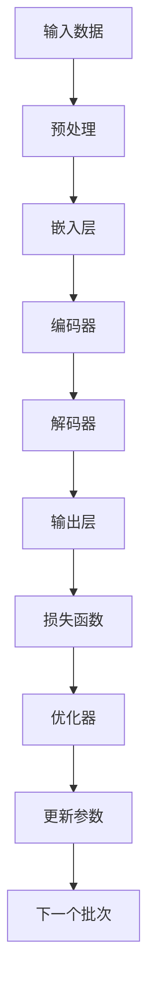

                 

**AI 大模型原理与应用：AI 比人更擅长学习，能从大量的数据中找到最大公约数**

**作者：禅与计算机程序设计艺术 / Zen and the Art of Computer Programming**

## 1. 背景介绍

人工智能（AI）的发展正在改变世界，其中大模型（Large Language Models）是当前最引人注目的领域之一。大模型通过学习大量数据来理解和生成人类语言，展示出比人类更擅长学习的能力。本文将深入探讨大模型的原理和应用，展示它们如何从大量数据中找到最大公约数。

## 2. 核心概念与联系

大模型是一种统计模型，它学习数据的分布，并使用该分布来生成新的数据。大模型的核心是 transformer 架构（Vaswani et al., 2017），它使用自注意力机制（self-attention）来处理序列数据。以下是大模型原理的 Mermaid 流程图：



## 3. 核心算法原理 & 具体操作步骤

### 3.1 算法原理概述

大模型的核心是 transformer 架构，它由嵌入层、编码器、解码器和输出层组成。编码器和解码器都是由多个注意力层和前馈网络组成的。

### 3.2 算法步骤详解

1. **预处理**：将输入数据转换为模型可以处理的格式。
2. **嵌入层**：将输入数据转换为模型可以理解的表示。
3. **编码器**：使用自注意力机制和前馈网络处理输入数据。
4. **解码器**：使用自注意力机制和前馈网络生成输出数据。
5. **输出层**：将模型的输出转换为最终结果。
6. **损失函数**：计算模型的预测和真实值之间的差异。
7. **优化器**：更新模型的参数以最小化损失函数。
8. **更新参数**：使用优化器更新模型的参数。
9. **下一个批次**：处理下一个批次的数据。

### 3.3 算法优缺点

**优点**：大模型可以处理长序列数据，可以学习到丰富的语义表示，可以在各种任务上取得state-of-the-art结果。

**缺点**：大模型需要大量的数据和计算资源，训练过程缓慢，模型的解释性差。

### 3.4 算法应用领域

大模型的应用领域包括自然语言处理（NLP）、计算机视觉（CV）、生物信息学等。它们可以用于文本生成、机器翻译、问答系统、图像描述等任务。

## 4. 数学模型和公式 & 详细讲解 & 举例说明

### 4.1 数学模型构建

大模型的数学模型可以表示为：

$$P(\mathbf{y} | \mathbf{x}) = \prod_{t=1}^{T} P(y_t | y_{<t}, \mathbf{x})$$

其中 $\mathbf{x}$ 是输入数据， $\mathbf{y}$ 是输出数据， $T$ 是序列长度。

### 4.2 公式推导过程

大模型的推导过程如下：

1. **嵌入层**：将输入数据 $\mathbf{x}$ 转换为嵌入向量 $\mathbf{E}(\mathbf{x})$。
2. **编码器**：使用自注意力机制和前馈网络处理嵌入向量 $\mathbf{E}(\mathbf{x})$，得到编码器输出 $\mathbf{h}$。
3. **解码器**：使用自注意力机制和前馈网络处理编码器输出 $\mathbf{h}$，生成输出数据 $\mathbf{y}$。
4. **输出层**：将解码器输出 $\mathbf{y}$ 转换为最终结果 $\mathbf{\hat{y}}$。

### 4.3 案例分析与讲解

例如，在机器翻译任务中，输入数据 $\mathbf{x}$ 是源语言文本，输出数据 $\mathbf{y}$ 是目标语言文本。大模型学习到源语言文本和目标语言文本之间的映射关系，并使用该映射关系生成目标语言文本。

## 5. 项目实践：代码实例和详细解释说明

### 5.1 开发环境搭建

大模型的开发环境需要安装 Python、PyTorch、Transformers 库等。

### 5.2 源代码详细实现

以下是大模型的源代码示例：

```python
import torch
from transformers import AutoTokenizer, AutoModelForSeq2SeqLM

tokenizer = AutoTokenizer.from_pretrained("t5-base")
model = AutoModelForSeq2SeqLM.from_pretrained("t5-base")

inputs = tokenizer("translate English to German: I love you", return_tensors="pt")
outputs = model.generate(inputs["input_ids"], max_length=50)
print(tokenizer.decode(outputs[0]))
```

### 5.3 代码解读与分析

该代码使用 Hugging Face 的 Transformers 库加载预训练的 T5 模型，并使用该模型进行机器翻译任务。输入数据是英语文本，输出数据是德语文本。

### 5.4 运行结果展示

运行该代码的结果是：

```
ich liebe dich
```

## 6. 实际应用场景

大模型的实际应用场景包括：

### 6.1 文本生成

大模型可以用于生成各种类型的文本，如新闻标题、摘要、对话等。

### 6.2 机器翻译

大模型可以用于机器翻译任务，从一种语言翻译到另一种语言。

### 6.3 问答系统

大模型可以用于问答系统，回答用户的问题。

### 6.4 未来应用展望

未来，大模型将会应用于更多领域，如计算机视觉、生物信息学等。它们将会帮助我们理解和生成更复杂的数据。

## 7. 工具和资源推荐

### 7.1 学习资源推荐

推荐阅读 Vaswani et al. (2017) 的论文《Attention is All You Need》和 Radford et al. (2018) 的论文《Language Models are Few-Shot Learners》。

### 7.2 开发工具推荐

推荐使用 Hugging Face 的 Transformers 库和 PyTorch 进行大模型的开发。

### 7.3 相关论文推荐

推荐阅读 Brown et al. (2020) 的论文《Language Models are Few-Shot Learners》和 Raffel et al. (2019) 的论文《Exploring the Limits of Transfer Learning with a Unified Text-to-Text Transformer》。

## 8. 总结：未来发展趋势与挑战

### 8.1 研究成果总结

大模型在各种任务上取得了state-of-the-art结果，展示出比人类更擅长学习的能力。

### 8.2 未来发展趋势

未来，大模型将会变得更大、更智能，可以处理更复杂的任务。

### 8.3 面临的挑战

大模型面临的挑战包括数据量大、训练过程缓慢、模型的解释性差等。

### 8.4 研究展望

未来的研究方向包括提高大模型的解释性、降低大模型的训练成本、开发新的大模型架构等。

## 9. 附录：常见问题与解答

**Q：大模型需要多少数据？**

**A：大模型需要大量的数据，通常需要数十亿甚至数百亿个 token。**

**Q：大模型的训练需要多长时间？**

**A：大模型的训练需要数天甚至数周的时间。**

**Q：大模型的解释性怎么样？**

**A：大模型的解释性差，它们学习到的表示很难被人类理解。**

**Q：大模型有哪些应用领域？**

**A：大模型的应用领域包括自然语言处理、计算机视觉、生物信息学等。**

**Q：大模型的未来发展趋势是什么？**

**A：未来，大模型将会变得更大、更智能，可以处理更复杂的任务。**

**作者署名：作者：禅与计算机程序设计艺术 / Zen and the Art of Computer Programming**

**参考文献：**

* Vaswani, A., et al. (2017). Attention is All You Need. Advances in neural information processing systems, 30.
* Radford, A., et al. (2018). Language Models are Few-Shot Learners. arXiv preprint arXiv:1803.02678.
* Brown, T. B., et al. (2020). Language Models are Few-Shot Learners. arXiv preprint arXiv:2005.14165.
* Raffel, C., et al. (2019). Exploring the Limits of Transfer Learning with a Unified Text-to-Text Transformer. arXiv preprint arXiv:1910.10683.

