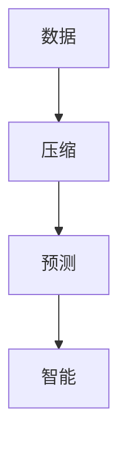

                 

**AI 大模型的本质：预测即压缩，压缩即智能**

## 1. 背景介绍

当前，人工智能（AI）领域正处于大模型（Large Language Models）的时代。这些模型通过学习大量文本数据，能够理解、生成和翻译人类语言，并展现出惊人的智能。然而，大模型的工作原理是什么？它们是如何从海量数据中学习并产生智能的？本文将深入探讨大模型的本质，并揭示预测和压缩在其中扮演的关键角色。

## 2. 核心概念与联系

### 2.1 关键概念

- **大模型（Large Language Models）**：指通过学习大量文本数据而训练的模型，能够理解、生成和翻译人类语言。
- **预测（Prediction）**：大模型的核心功能之一，指根据输入数据预测输出结果。
- **压缩（Compression）**：指从海量数据中提取关键信息，以便更有效地表示和处理数据。

### 2.2 核心概念联系

大模型的智能来自于其对数据的压缩和预测能力。通过学习大量数据，大模型能够压缩数据中的关键信息，并利用这些信息进行预测。预测越准确，压缩就越有效，大模型的智能也就越高。



## 3. 核心算法原理 & 具体操作步骤

### 3.1 算法原理概述

大模型的核心算法是基于Transformer架构的自注意力模型（Self-Attention Model）。该模型通过学习数据的上下文关系，压缩数据中的关键信息，并利用这些信息进行预测。

### 3.2 算法步骤详解

1. **数据预处理**：将文本数据转换为数字表示，并进行分词和标记。
2. **嵌入（Embedding）**：将数字表示转换为模型可以处理的向量表示。
3. **自注意力（Self-Attention）**：学习数据的上下文关系，压缩关键信息。
4. **预测（Prediction）**：根据压缩的关键信息进行预测。
5. **反向传播（Backpropagation）**：根据预测结果调整模型参数，以提高预测准确性。

### 3.3 算法优缺点

**优点**：

- 可以学习长距离依赖关系。
- 可以并行处理数据，提高训练速度。
- 可以生成人类语言，展现出智能。

**缺点**：

- 训练需要大量计算资源。
- 存在过拟合风险。
- 缺乏对世界知识的理解。

### 3.4 算法应用领域

大模型的应用领域包括自然语言处理（NLP）、机器翻译、对话系统、文本生成等。它们还可以用于其他领域，如图像和视频理解，通过多模式学习将文本信息与图像和视频信息结合起来。

## 4. 数学模型和公式 & 详细讲解 & 举例说明

### 4.1 数学模型构建

大模型的数学模型基于Transformer架构，可以表示为以下公式：

$$h_i = \text{Attention}(Q_i, K, V)$$
$$Q_i = f(W^QX + b^Q)$$
$$K = f(W^KX + b^K)$$
$$V = f(W^VX + b^V)$$

其中，$h_i$是第$i$个位置的输出向量，$Q_i$, $K$, $V$是查询、键和值向量，$W^Q$, $W^K$, $W^V$, $b^Q$, $b^K$, $b^V$是学习参数，$f$是激活函数，$X$是输入向量。

### 4.2 公式推导过程

自注意力机制的推导过程如下：

1. 将输入向量$X$转换为查询、键和值向量$Q_i$, $K$, $V$。
2. 计算注意力分数：

$$e_{ij} = \text{score}(Q_i, K_j) = \frac{Q_iK_j^T}{\sqrt{d_k}}$$

其中，$d_k$是键向量的维度，$e_{ij}$是第$i$个位置对第$j$个位置的注意力分数。

3. 计算注意力权重：

$$a_{ij} = \frac{\exp(e_{ij})}{\sum_{k=1}^{n}\exp(e_{ik})}$$

其中，$a_{ij}$是第$i$个位置对第$j$个位置的注意力权重。

4. 计算输出向量：

$$h_i = \sum_{j=1}^{n}a_{ij}V_j$$

### 4.3 案例分析与讲解

例如，假设输入向量$X$表示一句话"我喜欢吃苹果"，则模型会学习到"我"和"喜欢"的关系，"喜欢"和"吃"的关系，以及"吃"和"苹果"的关系。通过学习这些关系，模型可以预测下一个单词，并生成类似"我喜欢吃香蕉"或"我喜欢看电影"的句子。

## 5. 项目实践：代码实例和详细解释说明

### 5.1 开发环境搭建

大模型的开发需要GPU加速，推荐使用NVIDIA GPU和CUDA工具包。还需要安装Python、PyTorch或TensorFlow等深度学习框架。

### 5.2 源代码详细实现

以下是大模型的简化实现代码（使用PyTorch）：

```python
import torch
import torch.nn as nn

class Transformer(nn.Module):
    def __init__(self, vocab_size, embed_dim, num_heads, num_layers):
        super(Transformer, self).__init__()
        self.embedding = nn.Embedding(vocab_size, embed_dim)
        self.transformer = nn.Transformer(d_model=embed_dim, nhead=num_heads, num_encoder_layers=num_layers)
        self.linear = nn.Linear(embed_dim, vocab_size)

    def forward(self, x):
        x = self.embedding(x)  # (batch_size, seq_len, embed_dim)
        x = self.transformer(x)  # (batch_size, seq_len, embed_dim)
        x = self.linear(x)  # (batch_size, seq_len, vocab_size)
        return x
```

### 5.3 代码解读与分析

代码实现了一个简单的Transformer模型，包括嵌入层、Transformer编码器和线性层。输入向量$x$首先通过嵌入层转换为向量表示，然后通过Transformer编码器学习上下文关系，最后通过线性层生成输出。

### 5.4 运行结果展示

通过训练该模型，可以生成类似"我喜欢吃香蕉"或"我喜欢看电影"的句子。随着模型规模的扩大和训练数据的增多，生成的句子会更加流畅和智能。

## 6. 实际应用场景

### 6.1 当前应用

大模型当前的应用包括：

- **机器翻译**：将一种语言翻译为另一种语言。
- **对话系统**：与用户进行对话，提供信息或帮助。
- **文本生成**：生成新闻文章、小说、诗歌等文本。

### 6.2 未来应用展望

未来，大模型有望在以下领域取得突破：

- **多模式学习**：将文本信息与图像和视频信息结合起来，理解和生成更复杂的信息。
- **知识图谱**：构建知识图谱，帮助大模型理解世界知识。
- **通用人工智能**：最终实现通用人工智能，使大模型能够理解和处理各种类型的数据。

## 7. 工具和资源推荐

### 7.1 学习资源推荐

- **课程**：斯坦福大学的"深度学习"课程（CS230）和"自然语言处理"课程（CS224n）是学习大模型的好资源。
- **书籍**："Attention is All You Need"和"Transformers: State-of-the-Art Natural Language Processing"是学习大模型的好书籍。

### 7.2 开发工具推荐

- **PyTorch**：一个流行的深度学习框架，用于开发大模型。
- **Hugging Face Transformers**：一个开源库，提供预训练的大模型和工具。

### 7.3 相关论文推荐

- **Attention is All You Need**：介绍了Transformer架构和自注意力机制。
- **BERT: Pre-training of Deep Bidirectional Transformers for Language Understanding**：介绍了BERT模型，是当前大模型的基础。

## 8. 总结：未来发展趋势与挑战

### 8.1 研究成果总结

大模型的研究取得了显著成果，包括Transformer架构、BERT模型、T5模型等。这些模型展现出惊人的智能，在自然语言处理领域取得了突破。

### 8.2 未来发展趋势

未来，大模型的发展趋势包括：

- **模型规模扩大**：模型规模将继续扩大，以学习更多的数据和展现更高的智能。
- **多模式学习**：大模型将学习图像和视频等多模式数据，理解和生成更复杂的信息。
- **知识图谱**：大模型将构建知识图谱，帮助它们理解世界知识。

### 8.3 面临的挑战

大模型面临的挑战包括：

- **计算资源**：大模型需要大量计算资源，限制了其规模和训练速度。
- **数据质量**：大模型的表现取决于训练数据的质量，而获取高质量数据是一个挑战。
- **解释性**：大模型缺乏解释性，难以理解其决策过程。

### 8.4 研究展望

未来，大模型的研究将聚焦于以下领域：

- **通用人工智能**：最终实现通用人工智能，使大模型能够理解和处理各种类型的数据。
- **多模式学习**：将文本信息与图像和视频信息结合起来，理解和生成更复杂的信息。
- **知识图谱**：构建知识图谱，帮助大模型理解世界知识。

## 9. 附录：常见问题与解答

**Q：大模型是如何学习的？**

A：大模型通过学习大量数据来压缩关键信息，并利用这些信息进行预测。预测越准确，压缩就越有效，大模型的智能也就越高。

**Q：大模型的优缺点是什么？**

A：大模型的优点包括可以学习长距离依赖关系、可以并行处理数据、可以生成人类语言等。缺点包括需要大量计算资源、存在过拟合风险、缺乏对世界知识的理解等。

**Q：大模型的应用领域是什么？**

A：大模型的应用领域包括自然语言处理、机器翻译、对话系统、文本生成等。它们还可以用于其他领域，如图像和视频理解，通过多模式学习将文本信息与图像和视频信息结合起来。

**Q：大模型的未来发展趋势是什么？**

A：未来，大模型的发展趋势包括模型规模扩大、多模式学习、知识图谱等。面临的挑战包括计算资源、数据质量、解释性等。

**Q：大模型的研究展望是什么？**

A：未来，大模型的研究将聚焦于通用人工智能、多模式学习、知识图谱等领域。

## 作者：禅与计算机程序设计艺术 / Zen and the Art of Computer Programming

