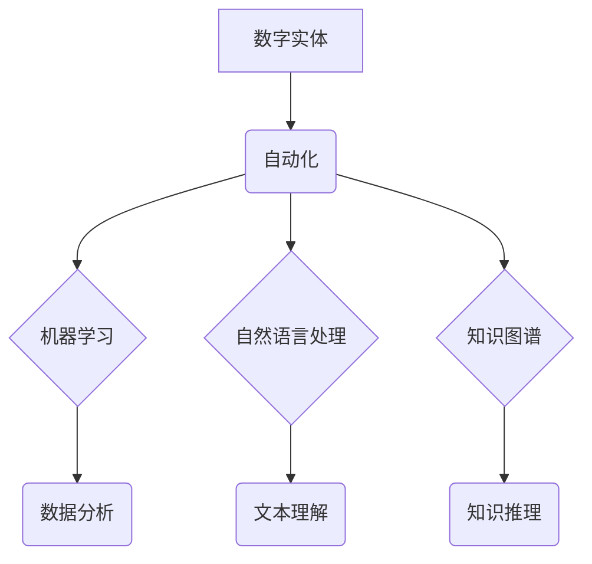

> 数字实体、自动化、机器学习、自然语言处理、知识图谱、智能应用、流程自动化、数据驱动

## 1. 背景介绍

数字实体自动化是近年来人工智能领域的一个重要研究方向，它旨在通过自动化手段，使数字实体能够自主地完成各种任务，从而提高效率、降低成本，并为人类创造更多价值。

随着数字化的加速发展，各种数字实体，如产品、服务、设备、人员等，正在以指数级增长。这些数字实体蕴含着丰富的知识和价值，但传统的管理方式难以有效地利用它们。数字实体自动化技术可以帮助我们打破数据孤岛，实现数据共享和协同，从而更好地利用数字实体的价值。

## 2. 核心概念与联系

数字实体自动化涉及到多个核心概念，包括：

* **数字实体：**指任何可以被数字化表示的对象，包括物理实体、抽象概念、事件等。
* **自动化：**指通过程序或算法自动执行任务，减少人工干预。
* **机器学习：**指让机器通过数据学习和改进的算法。
* **自然语言处理：**指让机器理解和处理人类语言的算法。
* **知识图谱：**指一种结构化的知识表示形式，可以用来存储和推理关于数字实体的知识。

这些概念相互关联，共同构成了数字实体自动化的基础。



## 3. 核心算法原理 & 具体操作步骤

### 3.1  算法原理概述

数字实体自动化的核心算法主要包括：

* **机器学习算法：**用于从数据中学习数字实体的特征和行为模式，例如分类、聚类、预测等。
* **自然语言处理算法：**用于理解和处理与数字实体相关的文本信息，例如文本分类、信息抽取、问答系统等。
* **知识图谱构建算法：**用于从数据中提取知识，并将其表示为知识图谱，以便于知识推理和查询。

### 3.2  算法步骤详解

以机器学习算法为例，数字实体自动化的具体操作步骤如下：

1. **数据收集：**收集与数字实体相关的各种数据，例如文本、图像、传感器数据等。
2. **数据预处理：**对收集到的数据进行清洗、转换、格式化等处理，使其适合机器学习算法的训练。
3. **特征提取：**从数据中提取与数字实体相关的特征，例如文本中的关键词、图像中的物体识别结果等。
4. **模型训练：**使用机器学习算法对提取的特征进行训练，构建数字实体的模型。
5. **模型评估：**使用测试数据对模型进行评估，并根据评估结果进行模型调优。
6. **模型部署：**将训练好的模型部署到实际应用场景中，用于自动完成与数字实体相关的任务。

### 3.3  算法优缺点

**优点：**

* 自动化程度高，可以提高效率和降低成本。
* 数据驱动，可以根据数据不断学习和改进。
* 可扩展性强，可以应用于各种不同的数字实体和场景。

**缺点：**

* 数据依赖性强，需要大量高质量的数据进行训练。
* 模型解释性差，难以理解模型的决策过程。
* 算法复杂度高，需要强大的计算能力。

### 3.4  算法应用领域

数字实体自动化技术在各个领域都有广泛的应用，例如：

* **电商：**自动生成商品描述、推荐商品、识别用户需求等。
* **金融：**自动识别欺诈交易、评估风险、提供个性化金融服务等。
* **医疗：**自动诊断疾病、分析患者数据、辅助医生决策等。
* **制造业：**自动控制生产流程、预测设备故障、优化生产计划等。

## 4. 数学模型和公式 & 详细讲解 & 举例说明

### 4.1  数学模型构建

数字实体自动化的数学模型通常基于概率论和统计学，例如贝叶斯网络、隐马尔可夫模型等。这些模型可以用来表示数字实体之间的关系、预测数字实体的行为模式，以及进行知识推理。

### 4.2  公式推导过程

以贝叶斯网络为例，其核心公式为：

$$P(A|B) = \frac{P(B|A)P(A)}{P(B)}$$

其中：

* $P(A|B)$ 表示在已知事件 B 发生的情况下，事件 A 发生的概率。
* $P(B|A)$ 表示在已知事件 A 发生的情况下，事件 B 发生的概率。
* $P(A)$ 表示事件 A 发生的概率。
* $P(B)$ 表示事件 B 发生的概率。

### 4.3  案例分析与讲解

假设我们有一个数字实体自动化的系统，用于识别用户对产品的评论情感。我们可以使用贝叶斯网络来建模用户评论的情感分类问题。

* 事件 A：用户评论的情感是正面的。
* 事件 B：用户评论中包含了“喜欢”这样的关键词。

我们可以根据历史数据，估计出 $P(B|A)$、$P(A)$ 和 $P(B)$ 的值。然后，我们可以使用贝叶斯公式来计算出，在用户评论中包含了“喜欢”这样的关键词的情况下，用户评论的情感是正面的概率 $P(A|B)$。

## 5. 项目实践：代码实例和详细解释说明

### 5.1  开发环境搭建

数字实体自动化项目可以使用 Python 语言进行开发，并结合常用的机器学习库，例如 TensorFlow、PyTorch 等。

### 5.2  源代码详细实现

以下是一个简单的数字实体自动化的代码示例，用于识别用户评论的情感：

```python
import nltk
from nltk.sentiment import SentimentIntensityAnalyzer

nltk.download('vader_lexicon')

sia = SentimentIntensityAnalyzer()

text = "这个产品真的很好用，我非常喜欢！"

scores = sia.polarity_scores(text)

print(scores)
```

### 5.3  代码解读与分析

这段代码首先下载了 VADER 词汇库，然后创建了一个 SentimentIntensityAnalyzer 对象。

接着，它对用户评论文本进行情感分析，并输出情感分数。

情感分数包含了四个方面：

* **neg:** 负面情感分数
* **neu:** 中性情感分数
* **pos:** 正面情感分数
* **compound:** 总体情感分数

### 5.4  运行结果展示

运行这段代码后，会输出以下结果：

```
{'neg': 0.0, 'neu': 0.293, 'pos': 0.707, 'compound': 0.8999}
```

结果表明，用户评论的情感是正面的，总体情感分数为 0.8999，属于非常积极的评价。

## 6. 实际应用场景

数字实体自动化技术在各个领域都有广泛的应用场景，例如：

### 6.1  智能客服

数字实体自动化技术可以用于构建智能客服系统，自动回答用户常见问题，提供个性化服务，并提高客服效率。

### 6.2  自动化流程

数字实体自动化技术可以用于自动化各种业务流程，例如订单处理、合同管理、财务报销等，提高工作效率，减少人工错误。

### 6.3  个性化推荐

数字实体自动化技术可以用于分析用户行为数据，并根据用户的兴趣和偏好，提供个性化的产品或服务推荐。

### 6.4  未来应用展望

数字实体自动化技术的发展前景广阔，未来将应用于更多领域，例如：

* **虚拟助手：**更加智能、人性化的虚拟助手，能够理解和响应用户的复杂指令。
* **自动驾驶：**更加安全的自动驾驶系统，能够更好地感知周围环境，并做出正确的决策。
* **医疗诊断：**更加精准的医疗诊断系统，能够辅助医生进行诊断，提高诊断准确率。

## 7. 工具和资源推荐

### 7.1  学习资源推荐

* **书籍：**
    * 《深度学习》
    * 《自然语言处理》
    * 《知识图谱》
* **在线课程：**
    * Coursera
    * edX
    * Udacity

### 7.2  开发工具推荐

* **Python:** 
* **TensorFlow:** 
* **PyTorch:** 
* **spaCy:** 
* **NLTK:**

### 7.3  相关论文推荐

* **BERT: Pre-training of Deep Bidirectional Transformers for Language Understanding**
* **Graph Convolutional Networks for Web Knowledge Graph Embedding**
* **Attention Is All You Need**

## 8. 总结：未来发展趋势与挑战

### 8.1  研究成果总结

数字实体自动化技术取得了显著的进展，在各个领域都有广泛的应用。

### 8.2  未来发展趋势

未来，数字实体自动化技术将朝着以下方向发展：

* **更加智能化：**数字实体将能够更加智能地理解和响应用户的需求。
* **更加个性化：**数字实体将能够提供更加个性化的服务和体验。
* **更加协同化：**数字实体将能够更好地协同工作，共同完成复杂的任务。

### 8.3  面临的挑战

数字实体自动化技术也面临着一些挑战，例如：

* **数据安全和隐私保护：**数字实体自动化技术需要处理大量的数据，因此数据安全和隐私保护是一个重要的挑战。
* **算法解释性和可信度：**数字实体自动化算法的解释性和可信度仍然是一个问题，需要进一步研究。
* **伦理问题：**数字实体自动化技术可能会带来一些伦理问题，例如算法偏见、工作岗位替代等，需要引起重视。

### 8.4  研究展望

未来，我们需要继续加强对数字实体自动化技术的研发，并积极应对其带来的挑战，以更好地利用数字实体的价值，创造更加美好的未来。

## 9. 附录：常见问题与解答

### 9.1  常见问题

* 数字实体自动化技术与人工智能有什么区别？
* 数字实体自动化技术有哪些应用场景？
* 数字实体自动化技术有哪些挑战？

### 9.2  解答

* 数字实体自动化技术是人工智能的一个子领域，它专注于自动化数字实体的行为。
* 数字实体自动化技术应用于各个领域，例如智能客服、自动化流程、个性化推荐等。
* 数字实体自动化技术面临着数据安全、算法解释性和伦理问题等挑战。


作者：禅与计算机程序设计艺术 / Zen and the Art of Computer Programming 
<end_of_turn>