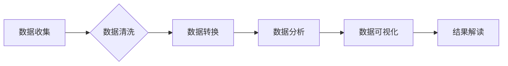

> 平台经济, 数据分析, 研究方向, 算法, 模型, 应用场景, 挑战

## 1. 背景介绍

平台经济作为一种新型的经济模式，以其连接用户和提供商，创造价值和促进交易的方式，迅速崛起并成为全球经济的重要组成部分。从出行、餐饮到教育、金融，平台经济的应用场景日益广泛。数据作为平台经济的核心驱动力，蕴藏着丰富的价值信息。通过对数据的分析和挖掘，可以帮助平台更好地理解用户需求、优化运营策略、提升用户体验，最终实现可持续发展。

然而，平台经济数据分析面临着诸多挑战：

* **数据规模庞大、结构复杂**: 平台经济产生的数据量巨大，且来自不同来源，结构多样，难以统一处理。
* **数据质量参差不齐**: 平台数据存在缺失、错误、重复等问题，需要进行清洗和预处理。
* **数据隐私安全**: 平台数据包含用户敏感信息，需要采取有效措施保障数据安全和隐私。
* **分析方法和工具不断迭代**: 平台经济发展迅速，数据分析方法和工具也需要不断更新和改进。

## 2. 核心概念与联系

**2.1 平台经济**

平台经济是指通过搭建线上平台，连接用户和提供商，并通过撮合交易、提供服务等方式创造价值的经济模式。

**2.2 数据分析**

数据分析是指通过收集、清洗、整理、分析和挖掘数据，以发现数据中的规律、趋势和价值，并为决策提供支持的过程。

**2.3 数据分析在平台经济中的应用**

数据分析在平台经济中扮演着至关重要的角色，可以应用于以下多个方面：

* **用户画像**: 通过分析用户行为、偏好和需求，构建用户画像，以便更好地理解用户群体，提供个性化服务。
* **推荐系统**: 基于用户历史行为和兴趣，推荐相关商品、服务或内容，提高用户粘性和转化率。
* **运营优化**: 分析平台运营数据，例如用户活跃度、交易额、用户流失率等，优化平台运营策略，提高平台效率和盈利能力。
* **风险控制**: 通过分析用户行为和交易数据，识别潜在的风险行为，例如欺诈、虚假交易等，有效控制平台风险。

**2.4 数据分析技术**

常用的数据分析技术包括：

* **统计分析**: 使用统计方法对数据进行描述和分析，例如计算平均值、标准差、相关系数等。
* **机器学习**: 使用算法训练模型，从数据中学习规律，进行预测和分类。
* **深度学习**: 使用多层神经网络模型，对复杂数据进行分析和挖掘。
* **数据可视化**: 使用图表和图形等方式，直观地展示数据信息，帮助用户理解数据趋势和规律。

**2.5 数据分析流程**

数据分析流程通常包括以下几个步骤：

1. **数据收集**: 从各种数据源收集相关数据。
2. **数据清洗**: 对收集到的数据进行清洗，去除缺失值、错误值和重复值。
3. **数据转换**: 将数据转换为适合分析的格式。
4. **数据分析**: 使用统计分析、机器学习等方法对数据进行分析。
5. **数据可视化**: 将分析结果以图表和图形等方式展示。
6. **结果解读**: 对分析结果进行解读，并提出相应的建议。

**2.6 Mermaid 流程图**



## 3. 核心算法原理 & 具体操作步骤

### 3.1  算法原理概述

在平台经济中，数据分析算法可以分为以下几类：

* **聚类算法**: 将用户或商品等数据点根据相似性进行分组，例如K-means聚类、DBSCAN聚类等。
* **推荐算法**: 根据用户历史行为和兴趣，推荐相关商品或服务，例如协同过滤、内容过滤等。
* **分类算法**: 将数据点分类到不同的类别，例如决策树、支持向量机等。
* **预测算法**: 对未来事件进行预测，例如线性回归、逻辑回归等。

### 3.2  算法步骤详解

以K-means聚类算法为例，其步骤如下：

1. **初始化**: 随机选择K个数据点作为聚类中心。
2. **分配**: 将每个数据点分配到距离其最近的聚类中心所属的类别。
3. **更新**: 计算每个聚类中心的新的位置，即所有属于该聚类中心的点的平均值。
4. **重复**: 重复步骤2和步骤3，直到聚类中心不再移动或达到最大迭代次数。

### 3.3  算法优缺点

**优点**:

* 算法简单易懂，易于实现。
* 能够有效地将数据点分组，发现数据中的潜在结构。

**缺点**:

* 需要事先确定聚类数K，选择合适的K值比较困难。
* 对数据分布敏感，如果数据分布不均匀，聚类效果可能不理想。

### 3.4  算法应用领域

K-means聚类算法广泛应用于以下领域：

* **用户画像**: 将用户根据消费习惯、兴趣爱好等特征进行分组，构建用户画像。
* **市场细分**: 将市场根据用户需求、消费能力等特征进行细分，制定针对性的营销策略。
* **异常检测**: 将异常数据点从正常数据集中分离出来，用于风险控制和故障诊断。

## 4. 数学模型和公式 & 详细讲解 & 举例说明

### 4.1  数学模型构建

在数据分析中，数学模型可以用来描述数据之间的关系，并进行预测和分析。例如，线性回归模型可以用来预测连续变量的值，其数学模型如下：

$$y = mx + c$$

其中：

* $y$ 是预测值
* $x$ 是自变量
* $m$ 是斜率
* $c$ 是截距

### 4.2  公式推导过程

线性回归模型的参数$m$和$c$可以通过最小二乘法来估计。最小二乘法是指寻找使得预测值与实际值之间的误差平方和最小的参数值。

### 4.3  案例分析与讲解

假设我们想要预测房屋价格，已知房屋面积和房屋价格的数据，可以使用线性回归模型进行预测。

* $x$ 为房屋面积
* $y$ 为房屋价格

通过最小二乘法估计出$m$和$c$的值，得到线性回归模型的方程。

然后，我们可以使用这个模型来预测新房屋的价格，只需要输入新房屋的面积即可。

## 5. 项目实践：代码实例和详细解释说明

### 5.1  开发环境搭建

* Python 3.x
* Jupyter Notebook
* pandas
* scikit-learn

### 5.2  源代码详细实现

```python
import pandas as pd
from sklearn.linear_model import LinearRegression

# 加载数据
data = pd.read_csv('house_data.csv')

# 划分训练集和测试集
X = data[['面积']]
y = data['价格']

# 创建线性回归模型
model = LinearRegression()

# 训练模型
model.fit(X, y)

# 预测新房屋价格
new_house_area = 100
predicted_price = model.predict([[new_house_area]])

# 打印预测结果
print(f'新房屋面积为{new_house_area}平方米，预测价格为{predicted_price[0]:.2f}元')
```

### 5.3  代码解读与分析

* 首先，我们加载数据并划分训练集和测试集。
* 然后，我们创建线性回归模型并训练模型。
* 最后，我们使用训练好的模型来预测新房屋的价格。

### 5.4  运行结果展示

运行代码后，会输出新房屋的价格预测结果。

## 6. 实际应用场景

数据分析在平台经济中的应用场景非常广泛，例如：

* **电商平台**: 通过分析用户购买行为，推荐商品，优化商品排序，提高转化率。
* **出行平台**: 通过分析用户出行需求，优化路线规划，提高出行效率。
* **社交平台**: 通过分析用户社交行为，推荐好友，提高用户粘性。
* **金融平台**: 通过分析用户金融行为，提供个性化金融服务，降低风险。

### 6.4  未来应用展望

随着数据量的不断增长和分析技术的不断进步，数据分析在平台经济中的应用将更加广泛和深入。未来，数据分析将更加注重以下几个方面：

* **个性化**: 通过更深入地理解用户需求，提供更加个性化的服务。
* **智能化**: 使用人工智能技术，自动分析数据，发现隐藏的价值。
* **实时性**: 实时分析数据，及时响应用户需求，提高服务效率。

## 7. 工具和资源推荐

### 7.1  学习资源推荐

* **书籍**:
    * 《数据挖掘：概念与技术》
    * 《机器学习》
    * 《Python数据分析手册》
* **在线课程**:
    * Coursera
    * edX
    * Udemy

### 7.2  开发工具推荐

* **Python**: 
    * pandas
    * scikit-learn
    * TensorFlow
    * PyTorch
* **数据可视化工具**:
    * Tableau
    * Power BI
    * matplotlib
    * seaborn

### 7.3  相关论文推荐

* **推荐系统**:
    * Collaborative Filtering for Implicit Feedback Datasets
    * Matrix Factorization Techniques for Recommender Systems
* **聚类算法**:
    * K-Means Clustering Algorithm
    * DBSCAN: Density-Based Spatial Clustering of Applications with Noise
* **机器学习**:
    * The Elements of Statistical Learning
    * Introduction to Machine Learning

## 8. 总结：未来发展趋势与挑战

### 8.1  研究成果总结

数据分析在平台经济中的应用取得了显著成果，帮助平台更好地理解用户需求，优化运营策略，提升用户体验。

### 8.2  未来发展趋势

未来，数据分析在平台经济中的应用将更加智能化、个性化和实时化。

### 8.3  面临的挑战

数据分析在平台经济中也面临着一些挑战，例如数据规模庞大、数据质量参差不齐、数据隐私安全等问题。

### 8.4  研究展望

未来，需要进一步研究如何解决数据分析中的挑战，开发更先进的数据分析算法和工具，并将其应用于更多平台经济场景。

## 9. 附录：常见问题与解答

**Q1: 如何选择合适的聚类算法？**

**A1:** 选择合适的聚类算法需要根据数据的特点和分析目标来决定。例如，如果数据分布比较均匀，可以使用K-means聚类算法；如果数据分布不均匀，可以使用DBSCAN聚类算法。

**Q2: 如何评估聚类算法的效果？**

**A2:** 可以使用一些指标来评估聚类算法的效果，例如Silhouette score、Dunn index等。

**Q3: 如何处理缺失数据？**

**A3:** 可以使用一些方法来处理缺失数据，例如平均值填充、插值法等。

**Q4: 如何保证数据隐私安全？**

**A4:** 可以使用一些技术来保证数据隐私安全，例如数据加密、匿名化等。


作者：禅与计算机程序设计艺术 / Zen and the Art of Computer Programming 
<end_of_turn>