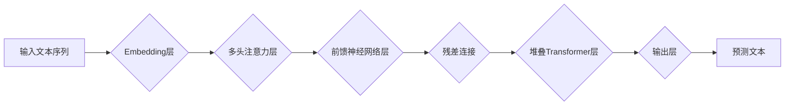

> GPT模型,文本生成,Transformer,自然语言处理,深度学习,机器学习

## 1. 背景介绍

近年来，深度学习在自然语言处理（NLP）领域取得了突破性进展。其中，生成式预训练语言模型（Generative Pre-trained Transformer，GPT）凭借其强大的文本生成能力，在机器翻译、文本摘要、对话系统等领域展现出巨大的应用潜力。

GPT模型由OpenAI公司开发，其核心是Transformer架构，能够捕捉文本序列中长距离依赖关系，从而生成更流畅、更自然的文本。自GPT-2发布以来，其强大的文本生成能力引发了广泛关注和研究。

## 2. 核心概念与联系

### 2.1 Transformer架构

Transformer是一种新型的深度学习架构，专门设计用于处理序列数据，例如文本。它摒弃了传统的循环神经网络（RNN）的顺序处理方式，采用注意力机制（Attention）来捕捉文本序列中不同词之间的关系，从而实现并行处理，提高训练效率和模型性能。

### 2.2 注意力机制

注意力机制是Transformer架构的核心，它允许模型关注输入序列中与当前任务最相关的部分。通过计算每个词与其他词之间的“注意力权重”，模型可以动态地分配计算资源，从而更好地理解文本语义。

### 2.3 预训练与微调

GPT模型采用预训练与微调的训练策略。首先，在大量的文本数据上进行预训练，学习语言的语法和语义知识。然后，将预训练模型微调到特定任务，例如文本生成、机器翻译等。

**Mermaid 流程图**



## 3. 核心算法原理 & 具体操作步骤

### 3.1 算法原理概述

GPT模型的核心算法是基于Transformer架构的解码器网络。解码器网络接收输入文本序列，并通过多层Transformer编码器和解码器进行处理，最终生成预测的文本序列。

### 3.2 算法步骤详解

1. **词嵌入:** 将输入文本序列中的每个词转换为稠密的向量表示，称为词嵌入。
2. **解码器网络:** 将词嵌入作为输入，通过多层Transformer编码器和解码器进行处理。
    * **编码器:** 负责提取输入文本序列的语义信息。
    * **解码器:** 负责根据编码器的输出生成预测的文本序列。
3. **注意力机制:** 在解码器中，注意力机制用于捕捉输入文本序列中与当前生成词相关的上下文信息。
4. **预测:** 在每个时间步，解码器网络会预测下一个词的概率分布，并根据概率分布选择最可能的词作为输出。

### 3.3 算法优缺点

**优点:**

* 强大的文本生成能力
* 能够捕捉长距离依赖关系
* 并行处理能力强

**缺点:**

* 训练成本高
* 容易出现生成文本偏差
* 对训练数据质量要求高

### 3.4 算法应用领域

* 文本生成：小说、诗歌、剧本等
* 机器翻译
* 文本摘要
* 对话系统
* 代码生成

## 4. 数学模型和公式 & 详细讲解 & 举例说明

### 4.1 数学模型构建

GPT模型的数学模型主要基于Transformer架构，其核心是注意力机制和多层感知机（MLP）。

**注意力机制公式:**

$$
Attention(Q, K, V) = softmax(\frac{QK^T}{\sqrt{d_k}})V
$$

其中：

* $Q$：查询矩阵
* $K$：键矩阵
* $V$：值矩阵
* $d_k$：键向量的维度

**多层感知机公式:**

$$
MLP(x) = \sigma(W_1x + b_1)
$$

其中：

* $x$：输入向量
* $W_1$：权重矩阵
* $b_1$：偏置向量
* $\sigma$：激活函数

### 4.2 公式推导过程

注意力机制的公式通过计算查询向量与键向量的点积，并使用softmax函数归一化，得到每个键向量对应的注意力权重。然后，将注意力权重与值向量相乘，得到最终的注意力输出。

多层感知机是一个简单的全连接神经网络，其输入向量经过线性变换和激活函数，得到输出向量。

### 4.3 案例分析与讲解

假设我们有一个输入文本序列“我爱学习编程”，其词嵌入表示为：

$$
[e_1, e_2, e_3, e_4, e_5]
$$

其中，$e_i$表示第i个词的词嵌入向量。

通过注意力机制，模型可以计算每个词与其他词之间的注意力权重，例如，“学习”与“编程”之间的注意力权重可能较高，因为它们是语义相关的词。

然后，通过多层感知机，模型可以将注意力输出和词嵌入向量进行组合，最终生成预测的文本序列。

## 5. 项目实践：代码实例和详细解释说明

### 5.1 开发环境搭建

* Python 3.7+
* PyTorch 1.7+
* CUDA 10.2+

### 5.2 源代码详细实现

```python
import torch
import torch.nn as nn

class Transformer(nn.Module):
    def __init__(self, d_model, nhead, num_encoder_layers, num_decoder_layers):
        super(Transformer, self).__init__()
        self.encoder = nn.TransformerEncoder(nn.TransformerEncoderLayer(d_model, nhead), num_encoder_layers)
        self.decoder = nn.TransformerDecoder(nn.TransformerDecoderLayer(d_model, nhead), num_decoder_layers)

    def forward(self, src, tgt, src_mask, tgt_mask):
        src = self.encoder(src, src_mask)
        tgt = self.decoder(tgt, src, tgt_mask)
        return tgt

# ... 其他代码 ...
```

### 5.3 代码解读与分析

* `Transformer`类定义了Transformer模型的结构。
* `encoder`和`decoder`分别代表编码器和解码器。
* `nn.TransformerEncoderLayer`和`nn.TransformerDecoderLayer`分别定义了编码器和解码器的单个层。
* `forward`方法定义了模型的输入和输出。

### 5.4 运行结果展示

运行模型后，可以生成预测的文本序列。例如，输入文本序列为“我爱学习编程”，模型可能生成以下预测文本序列：

```
我爱学习编程语言
```

## 6. 实际应用场景

### 6.1 文本生成

GPT模型可以用于生成各种类型的文本，例如小说、诗歌、剧本等。

### 6.2 机器翻译

GPT模型可以用于机器翻译，将一种语言的文本翻译成另一种语言。

### 6.3 文本摘要

GPT模型可以用于文本摘要，将长篇文本压缩成短篇摘要。

### 6.4 对话系统

GPT模型可以用于构建对话系统，与用户进行自然语言交互。

### 6.5 未来应用展望

GPT模型在未来将有更广泛的应用场景，例如：

* 自动写作
* 代码生成
* 虚拟助手
* 教育辅助

## 7. 工具和资源推荐

### 7.1 学习资源推荐

* **论文:**
    * Vaswani, A., Shazeer, N., Parmar, N., Uszkoreit, J., Jones, L., Gomez, A. N., ... & Polosukhin, I. (2017). Attention is all you need. In Advances in neural information processing systems (pp. 5998-6008).
* **博客:**
    * https://openai.com/blog/gpt-3/
    * https://jalammar.github.io/illustrated-transformer/

### 7.2 开发工具推荐

* **PyTorch:** https://pytorch.org/
* **Hugging Face Transformers:** https://huggingface.co/transformers/

### 7.3 相关论文推荐

* BERT: https://arxiv.org/abs/1810.04805
* T5: https://arxiv.org/abs/1910.10683

## 8. 总结：未来发展趋势与挑战

### 8.1 研究成果总结

GPT模型在文本生成领域取得了显著的成果，其强大的文本生成能力和广泛的应用场景使其成为NLP领域的研究热点。

### 8.2 未来发展趋势

* 模型规模更大，参数量更多
* 训练数据更加丰富多样
* 模型更加高效，训练速度更快
* 模型更加安全可靠，能够避免生成有害文本

### 8.3 面临的挑战

* 模型训练成本高
* 模型容易出现生成文本偏差
* 模型对训练数据质量要求高
* 模型解释性差

### 8.4 研究展望

未来，GPT模型的研究将继续朝着更强大、更安全、更可解释的方向发展。

## 9. 附录：常见问题与解答

* **Q: GPT模型的训练数据是什么？**

* **A:** GPT模型的训练数据是大量的文本数据，包括书籍、文章、代码等。

* **Q: GPT模型的训练成本是多少？**

* **A:** GPT模型的训练成本很高，需要大量的计算资源和时间。

* **Q: GPT模型可以生成什么样的文本？**

* **A:** GPT模型可以生成各种类型的文本，例如小说、诗歌、剧本等。

* **Q: GPT模型的安全性如何？**

* **A:** GPT模型可能会生成有害文本，因此需要采取措施确保其安全性。

作者：禅与计算机程序设计艺术 / Zen and the Art of Computer Programming


<end_of_turn>