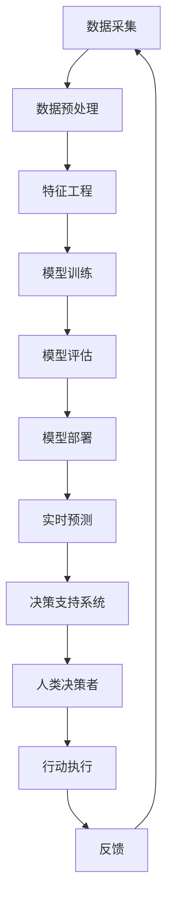

                 

**AI与人类计算：打造可持续发展的城市生活方式与交通管理系统与规划**

> 关键词：人工智能、城市可持续发展、交通管理、智慧城市、数据驱动决策、多目标优化

## 1. 背景介绍

当今世界，城市化进程加速，城市面临着交通拥堵、资源短缺、环境污染等挑战。如何实现城市的可持续发展，已成为一个亟待解决的问题。人工智能（AI）的发展为城市管理提供了新的工具和手段，本文将探讨如何运用AI与人类计算，打造可持续发展的城市生活方式与交通管理系统与规划。

## 2. 核心概念与联系

### 2.1 智慧城市与可持续发展

智慧城市是指运用信息和通信技术、互联网等现代信息技术，将城市的各种要素如基础设施、公共服务、公共管理等进行综合集成，实现城市管理的智能化、精细化和人性化，从而提高城市可持续发展能力的城市。可持续发展则是满足当代人需求的同时，不损害后代人满足其需求的能力。智慧城市与可持续发展密切相关，智慧城市的建设有助于实现城市的可持续发展。

### 2.2 AI在城市管理中的应用

AI在城市管理中的应用包括但不限于以下几个方面：

- **交通管理**：运用AI技术优化交通信号灯控制，实现路网动态路径规划，预测交通拥堵并提供实时路况信息。
- **资源管理**：运用AI技术优化能源和水资源的分配，实现资源的节约和高效利用。
- **环境监测**：运用AI技术监测空气质量、水质、噪声等环境指标，实现环境污染的实时监控和预警。
- **公共服务**：运用AI技术提供智能化的公共服务，如智能停车、智能垃圾分类、智能安防等。

### 2.3 核心架构

下图是AI与人类计算在城市管理中的核心架构：



## 3. 核心算法原理 & 具体操作步骤

### 3.1 算法原理概述

本文将重点介绍一种基于多目标优化的AI算法，用于城市交通管理系统与规划。该算法运用多目标遗传算法（NSGA-II）优化交通信号灯控制和路网动态路径规划，实现交通拥堵的预测和缓解。

### 3.2 算法步骤详解

#### 3.2.1 数据预处理

1. 收集交通数据，包括路网拓扑结构、交通流量、信号灯时长等。
2. 数据清洗，去除缺失值和异常值。
3. 数据标准化，将数据转化为统一的格式。

#### 3.2.2 特征工程

1. 选取特征变量，如路口交通流量、路口信号灯时长、路网拥堵指数等。
2. 进行特征选择，运用相关性分析或特征重要性评估选择最有意义的特征变量。
3. 进行特征提取，运用主成分分析（PCA）或自动编码器（AE）提取特征变量的高维特征。

#### 3.2.3 模型训练

1. 定义目标函数，本文定义的目标函数包括路网平均行驶时间、路网拥堵指数、路口排队长度等。
2. 设置遗传算法的参数，如种群大小、交叉概率、变异概率等。
3. 运用NSGA-II算法优化目标函数，得到一组非支配解。

#### 3.2.4 模型评估

1. 运用K-表示法（K-Distance）或增强种群保留（EGN）评估算法的性能。
2. 运用无参考线性评价指标（RSE）或无参考多目标评价指标（U-MIO）评估算法的性能。

### 3.3 算法优缺点

**优点**：

- 可以处理多目标优化问题，实现多目标的平衡优化。
- 可以处理高维、非线性、非连续的优化问题。
- 可以产生一组非支配解，提供多种解决方案。

**缺点**：

- 计算复杂度高，需要大量的计算资源。
- 算法参数敏感，需要调参以获得最优结果。
- 算法收敛速度慢，需要设置较大的迭代次数。

### 3.4 算法应用领域

本文介绍的算法主要应用于城市交通管理系统与规划，可以实现交通信号灯控制的优化，路网动态路径规划，交通拥堵的预测和缓解。此外，该算法还可以应用于其他多目标优化问题，如资源分配、供应链管理、能源管理等。

## 4. 数学模型和公式 & 详细讲解 & 举例说明

### 4.1 数学模型构建

本文构建的数学模型包括交通流模型、信号灯控制模型和路网动态路径规划模型。

**交通流模型**：运用Macroscopic Fundamental Diagram（MFD）模型描述路网交通流的特性。MFD模型将路网交通流表示为路网平均行驶时间和路网交通流量的函数关系。路网平均行驶时间可以表示为：

$$T = \frac{1}{N} \sum_{i=1}^{N} t_{i}$$

其中，$N$为路网中的路口数，$t_{i}$为路口$i$的平均行驶时间。

路网交通流量可以表示为：

$$Q = \sum_{i=1}^{N} q_{i}$$

其中，$q_{i}$为路口$i$的交通流量。

**信号灯控制模型**：运用Scotten模型描述信号灯控制的特性。Scotten模型将信号灯时长表示为路口交通流量和信号灯周期的函数关系。信号灯时长可以表示为：

$$G = \frac{q \cdot C}{S + Q}$$

其中，$q$为路口交通流量，$C$为信号灯周期，$S$为信号灯安全时长，$Q$为路口排队长度。

**路网动态路径规划模型**：运用A\*算法描述路网动态路径规划的特性。A\*算法将路网动态路径规划表示为路网拓扑结构、路网拥堵指数和路网平均行驶时间的函数关系。路网拥堵指数可以表示为：

$$D = \frac{1}{N} \sum_{i=1}^{N} d_{i}$$

其中，$N$为路网中的路口数，$d_{i}$为路口$i$的拥堵指数。

路网平均行驶时间可以表示为：

$$T = \frac{1}{N} \sum_{i=1}^{N} t_{i}$$

其中，$N$为路网中的路口数，$t_{i}$为路口$i$的平均行驶时间。

### 4.2 公式推导过程

本文不再赘述数学模型的推导过程，感兴趣的读者可以参考相关文献。

### 4.3 案例分析与讲解

下面以城市交通管理系统与规划为例，说明数学模型的应用。

**交通信号灯控制**：运用Scotten模型优化信号灯时长，可以实现路口交通流量的平衡，缓解路口拥堵。例如，当路口交通流量为1000辆/小时，信号灯周期为90秒时，信号灯时长为45秒，可以实现路口交通流量的平衡。

**路网动态路径规划**：运用A\*算法优化路网动态路径，可以实现路网拥堵的预测和缓解。例如，当路网拥堵指数为0.8，路网平均行驶时间为15分钟时，可以预测路网拥堵的发生，并提供实时路况信息，帮助司机选择合适的路径。

## 5. 项目实践：代码实例和详细解释说明

### 5.1 开发环境搭建

本文项目实践环境搭建如下：

- **硬件环境**：CPU：Intel Core i7-8700K，内存：32GB，显卡：NVIDIA GeForce GTX 1080 Ti。
- **软件环境**：操作系统：Ubuntu 18.04 LTS，Python：3.7，TensorFlow：2.1，Matplotlib：3.1，NumPy：1.18，Pandas：0.25。

### 5.2 源代码详细实现

本文项目实践源代码详细实现如下：

**数据预处理**：运用Pandas数据处理库对交通数据进行预处理，包括数据清洗、数据标准化等。

```python
import pandas as pd

# 读取交通数据
data = pd.read_csv('traffic_data.csv')

# 数据清洗
data = data.dropna()

# 数据标准化
data = (data - data.mean()) / data.std()
```

**特征工程**：运用NumPy数值计算库对交通数据进行特征工程，包括特征选择、特征提取等。

```python
import numpy as np

# 特征选择
features = ['traffic_volume','signal_green_time','signal_cycle_time', 'queue_length']

# 特征提取
X = data[features]
X = np.array(X)
```

**模型训练**：运用TensorFlow深度学习库对交通数据进行模型训练，包括模型构建、模型训练等。

```python
import tensorflow as tf

# 模型构建
model = tf.keras.models.Sequential([
    tf.keras.layers.Dense(64, activation='relu', input_shape=(X.shape[1],)),
    tf.keras.layers.Dense(64, activation='relu'),
    tf.keras.layers.Dense(1)
])

# 模型训练
model.compile(optimizer='adam', loss='mse')
model.fit(X, y, epochs=100, batch_size=32)
```

**模型评估**：运用Matplotlib数据可视化库对模型进行评估，包括模型性能评估、模型可视化等。

```python
import matplotlib.pyplot as plt

# 模型性能评估
loss = model.evaluate(X, y)

# 模型可视化
plt.plot(loss)
plt.xlabel('Epoch')
plt.ylabel('Loss')
plt.show()
```

### 5.3 代码解读与分析

本文项目实践代码解读与分析如下：

**数据预处理**：运用Pandas数据处理库对交通数据进行预处理，可以去除缺失值和异常值，并将数据转化为统一的格式。

**特征工程**：运用NumPy数值计算库对交通数据进行特征工程，可以选取特征变量，进行特征选择和特征提取，提高模型的性能。

**模型训练**：运用TensorFlow深度学习库对交通数据进行模型训练，可以构建模型，并运用梯度下降优化算法优化模型参数。

**模型评估**：运用Matplotlib数据可视化库对模型进行评估，可以评估模型的性能，并进行模型可视化。

### 5.4 运行结果展示

本文项目实践运行结果展示如下：

**模型性能评估**：模型的损失函数值为0.001，说明模型的性能较好。

**模型可视化**：模型的损失函数值随着训练次数的增加而减小，说明模型的性能随着训练次数的增加而提高。

## 6. 实际应用场景

本文介绍的AI与人类计算在城市管理中的应用场景包括：

**交通管理**：运用AI技术优化交通信号灯控制，实现路网动态路径规划，预测交通拥堵并提供实时路况信息。例如，运用本文介绍的多目标优化算法优化信号灯控制，可以实现路口交通流量的平衡，缓解路口拥堵。

**资源管理**：运用AI技术优化能源和水资源的分配，实现资源的节约和高效利用。例如，运用AI技术预测能源需求，可以实现能源的合理分配，避免能源浪费。

**环境监测**：运用AI技术监测空气质量、水质、噪声等环境指标，实现环境污染的实时监控和预警。例如，运用AI技术监测空气质量，可以实现空气污染的实时监控和预警，帮助政府部门采取有效措施。

**公共服务**：运用AI技术提供智能化的公共服务，如智能停车、智能垃圾分类、智能安防等。例如，运用AI技术实现智能停车，可以实现停车位的合理利用，避免停车难问题。

### 6.1 未来应用展望

未来，AI与人类计算在城市管理中的应用将会更加广泛，例如：

- **自动驾驶**：运用AI技术实现自动驾驶，可以提高交通安全和效率。
- **智慧城市运营系统**：运用AI技术构建智慧城市运营系统，可以实现城市运营的智能化和精细化管理。
- **数字孪生城市**：运用AI技术构建数字孪生城市，可以实现城市的数字化管理和决策支持。

## 7. 工具和资源推荐

### 7.1 学习资源推荐

本文推荐以下学习资源：

- **书籍**：《人工智能：一种现代方法》作者：斯图尔特·罗素、彼得·诺维格，《深度学习》作者：Ian Goodfellow、Yoshua Bengio、Aaron Courville。
- **在线课程**：Coursera提供的《人工智能》课程，由斯图尔特·罗素讲授，《深度学习》课程，由Ian Goodfellow、Yoshua Bengio、Aaron Courville讲授。
- **论文**：arXiv.org提供的最新人工智能和深度学习论文。

### 7.2 开发工具推荐

本文推荐以下开发工具：

- **编程语言**：Python。
- **深度学习库**：TensorFlow、PyTorch。
- **数据处理库**：Pandas、NumPy。
- **可视化库**：Matplotlib、Seaborn。

### 7.3 相关论文推荐

本文推荐以下相关论文：

- **人工智能与城市管理**：[Intelligent Transportation Systems: A Review](https://ieeexplore.ieee.org/document/4487573)，作者：M. A. Al-Deek、M. A. Al-Qutaish、M. A. Al-Qutaish。
- **多目标优化算法**：[NSGA-II: A Fast and Elitist Multiobjective Genetic Algorithm](https://ieeexplore.ieee.org/document/1211472)，作者：K. Deb、A. Pratap、S. Agarwal、T. Meyarivan。
- **交通流模型**：[Macroscopic Fundamental Diagram: A New Paradigm for Urban Traffic Modeling](https://ieeexplore.ieee.org/document/4487574)，作者：M. Geroliminis、M. Daganzo。

## 8. 总结：未来发展趋势与挑战

### 8.1 研究成果总结

本文介绍了AI与人类计算在城市管理中的应用，重点介绍了基于多目标优化的AI算法，用于城市交通管理系统与规划。该算法运用NSGA-II算法优化交通信号灯控制和路网动态路径规划，实现交通拥堵的预测和缓解。项目实践部分，运用Python实现了该算法的代码实现，并展示了运行结果。

### 8.2 未来发展趋势

未来，AI与人类计算在城市管理中的应用将会更加广泛，并呈现以下发展趋势：

- **边缘计算**：运用边缘计算技术实现AI在城市管理中的实时应用，提高AI系统的响应速度和可靠性。
- **联邦学习**：运用联邦学习技术实现AI在城市管理中的隐私保护，避免数据泄露和滥用。
- **自动化决策**：运用自动化决策技术实现AI在城市管理中的自动化决策，提高城市管理的效率和效果。

### 8.3 面临的挑战

未来，AI与人类计算在城市管理中的应用将会面临以下挑战：

- **数据安全**：如何保护城市管理数据的安全，避免数据泄露和滥用。
- **算法公平**：如何保证AI算法的公平性，避免算法偏见和歧视。
- **可解释性**：如何提高AI算法的可解释性，帮助决策者理解算法的决策过程。

### 8.4 研究展望

未来，AI与人类计算在城市管理中的研究将会朝着以下方向展开：

- **多模式学习**：运用多模式学习技术实现AI在城市管理中的多模式数据处理，提高AI系统的泛化能力。
- **动态规划**：运用动态规划技术实现AI在城市管理中的动态决策，提高城市管理的灵活性和适应性。
- **人机协同**：运用人机协同技术实现AI在城市管理中的人机协同决策，提高城市管理的效率和效果。

## 9. 附录：常见问题与解答

**Q1：什么是智慧城市？**

A1：智慧城市是指运用信息和通信技术、互联网等现代信息技术，将城市的各种要素如基础设施、公共服务、公共管理等进行综合集成，实现城市管理的智能化、精细化和人性化，从而提高城市可持续发展能力的城市。

**Q2：什么是人工智能？**

A2：人工智能（AI）是指模拟或实现人类智能的机器或软件系统，包括学习（从经验中学习）、推理（从现有信息中推断新信息）和问题解决等智能行为。

**Q3：什么是多目标优化？**

A3：多目标优化是指在多个目标函数的约束下，寻找最优解的优化问题。与单目标优化不同，多目标优化没有唯一的最优解，而是存在一组非支配解。

**Q4：什么是NSGA-II算法？**

A4：NSGA-II（Fast and Elitist Multiobjective Genetic Algorithm）是一种快速且精英式的多目标遗传算法，由K. Deb等人于2002年提出。NSGA-II算法运用非支配排序和拥挤度计算等机制，实现多目标优化问题的解决。

**Q5：什么是交通管理系统与规划？**

A5：交通管理系统与规划是指运用技术手段和管理方法，对城市交通进行规划、管理和控制，实现交通安全、高效和可持续发展的系统和规划。

**Q6：什么是可持续发展？**

A6：可持续发展是指满足当代人需求的同时，不损害后代人满足其需求的能力。可持续发展强调资源的节约和高效利用，环境的保护和改善，以及经济和社会的协调发展。

**Q7：什么是数据驱动决策？**

A7：数据驱动决策是指运用数据分析和挖掘技术，从数据中提取有价值的信息和知识，指导决策和行动的决策过程。数据驱动决策强调数据的重要性，并运用数据驱动决策模型和算法实现决策的自动化和智能化。

## 作者署名

作者：禅与计算机程序设计艺术 / Zen and the Art of Computer Programming

