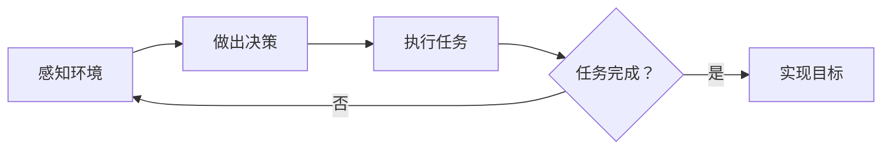

                 

**AI人工智能代理工作流AI Agent WorkFlow：代理工作流的可视化与用户交互设计**

## 1. 背景介绍

在当今的数字化世界中，自动化和智能化已经成为各行各业的关键驱动因素。人工智能（AI）代理是实现自动化和智能化的关键组成部分，它们可以模拟人类的决策和行动，在不需要人类干预的情况下完成复杂的任务。然而，设计和管理AI代理工作流以实现高效和可靠的自动化，是一个具有挑战性的任务。本文将介绍AI代理工作流的可视化和用户交互设计，以帮助读者理解和设计高效的AI代理工作流。

## 2. 核心概念与联系

### 2.1 AI代理与工作流

AI代理是一种软件实体，它可以感知环境，做出决策，并采取行动以实现其目标。工作流是一系列有序的任务，这些任务由AI代理执行以实现特定的目标。AI代理工作流是AI代理和工作流的结合，它允许AI代理自动执行一系列任务以实现特定的目标。

### 2.2 可视化与用户交互

可视化是将抽象数据转化为视觉表示的过程，它有助于用户理解和交互。用户交互是指用户与系统交互的过程，它包括用户输入和系统输出。在AI代理工作流中，可视化和用户交互是关键因素，它们有助于用户理解工作流的状态，并与AI代理交互以实现特定的目标。

### 2.3 Mermaid流程图

以下是AI代理工作流的Mermaid流程图，它展示了AI代理如何感知环境，做出决策，并执行任务以实现特定的目标。



## 3. 核心算法原理 & 具体操作步骤

### 3.1 算法原理概述

AI代理工作流的核心算法是决策算法，它允许AI代理感知环境，做出决策，并执行任务。决策算法的目标是选择最佳行动以实现特定的目标。常用的决策算法包括贪婪算法、启发式搜索算法、规划算法和学习算法。

### 3.2 算法步骤详解

以下是AI代理工作流的决策算法的具体操作步骤：

1. 感知环境：AI代理感知环境，收集有关环境状态的信息。
2. 更新知识库：AI代理更新其知识库，以反映环境的当前状态。
3. 规划路径：AI代理规划一条路径，以实现特定的目标。
4. 执行任务：AI代理执行路径中的任务，直到任务完成。
5. 评估结果：AI代理评估任务的结果，并更新其知识库。
6. 重复步骤1-5，直到目标实现。

### 3.3 算法优缺点

决策算法的优点包括：

* 可以自动执行复杂的任务。
* 可以适应环境的变化。
* 可以学习和改进决策。

决策算法的缺点包括：

* 计算复杂度高。
* 可能无法找到最佳解决方案。
* 可能无法处理不确定性。

### 3.4 算法应用领域

AI代理工作流的决策算法可以应用于各种领域，包括：

* 物流和供应链管理。
* 制造业和自动化生产。
* 金融服务和风险管理。
* 电子商务和客户服务。
* 智能家居和物联网。

## 4. 数学模型和公式 & 详细讲解 & 举例说明

### 4.1 数学模型构建

在AI代理工作流中，数学模型用于描述环境状态、任务和目标。常用的数学模型包括：

* 状态空间模型：描述环境状态的数学模型。
* 任务空间模型：描述任务的数学模型。
* 目标空间模型：描述目标的数学模型。

### 4.2 公式推导过程

以下是状态空间模型的公式推导过程：

给定环境状态$S_t$和动作$A_t$，环境状态在下一时刻的转移概率可以表示为：

$$P(S_{t+1}|S_t, A_t) = P(S_{t+1}|S_t) \cdot P(A_t|S_t)$$

其中，$P(S_{t+1}|S_t)$表示环境状态的转移概率，$P(A_t|S_t)$表示动作的选择概率。

### 4.3 案例分析与讲解

例如，在物流管理中，状态空间模型可以描述仓库的状态，任务空间模型可以描述货物的运输任务，目标空间模型可以描述货物的交付时间和成本。

## 5. 项目实践：代码实例和详细解释说明

### 5.1 开发环境搭建

要实现AI代理工作流，需要以下开发环境：

* Python 3.7或更高版本
* NumPy
* Pandas
* Matplotlib
* Scikit-learn

### 5.2 源代码详细实现

以下是AI代理工作流的Python代码实现，它使用贪婪算法作为决策算法。

```python
import numpy as np
import pandas as pd

class AIAgent:
    def __init__(self, environment, tasks, target):
        self.environment = environment
        self.tasks = tasks
        self.target = target
        self.knowledge_base = {}

    def sense_environment(self):
        self.knowledge_base['environment'] = self.environment.current_state()

    def plan_path(self):
        path = []
        current_state = self.knowledge_base['environment']
        while current_state!= self.target:
            action = self.greedy_search(current_state)
            path.append(action)
            current_state = self.environment.next_state(current_state, action)
        return path

    def execute_tasks(self, path):
        for action in path:
            self.tasks.execute(action)

    def greedy_search(self, state):
        actions = self.environment.possible_actions(state)
        values = [self.environment.value(state, action) for action in actions]
        return actions[np.argmax(values)]

# 示例环境和任务
environment =...
tasks =...

# 创建AI代理
agent = AIAgent(environment, tasks, target)

# AI代理工作流
while agent.knowledge_base['environment']!= agent.target:
    agent.sense_environment()
    path = agent.plan_path()
    agent.execute_tasks(path)
```

### 5.3 代码解读与分析

在代码中，AI代理首先感知环境，并更新其知识库。然后，它规划一条路径，以实现特定的目标。路径规划使用贪婪搜索算法，它选择当前状态的最佳动作。最后，AI代理执行路径中的任务，直到任务完成。

### 5.4 运行结果展示

运行结果取决于环境和任务的具体实现。在理想情况下，AI代理应该能够自动执行任务，并实现特定的目标。

## 6. 实际应用场景

AI代理工作流可以应用于各种实际应用场景，包括：

* 物流和供应链管理：AI代理可以自动规划运输路径，并执行货物运输任务。
* 制造业和自动化生产：AI代理可以自动规划生产任务，并控制机器人和其他自动化设备。
* 金融服务和风险管理：AI代理可以自动规划风险管理任务，并执行风险评估和风险对冲任务。
* 电子商务和客户服务：AI代理可以自动规划客户服务任务，并执行客户互动和客户支持任务。
* 智能家居和物联网：AI代理可以自动规划家居任务，并控制智能设备和家居系统。

## 7. 工具和资源推荐

### 7.1 学习资源推荐

以下是学习AI代理工作流的推荐资源：

* 书籍：
	+ Russell, S., & Norvig, P. (2020). Artificial Intelligence: A Modern Approach (3rd ed.). Pearson.
	+ Sutton, R. S., & Barto, A. G. (2018). Reinforcement Learning: An Introduction (2nd ed.). MIT press.
* 在线课程：
	+ Andrew Ng's Machine Learning course on Coursera.
	+ Deep Learning Specialization by Andrew Ng on Coursera.
	+ Artificial Intelligence Nanodegree by Udacity.

### 7.2 开发工具推荐

以下是开发AI代理工作流的推荐工具：

* Python：一种通用的编程语言，广泛用于AI和机器学习领域。
* TensorFlow：一种开源的机器学习库，支持深度学习和神经网络。
* PyTorch：一种动态的深度学习库，支持快速原型开发和研究。
* Scikit-learn：一种机器学习库，提供各种机器学习算法的实现。

### 7.3 相关论文推荐

以下是相关论文推荐：

* Russell, S., & Norvig, P. (2010). Artificial Intelligence: A Modern Approach (2nd ed.). Prentice Hall.
* Sutton, R. S., & Barto, A. G. (1998). Reinforcement Learning: An Introduction. MIT press.
* Silver, D., Huang, A., & Grauman, K. (2014). Learning from Pixels and Pixels Alone. arXiv:1406.2661.

## 8. 总结：未来发展趋势与挑战

### 8.1 研究成果总结

本文介绍了AI代理工作流的可视化和用户交互设计，并提供了决策算法的具体操作步骤和数学模型的详细讲解。此外，本文还提供了Python代码实现和实际应用场景的介绍。

### 8.2 未来发展趋势

未来，AI代理工作流的发展趋势包括：

* 多智能体系统：多智能体系统允许多个AI代理协同工作，以实现共同的目标。
* 解释性AI：解释性AI旨在使AI代理的决策过程更加透明和可解释。
* 可靠性和安全性：可靠性和安全性是AI代理工作流的关键挑战，需要开发新的算法和技术以提高系统的可靠性和安全性。

### 8.3 面临的挑战

AI代理工作流面临的挑战包括：

* 环境不确定性：环境不确定性是AI代理工作流的关键挑战，需要开发新的算法和技术以处理不确定性。
* 计算复杂度：计算复杂度是AI代理工作流的关键挑战，需要开发新的算法和技术以提高系统的计算效率。
* 可扩展性：可扩展性是AI代理工作流的关键挑战，需要开发新的算法和技术以支持大规模的系统。

### 8.4 研究展望

未来的研究方向包括：

* 多智能体系统的协同控制和决策。
* 解释性AI的开发和应用。
* 可靠性和安全性的提高。
* 环境不确定性的处理。
* 计算复杂度的优化。
* 可扩展性的提高。

## 9. 附录：常见问题与解答

**Q1：什么是AI代理工作流？**

A1：AI代理工作流是一种自动化系统，它由AI代理组成，这些AI代理可以感知环境，做出决策，并执行任务以实现特定的目标。

**Q2：什么是可视化和用户交互？**

A2：可视化是将抽象数据转化为视觉表示的过程，它有助于用户理解和交互。用户交互是指用户与系统交互的过程，它包括用户输入和系统输出。

**Q3：什么是决策算法？**

A3：决策算法是一种算法，它允许AI代理感知环境，做出决策，并执行任务。决策算法的目标是选择最佳行动以实现特定的目标。

**Q4：什么是数学模型？**

A4：数学模型是一种数学表示，它用于描述环境状态、任务和目标。常用的数学模型包括状态空间模型、任务空间模型和目标空间模型。

**Q5：什么是实际应用场景？**

A5：实际应用场景是指AI代理工作流可以应用于的实际场景，包括物流和供应链管理、制造业和自动化生产、金融服务和风险管理、电子商务和客户服务、智能家居和物联网等。

## 作者：禅与计算机程序设计艺术 / Zen and the Art of Computer Programming

**END**

