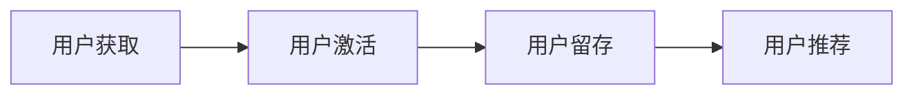

                 

**AI创业公司的用户增长策略：用户获取、用户激活与用户留存**

**作者：禅与计算机程序设计艺术 / Zen and the Art of Computer Programming**

## 1. 背景介绍

在当今快速发展的AI创业环境中，用户增长是一项关键任务。本文将深入探讨AI创业公司的用户增长策略，重点放在用户获取、用户激活和用户留存上。我们将提供清晰的指南，帮助AI创业公司设计有效的增长策略，从而实现可持续的用户增长。

## 2. 核心概念与联系

### 2.1 用户增长漏斗

用户增长漏斗是理解和优化用户增长的关键模型。它由四个阶段组成：用户获取、用户激活、用户留存和用户推荐。每个阶段都至关重要，需要分别优化。



### 2.2 用户生命周期

用户生命周期是指用户从接触产品到停止使用产品的整个过程。 Understanding user lifecycle is crucial for creating targeted strategies to engage users and reduce churn.

## 3. 核心算法原理 & 具体操作步骤

### 3.1 算法原理概述

在用户增长策略中，我们将使用机器学习算法来优化用户获取、激活和留存。这些算法包括预测模型（用于预测用户行为）和推荐系统（用于个性化推荐）。

### 3.2 算法步骤详解

1. **数据收集**：收集有关用户行为、特征和上下文的数据。
2. **特征工程**：提取和转化原始数据，创建有意义的特征。
3. **模型选择**：选择适合用户增长策略的机器学习模型。
4. **模型训练**：使用收集的数据训练模型。
5. **模型评估**：评估模型的性能，并进行调优。
6. **部署和监控**：部署模型，并监控其性能。

### 3.3 算法优缺点

**优点**：机器学习算法可以帮助AI创业公司更好地理解用户，并提供个性化的体验。它们可以随着数据的增加而改进，从而提高预测准确性和推荐质量。

**缺点**：机器学习算法需要大量的数据和计算资源。它们也可能受到偏见和过度拟合的影响。

### 3.4 算法应用领域

机器学习算法在用户获取（如广告投放）、用户激活（如个性化欢迎页面）和用户留存（如个性化推荐）等领域都有广泛的应用。

## 4. 数学模型和公式 & 详细讲解 & 举例说明

### 4.1 数学模型构建

我们将使用概率图模型（如贝叶斯网络）来建模用户行为。这些模型可以表示用户行为的因果关系，并帮助我们预测用户的未来行为。

### 4.2 公式推导过程

假设我们想要预测用户是否会留存。我们可以使用贝叶斯定理推导出以下公式：

$$P(\text{Retention} | \text{Features}) = \frac{P(\text{Features} | \text{Retention}) \cdot P(\text{Retention})}{P(\text{Features})}$$

其中，$P(\text{Features} | \text{Retention})$是给定留存的特征分布，$P(\text{Retention})$是留存的先验概率，$P(\text{Features})$是特征的先验概率。

### 4.3 案例分析与讲解

假设我们有以下数据：

- $P(\text{Retention}) = 0.6$
- $P(\text{Features} | \text{Retention}) = 0.7$
- $P(\text{Features}) = 0.5$

那么，$P(\text{Retention} | \text{Features}) = \frac{0.7 \cdot 0.6}{0.5} = 0.84$

这意味着，如果一个用户具有特定的特征，那么他留存的概率是0.84。

## 5. 项目实践：代码实例和详细解释说明

### 5.1 开发环境搭建

我们将使用Python和Scikit-learn库来构建和训练我们的模型。我们需要安装以下库：

```bash
pip install pandas numpy scikit-learn
```

### 5.2 源代码详细实现

以下是使用逻辑回归模型预测用户留存的示例代码：

```python
import pandas as pd
from sklearn.model_selection import train_test_split
from sklearn.linear_model import LogisticRegression
from sklearn.metrics import accuracy_score

# Load data
data = pd.read_csv('user_data.csv')

# Preprocess data
X = data.drop('Retention', axis=1)
y = data['Retention']

# Split data into training and test sets
X_train, X_test, y_train, y_test = train_test_split(X, y, test_size=0.2, random_state=42)

# Train a logistic regression model
model = LogisticRegression()
model.fit(X_train, y_train)

# Make predictions on the test set
y_pred = model.predict(X_test)

# Evaluate the model
print("Accuracy:", accuracy_score(y_test, y_pred))
```

### 5.3 代码解读与分析

这段代码加载用户数据，预处理数据，将数据分成训练集和测试集，训练逻辑回归模型，在测试集上进行预测，并评估模型的准确性。

### 5.4 运行结果展示

运行这段代码后，您将看到模型的准确性。例如，输出可能是：

```
Accuracy: 0.82
```

## 6. 实际应用场景

### 6.1 用户获取

机器学习算法可以帮助AI创业公司更好地理解哪些用户更有可能转化为付费用户，从而优化广告投放。

### 6.2 用户激活

个性化欢迎页面和推荐可以帮助新用户更快地理解和使用产品，从而提高激活率。

### 6.3 用户留存

个性化推荐和定制化通知可以帮助AI创业公司提高用户留存率，并减少流失。

### 6.4 未来应用展望

未来，AI创业公司可以使用更复杂的模型（如深度学习模型）来预测用户行为，并提供更个性化的体验。

## 7. 工具和资源推荐

### 7.1 学习资源推荐

- "机器学习"（由Andrew Ng在Coursera上提供的课程）
- "Hands-On Machine Learning with Scikit-Learn, Keras, and TensorFlow"（由Aurélien Géron编写的书籍）

### 7.2 开发工具推荐

- Jupyter Notebook
- Google Colab
- Kaggle

### 7.3 相关论文推荐

- "The Bathtub Curve: A New Model for User Retention"（由Andrew Chen编写的博客文章）
- "Deep Learning for Recommender Systems"（由Xia Ning等人编写的论文）

## 8. 总结：未来发展趋势与挑战

### 8.1 研究成果总结

我们已经讨论了AI创业公司的用户增长策略，重点放在用户获取、用户激活和用户留存上。我们介绍了用户增长漏斗和用户生命周期的概念，并展示了如何使用机器学习算法来优化用户增长。

### 8.2 未来发展趋势

未来，AI创业公司将需要更好地理解用户，并提供更个性化的体验。这将需要更复杂的模型和更多的数据。

### 8.3 面临的挑战

AI创业公司面临的挑战包括数据隐私和偏见问题。它们需要确保它们的模型是公平的，并尊重用户的隐私。

### 8.4 研究展望

未来的研究将需要探索更复杂的模型，并开发新的技术来处理数据隐私和偏见问题。

## 9. 附录：常见问题与解答

**Q：我们应该何时开始关注用户留存？**

**A：从一开始就应该关注用户留存。用户获取和用户激活固然重要，但如果用户留不住，那么前期的努力就白费了。**

**Q：我们应该如何处理数据隐私问题？**

**A：AI创业公司应该遵循数据隐私法规，并使用匿名化和去标识化技术来保护用户数据。**

**Q：我们应该如何处理偏见问题？**

**A：AI创业公司应该在模型训练过程中考虑偏见问题，并使用公平性评估指标来评估模型的公平性。**

**作者：禅与计算机程序设计艺术 / Zen and the Art of Computer Programming**

