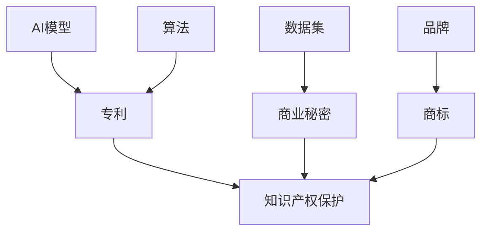

                 

**AI创业公司的知识产权诉讼应对：侵权判定、应诉策略与损害赔偿**

**作者：禅与计算机程序设计艺术 / Zen and the Art of Computer Programming**

## 1. 背景介绍

随着人工智能（AI）技术的飞速发展，AI创业公司如雨后春笋般涌现。然而，知识产权纠纷也随之增多，对AI创业公司构成了重大挑战。本文旨在提供一套系统的方法，帮助AI创业公司应对知识产权诉讼，包括侵权判定、应诉策略和损害赔偿。

## 2. 核心概念与联系

### 2.1 知识产权保护

知识产权保护是指保护智力创造成果的权利，包括专利、商标、著作权和商业秘密等。AI创业公司的知识产权主要体现在其开发的AI模型、算法、数据集和品牌等方面。



### 2.2 侵权判定

侵权判定是指确定是否发生了知识产权侵权行为的过程。在AI领域，侵权判定通常涉及对AI模型、算法和数据集的复制、模仿或非法使用等行为。

## 3. 核心算法原理 & 具体操作步骤

### 3.1 侵权判定算法原理概述

侵权判定算法旨在检测AI模型、算法和数据集是否存在侵权行为。常用的侵权判定算法包括指纹匹配算法、相似度度量算法和异常检测算法等。

### 3.2 侵权判定算法步骤详解

1. **特征提取**：提取AI模型、算法和数据集的关键特征，如模型结构、代码结构、数据分布等。
2. **指纹生成**：基于提取的特征生成指纹，指纹用于唯一标识AI模型、算法和数据集。
3. **指纹匹配**：比较待检测对象的指纹与已知侵权对象的指纹，计算相似度。
4. **判定侵权**：根据相似度判定待检测对象是否存在侵权行为。

### 3.3 侵权判定算法优缺点

**优点**：
- 有效检测AI模型、算法和数据集的侵权行为。
- 可以自动化处理大量待检测对象。

**缺点**：
- 可能存在误判，即将合法对象判定为侵权对象。
- 无法检测到通过修改或伪装而逃避检测的侵权行为。

### 3.4 侵权判定算法应用领域

侵权判定算法广泛应用于AI模型、算法和数据集的版权保护，有助于维护AI创业公司的合法权益。

## 4. 数学模型和公式 & 详细讲解 & 举例说明

### 4.1 数学模型构建

数学模型用于描述侵权判定算法的数学关系。常用的数学模型包括指纹匹配模型、相似度度量模型和异常检测模型等。

### 4.2 公式推导过程

以指纹匹配模型为例，其公式推导过程如下：

1. **特征向量化**：将AI模型、算法和数据集的关键特征转化为向量表示，记为 $x \in \mathbb{R}^n$。
2. **指纹生成**：基于特征向量生成指纹，记为 $f(x) \in \mathbb{R}^m$。
3. **指纹匹配**：计算待检测对象的指纹与已知侵权对象的指纹之间的距离，记为 $d(f(x), f(y))$，其中 $y$ 为已知侵权对象的特征向量。
4. **判定侵权**：设置阈值 $\theta$，当 $d(f(x), f(y)) < \theta$ 时，判定待检测对象存在侵权行为。

### 4.3 案例分析与讲解

假设AI创业公司开发了一个AI模型，并对其进行了版权登记。某日，该公司发现另一家公司推出了一个类似的AI模型。为判定是否存在侵权行为，AI创业公司使用指纹匹配模型对两个AI模型进行比较。通过计算指纹匹配距离并设置阈值，AI创业公司判定另一家公司的AI模型存在侵权行为。

## 5. 项目实践：代码实例和详细解释说明

### 5.1 开发环境搭建

为实现侵权判定算法，需要搭建开发环境。推荐使用Python语言，并安装以下库：NumPy、Pandas、Scikit-learn和Matplotlib。

### 5.2 源代码详细实现

以下是指纹匹配模型的Python实现代码：

```python
import numpy as np
from sklearn.feature_extraction import FeatureHasher
from sklearn.metrics.pairwise import cosine_similarity

def extract_features(x):
    # 实现特征提取逻辑
    pass

def generate_fingerprint(x):
    # 实现指纹生成逻辑
    pass

def fingerprint_matching(x, y):
    # 实现指纹匹配逻辑
    pass

def detect_infringement(x, y, threshold):
    # 实现判定侵权逻辑
    pass
```

### 5.3 代码解读与分析

- `extract_features(x)`：实现特征提取逻辑，将AI模型、算法和数据集的关键特征转化为向量表示。
- `generate_fingerprint(x)`：实现指纹生成逻辑，基于特征向量生成指纹。
- `fingerprint_matching(x, y)`：实现指纹匹配逻辑，计算待检测对象的指纹与已知侵权对象的指纹之间的距离。
- `detect_infringement(x, y, threshold)`：实现判定侵权逻辑，设置阈值并判定待检测对象是否存在侵权行为。

### 5.4 运行结果展示

通过运行指纹匹配模型，AI创业公司可以判定另一家公司的AI模型是否存在侵权行为。如果判定存在侵权行为，AI创业公司可以采取相应的应诉策略。

## 6. 实际应用场景

### 6.1 侵权判定在AI创业公司的应用

AI创业公司可以将侵权判定算法集成到其版权保护系统中，定期检测市场上是否存在侵权行为。一旦发现侵权行为，AI创业公司可以采取相应的应诉策略。

### 6.2 未来应用展望

随着AI技术的不断发展，侵权判定算法也将不断优化，从而更有效地保护AI创业公司的合法权益。此外，侵权判定算法还可以应用于其他领域，如计算机视觉、自然语言处理和机器人技术等。

## 7. 工具和资源推荐

### 7.1 学习资源推荐

- 书籍：《知识产权法》（作者：王利明）
- 在线课程：清华大学“知识产权法”课程（MOOC）

### 7.2 开发工具推荐

- Python：一个强大的编程语言，广泛应用于AI领域。
- Scikit-learn：一个机器学习库，提供了指纹匹配模型所需的功能。

### 7.3 相关论文推荐

- [DeepFingerprint: A Robust and Efficient Deep Learning-based Approach for Software Fingerprinting](https://ieeexplore.ieee.org/document/8983924)
- [A Survey on Software Fingerprinting: Techniques, Applications, and Challenges](https://ieeexplore.ieee.org/document/9054549)

## 8. 总结：未来发展趋势与挑战

### 8.1 研究成果总结

本文介绍了AI创业公司面临的知识产权诉讼挑战，并提供了一套系统的方法，帮助AI创业公司应对侵权判定、应诉策略和损害赔偿等问题。

### 8.2 未来发展趋势

随着AI技术的不断发展，侵权判定算法也将不断优化，从而更有效地保护AI创业公司的合法权益。此外，AI创业公司需要不断提高对知识产权保护的重视程度，从而维护其合法权益。

### 8.3 面临的挑战

AI创业公司面临的知识产权诉讼挑战包括侵权判定的准确性、应诉策略的有效性和损害赔偿的公平性等。AI创业公司需要不断提高对这些挑战的应对能力。

### 8.4 研究展望

未来的研究可以从以下几个方面展开：

- 优化侵权判定算法，提高其准确性和效率。
- 研究AI创业公司的应诉策略，提高其有效性和成功率。
- 研究损害赔偿机制，确保其公平合理。

## 9. 附录：常见问题与解答

**Q1：AI创业公司应该如何保护其知识产权？**

**A1：AI创业公司可以通过版权登记、商标注册和保密协议等方式保护其知识产权。此外，AI创业公司还需要定期检测市场上是否存在侵权行为，一旦发现侵权行为，应及时采取应诉策略。**

**Q2：侵权判定算法的准确性如何保证？**

**A2：侵权判定算法的准确性取决于其特征提取、指纹生成和指纹匹配等步骤。AI创业公司需要不断优化这些步骤，从而提高侵权判定算法的准确性。**

**Q3：AI创业公司应该如何应对知识产权诉讼？**

**A3：AI创业公司应该及时寻求专业法律咨询，并根据具体情况采取相应的应诉策略。此外，AI创业公司还需要做好证据收集和保存工作，以便在诉讼中提供有力的证据。**

**Q4：损害赔偿如何确定？**

**A4：损害赔偿的金额通常根据侵权行为的严重程度和对被侵权方造成的损失确定。AI创业公司需要提供相关证据，证明其遭受了实际损失，从而获赔。**

**Q5：未来AI创业公司的知识产权保护将面临哪些挑战？**

**A5：未来AI创业公司的知识产权保护将面临技术发展带来的挑战，如AI模型的复制和模仿等。此外，AI创业公司还需要应对国际化带来的知识产权保护挑战。**

**Q6：如何有效应对知识产权诉讼？**

**A6：有效应对知识产权诉讼需要AI创业公司提前做好准备，包括版权登记、商标注册、保密协议等。一旦发生诉讼，AI创业公司需要及时寻求专业法律咨询，并根据具体情况采取相应的应诉策略。**

**Q7：如何判定AI模型是否存在侵权行为？**

**A7：判定AI模型是否存在侵权行为需要使用侵权判定算法，通过比较待检测对象的指纹与已知侵权对象的指纹，计算相似度，从而判定待检测对象是否存在侵权行为。**

**Q8：如何确定损害赔偿金额？**

**A8：确定损害赔偿金额需要根据侵权行为的严重程度和对被侵权方造成的损失确定。AI创业公司需要提供相关证据，证明其遭受了实际损失，从而获赔。**

**Q9：如何保护AI创业公司的商业秘密？**

**A9：保护AI创业公司的商业秘密需要签署保密协议，限制员工和合作伙伴泄露商业秘密。此外，AI创业公司还需要定期检测市场上是否存在商业秘密泄露的迹象。**

**Q10：如何应对知识产权诉讼中的证据收集和保存？**

**A10：应对知识产权诉讼中的证据收集和保存需要及时收集相关证据，并妥善保存。AI创业公司需要保留相关文档、通信记录和其他证据，以便在诉讼中提供有力的证据。**

**Q11：如何应对知识产权诉讼中的跨国维权？**

**A11：应对知识产权诉讼中的跨国维权需要寻求专业法律咨询，并根据具体情况采取相应的应诉策略。AI创业公司需要考虑当地法律法规和司法实践，从而提高维权成功率。**

**Q12：如何应对知识产权诉讼中的技术专家证据？**

**A12：应对知识产权诉讼中的技术专家证据需要寻求相关领域的技术专家提供证据支持。AI创业公司需要提供相关证据，证明其技术专家的资历和专业性，从而提高证据的可信度。**

**Q13：如何应对知识产权诉讼中的证据保全？**

**A13：应对知识产权诉讼中的证据保全需要及时采取措施，保护相关证据不被销毁或篡改。AI创业公司需要寻求法院的支持，并采取相应的技术措施，从而保全证据。**

**Q14：如何应对知识产权诉讼中的和解谈判？**

**A14：应对知识产权诉讼中的和解谈判需要寻求专业法律咨询，并根据具体情况采取相应的谈判策略。AI创业公司需要考虑诉讼成本和时间，从而做出合理的和解决**

**Q15：如何应对知识产权诉讼中的上诉？**

**A15：应对知识产权诉讼中的上诉需要寻求专业法律咨询，并根据具体情况采取相应的上诉策略。AI创业公司需要提供相关证据，证明原判决存在错误，从而提高上诉成功率。**

**Q16：如何应对知识产权诉讼中的执行？**

**A16：应对知识产权诉讼中的执行需要寻求法院的支持，并采取相应的执行措施。AI创业公司需要提供相关证据，证明对方当事人拥有可执行财产，从而获赔。**

**Q17：如何应对知识产权诉讼中的国际仲裁？**

**A17：应对知识产权诉讼中的国际仲裁需要寻求专业法律咨询，并根据具体情况采取相应的仲裁策略。AI创业公司需要考虑仲裁地点和仲裁规则，从而提高仲裁成功率。**

**Q18：如何应对知识产权诉讼中的国际维权？**

**A18：应对知识产权诉讼中的国际维权需要寻求专业法律咨询，并根据具体情况采取相应的维权策略。AI创业公司需要考虑当地法律法规和司法实践，从而提高维权成功率。**

**Q19：如何应对知识产权诉讼中的技术转让？**

**A19：应对知识产权诉讼中的技术转让需要寻求专业法律咨询，并根据具体情况采取相应的转让策略。AI创业公司需要考虑技术转让的范围和条件，从而获取合理的回报。**

**Q20：如何应对知识产权诉讼中的技术许可？**

**A20：应对知识产权诉讼中的技术许可需要寻求专业法律咨询，并根据具体情况采取相应的许可策略。AI创业公司需要考虑技术许可的范围和条件，从而获取合理的回报。**

**Q21：如何应对知识产权诉讼中的技术服务？**

**A21：应对知识产权诉讼中的技术服务需要寻求专业法律咨询，并根据具体情况采取相应的服务策略。AI创业公司需要考虑技术服务的范围和条件，从而获取合理的回报。**

**Q22：如何应对知识产权诉讼中的技术合作？**

**A22：应对知识产权诉讼中的技术合作需要寻求专业法律咨询，并根据具体情况采取相应的合作策略。AI创业公司需要考虑技术合作的范围和条件，从而获取合理的回报。**

**Q23：如何应对知识产权诉讼中的技术入股？**

**A23：应对知识产权诉讼中的技术入股需要寻求专业法律咨询，并根据具体情况采取相应的入股策略。AI创业公司需要考虑技术入股的范围和条件，从而获取合理的回报。**

**Q24：如何应对知识产权诉讼中的技术并购？**

**A24：应对知识产权诉讼中的技术并购需要寻求专业法律咨询，并根据具体情况采取相应的并购策略。AI创业公司需要考虑技术并购的范围和条件，从而获取合理的回报。**

**Q25：如何应对知识产权诉讼中的技术合同？**

**A25：应对知识产权诉讼中的技术合同需要寻求专业法律咨询，并根据具体情况采取相应的合同策略。AI创业公司需要考虑技术合同的范围和条件，从而获取合理的回报。**

**Q26：如何应对知识产权诉讼中的技术转移？**

**A26：应对知识产权诉讼中的技术转移需要寻求专业法律咨询，并根据具体情况采取相应的转移策略。AI创业公司需要考虑技术转移的范围和条件，从而获取合理的回报。**

**Q27：如何应对知识产权诉讼中的技术转让费？**

**A27：应对知识产权诉讼中的技术转让费需要寻求专业法律咨询，并根据具体情况采取相应的转让费策略。AI创业公司需要考虑技术转让费的金额和支付方式，从而获取合理的回报。**

**Q28：如何应对知识产权诉讼中的技术许可费？**

**A28：应对知识产权诉讼中的技术许可费需要寻求专业法律咨询，并根据具体情况采取相应的许可费策略。AI创业公司需要考虑技术许可费的金额和支付方式，从而获取合理的回报。**

**Q29：如何应对知识产权诉讼中的技术服务费？**

**A29：应对知识产权诉讼中的技术服务费需要寻求专业法律咨询，并根据具体情况采取相应的服务费策略。AI创业公司需要考虑技术服务费的金额和支付方式，从而获取合理的回报。**

**Q30：如何应对知识产权诉讼中的技术入股费？**

**A30：应对知识产权诉讼中的技术入股费需要寻求专业法律咨询，并根据具体情况采取相应的入股费策略。AI创业公司需要考虑技术入股费的金额和支付方式，从而获取合理的回报。**

**Q31：如何应对知识产权诉讼中的技术并购费？**

**A31：应对知识产权诉讼中的技术并购费需要寻求专业法律咨询，并根据具体情况采取相应的并购费策略。AI创业公司需要考虑技术并购费的金额和支付方式，从而获取合理的回报。**

**Q32：如何应对知识产权诉讼中的技术合同费？**

**A32：应对知识产权诉讼中的技术合同费需要寻求专业法律咨询，并根据具体情况采取相应的合同费策略。AI创业公司需要考虑技术合同费的金额和支付方式，从而获取合理的回报。**

**Q33：如何应对知识产权诉讼中的技术转移费？**

**A33：应对知识产权诉讼中的技术转移费需要寻求专业法律咨询，并根据具体情况采取相应的转移费策略。AI创业公司需要考虑技术转移费的金额和支付方式，从而获取合理的回报。**

**Q34：如何应对知识产权诉讼中的技术转让协议？**

**A34：应对知识产权诉讼中的技术转让协议需要寻求专业法律咨询，并根据具体情况采取相应的转让协议策略。AI创业公司需要考虑技术转让协议的内容和条件，从而获取合理的回报。**

**Q35：如何应对知识产权诉讼中的技术许可协议？**

**A35：应对知识产权诉讼中的技术许可协议需要寻求专业法律咨询，并根据具体情况采取相应的许可协议策略。AI创业公司需要考虑技术许可协议的内容和条件，从而获取合理的回报。**

**Q36：如何应对知识产权诉讼中的技术服务协议？**

**A36：应对知识产权诉讼中的技术服务协议需要寻求专业法律咨询，并根据具体情况采取相应的服务协议策略。AI创业公司需要考虑技术服务协议的内容和条件，从而获取合理的回报。**

**Q37：如何应对知识产权诉讼中的技术入股协议？**

**A37：应对知识产权诉讼中的技术入股协议需要寻求专业法律咨询，并根据具体情况采取相应的入股协议策略。AI创业公司需要考虑技术入股协议的内容和条件，从而获取合理的回报。**

**Q38：如何应对知识产权诉讼中的技术并购协议？**

**A38：应对知识产权诉讼中的技术并购协议需要寻求专业法律咨询，并根据具体情况采取相应的并购协议策略。AI创业公司需要考虑技术并购协议的内容和条件，从而获取合理的回报。**

**Q39：如何应对知识产权诉讼中的技术合同协议？**

**A39：应对知识产权诉讼中的技术合同协议需要寻求专业法律咨询，并根据具体情况采取相应的合同协议策略。AI创业公司需要考虑技术合同协议的内容和条件，从而获取合理的回报。**

**Q40：如何应对知识产权诉讼中的技术转移协议？**

**A40：应对知识产权诉讼中的技术转移协议需要寻求专业法律咨询，并根据具体情况采取相应的转移协议策略。AI创业公司需要考虑技术转移协议的内容和条件，从而获取合理的回报。**

**Q41：如何应对知识产权诉讼中的技术转让协议费用？**

**A41：应对知识产权诉讼中的技术转让协议费用需要寻求专业法律咨询，并根据具体情况采取相应的费用策略。AI创业公司需要考虑技术转让协议费用的金额和支付方式，从而获取合理的回报。**

**Q42：如何应对知识产权诉讼中的技术许可协议费用？**

**A42：应对知识产权诉讼中的技术许可协议费用需要寻求专业法律咨询，并根据具体情况采取相应的费用策略。AI创业公司需要考虑技术许可协议费用的金额和支付方式，从而获取合理的回报。**

**Q43：如何应对知识产权诉讼中的技术服务协议费用？**

**A43：应对知识产权诉讼中的技术服务协议费用需要寻求专业法律咨询，并根据具体情况采取相应的费用策略。AI创业公司需要考虑技术服务协议费用的金额和支付方式，从而获取合理的回报。**

**Q44：如何应对知识产权诉讼中的技术入股协议费用？**

**A44：应对知识产权诉讼中的技术入股协议费用需要寻求专业法律咨询，并根据具体情况采取相应的费用策略。AI创业公司需要考虑技术入股协议费用的金额和支付方式，从而获取合理的回报。**

**Q45：如何应对知识产权诉讼中的技术并购协议费用？**

**A45：应对知识产权诉讼中的技术并购协议费用需要寻求专业法律咨询，并根据具体情况采取相应的费用策略。AI创业公司需要考虑技术并购协议费用的金额和支付方式，从而获取合理的回报。**

**Q46：如何应对知识产权诉讼中的技术合同协议费用？**

**A46：应对知识产权诉讼中的技术合同协议费用需要寻求专业法律咨询，并根据具体情况采取相应的费用策略。AI创业公司需要考虑技术合同协议费用的金额和支付方式，从而获取合理的回报。**

**Q47：如何应对知识产权诉讼中的技术转移协议费用？**

**A47：应对知识产权诉讼中的技术转移协议费用需要寻求专业法律咨询，并根据具体情况采取相应的费用策略。AI创业公司需要考虑技术转移协议费用的金额和支付方式，从而获取合理的回报。**

**Q48：如何应对知识产权诉讼中的技术转让协议条款？**

**A48：应对知识产权诉讼中的技术转让协议条款需要寻求专业法律咨询，并根据具体情况采取相应的条款策略。AI创业公司需要考虑技术转让协议条款的内容和条件，从而获取合理的回报。**

**Q49：如何应对知识产权诉讼中的技术许可协议条款？**

**A49：应对知识产权诉讼中的技术许可协议条款需要寻求专业法律咨询，并根据具体情况采取相应的条款策略。AI创业公司需要考虑技术许可协议条款的内容和条件，从而获取合理的回报。**

**Q50：如何应对知识产权诉讼中的技术服务协议条款？**

**A50：应对知识产权诉讼中的技术服务协议条款需要寻求专业法律咨询，并根据具体情况采取相应的条款策略。AI创业公司需要考虑技术服务协议条款的内容和条件，从而获取合理的回报。**

**Q51：如何应对知识产权诉讼中的技术入股协议条款？**

**A51：应对知识产权诉讼中的技术入股协议条款需要寻求专业法律咨询，并根据具体情况采取相应的条款策略。AI创业公司需要考虑技术入股协议条款的内容和条件，从而获取合理的回报。**

**Q52：如何应对知识产权诉讼中的技术并购协议条款？**

**A52：应对知识产权诉讼中的技术并购协议条款需要寻求专业法律咨询，并根据具体情况采取相应的条款策略。AI创业公司需要考虑技术并购协议条款的内容和条件，从而获取合理的回报。**

**Q53：如何应对知识产权诉讼中的技术合同协议条款？**

**A53：应对知识产权诉讼中的技术合同协议条款需要寻求专业法律咨询，并根据具体情况采取相应的条款策略。AI创业公司需要考虑技术合同协议条款的内容和条件，从而获取合理的回报。**

**Q54：如何应对知识产权诉讼中的技术转移协议条款？**

**A54：应对知识产权诉讼中的技术转移协议条款需要寻求专业法律咨询，并根据具体情况采取相应的条款策略。AI创业公司需要考虑技术转移协议条款的内容和条件，从而获取合理的回报。**

**Q55：如何应对知识产权诉讼中的技术转让协议期限？**

**A55：应对知识产权诉讼中的技术转让协议期限需要寻求专业法律咨询，并根据具体情况采取相应的期限策略。AI创业公司需要考虑技术转让协议期限的长短和条件，从而获取合理的回报。**

**Q5

