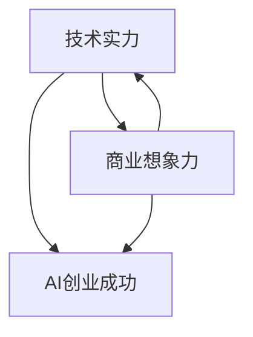

                 

**AI创业投资新风向：关注技术实力与商业想象力**

**作者：禅与计算机程序设计艺术 / Zen and the Art of Computer Programming**

## 1. 背景介绍

随着人工智能（AI）技术的飞速发展，AI创业正在成为创投领域的新风口。然而，在AI创业浪潮中，如何区分真正具有技术实力和商业潜力的项目，成为了投资人和创业者共同面临的挑战。本文将从技术和商业两个维度，剖析当前AI创业投资的新风向，并提供一些有价值的建议。

## 2. 核心概念与联系

### 2.1 技术实力

技术实力是AI创业的基础，它包括算法、模型、数据处理能力和系统集成能力等。具有技术实力的AI创业项目，往往能够提供独特的解决方案，满足市场需求，并具有较高的壁垒。

### 2.2 商业想象力

商业想象力是AI创业的动力，它包括市场洞察、商业模式创新和战略布局等。具有商业想象力的AI创业项目，往往能够发现新的市场机会，创造新的商业模式，并具有较强的执行力。

### 2.3 技术实力与商业想象力的联系

技术实力和商业想象力是AI创业成功的两个关键因素，它们相辅相成，缺一不可。技术实力为商业想象力提供了支撑，商业想象力则为技术实力指明了方向。二者的结合，能够创造出具有竞争力的AI创业项目。



## 3. 核心算法原理 & 具体操作步骤

### 3.1 算法原理概述

AI创业项目的核心往往是某种算法或模型，因此，理解算法原理是评估技术实力的关键。常见的AI算法包括神经网络、决策树、支持向量机等。

### 3.2 算法步骤详解

以神经网络为例，其训练过程包括以下步骤：

1. 初始化权重和偏置。
2. 将输入数据传递给输入层。
3. 计算每个神经元的输出。
4. 计算误差。
5. 更新权重和偏置。
6. 重复步骤2-5，直到误差小于阈值。

### 3.3 算法优缺点

每种算法都有其优缺点，例如：

- 神经网络：优点是能够学习复杂的非线性关系，缺点是训练时间长，易于过拟合。
- 决策树：优点是易于理解和解释，缺点是易于过拟合，不适合连续值预测。
- 支持向量机：优点是泛化能力强，缺点是训练时间长，不适合大规模数据。

### 3.4 算法应用领域

AI算法的应用领域非常广泛，包括图像识别、语音识别、自然语言处理、推荐系统等。创业者需要根据市场需求，选择合适的算法，并不断优化和改进。

## 4. 数学模型和公式 & 详细讲解 & 举例说明

### 4.1 数学模型构建

数学模型是AI算法的基础，它描述了算法的数学原理。例如，线性回归模型的数学表达式为：

$$y = wx + b$$

其中，$y$是输出，$x$是输入，$w$是权重，$b$是偏置。

### 4.2 公式推导过程

数学模型的公式推导过程，体现了算法的数学基础。例如，线性回归模型的公式推导过程如下：

1. 设置目标函数：最小化误差平方和。
2. 计算梯度：使用链式法则计算梯度。
3. 更新权重和偏置：使用梯度下降法更新权重和偏置。

### 4.3 案例分析与讲解

以图像识别为例，常用的数学模型是卷积神经网络（CNN）。CNN的数学模型包括卷积层、池化层、全连接层等。例如，卷积层的数学表达式为：

$$y_{ij} = \sigma(\sum_{m=0}^{M-1}\sum_{n=0}^{N-1}x_{i+m,j+n}w_{mn} + b)$$

其中，$y_{ij}$是输出，$x_{i,j}$是输入，$w_{mn}$是权重，$b$是偏置，$\sigma$是激活函数。

## 5. 项目实践：代码实例和详细解释说明

### 5.1 开发环境搭建

AI创业项目的开发环境，通常包括硬件环境和软件环境。硬件环境包括GPU、CPU、内存等，软件环境包括操作系统、编程语言、深度学习框架等。常用的深度学习框架包括TensorFlow、PyTorch、Caffe等。

### 5.2 源代码详细实现

以TensorFlow为例，实现一个简单的线性回归模型的源代码如下：

```python
import tensorflow as tf

# 定义输入和输出
x = tf.placeholder(tf.float32, [None, 1])
y = tf.placeholder(tf.float32, [None, 1])

# 定义权重和偏置
w = tf.Variable(tf.random_normal([1, 1]))
b = tf.Variable(tf.random_normal([1]))

# 定义模型
y_pred = tf.add(tf.matmul(x, w), b)

# 定义损失函数
loss = tf.reduce_mean(tf.square(y_pred - y))

# 定义优化器
optimizer = tf.train.GradientDescentOptimizer(0.5).minimize(loss)

# 定义会话
with tf.Session() as sess:
    # 初始化变量
    sess.run(tf.global_variables_initializer())

    # 训练模型
    for i in range(1000):
        sess.run(optimizer, feed_dict={x: X, y: y})

    # 输出权重和偏置
    print(sess.run([w, b]))
```

### 5.3 代码解读与分析

上述代码实现了一个简单的线性回归模型。它首先定义了输入和输出，然后定义了权重和偏置。接着，它定义了模型、损失函数和优化器。最后，它使用会话运行模型，并输出训练后的权重和偏置。

### 5.4 运行结果展示

运行上述代码后，输出的权重和偏置，就是训练好的模型参数。这些参数可以用于预测新数据的输出。

## 6. 实际应用场景

### 6.1 当前应用场景

AI创业项目的实际应用场景非常广泛，包括金融、医疗、零售、交通等领域。例如，在金融领域，AI可以用于风险评估、信用评级、交易预测等；在医疗领域，AI可以用于疾病诊断、药物发现、个性化治疗等。

### 6.2 未来应用展望

未来，AI创业项目的应用场景将会更加丰富，例如：

- 智能城市：AI可以用于城市管理、交通优化、环境监测等。
- 智能制造：AI可以用于质量控制、设备维护、供应链管理等。
- 智能生活：AI可以用于家庭服务、个性化推荐、虚拟现实等。

## 7. 工具和资源推荐

### 7.1 学习资源推荐

AI创业项目的学习资源包括在线课程、书籍、论文等。常用的在线课程包括Coursera、Udacity、edX等；常用的书籍包括《深度学习》《机器学习》等；常用的论文包括NIPS、ICML、CVPR等会议上的论文。

### 7.2 开发工具推荐

AI创业项目的开发工具包括编程语言、深度学习框架、开发环境等。常用的编程语言包括Python、C++、Java等；常用的深度学习框架包括TensorFlow、PyTorch、Caffe等；常用的开发环境包括Jupyter Notebook、Google Colab等。

### 7.3 相关论文推荐

AI创业项目的相关论文包括最新的研究成果和行业报告。常用的行业报告包括Gartner、Forrester、IDC等机构的报告；常用的研究成果包括NIPS、ICML、CVPR等会议上的论文。

## 8. 总结：未来发展趋势与挑战

### 8.1 研究成果总结

本文从技术和商业两个维度，剖析了当前AI创业投资的新风向。我们发现，技术实力和商业想象力是AI创业成功的关键因素，二者相辅相成，缺一不可。我们还介绍了常用的AI算法原理、数学模型和开发工具，并提供了项目实践的代码实例。

### 8.2 未来发展趋势

未来，AI创业项目的发展趋势包括：

- 多模式学习：结合符号学习和无监督学习，实现更强大的学习能力。
- 解释性AI：开发能够解释决策过程的AI模型，提高AI的可信度。
- 端到端学习：实现端到端的学习，减少人为特征工程的需求。
- 量子机器学习：利用量子计算加速机器学习，提高学习效率。

### 8.3 面临的挑战

未来，AI创业项目面临的挑战包括：

- 数据安全：如何保护用户数据安全，避免数据泄露和滥用。
- 算法偏见：如何避免算法偏见，实现公平和无偏见的AI模型。
- 可解释性：如何提高AI模型的可解释性，实现可信和可控的AI系统。
- 伦理道德：如何平衡AI技术的发展和伦理道德，实现负责任的AI创业。

### 8.4 研究展望

未来，AI创业项目的研究展望包括：

- 多模式学习：结合符号学习和无监督学习，实现更强大的学习能力。
- 解释性AI：开发能够解释决策过程的AI模型，提高AI的可信度。
- 端到端学习：实现端到端的学习，减少人为特征工程的需求。
- 量子机器学习：利用量子计算加速机器学习，提高学习效率。

## 9. 附录：常见问题与解答

**Q1：如何评估AI创业项目的技术实力？**

**A1：评估AI创业项目的技术实力，需要从算法原理、数学模型、开发工具等方面进行综合评估。常用的评估指标包括准确率、精确度、召回率、F1值等。**

**Q2：如何评估AI创业项目的商业想象力？**

**A2：评估AI创业项目的商业想象力，需要从市场需求、商业模式、战略布局等方面进行综合评估。常用的评估指标包括市场规模、增长率、获客成本、客单价等。**

**Q3：如何平衡技术实力和商业想象力？**

**A3：平衡技术实力和商业想象力，需要在项目早期就进行统一规划，并不断迭代和优化。技术实力为商业想象力提供了支撑，商业想象力则为技术实力指明了方向。二者相辅相成，缺一不可。**

**Q4：如何应对AI创业项目面临的挑战？**

**A4：应对AI创业项目面临的挑战，需要从技术、商业和伦理道德等方面进行综合考虑。技术上，需要不断优化和改进AI模型，提高学习效率和可解释性；商业上，需要不断创新和优化商业模式，提高市场竞争力；伦理道德上，需要平衡AI技术的发展和伦理道德，实现负责任的AI创业。**

**Q5：如何预测AI创业项目的未来发展趋势？**

**A5：预测AI创业项目的未来发展趋势，需要从技术、市场和政策等方面进行综合分析。技术上，需要关注多模式学习、解释性AI、端到端学习、量子机器学习等新技术的发展；市场上，需要关注新的市场机会和需求；政策上，需要关注政府政策和监管趋势。**

**Q6：如何评估AI创业项目的成功？**

**A6：评估AI创业项目的成功，需要从技术、商业和社会影响等方面进行综合评估。技术上，需要关注AI模型的准确率、可解释性和可控性；商业上，需要关注市场份额、盈利能力和增长率；社会影响上，需要关注AI技术对社会和经济的影响，以及对伦理道德的平衡。**

**Q7：如何实现负责任的AI创业？**

**A7：实现负责任的AI创业，需要从技术、商业和伦理道德等方面进行综合考虑。技术上，需要开发可解释、可控和可信的AI模型；商业上，需要平衡市场需求和伦理道德，实现可持续发展；伦理道德上，需要遵循伦理道德准则，平衡AI技术的发展和伦理道德。**

**Q8：如何评估AI创业项目的投资价值？**

**A8：评估AI创业项目的投资价值，需要从技术、商业和团队等方面进行综合评估。技术上，需要关注AI模型的创新性、可行性和竞争力；商业上，需要关注市场需求、商业模式和盈利能力；团队上，需要关注创始人和团队的背景、能力和动机。**

**Q9：如何评估AI创业项目的技术壁垒？**

**A9：评估AI创业项目的技术壁垒，需要从算法原理、数据处理能力、系统集成能力等方面进行综合评估。常用的评估指标包括专利数量、技术优势、数据优势、系统集成能力等。**

**Q10：如何评估AI创业项目的商业壁垒？**

**A10：评估AI创业项目的商业壁垒，需要从市场地位、品牌影响力、渠道优势、客户关系等方面进行综合评估。常用的评估指标包括市场份额、品牌知名度、渠道数量、客户数量等。**

**Q11：如何评估AI创业项目的执行力？**

**A11：评估AI创业项目的执行力，需要从团队能力、运营能力、执行效率等方面进行综合评估。常用的评估指标包括团队规模、团队能力、运营效率、执行进度等。**

**Q12：如何评估AI创业项目的创新性？**

**A12：评估AI创业项目的创新性，需要从技术创新、商业创新、模式创新等方面进行综合评估。常用的评估指标包括专利数量、技术优势、市场需求、商业模式等。**

**Q13：如何评估AI创业项目的可持续性？**

**A13：评估AI创业项目的可持续性，需要从技术可持续性、商业可持续性、环境可持续性等方面进行综合评估。常用的评估指标包括技术路线图、商业模式、环境影响等。**

**Q14：如何评估AI创业项目的风险？**

**A14：评估AI创业项目的风险，需要从技术风险、市场风险、政策风险、运营风险等方面进行综合评估。常用的评估指标包括技术可行性、市场需求、政策环境、运营能力等。**

**Q15：如何评估AI创业项目的回报？**

**A15：评估AI创业项目的回报，需要从技术回报、商业回报、社会回报等方面进行综合评估。常用的评估指标包括技术优势、市场份额、盈利能力、社会影响等。**

**Q16：如何评估AI创业项目的团队？**

**A16：评估AI创业项目的团队，需要从创始人能力、团队构成、团队协作等方面进行综合评估。常用的评估指标包括创始人背景、团队规模、团队能力、团队协作等。**

**Q17：如何评估AI创业项目的市场需求？**

**A17：评估AI创业项目的市场需求，需要从市场规模、市场增长率、市场竞争力等方面进行综合评估。常用的评估指标包括市场规模、市场增长率、市场份额、市场竞争力等。**

**Q18：如何评估AI创业项目的商业模式？**

**A18：评估AI创业项目的商业模式，需要从盈利模式、客户获取模式、渠道模式等方面进行综合评估。常用的评估指标包括盈利模式、客户获取模式、渠道模式、客单价等。**

**Q19：如何评估AI创业项目的战略布局？**

**A19：评估AI创业项目的战略布局，需要从市场战略、产品战略、渠道战略等方面进行综合评估。常用的评估指标包括市场战略、产品战略、渠道战略、战略合作等。**

**Q20：如何评估AI创业项目的伦理道德？**

**A20：评估AI创业项目的伦理道德，需要从数据隐私、算法偏见、伦理准则等方面进行综合评估。常用的评估指标包括数据隐私保护、算法公平性、伦理准则遵循等。**

**Q21：如何评估AI创业项目的政策环境？**

**A21：评估AI创业项目的政策环境，需要从政策支持、政策监管、政策风险等方面进行综合评估。常用的评估指标包括政策支持力度、政策监管要求、政策风险等。**

**Q22：如何评估AI创业项目的运营能力？**

**A22：评估AI创业项目的运营能力，需要从运营效率、运营成本、运营质量等方面进行综合评估。常用的评估指标包括运营效率、运营成本、运营质量、运营进度等。**

**Q23：如何评估AI创业项目的客户关系？**

**A23：评估AI创业项目的客户关系，需要从客户数量、客户满意度、客户忠诚度等方面进行综合评估。常用的评估指标包括客户数量、客户满意度、客户忠诚度、客户获取成本等。**

**Q24：如何评估AI创业项目的品牌影响力？**

**A24：评估AI创业项目的品牌影响力，需要从品牌知名度、品牌美誉度、品牌忠诚度等方面进行综合评估。常用的评估指标包括品牌知名度、品牌美誉度、品牌忠诚度、品牌价值等。**

**Q25：如何评估AI创业项目的渠道优势？**

**A25：评估AI创业项目的渠道优势，需要从渠道数量、渠道覆盖率、渠道效率等方面进行综合评估。常用的评估指标包括渠道数量、渠道覆盖率、渠道效率、渠道成本等。**

**Q26：如何评估AI创业项目的技术路线图？**

**A26：评估AI创业项目的技术路线图，需要从技术创新、技术可行性、技术进度等方面进行综合评估。常用的评估指标包括技术创新、技术可行性、技术进度、技术风险等。**

**Q27：如何评估AI创业项目的商业路线图？**

**A27：评估AI创业项目的商业路线图，需要从市场战略、商业模式、盈利能力等方面进行综合评估。常用的评估指标包括市场战略、商业模式、盈利能力、商业风险等。**

**Q28：如何评估AI创业项目的运营路线图？**

**A28：评估AI创业项目的运营路线图，需要从运营效率、运营成本、运营质量等方面进行综合评估。常用的评估指标包括运营效率、运营成本、运营质量、运营进度等。**

**Q29：如何评估AI创业项目的风险管理？**

**A29：评估AI创业项目的风险管理，需要从风险识别、风险评估、风险对策等方面进行综合评估。常用的评估指标包括风险识别、风险评估、风险对策、风险控制等。**

**Q30：如何评估AI创业项目的创新管理？**

**A30：评估AI创业项目的创新管理，需要从创新战略、创新过程、创新成果等方面进行综合评估。常用的评估指标包括创新战略、创新过程、创新成果、创新效果等。**

**Q31：如何评估AI创业项目的组织管理？**

**A31：评估AI创业项目的组织管理，需要从组织结构、组织文化、组织效率等方面进行综合评估。常用的评估指标包括组织结构、组织文化、组织效率、组织目标等。**

**Q32：如何评估AI创业项目的人才管理？**

**A32：评估AI创业项目的人才管理，需要从人才引进、人才培养、人才激励等方面进行综合评估。常用的评估指标包括人才引进、人才培养、人才激励、人才流失等。**

**Q33：如何评估AI创业项目的财务管理？**

**A33：评估AI创业项目的财务管理，需要从资金筹集、资金运用、资金监控等方面进行综合评估。常用的评估指标包括资金筹集、资金运用、资金监控、财务报表等。**

**Q34：如何评估AI创业项目的供应链管理？**

**A34：评估AI创业项目的供应链管理，需要从供应商管理、库存管理、物流管理等方面进行综合评估。常用的评估指标包括供应商管理、库存管理、物流管理、供应链成本等。**

**Q35：如何评估AI创业项目的客户服务？**

**A35：评估AI创业项目的客户服务，需要从客户需求、客户沟通、客户满意度等方面进行综合评估。常用的评估指标包括客户需求、客户沟通、客户满意度、客户投诉等。**

**Q36：如何评估AI创业项目的市场营销？**

**A36：评估AI创业项目的市场营销，需要从市场调研、市场定位、市场推广等方面进行综合评估。常用的评估指标包括市场调研、市场定位、市场推广、市场份额等。**

**Q37：如何评估AI创业项目的品牌建设？**

**A37：评估AI创业项目的品牌建设，需要从品牌定位、品牌传播、品牌忠诚度等方面进行综合评估。常用的评估指标包括品牌定位、品牌传播、品牌忠诚度、品牌价值等。**

**Q38：如何评估AI创业项目的渠道建设？**

**A38：评估AI创业项目的渠道建设，需要从渠道选择、渠道建设、渠道管理等方面进行综合评估。常用的评估指标包括渠道选择、渠道建设、渠道管理、渠道成本等。**

**Q39：如何评估AI创业项目的合作伙伴？**

**A39：评估AI创业项目的合作伙伴，需要从合作伙伴选择、合作伙伴关系、合作伙伴协作等方面进行综合评估。常用的评估指标包括合作伙伴选择、合作伙伴关系、合作伙伴协作、合作伙伴贡献等。**

**Q40：如何评估AI创业项目的社会责任？**

**A40：评估AI创业项目的社会责任，需要从环境保护、社会公益、员工福利等方面进行综合评估。常用的评估指标包括环境保护、社会公益、员工福利、社会影响等。**

**Q41：如何评估AI创业项目的知识产权？**

**A41：评估AI创业项目的知识产权，需要从专利申请、商标注册、版权保护等方面进行综合评估。常用的评估指标包括专利申请、商标注册、版权保护、知识产权保护等。**

**Q42：如何评估AI创业项目的数据安全？**

**A42：评估AI创业项目的数据安全，需要从数据收集、数据存储、数据传输等方面进行综合评估。常用的评估指标包括数据收集、数据存储、数据传输、数据安全措施等。**

**Q43：如何评估AI创业项目的算法偏见？**

**A43：评估AI创业项目的算法偏见，需要从数据偏见、模型偏见、决策偏见等方面进行综合评估。常用的评估指标包括数据偏见、模型偏见、决策偏见、公平性评估等。**

**Q44：如何评估AI创业项目的伦理道德？**

**A44：评估AI创业项目的伦理道德，需要从数据隐私、算法公平、伦理准则等方面进行综合评估。常用的评估指标包括数据隐私、算法公平、伦理准则、伦理审查等。**

**Q45：如何评估AI创业项目的政策环境？**

**A45：评估AI创业项目的政策环境，需要从政策支持、政策监管、政策风险等方面进行综合评估。常用的评估指标包括政策支持、政策监管、政策风险、政策变化等。**

**Q46：如何评估AI创业项目的运营风险？**

**A46：评估AI创业项目的运营风险，需要从运营效率、运营成本、运营质量等方面进行综合评估。常用的评估指标包括运营效率、运营成本、运营质量、运营风险等。**

**Q47：如何评估AI创业项目的市场风险？**

**A47：评估AI创业项目的市场风险，需要从市场需求、市场竞争、市场变化等方面进行综合评估。常用的评估指标包括市场需求、市场竞争、市场变化、市场风险等。**

**Q48：如何评估AI创业项目的技术风险？**

**A48：评估AI创业项目的技术风险，需要从技术可行性、技术创新、技术进度等方面进行综合评估。常用的评估指标包括技术可行性、技术创新、技术进度、技术风险等。**

**Q49：如何评估AI创业项目的财务风险？**

**A49：评估AI创业项目的财务风险，需要从资金筹集、资金运用、资金监控等方面进行综合评估。常用的评估指标包括资金筹集、资金运用、资金监控、财务风险等。**

**Q50：如何评估AI创业项目的组织风险？**

**A50：评估AI创业项目的组织风险，需要从组织结构、组织文化、组织效率等方面进行综合评估。常用的评估指标包括组织结构、组织文化、组织效率、组织风险等。**

**Q51：如何评估AI创业项目的人才风险？**

**A51：评估AI创业项目的人才风险，需要从人才引进、人才培养、人才激励等方面进行综合评估。常用的评估指标包括人才引进、人才培养、人才激励、人才流失等。**

**Q52：如何评估AI创业项目的供应链风险？**

**A52：评估AI创业项目的供应链风险，需要从供应商管理、库存管理、物流管理等方面进行综合评估。常用的评估指标包括供应商管理、库存管理、物流管理、供应链成本等。**

**Q53：如何评估AI创业项目的客户风险？**

**A53：评估AI创业项目的客户风险，需要从客户需求、客户沟通、客户满意度等方面进行综合评估。常用的评估指标包括客户需求、客户沟通、客户满意度、客户投诉等。**

**Q54：如何评估AI创业项目的品牌风险？**

**A54：评估AI创业项目的品牌风险，需要从品牌定位、品牌传播、品牌忠诚度等方面进行综合评估。常用的评估指标包括品牌定位、

