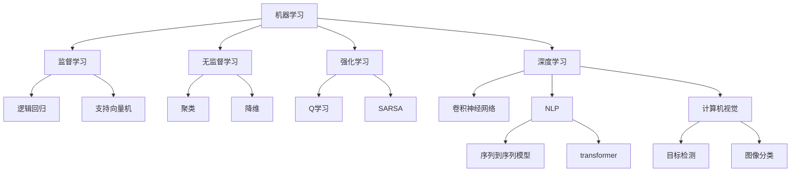

                 

**AI创业：技术转化为利润**

**作者：禅与计算机程序设计艺术 / Zen and the Art of Computer Programming**

## 1. 背景介绍

在当今的商业世界中，人工智能（AI）已经成为各行各业的关键驱动因素。然而，将AI技术转化为利润的能力却是企业成功的关键。本文将深入探讨AI创业的关键概念、算法原理、数学模型、项目实践，并提供实际应用场景、工具和资源推荐，最终展望未来发展趋势和挑战。

## 2. 核心概念与联系

AI创业的核心在于将AI技术应用于商业问题，创造价值。AI技术的核心包括机器学习（ML）、深度学习（DL）、自然语言处理（NLP）、计算机视觉（CV）等。这些技术相互关联，共同构成了AI技术的生态系统。



## 3. 核心算法原理 & 具体操作步骤

### 3.1 算法原理概述

AI创业的核心算法之一是监督学习，它涉及到从已标记的数据集中学习，以预测新数据的标签。另一个关键算法是强化学习，它涉及到代理在环境中学习以最大化回报。

### 3.2 算法步骤详解

#### 3.2.1 监督学习

1. 数据收集：收集包含特征和标签的数据集。
2. 数据预处理：清洗数据，处理缺失值，进行特征工程。
3. 模型选择：选择适合数据集的监督学习算法，如逻辑回归或支持向量机。
4. 模型训练：使用训练集训练模型。
5. 模型评估：使用验证集评估模型的性能。
6. 模型部署：将模型部署到生产环境中，用于预测新数据的标签。

#### 3.2.2 强化学习

1. 环境定义：定义代理在其中学习的环境，包括状态、动作和回报。
2. 代理定义：定义代理的决策策略。
3. 学习算法选择：选择适合环境和代理的强化学习算法，如Q学习或SARSA。
4. 学习过程：代理在环境中学习，通过试错改进其决策策略。
5. 策略提取：提取代理学习到的策略，用于生产环境。

### 3.3 算法优缺点

监督学习的优点包括：简单易用，可以处理大规模数据集。缺点包括：需要大量标记数据，可能导致过拟合。强化学习的优点包括：可以学习复杂的决策策略，可以处理未知环境。缺点包括：学习过程缓慢，可能导致过度探索。

### 3.4 算法应用领域

监督学习在图像分类、文本分类等领域广泛应用。强化学习在游戏AI、自动驾驶等领域有着广泛的应用。

## 4. 数学模型和公式 & 详细讲解 & 举例说明

### 4.1 数学模型构建

监督学习的数学模型可以表示为：

$$y = f(x; \theta) + \epsilon$$

其中，$y$是标签，$x$是特征，$f$是模型函数，$\theta$是模型参数，$\epsilon$是误差项。

强化学习的数学模型可以表示为：

$$Q(s, a) = E[R_{t+1} + \gamma max_a Q(S_{t+1}, a)]$$

其中，$Q(s, a)$是状态-动作值函数，$s$是状态，$a$是动作，$R_{t+1}$是下一时刻的回报，$\gamma$是折扣因子。

### 4.2 公式推导过程

监督学习的目标是最小化误差项$\epsilon$，即最小化：

$$\min_{\theta} \sum_{i=1}^{n} (y_i - f(x_i; \theta))^2$$

强化学习的目标是最大化状态-动作值函数$Q(s, a)$，即最大化：

$$\max_{\theta} Q(s, a) = E[R_{t+1} + \gamma max_a Q(S_{t+1}, a)]$$

### 4.3 案例分析与讲解

例如，在图像分类任务中，可以使用逻辑回归作为监督学习算法。给定一组图像特征$x$和对应的标签$y$，模型的目标是学习参数$\theta$，使得预测标签$f(x; \theta)$与真实标签$y$尽可能接近。在强化学习中，代理可以学习在围棋中下棋的策略。给定当前状态$s$，代理的目标是学习动作$a$，使得状态-动作值函数$Q(s, a)$最大化。

## 5. 项目实践：代码实例和详细解释说明

### 5.1 开发环境搭建

AI创业项目的开发环境包括Python、TensorFlow、Keras、Scikit-learn等库。此外，还需要一个集成开发环境（IDE），如PyCharm或Jupyter Notebook。

### 5.2 源代码详细实现

以下是使用Scikit-learn实现逻辑回归的示例代码：

```python
from sklearn.model_selection import train_test_split
from sklearn.linear_model import LogisticRegression
from sklearn.metrics import accuracy_score

# 加载数据集
X, y = load_data()

# 分割数据集
X_train, X_test, y_train, y_test = train_test_split(X, y, test_size=0.2, random_state=42)

# 创建模型
model = LogisticRegression()

# 训练模型
model.fit(X_train, y_train)

# 预测标签
y_pred = model.predict(X_test)

# 评估模型
accuracy = accuracy_score(y_test, y_pred)
print("Accuracy:", accuracy)
```

以下是使用TensorFlow实现强化学习的示例代码：

```python
import tensorflow as tf
from tensorflow.keras.models import Sequential
from tensorflow.keras.layers import Dense, Flatten

# 定义模型
model = Sequential([
    Flatten(input_shape=(84, 84, 4)),
    Dense(256, activation='relu'),
    Dense(256, activation='relu'),
    Dense(4, activation='linear')
])

# 编译模型
model.compile(optimizer='adam', loss='mse')

# 训练模型
model.fit(X_train, y_train, epochs=10, batch_size=32)
```

### 5.3 代码解读与分析

在逻辑回归示例中，我们首先加载数据集，然后分割数据集为训练集和测试集。我们创建一个逻辑回归模型，并使用训练集训练模型。然后，我们使用测试集预测标签，并评估模型的准确性。

在强化学习示例中，我们首先定义模型，然后编译模型。我们使用训练集训练模型，并指定训练的epoch数和batch大小。

### 5.4 运行结果展示

在逻辑回归示例中，模型的准确性可能在0.8到0.9之间。在强化学习示例中，模型的损失函数值应该在每个epoch结束时下降。

## 6. 实际应用场景

AI创业的实际应用场景包括：

### 6.1 电子商务

AI可以用于产品推荐、客户画像、价格优化等领域，帮助电子商务企业提高销售额和客户满意度。

### 6.2 金融服务

AI可以用于风险评估、信用评分、欺诈检测等领域，帮助金融机构提高风险管理能力和客户服务水平。

### 6.3 健康医疗

AI可以用于疾病诊断、药物发现、个性化治疗等领域，帮助医疗机构提高诊疗水平和病人满意度。

### 6.4 工业制造

AI可以用于预测维护、质量控制、自动化生产等领域，帮助制造企业提高生产效率和产品质量。

### 6.5 未来应用展望

未来，AI创业的应用场景将会进一步扩展，包括自动驾驶、人工智能助手、智能城市等领域。AI技术的发展将会带来更多的创新和机遇。

## 7. 工具和资源推荐

### 7.1 学习资源推荐

推荐阅读《机器学习》一书，该书是机器学习领域的经典教材。此外，还可以阅读《深度学习》一书，该书是深度学习领域的权威指南。

### 7.2 开发工具推荐

推荐使用Python、TensorFlow、Keras、Scikit-learn等库进行AI创业项目开发。此外，还可以使用Jupyter Notebook进行数据分析和可视化。

### 7.3 相关论文推荐

推荐阅读《神经网络和深度学习》一文，该文是深度学习领域的经典论文。此外，还可以阅读《强化学习》一文，该文是强化学习领域的权威指南。

## 8. 总结：未来发展趋势与挑战

### 8.1 研究成果总结

本文介绍了AI创业的关键概念、算法原理、数学模型、项目实践，并提供了实际应用场景、工具和资源推荐。

### 8.2 未来发展趋势

未来，AI创业的发展趋势包括：边缘计算、联邦学习、自监督学习、多模式学习等。

### 8.3 面临的挑战

AI创业面临的挑战包括：数据安全、算法偏见、解释性AI、计算资源等。

### 8.4 研究展望

未来的研究方向包括：AI伦理、AI安全、AI可解释性、AI与物联网等。

## 9. 附录：常见问题与解答

**Q1：AI创业需要什么样的技能？**

**A1：AI创业需要的技能包括：数据分析、机器学习、深度学习、编程等。**

**Q2：AI创业需要什么样的资源？**

**A2：AI创业需要的资源包括：计算资源、数据集、开发工具等。**

**Q3：AI创业面临的挑战是什么？**

**A3：AI创业面临的挑战包括：数据安全、算法偏见、解释性AI、计算资源等。**

**Q4：AI创业的未来发展趋势是什么？**

**A4：AI创业的未来发展趋势包括：边缘计算、联邦学习、自监督学习、多模式学习等。**

**Q5：AI创业的实际应用场景是什么？**

**A5：AI创业的实际应用场景包括：电子商务、金融服务、健康医疗、工业制造等。**

**作者：禅与计算机程序设计艺术 / Zen and the Art of Computer Programming**

