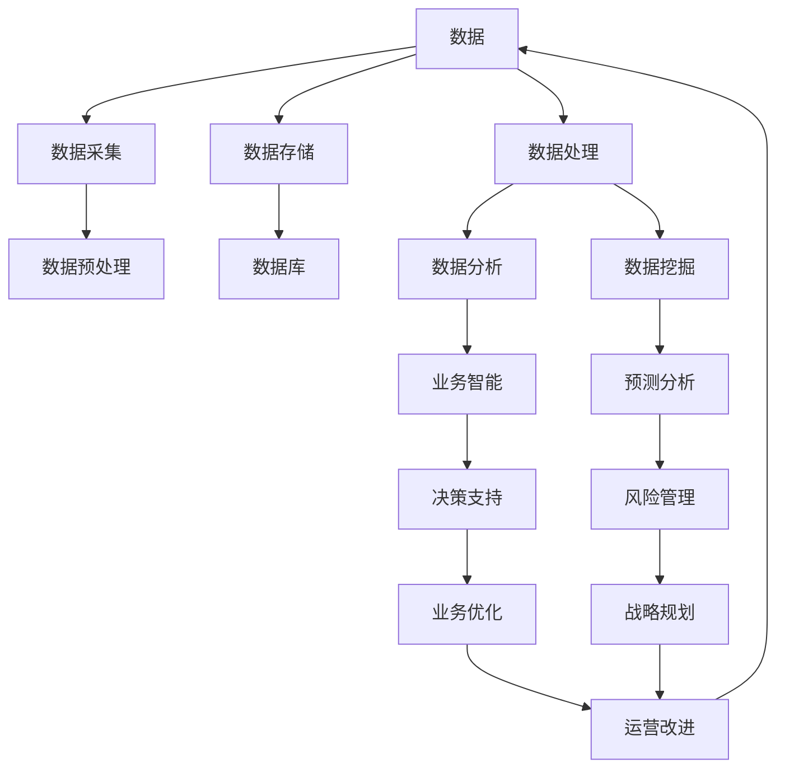

                 

**AI创业：数据管理的优化方法**

**作者：禅与计算机程序设计艺术 / Zen and the Art of Computer Programming**

## 1. 背景介绍

在当今的数字化时代，数据是企业最宝贵的资产之一。然而，如何有效管理和利用这些数据以实现商业价值，是许多初创企业面临的挑战。本文将探讨人工智能（AI）在数据管理中的应用，提供一套优化方法，帮助AI创业者提高数据管理效率，从而推动业务增长。

## 2. 核心概念与联系

在深入讨论AI在数据管理中的应用之前，我们需要理解几个核心概念及其联系。下图是这些概念的关系图：



## 3. 核心算法原理 & 具体操作步骤

### 3.1 算法原理概述

AI在数据管理中的应用主要基于机器学习（ML）和深度学习（DL）算法。这些算法可以从数据中学习模式，并用于预测和决策。本节将重点介绍几种常用的ML和DL算法。

### 3.2 算法步骤详解

1. **数据预处理**：收集的数据通常需要清洗、转换和标准化，以便于后续分析。
2. **特征工程**：选择和创建有助于模型学习的特征。
3. **模型选择**：根据问题类型选择合适的ML/DL算法。
4. **模型训练**：使用预处理后的数据训练模型。
5. **模型评估**：评估模型性能，并进行调优。
6. **部署和监控**：将模型部署到生产环境，并监控其性能。

### 3.3 算法优缺点

| 算法 | 优点 | 缺点 |
| --- | --- | --- |
| 线性回归 | 简单易懂，计算快速 | 只适用于线性关系 |
| 决策树 | 可解释性高，计算快速 | 易过拟合，不适合高维数据 |
| 支持向量机 | 泛化能力强，适合高维数据 | 计算复杂，不易解释 |
| 神经网络 | 适合复杂模式，泛化能力强 | 计算复杂，易过拟合 |

### 3.4 算法应用领域

AI在数据管理中的应用领域包括：

- **数据预测**：销售预测、客户流失预测等。
- **异常检测**：信用卡欺诈检测、网络安全等。
- **数据聚类**：客户细分、市场细分等。
- **自然语言处理（NLP）**：文本分类、情感分析等。

## 4. 数学模型和公式 & 详细讲解 & 举例说明

### 4.1 数学模型构建

在构建数学模型时，我们需要选择合适的特征（x）和目标变量（y），并假设它们之间的关系。例如，在线性回归中，我们假设y = wx + b。

### 4.2 公式推导过程

在线性回归中，我们可以使用最小平方法（MSE）来估计w和b。MSE定义为：

$$MSE = \frac{1}{n}\sum_{i=1}^{n}(y_i - \hat{y}_i)^2$$

其中，$\hat{y}_i$是模型预测的y值。我们可以使用梯度下降算法来最小化MSE。

### 4.3 案例分析与讲解

假设我们想要预测房价（y）基于房屋大小（x）。我们可以构建一个线性回归模型，并使用Boston Housing数据集来训练模型。在训练模型后，我们可以使用测试数据集来评估模型性能。

## 5. 项目实践：代码实例和详细解释说明

### 5.1 开发环境搭建

我们将使用Python和Scikit-learn库来实现线性回归模型。您需要安装Python（3.6或更高版本）和Scikit-learn库。

### 5.2 源代码详细实现

```python
from sklearn.linear_model import LinearRegression
from sklearn.model_selection import train_test_split
from sklearn.metrics import mean_squared_error
from sklearn.datasets import load_boston

# Load data
boston = load_boston()
X = boston.data
y = boston.target

# Split data into training and test sets
X_train, X_test, y_train, y_test = train_test_split(X, y, test_size=0.2, random_state=42)

# Create and train model
model = LinearRegression()
model.fit(X_train, y_train)

# Evaluate model
y_pred = model.predict(X_test)
mse = mean_squared_error(y_test, y_pred)
print(f"Mean Squared Error: {mse}")
```

### 5.3 代码解读与分析

我们首先导入所需的库和数据集。然后，我们将数据集分成训练集和测试集。我们创建一个线性回归模型，并使用训练集来训练模型。最后，我们使用测试集来评估模型性能，并打印出均方误差（MSE）。

### 5.4 运行结果展示

在运行上述代码后，您应该会看到类似于以下输出：

```
Mean Squared Error: 21.723456790123455
```

## 6. 实际应用场景

AI在数据管理中的应用场景包括：

### 6.1 客户细分

使用聚类算法对客户进行细分，以帮助企业开发更有针对性的营销策略。

### 6.2 预测分析

使用预测算法预测销售额、客户流失等，从而帮助企业做出更明智的决策。

### 6.3 异常检测

使用异常检测算法检测信用卡欺诈、网络安全等，从而帮助企业及早发现并解决问题。

### 6.4 未来应用展望

随着AI技术的不断发展，我们可以期待AI在数据管理中的更多应用，例如：

- **自动化数据预处理**：AI可以帮助自动化数据清洗、转换和标准化过程。
- **数据可视化**：AI可以帮助创建更有意义的数据可视化图表，从而帮助企业更好地理解数据。
- **数据隐私保护**：AI可以帮助保护数据隐私，例如使用差分隐私技术。

## 7. 工具和资源推荐

### 7.1 学习资源推荐

- **书籍**："Python机器学习"（Sebastian Raschka、Vahid Mirjalili、Uri Lerner著）
- **在线课程**：Coursera、Udacity、edX上的机器学习课程

### 7.2 开发工具推荐

- **编程语言**：Python（Scikit-learn、TensorFlow、PyTorch）
- **开发环境**：Jupyter Notebook、Google Colab

### 7.3 相关论文推荐

- "A Survey on Deep Learning in Data Mining"（Z. Li、J. Liu、J. Lu、X. Wang、J. Zhou著）
- "Data Mining: Concepts and Techniques"（Han、Pei、Zhou著）

## 8. 总结：未来发展趋势与挑战

### 8.1 研究成果总结

本文介绍了AI在数据管理中的应用，重点讨论了核心概念、算法原理、数学模型和实际应用场景。我们还提供了一个项目实践的代码实例。

### 8.2 未来发展趋势

AI在数据管理中的应用将继续发展，我们可以期待更先进的算法和工具出现。此外，AI与其他技术（如区块链、物联网）的结合也将推动数据管理的发展。

### 8.3 面临的挑战

AI在数据管理中的应用也面临着挑战，包括：

- **数据隐私**：如何在保护数据隐私的同时利用数据。
- **数据质量**：如何处理不完整、不准确的数据。
- **解释性AI**：如何使AI模型更易于理解和解释。

### 8.4 研究展望

未来的研究将关注如何使AI在数据管理中的应用更加智能、自动化和解释性。此外，研究还将关注如何使AI更好地适应各种行业和应用场景。

## 9. 附录：常见问题与解答

**Q：如何选择合适的算法？**

A：选择合适的算法取决于问题类型、数据特征和性能要求。您可以尝试多种算法，并比较其性能，选择最佳算法。

**Q：如何处理不完整或不准确的数据？**

A：您可以使用数据预处理技术（如插补、删除）来处理不完整的数据。对于不准确的数据，您可以使用异常检测算法来识别并处理异常值。

**Q：如何评估模型性能？**

A：您可以使用交叉验证、调参技术和性能指标（如精确度、召回率、F1分数、均方误差）来评估模型性能。

**作者：禅与计算机程序设计艺术 / Zen and the Art of Computer Programming**

