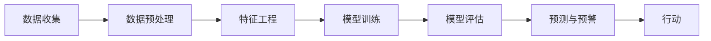

                 

**AI在环境保护中的应用：监测与预警**

**作者：禅与计算机程序设计艺术 / Zen and the Art of Computer Programming**

## 1. 背景介绍

当前，全球环境面临着严重的挑战，如气候变化、空气污染、水质恶化和生物多样性丧失。环境保护的关键在于及时监测和预警，以便采取有效的措施。人工智能（AI）技术的发展为环境监测和预警提供了新的工具和手段。本文将介绍AI在环境保护中的应用，重点关注监测与预警领域。

## 2. 核心概念与联系

### 2.1 核心概念

- **监测（Monitoring）**：收集和记录环境数据，以评估环境状况。
- **预警（Warning）**：根据监测数据，预测环境变化并发出警告。
- **人工智能（Artificial Intelligence）**：模拟人类智能的计算机系统，包括机器学习和深度学习。

### 2.2 核心架构

AI在环境保护中的应用通常遵循以下架构：



## 3. 核心算法原理 & 具体操作步骤

### 3.1 算法原理概述

AI在环境保护中的应用常用的算法包括：线性回归、决策树、随机森林、支持向量机（SVM）、神经网络和深度学习模型等。

### 3.2 算法步骤详解

1. **数据收集**：收集环境相关数据，如气象数据、水质数据、空气质量数据等。
2. **数据预处理**：清洗数据，处理缺失值，去除异常值。
3. **特征工程**：提取特征，如特征选择、特征提取、特征转换等。
4. **模型训练**：使用收集的数据训练AI模型。
5. **模型评估**：评估模型性能，如准确率、精确度、召回率等。
6. **预测与预警**：使用训练好的模型预测环境变化，并发出预警。
7. **行动**：根据预警采取相应措施。

### 3.3 算法优缺点

- **优点**：AI模型可以学习复杂的模式，提高预测准确性；可以处理大量数据，提高效率。
- **缺点**：模型训练需要大量数据，且数据质量直接影响模型性能；模型解释性差，难以理解模型决策的原因。

### 3.4 算法应用领域

AI在环境保护中的应用领域包括：气候变化监测、空气质量监测、水质监测、森林火灾预测、生物多样性监测等。

## 4. 数学模型和公式 & 详细讲解 & 举例说明

### 4.1 数学模型构建

环境保护领域常用的数学模型包括回归模型、时间序列模型、空间统计模型等。

### 4.2 公式推导过程

例如，线性回归模型的公式推导过程如下：

给定数据集$(x_1, y_1), (x_2, y_2), \ldots, (x_n, y_n)$，其中$x_i$为特征，$y_i$为标签。线性回归模型假设数据服从以下线性关系：

$$y = \beta_0 + \beta_1x + \epsilon$$

其中$\beta_0$和$\beta_1$为模型参数，$\epsilon$为误差项。模型参数可以通过最小化误差平方和（MSE）来估计：

$$MSE = \frac{1}{n}\sum_{i=1}^{n}(y_i - \hat{y}_i)^2$$

其中$\hat{y}_i$为模型预测的标签值。

### 4.3 案例分析与讲解

例如，使用线性回归模型预测空气质量指数（AQI）：

给定数据集包含空气中各种污染物的浓度和对应的AQI值。使用线性回归模型，可以预测空气质量指数：

$$AQI = \beta_0 + \beta_1C_1 + \beta_2C_2 + \ldots + \beta_pC_p$$

其中$C_1, C_2, \ldots, C_p$为各种污染物的浓度，$p$为特征数量。

## 5. 项目实践：代码实例和详细解释说明

### 5.1 开发环境搭建

本项目使用Python作为开发语言，并使用Anaconda创建虚拟环境。安装必要的库，如NumPy、Pandas、Matplotlib、Scikit-learn等。

### 5.2 源代码详细实现

以下是使用线性回归模型预测空气质量指数的示例代码：

```python
import numpy as np
import pandas as pd
from sklearn.model_selection import train_test_split
from sklearn.linear_model import LinearRegression
from sklearn.metrics import mean_squared_error

# 加载数据
data = pd.read_csv('air_quality.csv')

# 特征工程
X = data[['PM2.5', 'PM10', 'SO2', 'NO2', 'CO', 'O3']]
y = data['AQI']

# 数据分割
X_train, X_test, y_train, y_test = train_test_split(X, y, test_size=0.2, random_state=42)

# 模型训练
model = LinearRegression()
model.fit(X_train, y_train)

# 模型评估
y_pred = model.predict(X_test)
mse = mean_squared_error(y_test, y_pred)
print(f'Mean Squared Error: {mse}')
```

### 5.3 代码解读与分析

代码首先加载空气质量数据，然后进行特征工程，将数据分割为训练集和测试集。使用线性回归模型训练模型，并评估模型性能。

### 5.4 运行结果展示

运行结果显示模型的均方误差（MSE），可用于评估模型性能。

## 6. 实际应用场景

### 6.1 监测与预警系统

AI可以帮助建立环境监测与预警系统，实时监测环境变化，并发出预警。例如，空气质量监测系统可以实时监测空气中污染物浓度，并预测空气质量指数，发出预警。

### 6.2 环境决策支持系统

AI可以帮助环境决策支持系统，为环境保护提供数据驱动的决策。例如，森林火灾预测系统可以预测森林火灾风险，帮助决策者采取有效措施。

### 6.3 未来应用展望

未来，AI在环境保护中的应用将更加广泛，如环境DNA检测、生物多样性监测、环境影响评估等。此外，AI还可以帮助环境保护领域的数据可视化，提高环境保护的透明度和参与度。

## 7. 工具和资源推荐

### 7.1 学习资源推荐

- 书籍：《环境保护与人工智能》《机器学习》《深度学习》等。
- 在线课程：Coursera、Udacity、edX等平台上的相关课程。

### 7.2 开发工具推荐

- Python：数据分析和模型开发。
- R：统计分析和可视化。
- TensorFlow、PyTorch：深度学习模型开发。
- Jupyter Notebook：数据分析和模型开发的交互式环境。

### 7.3 相关论文推荐

- "A review of artificial intelligence applications in environmental science"[1]
- "Machine learning for environmental monitoring and management"[2]
- "Deep learning for environmental science"[3]

## 8. 总结：未来发展趋势与挑战

### 8.1 研究成果总结

本文介绍了AI在环境保护中的应用，重点关注监测与预警领域。通过实践项目，展示了如何使用线性回归模型预测空气质量指数。

### 8.2 未来发展趋势

未来，AI在环境保护中的应用将更加广泛，如环境DNA检测、生物多样性监测、环境影响评估等。此外，AI还可以帮助环境保护领域的数据可视化，提高环境保护的透明度和参与度。

### 8.3 面临的挑战

AI在环境保护中的应用面临的挑战包括：数据质量、模型解释性、计算资源等。

### 8.4 研究展望

未来的研究方向包括：环境保护领域的AI模型解释性研究、环境保护领域的AI模型可视化研究、环境保护领域的AI模型联邦学习研究等。

## 9. 附录：常见问题与解答

**Q1：AI在环境保护中的优势是什么？**

**A1：AI在环境保护中的优势包括：可以学习复杂的模式，提高预测准确性；可以处理大量数据，提高效率；可以实时监测环境变化，及时发出预警等。**

**Q2：AI在环境保护中的挑战是什么？**

**A2：AI在环境保护中的挑战包括：数据质量、模型解释性、计算资源等。**

**Q3：AI在环境保护中的应用领域有哪些？**

**A3：AI在环境保护中的应用领域包括：气候变化监测、空气质量监测、水质监测、森林火灾预测、生物多样性监测等。**

**参考文献：**

[1] "A review of artificial intelligence applications in environmental science" by Z. Wang et al. (2020)
[2] "Machine learning for environmental monitoring and management" by A. R. G. Langford et al. (2018)
[3] "Deep learning for environmental science" by J. K. H. Kwok and R. C. Y. Chan (2019)

**作者署名：作者：禅与计算机程序设计艺术 / Zen and the Art of Computer Programming**

