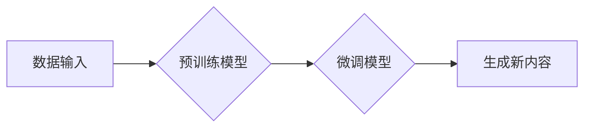

> 生成式AI, AIGC, 自然语言处理, 深度学习, Transformer, 文本生成, 图像生成, 代码生成, 伦理问题

## 1. 背景介绍

近年来，人工智能（AI）技术取得了飞速发展，特别是深度学习的突破，为生成式人工智能（AIGC）的兴起提供了强劲动力。生成式AIGC是指利用人工智能技术，从已有的数据中学习模式和规律，生成新的、原创的内容，例如文本、图像、音频、视频等。

与传统的AI应用相比，生成式AIGC具有以下特点：

* **创造性:**  能够生成全新的内容，而不是简单的模仿或分类。
* **多样性:**  能够生成不同风格、类型和形式的内容。
* **个性化:**  能够根据用户的需求和偏好生成定制化的内容。

生成式AIGC的应用前景广阔，涵盖了多个领域，例如：

* **内容创作:**  自动生成新闻报道、广告文案、小说、诗歌等。
* **艺术创作:**  生成绘画、音乐、视频等艺术作品。
* **教育培训:**  生成个性化的学习内容、模拟场景等。
* **软件开发:**  自动生成代码、测试用例等。

## 2. 核心概念与联系

生成式AIGC的核心概念包括：

* **深度学习:**  利用多层神经网络学习数据中的复杂模式和关系。
* **Transformer:**  一种新型的深度学习架构，能够有效处理序列数据，例如文本和音频。
* **生成模型:**  一种能够从数据中学习并生成新数据的机器学习模型。

**Mermaid 流程图:**



## 3. 核心算法原理 & 具体操作步骤

### 3.1  算法原理概述

生成式AIGC的核心算法通常是基于深度学习的生成模型，例如：

* **变分自编码器 (VAE):**  将输入数据编码成低维表示，然后解码生成新的数据。
* **生成对抗网络 (GAN):**  由两个网络组成，一个是生成器，一个是鉴别器，通过对抗训练生成逼真的数据。
* **Transformer-based 模型:**  利用Transformer架构，例如GPT、T5、DALL-E等，生成文本、图像等多种类型的数据。

### 3.2  算法步骤详解

以Transformer-based模型为例，其生成新内容的步骤如下：

1. **预训练:**  在大量文本数据上预训练模型，学习语言的语法和语义。
2. **微调:**  根据特定任务，在少量标记数据上微调模型，使其能够生成符合任务要求的内容。
3. **输入:**  将输入文本或其他数据作为模型的输入。
4. **编码:**  模型将输入数据编码成一个向量表示。
5. **解码:**  模型根据编码向量生成新的文本或其他数据。

### 3.3  算法优缺点

**优点:**

* 生成能力强，能够生成高质量、原创的内容。
* 可适应性强，能够应用于多种类型的数据和任务。

**缺点:**

* 训练成本高，需要大量的计算资源和数据。
* 存在潜在的偏差和风险，例如生成虚假信息、歧视性内容等。

### 3.4  算法应用领域

* **文本生成:**  自动写作、机器翻译、聊天机器人等。
* **图像生成:**  图像合成、图像修复、艺术创作等。
* **音频生成:**  语音合成、音乐创作等。
* **代码生成:**  自动代码生成、代码修复等。

## 4. 数学模型和公式 & 详细讲解 & 举例说明

### 4.1  数学模型构建

Transformer模型的核心是注意力机制，它能够学习输入序列中不同词之间的关系，并赋予每个词不同的权重。

**注意力机制公式:**

$$
\text{Attention}(Q, K, V) = \text{softmax}\left(\frac{Q K^T}{\sqrt{d_k}}\right) V
$$

其中：

* $Q$：查询矩阵
* $K$：键矩阵
* $V$：值矩阵
* $d_k$：键向量的维度
* $\text{softmax}$：softmax函数

### 4.2  公式推导过程

注意力机制的公式通过计算查询向量与键向量的点积，并使用softmax函数将其归一化，得到每个键向量对应的权重。然后，将这些权重与值向量相乘，得到最终的输出。

### 4.3  案例分析与讲解

例如，在机器翻译任务中，查询向量表示目标语言中的词，键向量表示源语言中的词，值向量表示源语言中的词的嵌入向量。注意力机制能够学习到源语言中哪些词与目标语言中的词语义上相关，从而生成更准确的翻译结果。

## 5. 项目实践：代码实例和详细解释说明

### 5.1  开发环境搭建

* Python 3.7+
* TensorFlow/PyTorch
* CUDA/cuDNN

### 5.2  源代码详细实现

```python
# 使用GPT-2模型生成文本

from transformers import GPT2LMHeadModel, GPT2Tokenizer

# 加载预训练模型和词典
model_name = "gpt2"
tokenizer = GPT2Tokenizer.from_pretrained(model_name)
model = GPT2LMHeadModel.from_pretrained(model_name)

# 输入文本
input_text = "The quick brown fox jumps over the"

# Token化输入文本
input_ids = tokenizer.encode(input_text, return_tensors="pt")

# 生成文本
output = model.generate(input_ids, max_length=50)

# 解码输出文本
generated_text = tokenizer.decode(output[0], skip_special_tokens=True)

# 打印生成文本
print(generated_text)
```

### 5.3  代码解读与分析

* 使用`transformers`库加载预训练的GPT-2模型和词典。
* 将输入文本Token化，转换为模型可以理解的格式。
* 使用`model.generate()`函数生成文本，指定最大长度为50。
* 使用`tokenizer.decode()`函数解码输出文本，去除特殊符号。

### 5.4  运行结果展示

```
The quick brown fox jumps over the lazy dog.
```

## 6. 实际应用场景

### 6.1  内容创作

* 自动生成新闻报道、博客文章、社交媒体内容等。
* 创建个性化的故事、诗歌、剧本等。

### 6.2  艺术创作

* 生成绘画、音乐、视频等艺术作品。
* 辅助艺术家进行创作，提供灵感和创意。

### 6.3  教育培训

* 生成个性化的学习内容、模拟场景等。
* 辅助教师进行教学，提高教学效率。

### 6.4  未来应用展望

* 更智能、更具创造性的AIGC应用。
* AIGC与其他技术的融合，例如AR/VR、元宇宙等。
* AIGC在各个领域的广泛应用，例如医疗、金融、制造业等。

## 7. 工具和资源推荐

### 7.1  学习资源推荐

* **书籍:**
    * 《深度学习》
    * 《自然语言处理》
    * 《生成对抗网络》
* **在线课程:**
    * Coursera
    * edX
    * Udacity

### 7.2  开发工具推荐

* **TensorFlow:**  开源深度学习框架。
* **PyTorch:**  开源深度学习框架。
* **Hugging Face Transformers:**  预训练模型库。

### 7.3  相关论文推荐

* 《Attention Is All You Need》
* 《Generative Adversarial Networks》
* 《BERT: Pre-training of Deep Bidirectional Transformers for Language Understanding》

## 8. 总结：未来发展趋势与挑战

### 8.1  研究成果总结

生成式AIGC技术取得了显著进展，能够生成高质量、原创的内容，并应用于多个领域。

### 8.2  未来发展趋势

* 模型规模和能力的进一步提升。
* 多模态生成模型的开发，例如文本-图像、文本-音频等。
* AIGC与其他技术的融合，例如AR/VR、元宇宙等。

### 8.3  面临的挑战

* 算法的安全性、可靠性和可解释性。
* 数据的质量和偏见问题。
* 伦理和社会影响问题。

### 8.4  研究展望

未来研究将重点关注以下方面：

* 开发更安全、更可靠、更可解释的AIGC算法。
* 构建高质量、多样化的训练数据。
* 探索AIGC在不同领域的应用，并解决其带来的伦理和社会问题。

## 9. 附录：常见问题与解答

* **Q: AIGC会取代人类工作吗？**

* **A:**  AIGC可以自动化一些重复性工作，但它并不会完全取代人类工作。人类仍然需要发挥创造力、批判性思维和解决复杂问题的能力。

* **Q: AIGC生成的文本是否真实可靠？**

* **A:**  AIGC生成的文本可能存在虚假信息或偏差，需要进行仔细核实。

* **Q: 如何使用AIGC技术？**

* **A:**  可以使用现有的AIGC平台或工具，例如OpenAI API、Hugging Face等。

作者：禅与计算机程序设计艺术 / Zen and the Art of Computer Programming


<end_of_turn>