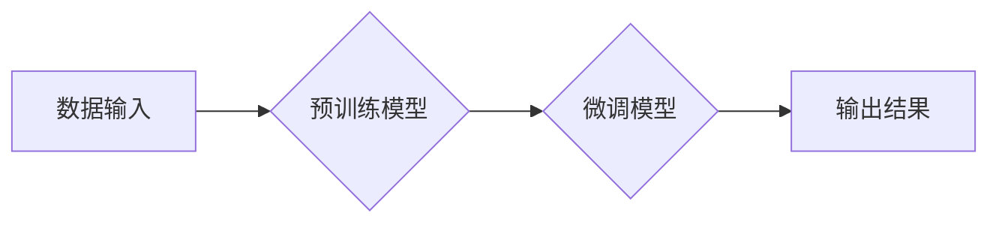

> 生成式AI, AIGC, 自然语言处理, 深度学习, Transformer, 文本生成, 图像生成, 代码生成, 商业应用

## 1. 背景介绍

近年来，人工智能（AI）技术取得了飞速发展，特别是深度学习的突破，为生成式人工智能（AIGC）的兴起提供了强劲动力。生成式AIGC是指利用人工智能技术，从已有的数据中学习模式和规律，生成新的、原创的内容，例如文本、图像、音频、视频等。

与传统的AI应用相比，生成式AIGC具有以下特点：

* **创造性:** 生成式AIGC能够生成全新的内容，而不是仅仅对现有数据进行分类或预测。
* **多样性:** 生成式AIGC能够生成多种不同风格和类型的內容，满足不同用户的需求。
* **效率:** 生成式AIGC能够自动完成内容生成任务，提高工作效率。

## 2. 核心概念与联系

**2.1 生成式AI的核心概念**

生成式AI的核心是学习数据中的模式和规律，并利用这些模式生成新的数据。这涉及到以下几个关键概念：

* **数据驱动:** 生成式AI模型依赖于大量的训练数据，通过学习这些数据中的模式和规律，才能生成高质量的内容。
* **概率模型:** 生成式AI模型通常是基于概率模型的，它学习数据中不同元素出现的概率分布，并根据这些概率分布生成新的数据。
* **生成过程:** 生成过程是指模型根据学习到的模式和规律，生成新的数据的步骤。

**2.2 生成式AIGC与其他AI技术的联系**

生成式AIGC与其他AI技术密切相关，例如：

* **自然语言处理 (NLP):** 生成式AIGC在文本生成领域得到了广泛应用，例如机器翻译、文本摘要、对话系统等。
* **计算机视觉 (CV):** 生成式AIGC在图像生成领域也取得了突破，例如图像合成、图像修复、图像风格迁移等。
* **语音识别和合成:** 生成式AIGC可以用于语音合成和语音识别，例如自动语音助手、语音翻译等。

**2.3 生成式AIGC的架构**



## 3. 核心算法原理 & 具体操作步骤

### 3.1 算法原理概述

生成式AIGC的核心算法主要包括：

* **变分自编码器 (VAE):** VAE是一种生成模型，它通过学习数据的潜在表示，并从潜在表示中生成新的数据。
* **生成对抗网络 (GAN):** GAN由两个网络组成：生成器和判别器。生成器试图生成逼真的数据，而判别器试图区分真实数据和生成数据。两者相互竞争，最终生成器能够生成逼真的数据。
* **Transformer:** Transformer是一种基于注意力机制的神经网络架构，它在自然语言处理领域取得了突破，并被广泛应用于生成式AIGC。

### 3.2 算法步骤详解

以Transformer为例，其生成文本的步骤如下：

1. **词嵌入:** 将输入的文本转换为向量表示。
2. **编码器:** 使用多层Transformer编码器，将文本序列编码为上下文表示。
3. **解码器:** 使用多层Transformer解码器，根据上下文表示生成文本序列。
4. **输出:** 将生成的文本序列解码为原始文本。

### 3.3 算法优缺点

**VAE:**

* **优点:** 可以生成多样化的样本，并能够控制生成样本的分布。
* **缺点:** 生成样本的质量可能不如GAN。

**GAN:**

* **优点:** 可以生成高质量的样本，并能够学习到数据的复杂分布。
* **缺点:** 训练过程比较复杂，容易出现模式崩溃等问题。

**Transformer:**

* **优点:** 可以处理长文本序列，并能够捕捉文本中的长距离依赖关系。
* **缺点:** 计算量较大，训练成本高。

### 3.4 算法应用领域

生成式AIGC的应用领域非常广泛，例如：

* **文本生成:** 机器翻译、文本摘要、对话系统、创意写作等。
* **图像生成:** 图像合成、图像修复、图像风格迁移等。
* **音频生成:** 语音合成、音乐生成等。
* **代码生成:** 代码自动补全、代码生成等。

## 4. 数学模型和公式 & 详细讲解 & 举例说明

### 4.1 数学模型构建

**4.1.1 VAE模型**

VAE模型由两个网络组成：编码器和解码器。

* **编码器:** 将输入数据映射到潜在空间。
* **解码器:** 将潜在空间中的数据映射回原始数据空间。

**4.1.2 GAN模型**

GAN模型由两个网络组成：生成器和判别器。

* **生成器:** 从随机噪声中生成数据。
* **判别器:** 区分真实数据和生成数据。

**4.1.3 Transformer模型**

Transformer模型的核心是注意力机制，它可以捕捉文本中的长距离依赖关系。

### 4.2 公式推导过程

**4.2.1 VAE模型的损失函数**

$$
\mathcal{L}_{VAE} = \mathcal{L}_{KL} + \mathcal{L}_{Reconstruction}
$$

其中：

* $\mathcal{L}_{KL}$ 是KL散度损失，用于衡量编码器输出的潜在分布与标准正态分布之间的差异。
* $\mathcal{L}_{Reconstruction}$ 是重建损失，用于衡量解码器输出的重建数据与真实数据的差异。

**4.2.2 GAN模型的损失函数**

$$
\begin{aligned}
\mathcal{L}_{GAN} &= \mathcal{L}_{D} + \mathcal{L}_{G} \\
\mathcal{L}_{D} &= \mathbb{E}_{x \sim p_{data}(x)}[\log D(x)] + \mathbb{E}_{z \sim p_{z}(z)}[\log (1 - D(G(z)))] \\
\mathcal{L}_{G} &= \mathbb{E}_{z \sim p_{z}(z)}[\log D(G(z))]
\end{aligned}
$$

其中：

* $\mathcal{L}_{D}$ 是判别器的损失函数。
* $\mathcal{L}_{G}$ 是生成器的损失函数。

### 4.3 案例分析与讲解

**4.3.1 文本生成案例**

使用Transformer模型进行文本生成，例如生成诗歌。

**4.3.2 图像生成案例**

使用GAN模型进行图像生成，例如生成逼真的风景图像。

## 5. 项目实践：代码实例和详细解释说明

### 5.1 开发环境搭建

使用Python语言和相关的深度学习框架，例如TensorFlow或PyTorch，搭建开发环境。

### 5.2 源代码详细实现

提供一个简单的文本生成模型的源代码示例，并进行详细的解释。

```python
import tensorflow as tf

# 定义模型结构
model = tf.keras.Sequential([
    tf.keras.layers.Embedding(input_dim=vocab_size, output_dim=embedding_dim),
    tf.keras.layers.LSTM(units=lstm_units),
    tf.keras.layers.Dense(units=vocab_size, activation='softmax')
])

# 编译模型
model.compile(optimizer='adam', loss='sparse_categorical_crossentropy', metrics=['accuracy'])

# 训练模型
model.fit(x_train, y_train, epochs=epochs)

# 生成文本
def generate_text(seed_text, num_words):
    for _ in range(num_words):
        # 将seed_text转换为向量表示
        input_text = tf.expand_dims(seed_text, 0)
        # 使用模型预测下一个词
        predictions = model.predict(input_text)
        # 选择概率最高的词
        predicted_word = tf.argmax(predictions[0]).numpy()
        # 将预测的词添加到seed_text中
        seed_text += chr(predicted_word)
    return seed_text
```

### 5.3 代码解读与分析

解释代码中的各个部分，例如模型结构、编译方法、训练过程、文本生成过程等。

### 5.4 运行结果展示

展示模型训练的结果，例如文本生成效果、准确率等。

## 6. 实际应用场景

### 6.1 文本生成应用

* **机器翻译:** 将文本从一种语言翻译成另一种语言。
* **文本摘要:** 将长文本压缩成短文本，保留关键信息。
* **对话系统:** 创建能够与人类进行自然对话的系统。
* **创意写作:** 帮助作家生成故事、诗歌等创意内容。

### 6.2 图像生成应用

* **图像合成:** 生成逼真的图像，例如合成人物肖像、场景图像等。
* **图像修复:** 修复损坏的图像，例如修复缺失的部分、去除噪声等。
* **图像风格迁移:** 将一张图像的风格迁移到另一张图像上。

### 6.3 其他应用场景

* **音频生成:** 生成逼真的语音、音乐等音频内容。
* **代码生成:** 自动生成代码，提高开发效率。

### 6.4 未来应用展望

生成式AIGC技术的发展将带来更多新的应用场景，例如：

* **个性化内容生成:** 根据用户的喜好生成个性化的内容，例如新闻推荐、个性化广告等。
* **虚拟现实和增强现实:** 生成逼真的虚拟场景和增强现实内容。
* **艺术创作:** 帮助艺术家创作新的艺术作品。

## 7. 工具和资源推荐

### 7.1 学习资源推荐

* **书籍:**
    * 《Deep Learning》 by Ian Goodfellow, Yoshua Bengio, and Aaron Courville
    * 《Generative Deep Learning》 by David Foster
* **在线课程:**
    * Coursera: Deep Learning Specialization
    * Udacity: Deep Learning Nanodegree
* **博客和网站:**
    * OpenAI Blog
    * Google AI Blog

### 7.2 开发工具推荐

* **TensorFlow:** 开源深度学习框架
* **PyTorch:** 开源深度学习框架
* **Hugging Face Transformers:** 提供预训练的Transformer模型

### 7.3 相关论文推荐

* **Generative Adversarial Networks** by Ian Goodfellow et al. (2014)
* **Attention Is All You Need** by Ashish Vaswani et al. (2017)
* **Variational Autoencoders for Generation** by Diederik P. Kingma and Max Welling (2013)

## 8. 总结：未来发展趋势与挑战

### 8.1 研究成果总结

生成式AIGC技术取得了显著的进展，能够生成高质量的文本、图像、音频等内容。

### 8.2 未来发展趋势

* **模型规模和能力的提升:** 未来将会有更大规模、更强大的生成式AIGC模型出现。
* **多模态生成:** 将文本、图像、音频等多种模态数据融合在一起，生成更丰富、更复杂的內容。
* **可解释性和控制性:** 提高生成式AIGC模型的可解释性和控制性，使其能够更好地服务于人类需求。

### 8.3 面临的挑战

* **数据质量和偏见:** 生成式AIGC模型依赖于大量数据，数据质量和偏见会影响模型的性能。
* **伦理和安全问题:** 生成式AIGC技术可能被用于生成虚假信息、恶意内容等，需要关注其伦理和安全问题。
* **计算资源需求:** 训练大型生成式AIGC模型需要大量的计算资源，成本较高。

### 8.4 研究展望

未来研究将集中在以下几个方面：

* **开发更强大的生成式AIGC模型:** 探索新的模型架构、训练方法和优化策略。
* **解决数据质量和偏见问题:** 开发新的数据清洗、增强和标注方法。
* **提高模型的可解释性和控制性:** 研究生成式AIGC模型的决策过程，并开发新的控制