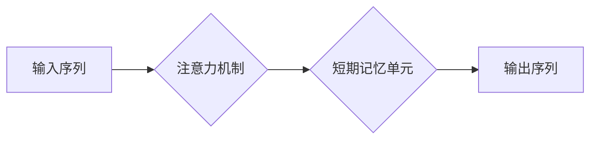

> 短期记忆，上下文学习，Transformer，注意力机制，自然语言处理，机器学习

## 1. 背景介绍

在人工智能领域，模型的性能很大程度上取决于其对上下文信息的理解能力。传统的机器学习模型往往难以捕捉长距离依赖关系，这限制了它们在处理复杂文本任务中的表现。近年来，随着深度学习的兴起，特别是 Transformer 架构的出现，上下文学习取得了长足的进步。

短期记忆，作为一种重要的上下文学习机制，能够帮助模型更好地理解和处理文本序列中的信息。它类似于人类的短期记忆，能够存储和检索最近发生的事件或信息，从而提高对上下文信息的理解能力。

## 2. 核心概念与联系

**2.1 短期记忆的定义**

短期记忆是指人类大脑能够暂时存储和处理少量信息的认知功能。它具有有限的容量和持续时间，通常只能存储几秒钟到几分钟的信息。

**2.2 短期记忆与上下文学习的联系**

上下文学习是指模型根据输入序列中的上下文信息来预测下一个元素或完成其他任务。短期记忆机制能够帮助模型捕捉和利用上下文信息，从而提高其上下文学习能力。

**2.3 Transformer 架构中的短期记忆机制**

Transformer 架构中，注意力机制被广泛应用于实现短期记忆功能。注意力机制能够学习到输入序列中不同元素之间的重要程度，从而突出关键信息，并将其用于预测下一个元素。

**2.4 Mermaid 流程图**



## 3. 核心算法原理 & 具体操作步骤

**3.1 算法原理概述**

短期记忆机制的核心思想是利用注意力机制来学习输入序列中不同元素之间的关系，并根据这些关系来存储和检索信息。

**3.2 算法步骤详解**

1. **输入序列编码:** 将输入序列中的每个元素编码成向量表示。
2. **注意力计算:** 计算每个元素与其他元素之间的注意力权重。
3. **短期记忆单元更新:** 根据注意力权重更新短期记忆单元的状态。
4. **输出序列解码:** 利用更新后的短期记忆单元状态解码输出序列。

**3.3 算法优缺点**

**优点:**

* 能够捕捉长距离依赖关系。
* 能够学习到输入序列中不同元素之间的重要程度。
* 能够有效地利用上下文信息。

**缺点:**

* 计算复杂度较高。
* 训练时间较长。

**3.4 算法应用领域**

* 自然语言处理 (NLP)：文本分类、机器翻译、问答系统等。
* 图像识别：目标检测、图像分割等。
* 时间序列分析：预测、异常检测等。

## 4. 数学模型和公式 & 详细讲解 & 举例说明

**4.1 数学模型构建**

假设输入序列长度为 T，每个元素的向量表示为 x_t (t = 1, 2, ..., T)。

**4.2 公式推导过程**

注意力权重计算公式:

$$
a_{ij} = \frac{exp(score(x_i, x_j))}{\sum_{k=1}^{T} exp(score(x_i, x_k))}
$$

其中，score(x_i, x_j) 是 x_i 和 x_j 之间的相似度得分，可以采用点积、余弦相似度等方式计算。

**4.3 案例分析与讲解**

例如，在机器翻译任务中，输入序列为源语言文本，输出序列为目标语言文本。注意力机制可以帮助模型学习到源语言文本中不同词语之间的关系，并根据这些关系来翻译目标语言文本。

## 5. 项目实践：代码实例和详细解释说明

**5.1 开发环境搭建**

使用 Python 3.x 环境，安装 TensorFlow 或 PyTorch 等深度学习框架。

**5.2 源代码详细实现**

```python
import tensorflow as tf

# 定义注意力机制层
class Attention(tf.keras.layers.Layer):
    def __init__(self, units):
        super(Attention, self).__init__()
        self.W1 = tf.keras.layers.Dense(units)
        self.W2 = tf.keras.layers.Dense(units)
        self.V = tf.keras.layers.Dense(1)

    def call(self, inputs):
        # inputs: (batch_size, seq_len, units)
        query = self.W1(inputs)
        key = self.W2(inputs)
        value = inputs
        scores = self.V(tf.math.tanh(query + key))
        attention_weights = tf.nn.softmax(scores, axis=-1)
        context_vector = tf.matmul(attention_weights, value)
        return context_vector

# 定义短期记忆单元
class ShortTermMemory(tf.keras.layers.Layer):
    def __init__(self, units):
        super(ShortTermMemory, self).__init__()
        self.attention = Attention(units)
        self.lstm = tf.keras.layers.LSTM(units)

    def call(self, inputs):
        # inputs: (batch_size, seq_len, units)
        context_vector = self.attention(inputs)
        output = self.lstm(context_vector)
        return output

# 定义模型
model = tf.keras.Sequential([
    ShortTermMemory(128),
    tf.keras.layers.Dense(10, activation='softmax')
])

# 训练模型
model.compile(optimizer='adam', loss='sparse_categorical_crossentropy', metrics=['accuracy'])
model.fit(x_train, y_train, epochs=10)
```

**5.3 代码解读与分析**

代码中定义了注意力机制层和短期记忆单元，并将其组合成一个完整的模型。注意力机制层用于学习输入序列中不同元素之间的关系，短期记忆单元则利用注意力机制学习到的信息来更新其状态。

**5.4 运行结果展示**

训练完成后，可以将模型应用于实际任务中，并评估其性能。

## 6. 实际应用场景

**6.1 自然语言处理**

* **机器翻译:** 利用短期记忆机制，模型能够更好地理解源语言文本的语义，并将其准确地翻译成目标语言。
* **文本摘要:** 模型能够学习到文本中最重要的信息，并将其总结成简洁的摘要。
* **问答系统:** 模型能够理解用户的问题，并从文本库中找到相应的答案。

**6.2 图像识别**

* **目标检测:** 模型能够学习到图像中不同目标之间的关系，并准确地定位目标的位置。
* **图像分割:** 模型能够将图像分割成不同的区域，并对每个区域进行分类。

**6.3 其他领域**

* **时间序列分析:** 模型能够学习到时间序列中的趋势和模式，并用于预测未来值。
* **推荐系统:** 模型能够学习到用户的偏好，并推荐相关的商品或服务。

**6.4 未来应用展望**

随着深度学习技术的不断发展，短期记忆机制将在更多领域得到应用。例如，它可以用于开发更智能的聊天机器人、更精准的医疗诊断系统、更安全的金融交易系统等。

## 7. 工具和资源推荐

**7.1 学习资源推荐**

* **论文:**
    * "Attention Is All You Need"
    * "BERT: Pre-training of Deep Bidirectional Transformers for Language Understanding"
* **博客:**
    * Jay Alammar's Blog: https://jalammar.github.io/
    * Distill.pub: https://distill.pub/

**7.2 开发工具推荐**

* **TensorFlow:** https://www.tensorflow.org/
* **PyTorch:** https://pytorch.org/

**7.3 相关论文推荐**

* "The Annotated Transformer"
* "XLNet: Generalized Autoregressive Pretraining for Language Understanding"

## 8. 总结：未来发展趋势与挑战

**8.1 研究成果总结**

短期记忆机制在自然语言处理、图像识别等领域取得了显著的成果，证明了其在上下文学习方面的有效性。

**8.2 未来发展趋势**

* **更强大的短期记忆机制:** 研究人员将继续探索更强大的短期记忆机制，例如基于图神经网络的短期记忆机制。
* **跨模态短期记忆:** 研究人员将尝试将短期记忆机制应用于跨模态任务，例如文本-图像理解。
* **高效的短期记忆训练:** 研究人员将致力于开发更有效、更节省资源的短期记忆训练方法。

**8.3 面临的挑战**

* **计算复杂度:** 短期记忆机制的计算复杂度较高，这限制了其在大型数据集上的应用。
* **数据依赖性:** 短期记忆机制的性能很大程度上依赖于训练数据的质量和数量。
* **可解释性:** 短期记忆机制的决策过程相对复杂，难以解释其背后的逻辑。

**8.4 研究展望**

未来，短期记忆机制将继续是人工智能领域的重要研究方向。随着技术的不断发展，我们相信短期记忆机制将为人工智能的发展带来新的突破。

## 9. 附录：常见问题与解答

**9.1 如何选择合适的短期记忆机制？**

选择合适的短期记忆机制取决于具体的应用场景和任务需求。例如，对于需要处理长距离依赖关系的任务，可以选择基于 Transformer 的注意力机制。

**9.2 如何训练短期记忆模型？**

训练短期记忆模型通常需要使用大量的训练数据和强大的计算资源。可以使用梯度下降算法进行模型训练，并根据模型的性能进行参数调整。

**9.3 如何评估短期记忆模型的性能？**

评估短期记忆模型的性能可以使用各种指标，例如准确率、召回率、F1 值等。具体的指标选择取决于具体的应用场景和任务需求。


作者：禅与计算机程序设计艺术 / Zen and the Art of Computer Programming 
<end_of_turn>