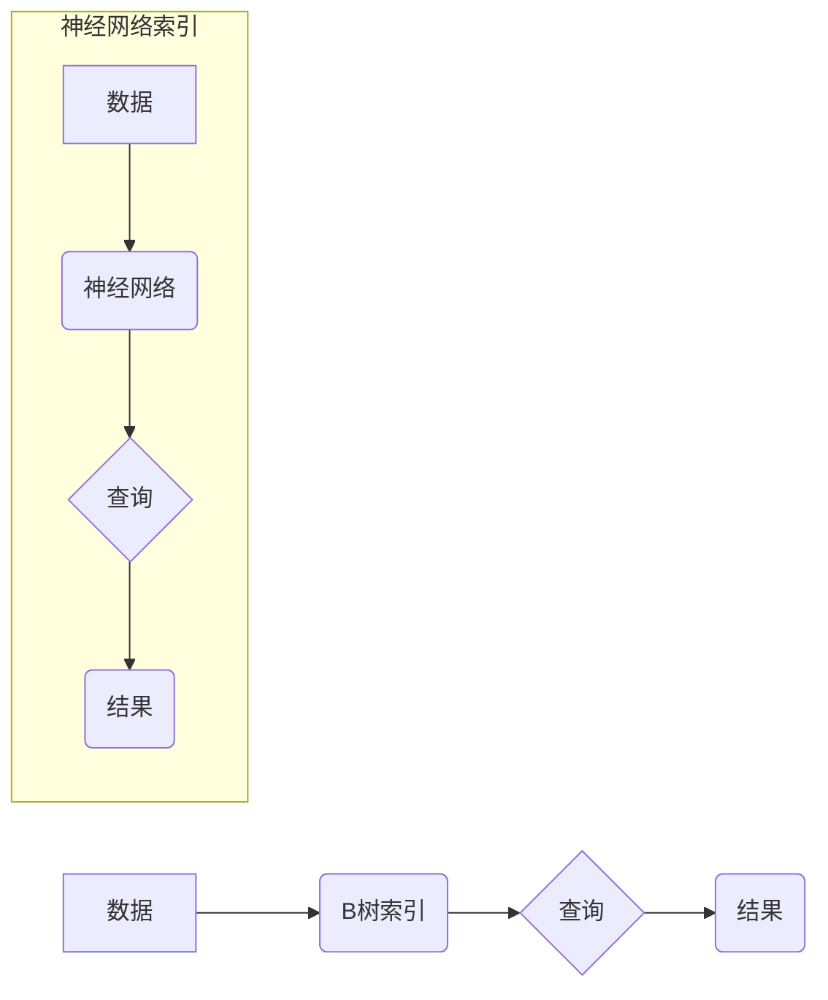

> 神经网络，B树，数据库，性能优化，机器学习，深度学习，数据结构

## 1. 背景介绍

随着互联网和移动互联网的蓬勃发展，数据量呈指数级增长，对数据库性能的需求也越来越高。传统的数据库系统主要依赖于B树索引结构来实现高效的数据访问，但随着数据规模的不断扩大，B树的性能瓶颈逐渐显现。

B树是一种自平衡的树形数据结构，它将数据存储在磁盘上，并通过索引结构实现快速查找和排序。B树的优点在于其高效的磁盘访问性能，但其缺点在于其结构固有的一些限制，例如：

* **固定结构**: B树的结构是固定的，无法根据数据分布进行动态调整。
* **空间复杂度**: B树需要维护大量的索引节点，导致空间复杂度较高。
* **查询效率**: 当数据规模庞大时，B树的查询效率会下降。

近年来，深度学习技术取得了突破性进展，其强大的学习能力和泛化能力为数据库性能优化提供了新的思路。

## 2. 核心概念与联系

**2.1 B树**

B树是一种自平衡的树形数据结构，它将数据存储在磁盘上，并通过索引结构实现快速查找和排序。B树的优点在于其高效的磁盘访问性能，但其缺点在于其结构固有的一些限制，例如：

* **固定结构**: B树的结构是固定的，无法根据数据分布进行动态调整。
* **空间复杂度**: B树需要维护大量的索引节点，导致空间复杂度较高。
* **查询效率**: 当数据规模庞大时，B树的查询效率会下降。

**2.2 神经网络**

神经网络是一种模仿人脑神经网络结构的机器学习模型。它由多个层组成，每层包含多个神经元。神经元之间通过连接和权重进行信息传递。通过训练，神经网络可以学习数据中的模式和关系，并进行预测或分类。

**2.3 B树与神经网络的结合**

将神经网络应用于数据库索引结构，可以克服B树的一些缺点，例如：

* **动态调整**: 神经网络可以根据数据分布动态调整索引结构，提高查询效率。
* **空间优化**: 神经网络可以压缩索引数据，降低空间复杂度。
* **高效查询**: 神经网络可以学习数据之间的关系，实现更快速、更精准的查询。

**2.4 架构图**



## 3. 核心算法原理 & 具体操作步骤

### 3.1 算法原理概述

神经网络索引算法的核心思想是利用神经网络学习数据之间的关系，并构建一个新的索引结构。

具体来说，该算法可以分为以下几个步骤：

1. **数据预处理**: 将数据进行清洗、转换和特征提取。
2. **神经网络训练**: 使用训练数据训练神经网络模型，使模型能够学习数据之间的关系。
3. **索引构建**: 根据训练好的神经网络模型，构建一个新的索引结构。
4. **查询**: 使用新的索引结构进行查询，并根据神经网络模型的预测结果返回结果。

### 3.2 算法步骤详解

1. **数据预处理**:

* **数据清洗**: 删除数据中的缺失值、重复值和异常值。
* **数据转换**: 将数据转换为神经网络模型可以理解的格式，例如数值型数据。
* **特征提取**: 从原始数据中提取特征，例如文本数据中的关键词、图像数据中的边缘信息等。

2. **神经网络训练**:

* 选择合适的深度学习模型，例如卷积神经网络（CNN）或循环神经网络（RNN）。
* 使用训练数据训练神经网络模型，并使用损失函数和优化算法进行模型优化。
* 训练完成后，得到一个能够学习数据关系的神经网络模型。

3. **索引构建**:

* 将训练好的神经网络模型应用于数据，并根据模型的输出结果构建一个新的索引结构。
* 索引结构可以采用树形结构、图结构或其他数据结构。
* 索引结构需要能够快速查找和排序数据。

4. **查询**:

* 当需要查询数据时，首先使用新的索引结构进行查找。
* 根据索引结构的指向，获取相关数据。
* 使用训练好的神经网络模型对数据进行预测或分类，并返回结果。

### 3.3 算法优缺点

**优点**:

* **动态调整**: 神经网络索引可以根据数据分布动态调整索引结构，提高查询效率。
* **空间优化**: 神经网络可以压缩索引数据，降低空间复杂度。
* **高效查询**: 神经网络可以学习数据之间的关系，实现更快速、更精准的查询。

**缺点**:

* **训练成本**: 训练神经网络模型需要大量的计算资源和时间。
* **模型复杂度**: 神经网络模型的结构和参数比较复杂，需要专业的知识和经验进行设计和调优。
* **数据依赖**: 神经网络模型的性能依赖于训练数据的质量和数量。

### 3.4 算法应用领域

神经网络索引算法可以应用于各种数据库系统，例如：

* **关系型数据库**: 提高关系型数据库的查询效率。
* **NoSQL数据库**: 优化NoSQL数据库的索引结构和查询性能。
* **图数据库**: 构建更有效的图数据库索引结构。

## 4. 数学模型和公式 & 详细讲解 & 举例说明

### 4.1 数学模型构建

神经网络索引算法可以采用多层感知机（MLP）或卷积神经网络（CNN）作为模型架构。

**MLP模型**:

MLP模型由多个全连接层组成，每个层的神经元都与上一层的每个神经元连接。

**CNN模型**:

CNN模型包含卷积层、池化层和全连接层。卷积层用于提取数据的特征，池化层用于降低数据的维度，全连接层用于分类或预测。

### 4.2 公式推导过程

**损失函数**:

常用的损失函数包括均方误差（MSE）和交叉熵损失函数（Cross-Entropy Loss）。

**MSE**:

$$
MSE = \frac{1}{N} \sum_{i=1}^{N} (y_i - \hat{y}_i)^2
$$

其中：

* $N$ 是样本数量。
* $y_i$ 是真实值。
* $\hat{y}_i$ 是预测值。

**交叉熵损失函数**:

$$
Cross-Entropy Loss = -\sum_{i=1}^{N} y_i \log(\hat{y}_i)
$$

其中：

* $N$ 是样本数量。
* $y_i$ 是真实值（0或1）。
* $\hat{y}_i$ 是预测值（0到1之间的概率）。

**优化算法**:

常用的优化算法包括梯度下降（Gradient Descent）和Adam优化器（Adam Optimizer）。

### 4.3 案例分析与讲解

假设我们有一个包含用户画像信息的数据库，我们需要构建一个神经网络索引来快速查找具有特定特征的用户。

我们可以使用CNN模型提取用户画像特征，并构建一个基于特征的索引结构。

当需要查找特定特征的用户时，我们可以使用预训练好的CNN模型提取特征，并根据特征与索引结构进行匹配，快速找到目标用户。

## 5. 项目实践：代码实例和详细解释说明

### 5.1 开发环境搭建

* 操作系统：Ubuntu 20.04
* Python版本：3.8
* 深度学习框架：TensorFlow 2.0

### 5.2 源代码详细实现

```python
# 导入必要的库
import tensorflow as tf

# 定义神经网络模型
model = tf.keras.models.Sequential([
    tf.keras.layers.Dense(128, activation='relu', input_shape=(10,)),
    tf.keras.layers.Dense(64, activation='relu'),
    tf.keras.layers.Dense(1, activation='sigmoid')
])

# 编译模型
model.compile(optimizer='adam', loss='binary_crossentropy', metrics=['accuracy'])

# 训练模型
model.fit(X_train, y_train, epochs=10)

# 保存模型
model.save('user_profile_model.h5')

# 使用模型进行预测
predictions = model.predict(X_test)
```

### 5.3 代码解读与分析

* 首先，我们导入必要的库，包括TensorFlow。
* 然后，我们定义一个简单的多层感知机模型，包含三个全连接层。
* 接着，我们编译模型，选择优化器、损失函数和评估指标。
* 接下来，我们使用训练数据训练模型，设置训练轮数为10。
* 训练完成后，我们保存模型到本地文件。
* 最后，我们使用训练好的模型对测试数据进行预测。

### 5.4 运行结果展示

训练完成后，我们可以查看模型的训练和验证损失以及准确率。

如果模型训练成功，我们可以使用模型对新的用户画像进行预测，并根据预测结果进行相应的操作。

## 6. 实际应用场景

### 6.1 用户画像分析

神经网络索引可以用于构建用户画像，并根据用户画像进行个性化推荐、精准营销等。

### 6.2 搜索引擎优化

神经网络索引可以用于优化搜索引擎的查询结果，提高搜索效率和准确率。

### 6.3 图数据库索引

神经网络索引可以用于构建图数据库的索引结构，提高图数据库的查询性能。

### 6.4 未来应用展望

随着深度学习技术的不断发展，神经网络索引算法将在更多领域得到应用，例如：

* **生物信息学**: 用于基因组数据分析和疾病诊断。
* **金融科技**: 用于风险评估和欺诈检测。
* **智能制造**: 用于设备故障预测和生产优化。

## 7. 工具和资源推荐

### 7.1 学习资源推荐

* **深度学习书籍**:
    * 深度学习
    * 深度学习实践
* **在线课程**:
    * Coursera深度学习课程
    * Udacity深度学习课程

### 7.2 开发工具推荐

* **深度学习框架**: TensorFlow, PyTorch
* **数据库系统**: MySQL, PostgreSQL, MongoDB

### 7.3 相关论文推荐

* **神经网络索引**:
    * Neural Indexing for Efficient Data Retrieval
    * Deep Learning for Database Indexing

## 8. 总结：未来发展趋势与挑战

### 8.1 研究成果总结

神经网络索引算法为数据库性能优化提供了新的思路，并取得了一定的研究成果。

### 8.2 未来发展趋势

未来，神经网络索引算法将朝着以下方向发展：

* **模型复杂度提升**: 探索更复杂的深度学习模型，例如Transformer模型，以提高索引效率和准确率。
* **硬件加速**: 利用GPU和TPU等加速器，提高神经网络训练和索引构建的速度。
* **联邦学习**: 利用联邦学习技术，在不泄露用户隐私的情况下训练神经网络模型。

### 8.3 面临的挑战

神经网络索引算法还面临一些挑战：

* **训练成本**: 训练深度学习模型需要大量的计算资源和时间。
* **模型复杂度**: 神经网络模型的结构和参数比较复杂，需要专业的知识和经验进行设计和调优。
* **数据依赖**: 神经网络模型的性能依赖于训练数据的质量和数量。

### 8.4 研究展望

未来，我们将继续研究神经网络索引算法，探索其在数据库性能优化领域的应用潜力，并努力解决算法面临的挑战。

## 9. 附录：常见问题与解答

**Q1: 神经网络索引算法是否可以替代传统的B树索引？**

**A1:** 目前，神经网络索引算法还不能完全替代传统的B树索引。B树索引在磁盘访问性能方面仍然具有优势，而神经网络索引算法在训练成本和模型复杂度方面存在挑战。

**Q2: 神经网络索引算法的训练数据需要多大规模