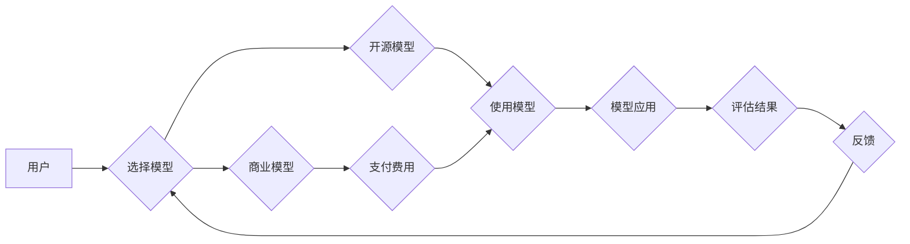

>  神经网络模型、许可证管理、知识产权、开源、商业化、伦理

## 1. 背景介绍

近年来，深度学习和神经网络模型在各个领域取得了突破性的进展，从图像识别、自然语言处理到药物研发，神经网络模型正在改变着我们的生活。然而，随着神经网络模型的日益普及，其许可证管理问题也日益凸显。

传统软件的许可证管理模式难以直接应用于神经网络模型，因为神经网络模型具有以下特点：

* **复杂性:** 神经网络模型通常由数百万甚至数十亿个参数组成，其结构和训练过程非常复杂。
* **数据依赖性:** 神经网络模型的性能很大程度上依赖于训练数据，而训练数据本身可能涉及隐私和版权问题。
* **可解释性差:** 神经网络模型的决策过程往往难以解释，这使得其应用在某些领域存在伦理和法律风险。

这些特点使得神经网络模型的许可证管理面临着独特的挑战。

## 2. 核心概念与联系

神经网络模型的许可证管理涉及到知识产权、开源、商业化和伦理等多个方面。

**2.1 知识产权**

神经网络模型的知识产权问题主要集中在以下几个方面：

* **模型本身的版权:** 是否可以将神经网络模型视为一种软件作品，并对其进行版权保护？
* **训练数据的著作权:** 训练数据是否属于公共领域，还是受到著作权保护？
* **模型训练方法的专利权:** 是否可以对特定的模型训练方法进行专利保护？

**2.2 开源**

开源神经网络模型的许可证通常采用Apache 2.0、MIT等开源许可证，允许他人自由使用、修改和分发模型。开源模型的优势在于促进社区合作、加速技术发展，但同时也存在着潜在的风险，例如模型被用于恶意目的。

**2.3 商业化**

商业公司往往希望将神经网络模型作为其核心竞争力，并通过商业授权的方式获取收益。商业化神经网络模型的许可证通常更加严格，例如限制使用范围、要求支付许可费用等。

**2.4 伦理**

神经网络模型的应用可能涉及到隐私、歧视、安全等伦理问题。许可证管理需要考虑这些伦理风险，并制定相应的规章制度。

**2.5 相关流程图**



## 3. 核心算法原理 & 具体操作步骤

### 3.1  算法原理概述

神经网络模型的许可证管理本质上是一个信息管理和控制问题。

其核心算法原理是基于以下几个方面：

* **身份认证:** 确保只有授权用户才能访问和使用神经网络模型。
* **访问控制:** 控制用户对模型的访问权限，例如只允许读取模型参数，不允许修改模型结构。
* **使用跟踪:** 记录用户对模型的使用情况，例如模型调用次数、使用时间等。
* **数据安全:** 保护模型训练数据和用户数据安全。

### 3.2  算法步骤详解

神经网络模型的许可证管理流程通常包括以下步骤：

1. **模型注册:** 将神经网络模型注册到许可证管理平台，并设置相应的许可证信息。
2. **用户认证:** 用户需要通过身份认证才能访问许可证管理平台。
3. **许可证申请:** 用户需要向许可证管理平台申请使用特定神经网络模型的许可证。
4. **许可证审批:** 许可证管理平台根据用户的申请和许可证信息进行审批。
5. **许可证授权:** 审批通过后，许可证管理平台会向用户授权使用模型。
6. **模型访问:** 用户可以使用授权的许可证访问和使用神经网络模型。
7. **使用跟踪:** 许可证管理平台会跟踪用户的模型使用情况。
8. **许可证续费:** 许可证到期后，用户需要进行续费才能继续使用模型。

### 3.3  算法优缺点

**优点:**

* **提高模型安全性:** 通过身份认证、访问控制等机制，可以防止未经授权的用户访问和使用模型。
* **保护知识产权:** 通过许可证管理，可以控制模型的使用范围和授权对象，保护模型的知识产权。
* **促进商业化:** 通过许可证授权，可以为模型开发者提供商业化收入来源。

**缺点:**

* **复杂性:** 许可证管理系统需要复杂的开发和维护工作。
* **成本:** 建立和维护许可证管理系统需要一定的成本投入。
* **可操作性:** 对于一些开源模型，许可证管理可能会增加使用门槛。

### 3.4  算法应用领域

神经网络模型的许可证管理技术可以应用于以下领域：

* **人工智能平台:** 提供神经网络模型的共享和授权服务。
* **企业内部:** 管理企业内部开发的神经网络模型。
* **学术研究:** 控制学术研究人员对模型的访问和使用。

## 4. 数学模型和公式 & 详细讲解 & 举例说明

### 4.1  数学模型构建

神经网络模型的许可证管理可以抽象为一个信息控制模型，其核心是基于访问控制列表（ACL）和角色权限管理（RBAC）的策略。

**ACL:** 访问控制列表是一种用于控制用户对资源访问权限的机制。ACL 可以定义用户、资源和权限之间的关系，例如允许特定用户访问特定资源，或者禁止特定用户访问特定资源。

**RBAC:** 角色权限管理是一种基于角色分配权限的机制。RBAC 将用户分为不同的角色，每个角色具有特定的权限。用户可以通过加入不同的角色来获得不同的权限。

### 4.2  公式推导过程

假设有 N 个用户，M 个资源，和 K 个角色。

* **用户-角色关系矩阵:** $U_R \in \{0,1\}^{N \times K}$，其中 $U_R[i,j] = 1$ 表示用户 $i$ 属于角色 $j$，否则为 0。
* **角色-资源权限矩阵:** $R_A \in \{0,1\}^{K \times M}$，其中 $R_A[i,j] = 1$ 表示角色 $i$ 拥有访问资源 $j$ 的权限，否则为 0。
* **用户-资源访问权限矩阵:** $U_A \in \{0,1\}^{N \times M}$，其中 $U_A[i,j] = 1$ 表示用户 $i$ 拥有访问资源 $j$ 的权限，否则为 0。

则用户 $i$ 访问资源 $j$ 的权限可以由以下公式计算：

$$U_A[i,j] = \sum_{k=1}^{K} U_R[i,k] \times R_A[k,j]$$

### 4.3  案例分析与讲解

例如，假设有 3 个用户 (Alice, Bob, Charlie)，2 个资源 (模型 A, 模型 B)，和 2 个角色 (开发者, 用户)。

* $U_R = \begin{bmatrix} 1 & 0 \\ 0 & 1 \\ 0 & 1 \end{bmatrix}$
* $R_A = \begin{bmatrix} 1 & 1 \\ 0 & 0 \end{bmatrix}$

则根据公式，Alice 拥有访问模型 A 和模型 B 的权限，Bob 拥有访问模型 A 的权限，Charlie 拥有访问模型 A 的权限。

## 5. 项目实践：代码实例和详细解释说明

### 5.1  开发环境搭建

* 操作系统: Ubuntu 20.04
* Python 版本: 3.8
* 依赖库: Flask, SQLAlchemy, bcrypt

### 5.2  源代码详细实现

```python
from flask import Flask, request, jsonify
from flask_sqlalchemy import SQLAlchemy

app = Flask(__name__)
app.config['SQLALCHEMY_DATABASE_URI'] = 'sqlite:///models.db'
db = SQLAlchemy(app)

class User(db.Model):
    id = db.Column(db.Integer, primary_key=True)
    username = db.Column(db.String(80), unique=True, nullable=False)
    password = db.Column(db.String(120), nullable=False)

class Model(db.Model):
    id = db.Column(db.Integer, primary_key=True)
    name = db.Column(db.String(80), unique=True, nullable=False)
    description = db.Column(db.Text)
    license = db.Column(db.String(255))

# ... 其他路由和函数

if __name__ == '__main__':
    db.create_all()
    app.run(debug=True)
```

### 5.3  代码解读与分析

* 代码使用 Flask 框架构建了一个简单的许可证管理 API。
* 数据库使用 SQLAlchemy 管理用户和模型信息。
* 用户和模型信息存储在数据库中，并通过 API 进行访问和操作。

### 5.4  运行结果展示

API 可以提供以下功能：

* 用户注册和登录
* 模型注册和管理
* 许可证申请和授权
* 模型使用跟踪

## 6. 实际应用场景

### 6.1  人工智能平台

人工智能平台可以提供神经网络模型的共享和授权服务，例如 Google AI Platform, Amazon SageMaker 等。

### 6.2  企业内部

企业可以利用许可证管理技术来管理内部开发的神经网络模型，例如控制模型的使用范围、授权对象等。

### 6.3  学术研究

学术研究人员可以使用许可证管理技术来控制对模型的访问和使用，例如限制模型的使用范围、要求用户进行学术贡献等。

### 6.4  未来应用展望

随着神经网络模型的日益普及，许可证管理技术将变得越来越重要。未来，许可证管理技术可能会朝着以下方向发展：

* **更细粒度的控制:** 允许对模型的不同部分进行不同的授权，例如只允许访问模型的输入层，不允许访问模型的输出层。
* **动态授权:** 根据用户的行为和环境动态调整模型的授权权限。
* **区块链技术:** 利用区块链技术来实现模型的不可篡改性和透明性。

## 7. 工具和资源推荐

### 7.1  学习资源推荐

* **论文:**

    * "Towards a Taxonomy of Open-Source Machine Learning Models"
    * "License Compliance in Open-Source Machine Learning"

* **博客:**

    * "OpenAI's API: A Guide to Licensing and Usage"
    * "The Ethics of Open-Source AI"

### 7.2  开发工具推荐

* **Flask:** 轻量级 Python Web 框架
* **SQLAlchemy:** Python 数据库抽象库
* **bcrypt:** 密码哈希库

### 7.3  相关论文推荐

* "On the Dangers of Stochastic Parrots: Can Language Models Be Too Big?"
* "The Alignment Problem: Machine Learning and Human Values"

## 8. 总结：未来发展趋势与挑战

### 8.1  研究成果总结

神经网络模型的许可证管理是一个新兴领域，目前的研究成果主要集中在以下几个方面：

* **许可证类型和策略:** 研究了不同的许可证类型和策略，并分析了其优缺点。
* **技术实现:** 开发了基于 ACL 和 RBAC 的许可证管理系统。
* **伦理问题:** 研究了神经网络模型许可证管理与伦理问题之间的关系。

### 8.2  未来发展趋势

未来，神经网络模型的许可证管理技术将朝着以下方向发展：

* **更细粒度的控制:** 允许对模型的不同部分进行不同的授权。
* **动态授权:** 根据用户的行为和环境动态调整模型的授权权限。
* **区块链技术:** 利用区块链技术来实现模型的不可篡改性和透明性。

### 8.3  面临的挑战

神经网络模型的许可证管理也面临着一些挑战