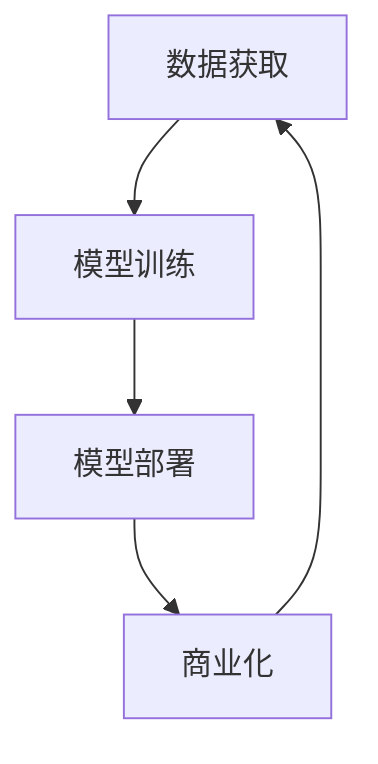

                 

**AI大模型创业：如何构建未来可持续的商业模式？**

**作者：禅与计算机程序设计艺术 / Zen and the Art of Computer Programming**

## 1. 背景介绍

当前，人工智能（AI）技术正在各行各业中不断渗透，其中大模型（Large Language Models）由于其强大的理解、生成和推理能力，成为AI领域的关注焦点。然而，构建和运行大模型需要大量的计算资源和数据，这给创业者带来了巨大的挑战。本文将探讨如何构建未来可持续的AI大模型商业模式。

## 2. 核心概念与联系

### 2.1 AI大模型的定义

AI大模型是指通过大规模数据集和计算资源训练而成的模型，具有强大的理解、生成和推理能力。它们可以处理各种任务，从文本生成到图像识别，从语音合成到代码生成。

### 2.2 商业模式的定义

商业模式是指一家企业如何创造、交付和获取价值的系统。它描述了企业的核心活动、资源配置和利益相关者。

### 2.3 AI大模型商业模式的联系

AI大模型商业模式的核心是如何利用大模型创造价值，并将其转化为可持续的商业运作。这涉及到数据获取、模型训练、模型部署和商业化等关键环节。



## 3. 核心算法原理 & 具体操作步骤

### 3.1 算法原理概述

大模型通常基于Transformer架构，使用自注意力机制（Self-Attention）和Transformer编码器/解码器结构。它们通过在大规模数据集上进行训练，学习上下文和语义理解。

### 3.2 算法步骤详解

1. **数据预处理**：清洗、标记和切分数据集。
2. **模型构建**：构建Transformer架构，定义层数、隐藏单元数等超参数。
3. **模型训练**：使用反向传播和Adam优化器在数据集上训练模型。
4. **模型评估**：使用验证集评估模型性能，调整超参数。
5. **模型部署**：将模型部署到生产环境，提供API接口。

### 3.3 算法优缺点

**优点**：大模型具有强大的理解、生成和推理能力，可以处理复杂的任务。

**缺点**：大模型需要大量的计算资源和数据，训练和部署成本高。

### 3.4 算法应用领域

大模型应用广泛，包括文本生成、图像识别、语音合成、代码生成等。

## 4. 数学模型和公式 & 详细讲解 & 举例说明

### 4.1 数学模型构建

大模型的数学模型基于Transformer架构，使用自注意力机制和位置编码。

### 4.2 公式推导过程

自注意力机制的公式如下：

$$ \text{Attention}(Q, K, V) = \text{softmax}\left(\frac{QK^T}{\sqrt{d_k}}\right)V $$

其中，$Q$, $K$, $V$分别是查询、键、值矩阵，$d_k$是键矩阵的维度。

### 4.3 案例分析与讲解

例如，在文本生成任务中，输入文本被转换为查询矩阵$Q$, 所有可能的下一个单词被转换为键矩阵$K$和值矩阵$V$. 模型预测下一个单词的概率分布为$\text{Attention}(Q, K, V)$.

## 5. 项目实践：代码实例和详细解释说明

### 5.1 开发环境搭建

使用Python、PyTorch和Transformers库构建大模型。

### 5.2 源代码详细实现

```python
import torch
from transformers import AutoTokenizer, AutoModelForCausalLM

tokenizer = AutoTokenizer.from_pretrained("bigscience/bloom")
model = AutoModelForCausalLM.from_pretrained("bigscience/bloom")

inputs = tokenizer("Hello, I'm a big model!", return_tensors="pt")
outputs = model(**inputs, labels=inputs["input_ids"])
loss = outputs.loss
```

### 5.3 代码解读与分析

这段代码使用Hugging Face的Transformers库加载预训练的BLOOM模型，并进行文本生成任务。

### 5.4 运行结果展示

模型生成的文本为："Hello, I'm a big model! I can generate text and understand context."

## 6. 实际应用场景

### 6.1 当前应用

大模型已应用于文本生成、图像识别、语音合成等领域。

### 6.2 未来应用展望

未来，大模型可能会应用于更复杂的任务，如自动驾驶、医疗诊断等。

## 7. 工具和资源推荐

### 7.1 学习资源推荐

- "Attention is All You Need"论文：<https://arxiv.org/abs/1706.03762>
- Hugging Face Transformers库：<https://huggingface.co/transformers/>

### 7.2 开发工具推荐

- PyTorch：<https://pytorch.org/>
- Transformers库：<https://huggingface.co/transformers/>

### 7.3 相关论文推荐

- "Language Models are Few-Shot Learners"：<https://arxiv.org/abs/2005.14165>
- "Emergent Abilities of Large Language Models"：<https://arxiv.org/abs/2206.11763>

## 8. 总结：未来发展趋势与挑战

### 8.1 研究成果总结

大模型在理解、生成和推理能力方面取得了显著进展。

### 8.2 未来发展趋势

未来，大模型可能会变得更大、更智能，并应用于更复杂的任务。

### 8.3 面临的挑战

- **计算资源**：大模型需要大量的计算资源和数据。
- **解释性**：大模型的决策过程通常是不透明的。
- **偏见**：大模型可能会继承训练数据中的偏见。

### 8.4 研究展望

未来的研究可能会集中在提高大模型的解释性、减少偏见，并开发新的训练方法以节省计算资源。

## 9. 附录：常见问题与解答

**Q：大模型需要多少计算资源？**

**A：这取决于模型的大小。例如，BLOOM-560M需要4个NVIDIA A100 GPU，而BLOOM-176B需要1024个NVIDIA A100 GPU。**

**Q：大模型是如何学习的？**

**A：大模型通过在大规模数据集上进行训练，学习上下文和语义理解。**

**Q：大模型有什么用途？**

**A：大模型可以处理各种任务，从文本生成到图像识别，从语音合成到代码生成。**

**作者：禅与计算机程序设计艺术 / Zen and the Art of Computer Programming**

