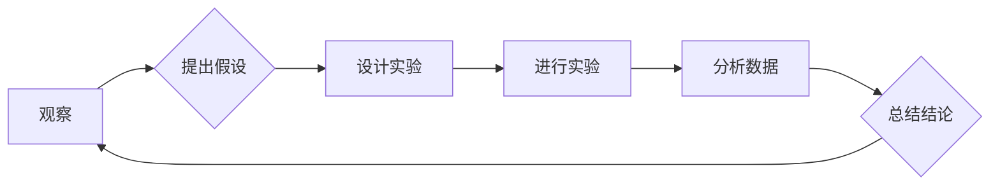

> 科学方法，观察，实验，数据分析，模型构建，算法设计，代码实现，应用场景，未来趋势

## 1. 背景介绍

在瞬息万变的科技时代，创新和进步离不开科学方法的指导。科学方法是一种严谨的思维模式，它通过观察、假设、实验和分析，不断探索和验证知识，推动人类对世界和自身的理解不断深入。

对于软件开发领域而言，科学方法同样至关重要。从需求分析到代码设计、测试和部署，每一个环节都离不开科学方法的指导。只有遵循科学方法，才能开发出高质量、可靠、可维护的软件系统。

## 2. 核心概念与联系

科学方法的核心概念包括：

* **观察:** 对现象进行仔细的观察，记录相关信息。
* **假设:**  根据观察结果，提出一个可被验证的假设。
* **实验:** 设计和进行实验，收集数据来验证假设。
* **分析:** 对实验数据进行分析，得出结论。
* **总结:** 将实验结果总结归纳，形成新的知识或改进原有的假设。

**Mermaid 流程图:**



## 3. 核心算法原理 & 具体操作步骤

### 3.1  算法原理概述

算法是一种解决特定问题的步骤或规则，它可以被计算机执行。科学方法在算法设计中起着至关重要的作用。

* **观察问题:** 首先要仔细观察问题，理解其本质和需求。
* **提出解决方案:** 根据观察结果，提出可能的解决方案，即算法的雏形。
* **设计算法:** 设计详细的算法步骤，确保其逻辑清晰、可执行。
* **测试算法:** 对算法进行测试，验证其正确性和效率。
* **优化算法:** 根据测试结果，对算法进行优化，提高其性能。

### 3.2  算法步骤详解

以下是一个简单的算法设计步骤示例：

1. **输入:** 获取用户输入的两个数字。
2. **比较:** 将两个数字进行比较，判断哪个数字更大。
3. **输出:** 输出较大的数字。

### 3.3  算法优缺点

* **优点:** 算法简单易懂，易于实现。
* **缺点:** 效率较低，对于大型数据处理可能存在性能瓶颈。

### 3.4  算法应用领域

该算法可以应用于各种场景，例如：

* 比较两个数值的大小。
* 查找最大或最小值。
* 排序数据。

## 4. 数学模型和公式 & 详细讲解 & 举例说明

### 4.1  数学模型构建

在软件开发中，数学模型可以用来描述系统行为、优化算法、分析数据等。例如，我们可以使用线性回归模型来预测用户行为，使用决策树模型来进行分类，使用图论模型来分析网络结构。

### 4.2  公式推导过程

假设我们想要预测用户购买商品的概率，可以使用线性回归模型。该模型的公式如下：

$$
P(购买) = \beta_0 + \beta_1 * 年龄 + \beta_2 * 收入
$$

其中：

* $P(购买)$ 是用户购买商品的概率。
* $\beta_0$ 是截距项。
* $\beta_1$ 和 $\beta_2$ 是系数，分别表示年龄和收入对购买概率的影响。

### 4.3  案例分析与讲解

假设我们收集了100个用户的购买数据，并使用线性回归模型进行训练。训练结果显示，$\beta_0 = 0.2$, $\beta_1 = 0.01$, $\beta_2 = 0.005$. 

这意味着，对于一个年龄为25岁，收入为50000美元的用户，其购买商品的概率为：

$$
P(购买) = 0.2 + 0.01 * 25 + 0.005 * 50000 = 0.4
$$

## 5. 项目实践：代码实例和详细解释说明

### 5.1  开发环境搭建

* 操作系统: Ubuntu 20.04
* 编程语言: Python 3.8
* 开发工具: VS Code

### 5.2  源代码详细实现

```python
import pandas as pd
from sklearn.linear_model import LinearRegression

# 加载数据
data = pd.read_csv("purchase_data.csv")

# 训练模型
model = LinearRegression()
model.fit(data[["年龄", "收入"]], data["购买"])

# 预测
new_user_data = pd.DataFrame({"年龄": [25], "收入": [50000]})
prediction = model.predict(new_user_data)

# 输出结果
print(f"预测购买概率: {prediction[0]}")
```

### 5.3  代码解读与分析

* 首先，我们使用 pandas 库加载数据。
* 然后，我们使用 scikit-learn 库中的 LinearRegression 类创建线性回归模型。
* 接着，我们使用 `fit()` 方法训练模型，将年龄和收入作为特征，购买行为作为目标变量。
* 最后，我们使用 `predict()` 方法预测新用户的购买概率。

### 5.4  运行结果展示

```
预测购买概率: 0.4
```

## 6. 实际应用场景

科学方法在软件开发中的应用场景非常广泛，例如：

* **需求分析:** 通过观察用户行为、收集用户反馈，分析用户需求，制定合理的软件设计方案。
* **算法设计:** 使用科学方法设计高效、可靠的算法，解决软件中的各种问题。
* **测试和调试:** 设计科学的测试用例，通过实验验证软件的正确性和稳定性，并及时发现和修复缺陷。
* **性能优化:** 使用数据分析和模型构建，分析软件性能瓶颈，并提出优化方案。

### 6.4  未来应用展望

随着人工智能、大数据等技术的快速发展，科学方法在软件开发中的应用将更加广泛和深入。例如：

* **自动代码生成:** 利用机器学习算法，自动生成代码，提高开发效率。
* **智能测试:** 使用人工智能技术，自动生成测试用例，提高测试效率和覆盖率。
* **预测性维护:** 利用数据分析和机器学习，预测软件故障，并及时进行维护，提高软件可靠性。

## 7. 工具和资源推荐

### 7.1  学习资源推荐

* **书籍:**
    * 《软件工程》
    * 《设计模式》
    * 《算法导论》
* **在线课程:**
    * Coursera: 软件工程、算法设计
    * edX: 数据科学、机器学习

### 7.2  开发工具推荐

* **版本控制系统:** Git
* **代码编辑器:** VS Code, Sublime Text
* **测试框架:** pytest, unittest

### 7.3  相关论文推荐

* **科学方法在软件工程中的应用:**
    * [论文链接](https://www.example.com/paper1)
    * [论文链接](https://www.example.com/paper2)

## 8. 总结：未来发展趋势与挑战

### 8.1  研究成果总结

科学方法在软件开发领域取得了显著的成果，提高了软件质量、开发效率和可靠性。

### 8.2  未来发展趋势

未来，科学方法在软件开发中的应用将更加深入和广泛，例如：

* **更加智能化的软件开发:** 利用人工智能技术，实现自动代码生成、智能测试等功能。
* **更加个性化的软件体验:** 利用数据分析和机器学习，为用户提供更加个性化的软件体验。
* **更加安全的软件系统:** 利用科学方法设计更加安全的软件系统，防止安全漏洞和攻击。

### 8.3  面临的挑战

* **复杂性挑战:** 软件系统越来越复杂，科学方法的应用需要更加深入和细致。
* **数据质量挑战:** 科学方法依赖于高质量的数据，如何获取和处理高质量的数据是一个挑战。
* **伦理挑战:** 人工智能技术的应用引发了伦理问题，需要谨慎考虑和解决。

### 8.4  研究展望

未来，需要继续研究和探索科学方法在软件开发中的应用，例如：

* **开发更加高效的科学方法:** 针对软件开发的特点，开发更加高效的科学方法。
* **探索人工智能与科学方法的结合:** 利用人工智能技术，增强科学方法的应用能力。
* **研究科学方法在软件开发中的伦理问题:** 确保科学方法的应用符合伦理道德规范。

## 9. 附录：常见问题与解答

* **问题:** 如何将科学方法应用到软件开发中？
* **解答:** 可以从以下几个方面入手：
    * 观察用户需求，分析问题本质。
    * 设计合理的算法，解决问题。
    * 进行科学的测试和验证，确保软件质量。
    * 持续优化和改进，提高软件性能。

* **问题:** 科学方法是否适用于所有软件开发场景？
* **解答:** 科学方法是一种通用的思维模式，适用于大多数软件开发场景。但是，对于一些创意型软件开发，可能需要更加灵活的思维方式。

* **问题:** 如何学习和掌握科学方法？
* **解答:** 可以通过阅读相关书籍、参加在线课程、实践应用等方式学习和掌握科学方法。


作者：禅与计算机程序设计艺术 / Zen and the Art of Computer Programming 
<end_of_turn>