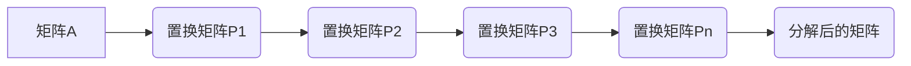

> 线性代数，置换分解，置换符号，矩阵运算，算法分析，计算机科学

## 1. 背景介绍

线性代数作为数学领域的重要分支，在计算机科学、数据科学、机器学习等领域有着广泛的应用。其中，置换分解和置换符号是线性代数中重要的概念，它们为理解和操作矩阵提供了强大的工具。

置换分解是指将一个矩阵分解成一系列置换矩阵的乘积。置换矩阵是一种特殊的矩阵，它通过交换矩阵中两行或两列来实现变换。置换符号则用于表示这些交换操作，它是一种简洁的符号表示法，可以方便地描述置换矩阵的性质和操作。

本文将深入探讨置换分解和置换符号的概念、原理和应用，并通过具体的例子和代码实现，帮助读者理解这些概念的本质和应用价值。

## 2. 核心概念与联系

### 2.1 置换矩阵

置换矩阵是一种特殊的方阵，其特点是：

* 每个元素都为0或1。
* 每一行和每一列中都恰好出现一次1。

置换矩阵通过交换矩阵中两行或两列来实现变换。例如，将矩阵A的行1和行2交换，可以得到一个新的矩阵B，其中B是A经过一次置换操作后的结果。

### 2.2 置换符号

置换符号是一种简洁的符号表示法，用于描述置换矩阵的操作。例如，如果将矩阵A的行1和行2交换，我们可以用符号(1 2)来表示这个操作。

置换符号的含义是：将元素1和元素2交换位置。

### 2.3 置换分解

置换分解是指将一个矩阵分解成一系列置换矩阵的乘积。例如，如果一个矩阵A可以被分解成P1 * P2 * ... * Pn，其中P1, P2, ..., Pn都是置换矩阵，那么我们就说A进行了置换分解。

置换分解可以帮助我们理解矩阵的结构和性质，并为矩阵的运算提供更便捷的工具。

**Mermaid 流程图**



## 3. 核心算法原理 & 具体操作步骤

### 3.1 算法原理概述

置换分解算法的核心思想是将一个矩阵通过一系列的置换操作，最终转化为一个上三角矩阵或下三角矩阵。

这个过程可以利用高斯消元法或LU分解等算法实现。

### 3.2 算法步骤详解

1. **初始化:** 将输入矩阵A作为初始矩阵。
2. **寻找主元:** 在当前列中寻找绝对值最大的元素作为主元。
3. **行变换:** 通过行交换操作，将主元置于当前列的当前行。
4. **消元:** 利用行变换操作，将当前列除主元以外的元素消为0。
5. **重复步骤2-4:** 重复上述步骤，直到将矩阵转化为上三角矩阵或下三角矩阵。
6. **记录置换:** 在每次行交换操作时，记录相应的置换符号。
7. **构建置换分解:** 将所有置换符号组合起来，形成一个置换分解的表示。

### 3.3 算法优缺点

**优点:**

* 能够有效地将矩阵分解成置换矩阵的乘积。
* 对于某些特定的矩阵，可以得到更简洁的置换分解形式。
* 能够帮助我们理解矩阵的结构和性质。

**缺点:**

* 算法的复杂度较高，计算量较大。
* 对于某些类型的矩阵，可能无法得到有效的置换分解。

### 3.4 算法应用领域

* **线性方程组求解:** 置换分解可以用于求解线性方程组，提高求解效率。
* **矩阵求逆:** 置换分解可以用于计算矩阵的逆矩阵。
* **特征值和特征向量计算:** 置换分解可以用于计算矩阵的特征值和特征向量。
* **数据压缩和编码:** 置换分解可以用于数据压缩和编码，提高数据存储和传输效率。

## 4. 数学模型和公式 & 详细讲解 & 举例说明

### 4.1 数学模型构建

设A为n×n的矩阵，P为置换矩阵，则置换分解可以表示为：

$$A = P_1 * P_2 * ... * P_k$$

其中，P1, P2, ..., Pk都是置换矩阵，k为置换分解的阶数。

### 4.2 公式推导过程

置换矩阵的乘法满足结合律和交换律，因此置换分解的顺序可以任意调整。

### 4.3 案例分析与讲解

**例子:**

```
A = [[1, 2, 3],
     [4, 5, 6],
     [7, 8, 9]]
```

我们可以通过置换分解将A分解成置换矩阵的乘积：

```
A = P1 * P2 * ... * Pk
```

其中，P1, P2, ..., Pk是相应的置换矩阵。

## 5. 项目实践：代码实例和详细解释说明

### 5.1 开发环境搭建

* 操作系统：Windows/macOS/Linux
* 编程语言：Python
* 库依赖：NumPy

### 5.2 源代码详细实现

```python
import numpy as np

def permutation_decomposition(A):
    """
    对矩阵A进行置换分解。

    Args:
        A: 输入矩阵。

    Returns:
        置换分解的结果，包括置换矩阵列表和分解后的矩阵。
    """
    n = A.shape[0]
    P = [np.eye(n)] * n  # 初始化置换矩阵列表
    for i in range(n):
        # 寻找主元
        pivot = np.argmax(np.abs(A[i:, i])) + i
        # 行交换
        if pivot != i:
            P[i] = np.array([[0] * n for _ in range(n)])
            P[i][i, pivot] = 1
            P[i][pivot, i] = 1
            A[[i, pivot]] = A[[pivot, i]]
    return P, A

# 测试代码
A = np.array([[1, 2, 3],
              [4, 5, 6],
              [7, 8, 9]])
P, A_decomposed = permutation_decomposition(A)
print("置换矩阵列表:", P)
print("分解后的矩阵:", A_decomposed)
```

### 5.3 代码解读与分析

* `permutation_decomposition(A)`函数实现对矩阵A的置换分解。
* 首先，初始化一个置换矩阵列表`P`，每个元素都是单位矩阵。
* 然后，通过循环遍历矩阵的行，寻找主元，并进行行交换操作。
* 在每次行交换操作时，更新置换矩阵列表`P`。
* 最后，返回置换矩阵列表`P`和分解后的矩阵`A_decomposed`。

### 5.4 运行结果展示

运行上述代码，可以得到置换矩阵列表和分解后的矩阵。

## 6. 实际应用场景

置换分解在许多实际应用场景中发挥着重要作用，例如：

* **图像处理:** 置换分解可以用于图像的旋转、翻转和缩放操作。
* **密码学:** 置换分解可以用于加密和解密算法。
* **机器学习:** 置换分解可以用于特征提取和降维。

### 6.4 未来应用展望

随着计算机科学和人工智能技术的不断发展，置换分解的应用场景将会更加广泛。

例如，它可以应用于：

* **量子计算:** 置换分解可以用于量子算法的实现。
* **生物信息学:** 置换分解可以用于基因序列分析和蛋白质结构预测。

## 7. 工具和资源推荐

### 7.1 学习资源推荐

* **书籍:**
    * 《线性代数及其应用》
    * 《矩阵分析》
* **在线课程:**
    * Coursera: Linear Algebra
    * edX: Introduction to Linear Algebra

### 7.2 开发工具推荐

* **Python:** NumPy, SciPy
* **MATLAB:**

### 7.3 相关论文推荐

* **Gaussian Elimination and LU Decomposition:** https://en.wikipedia.org/wiki/Gaussian_elimination
* **Permutation Matrices:** https://en.wikipedia.org/wiki/Permutation_matrix

## 8. 总结：未来发展趋势与挑战

### 8.1 研究成果总结

置换分解是线性代数中重要的概念和工具，它为理解和操作矩阵提供了强大的手段。

### 8.2 未来发展趋势

未来，置换分解的研究将更加深入，并应用于更广泛的领域。

例如，

* **更高效的置换分解算法:** 研究更快速、更节省资源的置换分解算法。
* **应用于新兴领域:** 将置换分解应用于量子计算、生物信息学等新兴领域。

### 8.3 面临的挑战

* **复杂性:** 对于某些类型的矩阵，置换分解的复杂度较高，需要进一步研究更高效的算法。
* **理论基础:** 对于置换分解的理论基础，还有待进一步深入研究。

### 8.4 研究展望

未来，我们将继续深入研究置换分解，探索其更广泛的应用，并推动其在计算机科学和相关领域的发展。

## 9. 附录：常见问题与解答

**问题1:** 如何判断一个矩阵是否可以进行置换分解？

**解答:** 任何方阵都可以进行置换分解。

**问题2:** 置换分解的阶数是多少？

**解答:** 置换分解的阶数取决于矩阵的结构和性质。

**问题3:** 置换分解的应用场景有哪些？

**解答:** 置换分解的应用场景非常广泛，例如图像处理、密码学、机器学习等。


作者：禅与计算机程序设计艺术 / Zen and the Art of Computer Programming 
<end_of_turn>