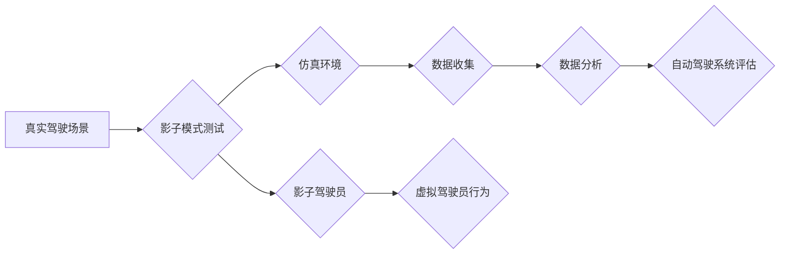

> 自动驾驶, 影子模式测试, 仿真环境, 数据驱动, 模型验证, 安全性, 可靠性

## 1. 背景介绍

自动驾驶技术作为未来交通运输的重要发展方向，其安全性、可靠性和性能一直是研究者和产业界关注的焦点。为了确保自动驾驶系统的安全性和可靠性，需要进行严格的测试和验证。传统的测试方法主要依赖于物理环境下的道路测试，但这种方法存在成本高、时间长、安全性低等问题。

影子模式测试作为一种新型的测试方法，通过在仿真环境中模拟真实驾驶场景，对自动驾驶系统进行测试和验证，具有成本低、时间短、安全性高等优点。影子模式测试的核心思想是，在真实驾驶场景中，将自动驾驶系统与一个虚拟的“影子驾驶员”进行交互，虚拟驾驶员根据预设的规则和策略，模拟真实驾驶员的行为，与自动驾驶系统进行交互，从而评估自动驾驶系统的性能和安全性。

## 2. 核心概念与联系

### 2.1 影子模式测试

影子模式测试是一种基于仿真环境的测试方法，通过模拟真实驾驶场景，对自动驾驶系统进行测试和验证。

### 2.2 仿真环境

仿真环境是指模拟真实驾驶场景的虚拟环境，包括道路、交通标志、车辆、行人等各种元素。

### 2.3 影子驾驶员

影子驾驶员是指一个虚拟的驾驶员，根据预设的规则和策略，模拟真实驾驶员的行为，与自动驾驶系统进行交互。

### 2.4 数据驱动

影子模式测试的数据驱动是指，测试过程中的数据收集和分析，用于评估自动驾驶系统的性能和安全性。

**Mermaid 流程图**



## 3. 核心算法原理 & 具体操作步骤

### 3.1 算法原理概述

影子模式测试的核心算法原理是基于模型预测控制（MPC）和强化学习（RL）的结合。MPC算法用于预测车辆在未来一段时间内的运动轨迹，并根据预设的目标和约束条件，规划最优的控制策略。RL算法则用于训练影子驾驶员，使其能够根据环境变化和自动驾驶系统的行为，做出最优的驾驶决策。

### 3.2 算法步骤详解

1. **环境建模:** 建立仿真环境，包括道路、交通标志、车辆、行人等各种元素。
2. **数据采集:** 在真实驾驶场景中采集大量驾驶数据，包括车辆状态、传感器数据、驾驶员行为等。
3. **模型训练:** 利用采集到的数据，训练MPC和RL模型。MPC模型用于预测车辆运动轨迹，RL模型用于训练影子驾驶员。
4. **仿真测试:** 在仿真环境中，将自动驾驶系统与训练好的影子驾驶员进行交互，模拟真实驾驶场景。
5. **数据分析:** 收集仿真测试过程中产生的数据，分析自动驾驶系统的性能和安全性。
6. **模型优化:** 根据测试结果，对MPC和RL模型进行优化，提高测试的准确性和有效性。

### 3.3 算法优缺点

**优点:**

* 成本低: 相比于物理环境下的道路测试，影子模式测试的成本更低。
* 时间短: 影子模式测试的时间更短，可以更快地完成测试和验证。
* 安全性高: 影子模式测试在虚拟环境中进行，安全性更高，不会对人员和财产造成损害。

**缺点:**

* 仿真环境的真实性: 仿真环境无法完全模拟真实驾驶场景，存在一定的局限性。
* 数据质量: 影子模式测试的数据质量直接影响测试结果的准确性，需要保证数据的真实性和完整性。

### 3.4 算法应用领域

影子模式测试在自动驾驶领域有着广泛的应用，例如:

* 自动驾驶系统的功能测试
* 自动驾驶系统的性能评估
* 自动驾驶系统的安全性验证
* 自动驾驶系统的算法优化

## 4. 数学模型和公式 & 详细讲解 & 举例说明

### 4.1 数学模型构建

**车辆运动模型:**

车辆运动模型描述了车辆在道路上的运动状态，通常采用非线性动力学模型，例如卡尔曼滤波器。

**状态方程:**

$$
x_{k+1} = f(x_k, u_k, w_k)
$$

其中:

* $x_k$ 是车辆状态向量，包括位置、速度、加速度等。
* $u_k$ 是控制输入，例如油门、刹车等。
* $w_k$ 是过程噪声。

**观测方程:**

$$
y_k = h(x_k, v_k)
$$

其中:

* $y_k$ 是传感器测量值，例如激光雷达、摄像头等。
* $v_k$ 是观测噪声。

**影子驾驶员模型:**

影子驾驶员模型可以采用强化学习算法，例如Q学习或深度强化学习，训练影子驾驶员做出最优的驾驶决策。

### 4.2 公式推导过程

**MPC算法:**

MPC算法的目标是找到一个控制序列，使得车辆在未来一段时间内的运动轨迹满足预设的目标和约束条件。

**优化问题:**

$$
\min_{u_0, u_1, ..., u_{N-1}} \sum_{k=0}^{N-1} L(x_k, u_k)
$$

其中:

* $L(x_k, u_k)$ 是代价函数，衡量车辆运动轨迹的优劣。

**约束条件:**

* 状态约束: $x_k$ 满足预设的范围。
* 控制约束: $u_k$ 满足预设的范围。

**RL算法:**

RL算法的目标是训练影子驾驶员，使其能够根据环境变化和自动驾驶系统的行为，做出最优的驾驶决策。

**奖励函数:**

$$
R(s, a)
$$

其中:

* $s$ 是环境状态。
* $a$ 是驾驶员采取的行动。

**价值函数:**

$$
V(s) = \max_{\pi} \mathbb{E}_{\pi}[R(s, a)]
$$

其中:

* $\pi$ 是驾驶员的行为策略。

### 4.3 案例分析与讲解

**案例:**

假设自动驾驶系统需要在十字路口进行转向。

**分析:**

* MPC算法可以预测车辆在未来一段时间内的运动轨迹，并规划最优的转向角度和速度。
* RL算法可以训练影子驾驶员，使其能够根据十字路口的交通状况和自动驾驶系统的行为，做出最优的转向决策。

**讲解:**

* MPC算法可以确保车辆在转向过程中安全地到达目标位置。
* RL算法可以使影子驾驶员更加灵活地应对不同的交通状况。

## 5. 项目实践：代码实例和详细解释说明

### 5.1 开发环境搭建

* 操作系统: Ubuntu 20.04
* 编程语言: Python 3.8
* 仿真环境: CARLA

### 5.2 源代码详细实现

```python
# 导入必要的库
import carla
import time

# 连接到CARLA仿真环境
client = carla.Client('localhost', 2000)
world = client.load_world('Town01')

# 创建车辆
blueprint = world.get_blueprint_library().filter('vehicle.audi.tt')[0]
transform = carla.Transform(carla.Location(x=100, y=0, z=0), carla.Rotation(0, 0, 0))
vehicle = world.spawn_actor(
    blueprint, transform,
    carla.ActorType.Vehicle
)

# 设置车辆控制策略
def control(vehicle):
    # 获取车辆状态
    speed = vehicle.get_velocity().length()
    # 根据速度控制车辆
    if speed < 10:
        throttle = 1.0
        brake = 0.0
    else:
        throttle = 0.0
        brake = 1.0
    return carla.VehicleControl(throttle=throttle, brake=brake)

# 启动车辆控制循环
while True:
    # 获取车辆状态
    vehicle_state = vehicle.get_state()
    # 控制车辆
    vehicle_control = control(vehicle)
    # 设置车辆控制
    vehicle.apply_control(vehicle_control)
    # 等待一段时间
    time.sleep(0.1)
```

### 5.3 代码解读与分析

* 代码首先连接到CARLA仿真环境，并创建车辆。
* 然后，代码定义了一个控制函数，根据车辆的速度控制车辆的油门和刹车。
* 最后，代码启动了一个控制循环，不断获取车辆状态，控制车辆，并等待一段时间。

### 5.4 运行结果展示

运行代码后，车辆将在CARLA仿真环境中行驶，并根据控制函数的逻辑控制速度。

## 6. 实际应用场景

影子模式测试在自动驾驶领域有着广泛的应用场景，例如:

### 6.1 功能测试

* 测试自动驾驶系统的各种功能，例如自动泊车、自动变道、自动巡航等。
* 验证自动驾驶系统在不同驾驶场景下的功能正确性。

### 6.2 性能评估

* 评估自动驾驶系统的性能指标，例如行驶速度、路径规划、避障能力等。
* 比较不同自动驾驶系统的性能差异。

### 6.3 安全性验证

* 验证自动驾驶系统在紧急情况下的安全性，例如紧急刹车、碰撞避免等。
* 评估自动驾驶系统的安全性能和可靠性。

### 6.4 未来应用展望

* 与增强现实（AR）和虚拟现实（VR）技术结合，为自动驾驶工程师提供更直观、更沉浸式的测试体验。
* 利用人工智能（AI）技术，自动生成测试用例，提高测试效率和覆盖率。
* 将影子模式测试与物理环境下的道路测试相结合，形成更加完善的测试体系。

## 7. 工具和资源推荐

### 7.1 学习资源推荐

* **书籍:**
    * 《自动驾驶汽车》
    * 《机器人操作系统》
* **在线课程:**
    * Coursera: 自动驾驶汽车
    * Udacity: 自动驾驶工程师

### 7.2 开发工具推荐

* **仿真环境:**
    * CARLA
    * Gazebo
* **编程语言:**
    * Python
    * C++

### 7.3 相关论文推荐

* **自动驾驶论文:**
    * 《End-to-End Learning for Self-Driving Cars》
    * 《Deep Reinforcement Learning for Autonomous Driving》
* **影子模式测试论文:**
    * 《Shadow Driving: A Novel Approach for Autonomous Vehicle Testing》
    * 《Simulation-Based Testing for Autonomous Driving Systems》

## 8. 总结：未来发展趋势与挑战

### 8.1 研究成果总结

影子模式测试作为一种新型的测试方法，在自动驾驶领域取得了显著的成果，为自动驾驶系统的开发和验证提供了新的思路和方法。

### 8.2 未来发展趋势

* **仿真环境的真实性:** 未来，仿真环境将更加逼真，能够更好地模拟真实驾驶场景。
* **人工智能技术的应用:** 人工智能技术将被更加广泛地应用于影子模式测试，例如自动生成测试用例、自动分析测试结果等。
* **多模态数据融合:** 多模态数据融合将成为未来影子模式测试的重要趋势，例如将激光雷达、摄像头、传感器等数据融合在一起，提高测试的准确性和有效性。

### 8.3 面临的挑战

* **仿真环境的建模:** 建立一个完全真实、可信的仿真环境仍然是一个挑战。
* **数据质量:** 影子模式测试的数据质量直接影响测试结果的准确性，需要保证数据的真实性和完整性。
* **算法的复杂性:** 影子模式测试的算法比较复杂，需要不断进行优化和改进。

### 8.4 研究展望

未来，影子模式测试将继续朝着更加真实