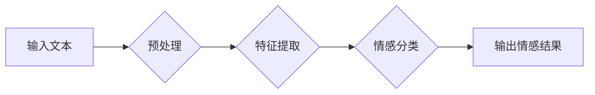

> 自然语言处理，情感分析，机器学习，深度学习，文本分类，情绪识别，情感分类

## 1. 背景介绍

随着互联网和移动技术的飞速发展，海量文本数据如潮水般涌现。这些文本数据蕴含着人们的情感、态度和意图，对企业、政府和个人都具有重要的价值。情感分析（Sentiment Analysis）作为自然语言处理（NLP）的重要分支，旨在从文本数据中识别和理解人们的情感倾向，从而为决策提供数据支持。

情感分析在各个领域都有着广泛的应用，例如：

* **市场营销:** 分析客户对产品和服务的评价，了解市场趋势，改进营销策略。
* **品牌管理:** 监控品牌形象，及时发现负面舆情，进行危机公关。
* **社会科学研究:** 分析公众对社会事件的看法，了解社会情绪和趋势。
* **医疗保健:** 分析患者的病历和反馈，了解患者的情绪状态，提供个性化医疗服务。

## 2. 核心概念与联系

情感分析的核心是识别文本中的情感倾向，将其分类为正向、负向或中性。

**情感分析流程:**



**核心概念:**

* **文本预处理:** 对输入文本进行清洗、格式化和转换，例如去除停用词、标点符号、HTML标签等，将文本转换为适合模型处理的形式。
* **特征提取:** 从预处理后的文本中提取情感相关的特征，例如词语、短语、语法结构、情感词典等。
* **情感分类:** 利用机器学习或深度学习模型，对提取的特征进行分类，识别文本的情感倾向。

## 3. 核心算法原理 & 具体操作步骤

### 3.1  算法原理概述

情感分析算法主要分为两类：

* **基于规则的算法:** 基于人工定义的规则和情感词典，对文本进行情感分析。
* **基于机器学习的算法:** 利用机器学习算法，从训练数据中学习情感分类模型。

常见的机器学习算法包括：

* **朴素贝叶斯算法:** 基于贝叶斯定理，计算文本属于不同情感类别的概率。
* **支持向量机算法:** 通过寻找最佳的分隔超平面，将文本分类到不同的情感类别。
* **决策树算法:** 通过构建决策树模型，对文本进行情感分类。
* **随机森林算法:** 通过构建多个决策树模型，并进行投票，提高分类准确率。
* **深度学习算法:** 利用深度神经网络，例如循环神经网络（RNN）和卷积神经网络（CNN），对文本进行情感分析。

### 3.2  算法步骤详解

以朴素贝叶斯算法为例，详细说明情感分析的具体操作步骤：

1. **数据收集和预处理:** 收集包含情感标签的文本数据，并进行预处理，例如去除停用词、标点符号等。
2. **特征提取:** 从预处理后的文本中提取情感相关的特征，例如词语、短语、情感词典等。
3. **训练模型:** 利用训练数据，训练朴素贝叶斯模型，计算每个情感类别的概率分布。
4. **预测情感:** 将新文本输入模型，根据模型计算出的概率分布，预测文本的情感类别。

### 3.3  算法优缺点

**朴素贝叶斯算法:**

* **优点:** 算法简单易懂，训练速度快，对小规模数据集效果较好。
* **缺点:** 对于复杂文本数据，假设词语独立性不成立，分类效果可能较差。

**支持向量机算法:**

* **优点:** 对高维数据具有较好的泛化能力，分类效果较好。
* **缺点:** 训练时间较长，参数选择较复杂。

**决策树算法:**

* **优点:** 算法易于理解和解释，可视化效果好。
* **缺点:** 容易过拟合，分类效果可能较差。

**随机森林算法:**

* **优点:** 能够有效避免过拟合，分类效果较好。
* **缺点:** 训练时间较长，模型解释性较差。

**深度学习算法:**

* **优点:** 能够学习到更复杂的文本特征，分类效果最好。
* **缺点:** 训练时间较长，对数据量要求较高，模型解释性较差。

### 3.4  算法应用领域

不同的情感分析算法适用于不同的应用场景。例如，对于需要快速处理大量文本数据的应用，可以选择朴素贝叶斯算法；对于需要高准确率的应用，可以选择深度学习算法。

## 4. 数学模型和公式 & 详细讲解 & 举例说明

### 4.1  数学模型构建

朴素贝叶斯算法的核心是基于贝叶斯定理，计算文本属于不同情感类别的概率。

**贝叶斯定理:**

$$P(A|B) = \frac{P(B|A)P(A)}{P(B)}$$

其中：

* $P(A|B)$ 是事件 A 在事件 B 发生的条件概率。
* $P(B|A)$ 是事件 B 在事件 A 发生的条件概率。
* $P(A)$ 是事件 A 的概率。
* $P(B)$ 是事件 B 的概率。

**情感分析模型:**

假设我们有情感类别 C，文本特征集合 D，则根据贝叶斯定理，文本属于情感类别 C 的概率可以表示为：

$$P(C|D) = \frac{P(D|C)P(C)}{P(D)}$$

其中：

* $P(C|D)$ 是文本属于情感类别 C 的概率。
* $P(D|C)$ 是给定情感类别 C，文本特征集合 D 的概率。
* $P(C)$ 是情感类别 C 的概率。
* $P(D)$ 是文本特征集合 D 的概率。

### 4.2  公式推导过程

在朴素贝叶斯算法中，假设文本特征之间相互独立，则：

$$P(D|C) = \prod_{i=1}^{n} P(d_i|C)$$

其中：

* $d_i$ 是文本特征集合 D 中的第 i 个特征。

### 4.3  案例分析与讲解

例如，我们想要判断一段文本是否属于正向情感类别。我们可以根据训练数据计算出：

* $P(正向)$: 正向情感类别的概率。
* $P(d_i|正向)$: 给定正向情感类别，特征 $d_i$ 出现的概率。

然后，将这些概率值代入贝叶斯公式，计算出文本属于正向情感类别的概率。

## 5. 项目实践：代码实例和详细解释说明

### 5.1  开发环境搭建

* Python 3.x
* NLTK 自然语言处理库
* Scikit-learn 机器学习库
* TensorFlow 或 PyTorch 深度学习库

### 5.2  源代码详细实现

```python
import nltk
from nltk.corpus import stopwords
from sklearn.feature_extraction.text import TfidfVectorizer
from sklearn.naive_bayes import MultinomialNB
from sklearn.model_selection import train_test_split

# 数据加载
data = [
    ("This movie is amazing!", "positive"),
    ("I hate this product.", "negative"),
    ("The food was okay.", "neutral"),
    # ...
]

# 数据预处理
stop_words = set(stopwords.words('english'))
def preprocess_text(text):
    text = text.lower()
    text = [word for word in text.split() if word not in stop_words]
    return " ".join(text)

processed_data = [(preprocess_text(text), label) for text, label in data]

# 特征提取
vectorizer = TfidfVectorizer()
X = vectorizer.fit_transform([text for text, label in processed_data])
y = [label for text, label in processed_data]

# 模型训练
X_train, X_test, y_train, y_test = train_test_split(X, y, test_size=0.2)
model = MultinomialNB()
model.fit(X_train, y_train)

# 模型预测
predictions = model.predict(X_test)

# 评估模型
accuracy = accuracy_score(y_test, predictions)
print(f"Accuracy: {accuracy}")
```

### 5.3  代码解读与分析

* 数据加载和预处理：加载情感分析数据集，并对文本进行预处理，例如转换为小写，去除停用词等。
* 特征提取：使用 TF-IDF 向量化技术，将文本转换为数字特征向量。
* 模型训练：使用朴素贝叶斯算法训练情感分类模型。
* 模型预测：将新文本输入模型，预测其情感类别。
* 模型评估：使用准确率等指标评估模型性能。

### 5.4  运行结果展示

运行代码后，会输出模型的准确率，以及预测结果。

## 6. 实际应用场景

### 6.1  社交媒体监控

分析社交媒体平台上的用户评论，了解用户对品牌、产品或事件的看法，及时发现负面舆情，进行危机公关。

### 6.2  客户服务

自动分析客户的反馈意见，识别客户的情绪状态，提供更精准的客户服务。

### 6.3  市场调研

分析市场上对产品的评价和反馈，了解消费者对产品的需求和偏好，为产品开发和营销策略提供数据支持。

### 6.4  未来应用展望

随着人工智能技术的不断发展，情感分析将在更多领域得到应用，例如：

* **个性化推荐:** 根据用户的喜好和情绪，提供个性化的产品和服务推荐。
* **医疗诊断:** 分析患者的病历和反馈，辅助医生进行诊断和治疗。
* **教育评估:** 分析学生的学习情绪和反馈，帮助老师了解学生的学习情况，提供个性化的教学方案。

## 7. 工具和资源推荐

### 7.1  学习资源推荐

* **书籍:**
    * "Natural Language Processing with Python" by Steven Bird, Ewan Klein, and Edward Loper
    * "Speech and Language Processing" by Daniel Jurafsky and James H. Martin
* **在线课程:**
    * Coursera: Natural Language Processing Specialization
    * edX: Artificial Intelligence

### 7.2  开发工具推荐

* **NLTK:** Python 自然语言处理库
* **spaCy:** 高性能 Python 自然语言处理库
* **Gensim:** 用于主题建模和词嵌入的 Python 库

### 7.3  相关论文推荐

* "Sentiment Classification of Movie Reviews Using Machine Learning Techniques"
* "A Survey of Sentiment Analysis Techniques"
* "Deep Learning for Sentiment Analysis"

## 8. 总结：未来发展趋势与挑战

### 8.1  研究成果总结

近年来，情感分析领域取得了显著进展，特别是深度学习技术的应用，使得情感分析的准确率大幅提升。

### 8.2  未来发展趋势

* **多模态情感分析:** 将文本、图像、音频等多模态数据融合，进行更全面的情感分析。
* **跨语言情感分析:** 将情感分析技术应用于不同语言的文本数据。
* **微表情识别:** 分析微表情，识别更细微的情感变化。

### 8.3  面临的挑战

* **数据标注:** 高质量的情感标注数据是情感分析模型训练的基础，但数据标注成本高，效率低。
* **情感细粒度分析:** 现有的情感分析模型主要关注情感类别，难以识别更细粒度的情感表达。
* **对抗样本攻击:** 攻击者可以构造对抗样本，欺骗情感分析模型，导致模型误判。

### 8.4  研究展望

未来，情感分析领域将继续朝着更智能、更精准、更普适的方向发展。

## 9. 附录：常见问题与解答

* **什么是情感分析？**

情感分析是指从文本数据中识别和理解人们的情感