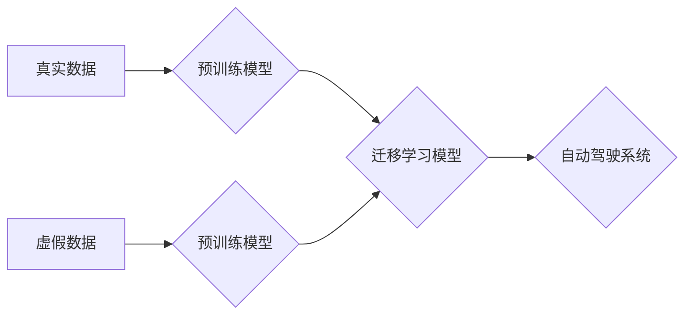

> 自动驾驶, 迁移学习, 虚实数据, 数据高效利用, 深度学习, 强化学习

## 1. 背景介绍

自动驾驶技术作为未来交通运输的重要发展方向，其核心是构建能够感知环境、理解道路规则并做出安全决策的智能驾驶系统。然而，自动驾驶系统的训练需要海量真实驾驶数据，而获取这些数据成本高昂且耗时长。因此，如何高效利用有限的真实数据，并加速自动驾驶系统的训练成为一个亟待解决的关键问题。

迁移学习作为一种机器学习范式，能够有效解决数据稀缺问题。它通过将已训练好的模型参数迁移到新的任务中，利用已有知识加速新任务的学习。近年来，迁移学习在自动驾驶领域取得了显著进展，例如，将模型参数从模拟环境迁移到真实环境，或将模型参数从特定场景迁移到其他场景。

然而，模拟环境生成的虚假数据与真实环境存在一定的差异，直接迁移模型参数可能导致性能下降。因此，如何有效利用虚实数据，并构建更 robust 的迁移学习模型，成为新的研究热点。

## 2. 核心概念与联系

**2.1 虚实数据**

虚实数据是指由模拟环境生成的虚拟数据和真实环境采集的真实数据。模拟环境可以模拟各种驾驶场景，生成大量多样化的驾驶数据，而真实数据则更贴近实际驾驶环境，包含更多噪声和不确定性。

**2.2 迁移学习**

迁移学习是一种机器学习范式，它利用已训练好的模型参数，迁移到新的任务中，加速新任务的学习。迁移学习可以分为以下几种类型：

* **知识迁移:** 将模型的知识结构或特征表示迁移到新的任务中。
* **参数迁移:** 将模型的参数直接迁移到新的任务中。
* **领域适应:** 将模型从一个领域迁移到另一个领域。

**2.3 虚实迁移学习**

虚实迁移学习是指利用模拟环境生成的虚假数据和真实环境采集的真实数据，构建更 robust 的迁移学习模型。

**2.4 架构图**



## 3. 核心算法原理 & 具体操作步骤

### 3.1  算法原理概述

虚实迁移学习的核心思想是利用模拟环境生成的虚假数据，预训练一个基础模型，然后将该模型迁移到真实环境，并结合真实数据进行微调，最终构建一个更 robust 的自动驾驶模型。

### 3.2  算法步骤详解

1. **数据收集:** 收集真实驾驶数据和模拟环境生成的虚假数据。
2. **预训练模型:** 利用虚假数据预训练一个基础模型，例如，使用深度神经网络进行图像识别、语义分割等任务。
3. **迁移学习:** 将预训练模型的参数迁移到新的任务中，例如，将图像识别模型迁移到自动驾驶场景，用于感知周围环境。
4. **微调:** 利用真实数据对迁移后的模型进行微调，以适应真实环境的差异。
5. **评估:** 对微调后的模型进行评估，并根据评估结果进行模型优化。

### 3.3  算法优缺点

**优点:**

* **数据高效:** 利用虚假数据预训练模型，可以有效减少对真实数据的依赖。
* **性能提升:** 迁移学习可以加速模型训练，并提高模型性能。
* **泛化能力强:** 预训练模型可以学习到更通用的特征表示，从而提高模型在不同场景下的泛化能力。

**缺点:**

* **虚假数据与真实数据差异:** 模拟环境生成的虚假数据与真实环境存在一定的差异，可能导致模型性能下降。
* **迁移学习效果依赖于预训练模型:** 预训练模型的质量直接影响迁移学习的效果。

### 3.4  算法应用领域

虚实迁移学习在自动驾驶领域具有广泛的应用前景，例如:

* **感知模块:** 利用虚实迁移学习，提高自动驾驶系统的感知能力，例如，识别道路标志、车辆、行人等。
* **决策模块:** 利用虚实迁移学习，提高自动驾驶系统的决策能力，例如，规划路径、控制车辆行驶等。
* **安全保障:** 利用虚实迁移学习，提高自动驾驶系统的安全保障能力，例如，预测潜在危险、避免碰撞等。

## 4. 数学模型和公式 & 详细讲解 & 举例说明

### 4.1  数学模型构建

虚实迁移学习的数学模型可以表示为一个多任务学习框架，其中包含两个子任务：

* **虚假数据预训练任务:** 利用虚假数据训练一个基础模型，其目标函数为：

$$
L_{pretrain} = \sum_{i=1}^{N} L_{i}(f(x_i), y_i)
$$

其中，$N$ 为虚假数据的数量，$x_i$ 为第 $i$ 个虚假数据样本，$y_i$ 为第 $i$ 个虚假数据样本的真实标签，$f(x_i)$ 为模型对第 $i$ 个虚假数据样本的预测结果，$L_i$ 为第 $i$ 个样本的损失函数。

* **真实数据迁移学习任务:** 利用预训练模型和真实数据进行微调，其目标函数为：

$$
L_{transfer} = \sum_{j=1}^{M} L_{j}(g(x_j), y_j)
$$

其中，$M$ 为真实数据的数量，$x_j$ 为第 $j$ 个真实数据样本，$y_j$ 为第 $j$ 个真实数据样本的真实标签，$g(x_j)$ 为迁移后的模型对第 $j$ 个真实数据样本的预测结果，$L_j$ 为第 $j$ 个样本的损失函数。

### 4.2  公式推导过程

虚实迁移学习的数学模型可以看作是一个多任务学习框架，其中两个子任务共享一部分参数。

预训练任务的目标是学习到通用的特征表示，而迁移学习任务的目标是将这些特征表示应用到新的任务中。

通过共享参数，可以实现知识迁移，提高模型的泛化能力。

### 4.3  案例分析与讲解

例如，在自动驾驶场景中，可以使用虚实迁移学习来训练一个车辆识别模型。

首先，利用虚假数据预训练一个图像识别模型，例如，使用卷积神经网络进行车辆识别。然后，将预训练模型迁移到真实环境，并结合真实数据进行微调。

通过虚实迁移学习，可以有效减少对真实数据的依赖，并提高模型的性能。

## 5. 项目实践：代码实例和详细解释说明

### 5.1  开发环境搭建

* 操作系统: Ubuntu 20.04
* Python 版本: 3.8
* 深度学习框架: PyTorch 1.7

### 5.2  源代码详细实现

```python
# 导入必要的库
import torch
import torch.nn as nn
import torchvision.transforms as transforms

# 定义预训练模型
class PretrainModel(nn.Module):
    def __init__(self):
        super(PretrainModel, self).__init__()
        # 定义模型结构
        # ...

    def forward(self, x):
        # 定义模型前向传播过程
        # ...

# 定义迁移学习模型
class TransferModel(nn.Module):
    def __init__(self):
        super(TransferModel, self).__init__()
        # 定义模型结构
        # ...

    def forward(self, x):
        # 定义模型前向传播过程
        # ...

# 加载预训练模型
pretrain_model = PretrainModel()
pretrain_model.load_state_dict(torch.load('pretrain_model.pth'))

# 实例化迁移学习模型
transfer_model = TransferModel()

# 将预训练模型的参数迁移到迁移学习模型中
transfer_model.load_state_dict(pretrain_model.state_dict())

# 训练迁移学习模型
# ...

# 保存迁移学习模型
torch.save(transfer_model.state_dict(), 'transfer_model.pth')
```

### 5.3  代码解读与分析

* **预训练模型:** 定义一个用于预训练的模型，例如，使用卷积神经网络进行图像识别。
* **迁移学习模型:** 定义一个用于迁移学习的模型，例如，将预训练模型的特征提取部分用于车辆识别任务。
* **加载预训练模型:** 加载预训练模型的权重参数。
* **迁移模型参数:** 将预训练模型的参数迁移到迁移学习模型中。
* **训练迁移学习模型:** 利用真实数据对迁移学习模型进行微调。
* **保存迁移学习模型:** 保存微调后的模型权重参数。

### 5.4  运行结果展示

通过训练和评估迁移学习模型，可以观察到模型在真实数据上的性能提升。

## 6. 实际应用场景

虚实迁移学习在自动驾驶领域具有广泛的应用场景，例如:

* **自动驾驶数据标注:** 利用虚假数据生成大量标注数据，降低人工标注成本。
* **自动驾驶场景模拟:** 利用虚假数据构建模拟环境，进行自动驾驶系统的测试和验证。
* **自动驾驶算法优化:** 利用虚实迁移学习，优化自动驾驶算法，提高模型性能。

### 6.4  未来应用展望

随着模拟环境技术的不断发展，虚实迁移学习在自动驾驶领域将发挥越来越重要的作用。

未来，虚实迁移学习将应用于更广泛的自动驾驶场景，例如:

* **复杂路况驾驶:** 利用虚假数据训练模型，应对复杂路况，例如，拥堵路段、恶劣天气等。
* **无人驾驶出租车:** 利用虚实迁移学习，提高无人驾驶出租车的安全性、可靠性和效率。
* **自动驾驶物流:** 利用虚实迁移学习，提高自动驾驶物流的效率和安全性。

## 7. 工具和资源推荐

### 7.1  学习资源推荐

* **书籍:**
    * 深度学习
    * 迁移学习
* **在线课程:**
    * Coursera: 深度学习
    * Udacity: 自动驾驶

### 7.2  开发工具推荐

* **模拟环境:**
    * CARLA
    * Gazebo
* **深度学习框架:**
    * PyTorch
    * TensorFlow

### 7.3  相关论文推荐

* **迁移学习在自动驾驶中的应用:**
    * [论文标题](论文链接)
    * [论文标题](论文链接)

## 8. 总结：未来发展趋势与挑战

### 8.1  研究成果总结

虚实迁移学习在自动驾驶领域取得了显著进展，有效解决了数据稀缺问题，提高了模型性能。

### 8.2  未来发展趋势

未来，虚实迁移学习将朝着以下方向发展:

* **更逼真的模拟环境:** 开发更逼真的模拟环境，更准确地模拟真实驾驶场景。
* **更有效的迁移学习算法:** 研究更有效的迁移学习算法，提高模型的泛化能力。
* **多模态数据融合:** 将图像、激光雷达、传感器等多模态数据融合，构建更全面的自动驾驶模型。

### 8.3  面临的挑战

虚实迁移学习还面临一些挑战:

* **虚假数据与真实数据差异:** 模拟环境生成的虚假数据与真实环境存在一定的差异，需要进一步研究如何缩小这种差异。
* **模型安全性和可靠性:** 自动驾驶系统需要具备高安全性、可靠性，需要进一步研究如何保证虚实迁移学习模型的安全性和可靠性。

### 8.4  研究展望

虚实迁移学习是自动驾驶领域的重要研究方向，未来将继续吸引大量的研究者投入。

## 9. 附录：常见问题与解答

* **Q1: 虚实迁移学习与传统迁移学习有什么区别?**

* **A1:** 虚实迁移学习利用模拟环境生成的虚假数据进行预训练，而传统迁移学习则利用其他任务的预训练模型进行迁移。

* **Q2: 如何评估虚