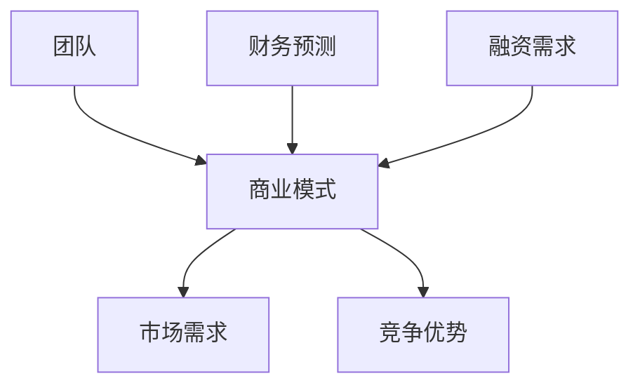

                 

**人工智能创业：制定融资计划**

**作者：禅与计算机程序设计艺术 / Zen and the Art of Computer Programming**

## 1. 背景介绍

在当今快速发展的科技世界中，人工智能（AI）已然成为各行各业的关键驱动因素。然而，将AI创意转化为成功的商业模式需要资金、战略和执行力。本文将指导AI创业者制定有效的融资计划，以实现其商业目标。

## 2. 核心概念与联系

### 2.1 融资计划的关键要素

融资计划是一项复杂的任务，需要平衡多个关键要素。以下是构建成功融资计划的关键要素：

- **商业模式**：清晰的商业模式是吸引投资者的关键。
- **市场需求**：明确的市场需求和目标客户。
- **竞争优势**：独特的竞争优势和差异化定位。
- **团队**：有能力的团队，包括管理、技术和销售人员。
- **财务预测**：准确的财务预测，包括收入、成本和利润。
- **融资需求**：明确的融资需求，包括金额、用途和期望的回报。

### 2.2 融资计划的关键要素关系图



## 3. 核心算法原理 & 具体操作步骤

### 3.1 融资计划算法原理概述

构建融资计划的过程可以视为一个算法，其目的是最大化吸引投资者的可能性。该算法的输入是创业者的商业计划，输出是一份详细的融资计划。

### 3.2 融资计划算法步骤详解

1. **定义商业模式**：清晰定义你的业务，包括产品或服务、目标客户和盈利模式。
2. **识别市场需求**：确定你的产品或服务满足哪些市场需求，并识别你的目标客户。
3. **确定竞争优势**：识别你的竞争对手，并确定你的产品或服务的独特优势。
4. **组建团队**：组建一支有能力的团队，包括管理、技术和销售人员。
5. **进行财务预测**：使用历史数据和市场调查进行准确的财务预测。
6. **确定融资需求**：明确你需要多少资金，资金将用于何处，以及你期望的回报。

### 3.3 融资计划算法优缺点

**优点**：该算法有助于创业者系统化地构建融资计划，提高吸引投资者的可能性。

**缺点**：该算法无法保证成功筹集资金，因为投资决策受多种因素影响，包括市场条件和投资者的个人偏好。

### 3.4 融资计划算法应用领域

该算法适用于所有寻求外部资金的AI创业公司，无论其大小或所处行业。

## 4. 数学模型和公式 & 详细讲解 & 举例说明

### 4.1 财务预测模型构建

财务预测是融资计划的关键组成部分。常用的财务预测模型包括：

- **线性回归**：用于预测销售额或其他财务指标的线性关系。
- **指数平滑**：用于预测短期趋势的指数加权移动平均线。

### 4.2 公式推导过程

假设我们使用线性回归模型预测销售额。线性回归模型的公式为：

$$y = a + bx + \epsilon$$

其中，$y$是销售额，$x$是时间，$a$和$b$是模型参数，$\epsilon$是误差项。参数$a$和$b$可以使用最小平方法求解。

### 4.3 案例分析与讲解

假设一家AI创业公司的销售额数据如下：

| 时间（月） | 销售额（万美元） |
| --- | --- |
| 1 | 50 |
| 2 | 60 |
| 3 | 70 |
| 4 | 80 |
| 5 | 90 |

使用线性回归模型预测第6个月的销售额，我们得到：

$$y = 30 + 10x$$

当$x=6$时，$y=90$万美元。这意味着第6个月的预期销售额为90万美元。

## 5. 项目实践：代码实例和详细解释说明

### 5.1 开发环境搭建

为构建融资计划，您需要一个简单的文本编辑器，如Visual Studio Code或Atom，以及一个电子表格软件，如Microsoft Excel或Google Sheets。

### 5.2 源代码详细实现

以下是使用Python和Pandas库进行线性回归预测的示例代码：

```python
import pandas as pd
from sklearn.linear_model import LinearRegression

# 数据
data = {
    'Time': [1, 2, 3, 4, 5],
    'Sales': [50, 60, 70, 80, 90]
}
df = pd.DataFrame(data)

# 线性回归模型
model = LinearRegression()
model.fit(df[['Time']], df['Sales'])

# 预测第6个月的销售额
sales_pred = model.predict([[6]])
print(f'Predicted sales for month 6: ${sales_pred[0]:.2f} million')
```

### 5.3 代码解读与分析

该代码使用Pandas库读取数据，然后使用Scikit-learn库的线性回归模型进行预测。预测结果以万美元为单位打印出来。

### 5.4 运行结果展示

运行上述代码，您将看到预测的第6个月销售额为90万美元。

## 6. 实际应用场景

### 6.1 成功案例

AI创业公司如DeepMind和NVIDIA成功筹集资金，并成长为AI行业的领导者。成功的关键因素包括清晰的商业模式、明确的市场需求和强大的团队。

### 6.2 未来应用展望

随着AI技术的不断发展，新的AI创业机会将不断涌现。成功筹集资金的关键将是创业者的能力，即能否清晰地定义商业模式，并证明其市场需求和竞争优势。

## 7. 工具和资源推荐

### 7.1 学习资源推荐

- **书籍**："Venture Capital and the Finance of Innovation" by Andrew Metrick
- **在线课程**：Coursera上的"Venture Capital"课程

### 7.2 开发工具推荐

- **文本编辑器**：Visual Studio Code或Atom
- **电子表格软件**：Microsoft Excel或Google Sheets
- **编程语言**：Python

### 7.3 相关论文推荐

- "Financing Entrepreneurial Ventures" by Paul A. Gompers and Josh Lerner

## 8. 总结：未来发展趋势与挑战

### 8.1 研究成果总结

本文提供了AI创业者制定融资计划的指南，包括关键要素、算法原理和数学模型。

### 8.2 未来发展趋势

AI技术的不断发展将带来新的创业机会，创业者需要不断适应市场变化，并调整其商业模式和融资计划。

### 8.3 面临的挑战

AI创业面临的挑战包括市场竞争、技术风险和资金筹集。创业者需要不断提高其商业模式的独特性，并证明其技术的可行性和市场需求。

### 8.4 研究展望

未来的研究可以关注AI创业的新模式，如AI与其他技术的结合，以及AI创业的全球化趋势。

## 9. 附录：常见问题与解答

**Q：我应该寻求天使投资人还是风险投资？**

**A：这取决于你的商业模式和融资需求。天使投资人通常投资于早期阶段，而风险投资则投资于成熟的商业模式。你需要根据你的商业计划选择合适的投资者。**

**Q：我应该如何估值我的创业公司？**

**A：估值是一项复杂的任务，取决于多种因素，包括你的商业模式、市场需求和竞争优势。你可以使用多种估值方法，如市盈率法或贴现现金流法。**

**Q：我应该如何筹集种子资金？**

**A：筹集种子资金的常见方法包括天使投资人、家庭和朋友，以及政府资助的创业基金。你需要根据你的商业计划选择合适的资金来源。**

**Q：我应该如何保护我的商业计划？**

**A：保护商业计划的常见方法包括专利、商标和版权。你需要根据你的商业计划选择合适的保护手段。**

**Q：我应该如何吸引投资者？**

**A：吸引投资者的关键因素包括清晰的商业模式、明确的市场需求和强大的团队。你需要根据你的商业计划选择合适的吸引投资者的策略。**

**Q：我应该如何管理我的创业公司？**

**A：管理创业公司的关键因素包括清晰的战略、有效的执行和灵活的调整。你需要根据你的商业计划选择合适的管理策略。**

**Q：我应该如何退出我的创业公司？**

**A：退出创业公司的常见方法包括并购和首次公开募股（IPO）。你需要根据你的商业计划选择合适的退出策略。**

**Q：我应该如何应对失败？**

**A：失败是创业过程中的一部分。关键是从失败中学习，并调整你的商业计划以提高成功的可能性。**

**Q：我应该如何平衡创业和生活？**

**A：平衡创业和生活是一项挑战。关键是设置清晰的边界，并优先考虑你的个人需求。**

**Q：我应该如何保持动力？**

**A：保持动力的关键因素包括清晰的目标、持续的学习和正向的思维模式。你需要根据你的商业计划选择合适的保持动力的策略。**

**Q：我应该如何应对创业压力？**

**A：应对创业压力的常见方法包括锻炼、冥想和寻求支持。你需要根据你的个人需求选择合适的应对压力的策略。**

**Q：我应该如何构建我的创业团队？**

**A：构建创业团队的关键因素包括清晰的角色定义、共同的目标和有效的沟通。你需要根据你的商业计划选择合适的构建团队的策略。**

**Q：我应该如何管理我的创业资金？**

**A：管理创业资金的关键因素包括准确的预算、有效的跟踪和及时的调整。你需要根据你的商业计划选择合适的管理资金的策略。**

**Q：我应该如何应对创业挫折？**

**A：应对创业挫折的关键因素包括灵活的调整、持续的学习和正向的思维模式。你需要根据你的商业计划选择合适的应对挫折的策略。**

**Q：我应该如何平衡创业和家庭？**

**A：平衡创业和家庭是一项挑战。关键是设置清晰的边界，并优先考虑你的家庭需求。**

**Q：我应该如何应对创业焦虑？**

**A：应对创业焦虑的常见方法包括锻炼、冥想和寻求支持。你需要根据你的个人需求选择合适的应对焦虑的策略。**

**Q：我应该如何构建我的创业网络？**

**A：构建创业网络的关键因素包括主动参与、持续联系和提供价值。你需要根据你的商业计划选择合适的构建网络的策略。**

**Q：我应该如何管理我的创业时间？**

**A：管理创业时间

