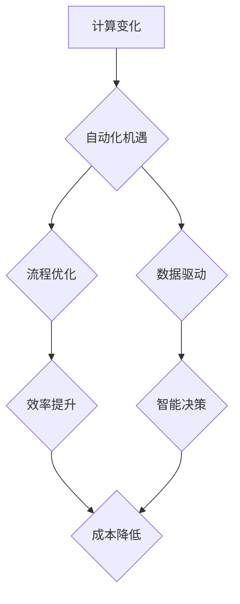

> 自动化、人工智能、机器学习、流程优化、效率提升、数据驱动、软件开发、DevOps

## 1. 背景介绍

在当今科技飞速发展的时代，计算能力的飞跃和数据量的爆炸式增长为自动化带来了前所未有的机遇。自动化技术正在深刻地改变着各个行业，从制造业到金融业，从医疗保健到教育，无处不在。

自动化技术的核心在于利用计算机程序和算法来执行重复性、规则性或复杂的任务，从而解放人力，提高效率，降低成本。随着人工智能（AI）和机器学习（ML）技术的不断发展，自动化技术正在变得更加智能化和精准化，能够处理更复杂的任务，并不断学习和改进。

## 2. 核心概念与联系

**2.1 自动化概念**

自动化是指利用技术手段，使生产、工作或其他过程无需人工干预即可自动完成的过程。它可以分为：

* **规则自动化:** 基于预先定义的规则和流程，自动执行特定任务。例如，电子邮件过滤、数据录入等。
* **智能自动化:** 利用人工智能和机器学习等技术，能够根据数据和环境变化，智能地调整执行策略。例如，自动驾驶、个性化推荐等。

**2.2 流程优化**

流程优化是指通过分析和改进现有流程，提高效率、降低成本、提升质量的过程。自动化技术是流程优化的重要手段，可以帮助企业识别和消除流程中的瓶颈，实现流程的标准化和自动化。

**2.3 数据驱动**

数据驱动是指利用数据分析和机器学习等技术，为决策提供依据，并根据数据反馈进行调整的过程。自动化技术可以帮助企业收集、分析和利用数据，实现数据驱动的决策和流程优化。

**2.4  Mermaid 流程图**



## 3. 核心算法原理 & 具体操作步骤

**3.1 算法原理概述**

自动化技术的核心是算法，算法是解决特定问题的一系列步骤或规则。常见的自动化算法包括：

* **规则引擎:** 基于预先定义的规则，自动执行任务。
* **机器学习算法:** 利用数据训练模型，自动学习和改进执行策略。例如，决策树、支持向量机、神经网络等。

**3.2 算法步骤详解**

以规则引擎为例，其基本步骤如下：

1. **定义规则:** 根据业务需求，定义一系列规则，描述任务执行的条件和操作。
2. **构建规则库:** 将定义的规则存储在规则库中，方便系统调用。
3. **输入数据:** 将需要处理的数据输入到规则引擎中。
4. **匹配规则:** 系统根据输入数据，匹配规则库中的规则。
5. **执行操作:** 匹配到规则后，系统执行规则中定义的操作。

**3.3 算法优缺点**

**规则引擎:**

* **优点:** 易于理解和维护，执行速度快。
* **缺点:** 规则难以表达复杂逻辑，难以适应变化的业务需求。

**机器学习算法:**

* **优点:** 可以学习复杂逻辑，适应变化的业务需求。
* **缺点:** 需要大量数据进行训练，训练过程复杂，难以解释模型决策结果。

**3.4 算法应用领域**

自动化算法广泛应用于各个领域，例如：

* **制造业:** 自动化生产线、机器人控制等。
* **金融业:** 风险管理、欺诈检测、客户服务等。
* **医疗保健:** 疾病诊断、药物研发、患者管理等。
* **教育:** 个性化学习、自动批改作业等。

## 4. 数学模型和公式 & 详细讲解 & 举例说明

**4.1 数学模型构建**

在自动化领域，数学模型可以用来描述系统行为、预测结果、优化决策等。例如，在机器学习中，可以使用线性回归模型来预测连续变量，例如房价、股票价格等。

**4.2 公式推导过程**

线性回归模型的公式如下：

$$y = mx + c$$

其中：

* $y$ 是预测值
* $x$ 是输入变量
* $m$ 是斜率
* $c$ 是截距

**4.3 案例分析与讲解**

假设我们想要预测房屋价格，已知房屋面积和房屋价格的数据集。我们可以使用线性回归模型来建立房屋价格预测模型。

首先，我们需要收集房屋面积和房屋价格的数据，并将其输入到线性回归模型中进行训练。训练过程会自动计算出模型参数 $m$ 和 $c$。

然后，我们可以使用训练好的模型来预测新房子的价格。只需要输入新房子的面积，模型就可以根据公式计算出预测价格。

## 5. 项目实践：代码实例和详细解释说明

**5.1 开发环境搭建**

本项目使用 Python 语言进行开发，需要安装以下软件：

* Python 3.x
* Jupyter Notebook

**5.2 源代码详细实现**

```python
import pandas as pd
from sklearn.linear_model import LinearRegression

# 加载数据
data = pd.read_csv('house_data.csv')

# 划分训练集和测试集
X = data[['面积']]
y = data['价格']

# 创建线性回归模型
model = LinearRegression()

# 训练模型
model.fit(X, y)

# 预测新房子的价格
new_house_area = 100
predicted_price = model.predict([[new_house_area]])

# 打印预测结果
print(f'新房子的预测价格为: {predicted_price[0]}')
```

**5.3 代码解读与分析**

* 首先，我们使用 pandas 库加载数据，并将其转换为 NumPy 数组。
* 然后，我们使用 scikit-learn 库中的 LinearRegression 类创建线性回归模型。
* 接着，我们使用 model.fit() 方法训练模型，将训练数据输入到模型中。
* 训练完成后，我们可以使用 model.predict() 方法预测新房子的价格。

**5.4 运行结果展示**

运行代码后，会输出新房子的预测价格。

## 6. 实际应用场景

**6.1 自动化测试**

自动化测试是指利用软件工具自动执行测试用例，验证软件功能是否正常工作。自动化测试可以提高测试效率，降低测试成本，并确保软件质量。

**6.2 自动化部署**

自动化部署是指利用软件工具自动将软件代码部署到生产环境。自动化部署可以提高部署效率，降低部署风险，并确保软件部署的稳定性。

**6.3 自动化运维**

自动化运维是指利用软件工具自动执行运维任务，例如监控系统状态、修复系统故障、备份数据等。自动化运维可以提高运维效率，降低运维成本，并确保系统稳定运行。

**6.4 未来应用展望**

随着人工智能和机器学习技术的不断发展，自动化技术将应用到更多领域，例如：

* **个性化服务:** 提供个性化的产品推荐、客户服务等。
* **智能制造:** 实现智能工厂，提高生产效率和产品质量。
* **自动驾驶:** 实现无人驾驶汽车，提高交通安全和效率。

## 7. 工具和资源推荐

**7.1 学习资源推荐**

* **书籍:**
    * 《自动化测试》
    * 《DevOps实践指南》
    * 《机器学习实战》
* **在线课程:**
    * Coursera: 自动化测试、DevOps、机器学习
    * Udemy: 自动化测试、DevOps、机器学习

**7.2 开发工具推荐**

* **自动化测试工具:** Selenium, Appium, JUnit
* **自动化部署工具:** Jenkins, GitLab CI, CircleCI
* **自动化运维工具:** Ansible, Puppet, Chef

**7.3 相关论文推荐**

* **自动化测试:**
    * "Automated Software Testing: A Survey"
* **DevOps:**
    * "The Phoenix Project: A Novel About IT, DevOps, and Helping Your Business Win"
* **机器学习:**
    * "Deep Learning"

## 8. 总结：未来发展趋势与挑战

**8.1 研究成果总结**

自动化技术已经取得了显著的成果，在各个领域得到了广泛应用。

**8.2 未来发展趋势**

未来，自动化技术将朝着以下方向发展：

* **更智能化:** 利用人工智能和机器学习技术，使自动化系统更加智能化，能够自主学习和改进。
* **更广泛的应用:** 自动化技术将应用到更多领域，例如医疗保健、教育、金融等。
* **更安全可靠:** 自动化系统需要更加安全可靠，能够应对各种突发事件。

**8.3 面临的挑战**

自动化技术的发展也面临着一些挑战：

* **技术复杂性:** 自动化系统需要复杂的算法和技术支持。
* **数据安全:** 自动化系统需要处理大量数据，数据安全是一个重要的挑战。
* **伦理问题:** 自动化技术可能会带来一些伦理问题，例如工作岗位的替代等。

**8.4 研究展望**

未来，我们需要继续研究和探索自动化技术的应用，并解决其面临的挑战，以更好地利用自动化技术，推动社会发展。

## 9. 附录：常见问题与解答

**9.1 如何选择合适的自动化工具？**

选择合适的自动化工具需要根据具体的需求和场景进行选择。例如，对于自动化测试，可以选择 Selenium 或 Appium 等工具；对于自动化部署，可以选择 Jenkins 或 GitLab CI 等工具。

**9.2 如何保证自动化系统的安全可靠？**

保证自动化系统的安全可靠需要从多个方面进行考虑，例如：

* 使用安全的编程语言和框架。
* 进行代码审查和测试。
* 使用安全的数据库和网络协议。
* 定期备份数据。

**9.3 自动化技术会取代人类工作吗？**

自动化技术可能会改变一些工作内容，但不会完全取代人类工作。人类仍然需要发挥创造力、解决问题的能力和人际交往能力。


作者：禅与计算机程序设计艺术 / Zen and the Art of Computer Programming 
<end_of_turn>