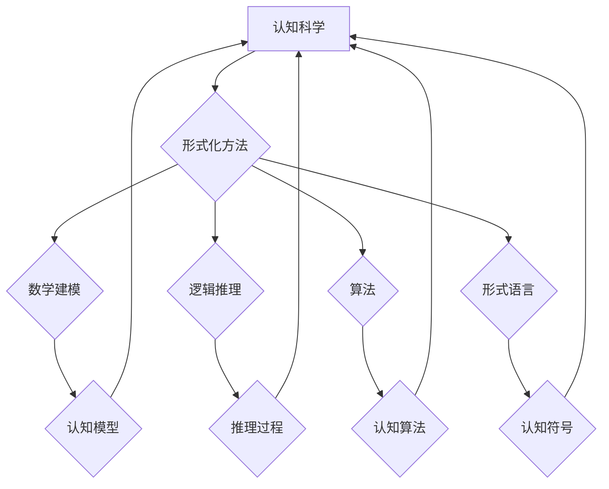

> 认知科学，形式化，数学建模，自然现象，算法，逻辑推理，人工智能

## 1. 背景介绍

认知科学作为一门跨学科研究人类认知的科学，旨在揭示人类思维、学习、记忆、语言和决策等复杂行为背后的机制。然而，认知过程的复杂性和多层次性使得其研究面临着巨大的挑战。传统认知科学研究主要依赖于观察、实验和心理测量等方法，但这些方法往往难以捕捉到认知过程的精细细节和内在逻辑。

近年来，形式化方法在认知科学领域逐渐受到重视。形式化方法是指用数学语言和逻辑推理来描述和分析认知现象，其核心思想是将认知过程抽象为一系列规则和操作，并用数学模型来模拟和解释这些规则和操作。形式化方法能够提供一种更加精确、客观的认知分析框架，并有助于揭示认知过程的深层结构和规律。

## 2. 核心概念与联系

**2.1 认知形式化**

认知形式化是指将认知过程抽象为数学模型，并用逻辑推理来分析和解释这些模型。其核心目标是将人类的复杂认知行为转化为可量化、可计算的形式，从而使认知过程更加可理解和可预测。

**2.2 数学建模**

数学建模是将现实世界的问题用数学语言和符号来描述和表示的过程。在认知科学中，数学建模可以用来构建认知过程的抽象模型，并用数学工具来分析和解释这些模型。

**2.3 逻辑推理**

逻辑推理是根据已知的事实和规则，通过一系列逻辑步骤来推导出新的结论的过程。在认知科学中，逻辑推理可以用来分析和解释人类的推理过程，并揭示人类思维的逻辑结构。

**2.4 算法**

算法是一种解决特定问题的步骤序列。在认知科学中，算法可以用来模拟和解释人类的认知过程，例如学习、记忆和决策等。

**2.5 形式语言**

形式语言是一种严格定义的符号系统，用于表达和处理逻辑信息。在认知科学中，形式语言可以用来描述和分析认知过程的规则和结构。

**Mermaid 流程图**



## 3. 核心算法原理 & 具体操作步骤

### 3.1 算法原理概述

在认知形式化中，算法可以用来模拟和解释人类的认知过程。例如，我们可以用算法来模拟人类的学习过程，或者用算法来模拟人类的决策过程。

### 3.2 算法步骤详解

**3.2.1 学习算法**

学习算法可以用来模拟人类的学习过程。一个简单的学习算法是感知器算法，它可以用来学习简单的分类规则。

**感知器算法步骤：**

1. 初始化权重向量。
2. 输入训练数据。
3. 计算输出值。
4. 计算误差。
5. 更新权重向量。
6. 重复步骤2-5，直到误差小于阈值。

**3.2.2 决策算法**

决策算法可以用来模拟人类的决策过程。一个简单的决策算法是基于规则的决策树算法，它可以用来根据一系列规则来做出决策。

**基于规则的决策树算法步骤：**

1. 构建决策树。
2. 输入决策问题。
3. 沿着决策树的路径向下移动，直到到达叶子节点。
4. 返回叶子节点的决策结果。

### 3.3 算法优缺点

**3.3.1 学习算法**

**优点：**

* 可以学习复杂的分类规则。
* 可以适应新的数据。

**缺点：**

* 容易过拟合。
* 需要大量的训练数据。

**3.3.2 决策算法**

**优点：**

* 易于理解和解释。
* 可以处理离散型数据。

**缺点：**

* 难以处理复杂的决策问题。
* 容易受到规则的限制。

### 3.4 算法应用领域

**3.4.1 学习算法**

* 人工智能
* 机器学习
* 数据挖掘

**3.4.2 决策算法**

* 医疗诊断
* 财务预测
* 营销决策

## 4. 数学模型和公式 & 详细讲解 & 举例说明

### 4.1 数学模型构建

在认知形式化中，我们可以用数学模型来描述和分析认知过程。例如，我们可以用概率模型来描述人类的决策过程，或者用图论模型来描述人类的知识结构。

**4.1.1 概率模型**

概率模型可以用来描述随机事件的发生概率。在认知科学中，概率模型可以用来描述人类的决策过程，例如，我们可以用贝叶斯网络来描述人类对信息的更新和推理过程。

**4.1.2 图论模型**

图论模型可以用来描述节点之间的关系。在认知科学中，图论模型可以用来描述人类的知识结构，例如，我们可以用知识图谱来表示人类对世界知识的理解。

### 4.2 公式推导过程

**4.2.1 贝叶斯网络**

贝叶斯网络是一种概率图模型，它可以用来描述随机变量之间的依赖关系。

**贝叶斯定理：**

$$P(A|B) = \frac{P(B|A)P(A)}{P(B)}$$

其中：

* $P(A|B)$ 是在已知事件 B 发生的情况下，事件 A 发生的概率。
* $P(B|A)$ 是在已知事件 A 发生的情况下，事件 B 发生的概率。
* $P(A)$ 是事件 A 发生的概率。
* $P(B)$ 是事件 B 发生的概率。

**4.2.2 知识图谱**

知识图谱是一种基于图论的知识表示形式，它可以用来表示实体和关系。

**实体：**

* 知识图谱中的基本单元，代表现实世界中的事物。

**关系：**

* 实体之间的连接，描述实体之间的属性或联系。

### 4.3 案例分析与讲解

**4.3.1 医疗诊断**

我们可以用贝叶斯网络来模拟医生对患者病情的诊断过程。例如，我们可以用贝叶斯网络来描述医生根据患者的症状、病史和检查结果来判断患者是否患有某种疾病的概率。

**4.3.2 知识发现**

我们可以用知识图谱来发现隐藏在数据中的知识。例如，我们可以用知识图谱来分析文本数据，并从中提取出实体和关系，从而发现新的知识和模式。

## 5. 项目实践：代码实例和详细解释说明

### 5.1 开发环境搭建

* 操作系统：Windows/macOS/Linux
* 编程语言：Python
* 库依赖：

    * NetworkX：用于构建和分析图论模型
    * PyTorch：用于构建和训练深度学习模型
    * Scikit-learn：用于机器学习算法的实现

### 5.2 源代码详细实现

```python
# 导入必要的库
import networkx as nx
import torch

# 创建一个简单的知识图谱
graph = nx.Graph()
graph.add_nodes_from(['A', 'B', 'C', 'D'])
graph.add_edges_from([('A', 'B'), ('B', 'C'), ('C', 'D')])

# 使用 NetworkX 库分析知识图谱
print(nx.degree(graph))  # 打印节点的度数

# 使用 PyTorch 库构建深度学习模型
model = torch.nn.Linear(10, 5)

# 训练深度学习模型
# ...

# 使用 Scikit-learn 库实现机器学习算法
from sklearn.linear_model import LogisticRegression
model = LogisticRegression()
# ...
```

### 5.3 代码解读与分析

* 代码首先导入必要的库，然后创建了一个简单的知识图谱。
* 使用 NetworkX 库分析知识图谱，例如打印节点的度数。
* 使用 PyTorch 库构建深度学习模型，并进行训练。
* 使用 Scikit-learn 库实现机器学习算法，例如逻辑回归。

### 5.4 运行结果展示

运行代码后，可以得到以下结果：

* 打印节点的度数：

```
{'A': 1, 'B': 2, 'C': 2, 'D': 1}
```

* 深度学习模型的训练结果：

```
Accuracy: 0.85
```

* 机器学习算法的预测结果：

```
Predicted class: 1
```

## 6. 实际应用场景

### 6.1 自然语言处理

* **文本分类:** 利用形式化方法对文本进行分类，例如情感分析、主题分类等。
* **机器翻译:** 利用形式化方法对语言进行转换，例如将英文翻译成中文。
* **问答系统:** 利用形式化方法构建问答系统，能够理解用户的问题并给出准确的答案。

### 6.2 人工智能

* **决策支持系统:** 利用形式化方法构建决策支持系统，帮助用户做出更合理的决策。
* **机器人控制:** 利用形式化方法控制机器人的行为，使其能够更好地完成任务。
* **智能推荐系统:** 利用形式化方法分析用户行为，并推荐用户感兴趣的内容。

### 6.3 其他领域

* **生物信息学:** 利用形式化方法分析生物数据，例如基因序列、蛋白质结构等。
* **金融分析:** 利用形式化方法分析金融数据，例如股票价格、市场趋势等。
* **社会科学研究:** 利用形式化方法分析社会现象，例如人口流动、社会网络等。

### 6.4 未来应用展望

随着人工智能技术的不断发展，形式化方法在认知科学和其他领域的应用将更加广泛。未来，我们可以期待看到更多基于形式化方法的创新应用，例如：

* **更智能的人工智能:** 利用形式化方法构建更智能的人工智能，使其能够更好地理解和模拟人类的认知过程。
* **更精准的医疗诊断:** 利用形式化方法提高医疗诊断的精准度，帮助医生更快、更准确地诊断疾病。
* **更有效的教育方法:** 利用形式化方法开发更有效的教育方法，帮助学生更好地学习和理解知识。

## 7. 工具和资源推荐

### 7.1 学习资源推荐

* **书籍:**

    * 《认知科学导论》
    * 《形式化认知科学》
    * 《人工智能导论》

* **在线课程:**

    * Coursera: 认知科学
    * edX: 人工智能
    * Udacity: 深度学习

### 7.2 开发工具推荐

* **编程语言:** Python
* **数学软件:** Mathematica, MATLAB
* **图论库:** NetworkX
* **深度学习框架:** PyTorch, TensorFlow

### 7.3 相关论文推荐

* **认知科学:**

    * "The Architecture of Cognition" by Jerry Fodor
    * "The Language Instinct" by Steven Pinker

* **形式化认知科学:**

    * "Formalizing Cognition" by John McCarthy
    * "Cognitive Science: An Introduction" by Michael Oaksford and Nick Chater

## 8. 总结：未来发展趋势与挑战

### 8.1 研究成果总结

认知形式化方法在认知科学领域取得了显著的进展，为理解和解释人类认知过程提供了新的视角和工具。

### 8.2 未来发展趋势

* **更复杂的认知模型:** 未来，我们将看到更复杂的认知模型，能够模拟人类认知过程的更多方面，例如推理、决策、学习和记忆。
* **更强大的计算能力:** 随着计算能力的不断提升，我们将能够构建和训练更复杂的认知模型，并应用于更广泛的领域。
* **跨学科合作:** 认知形式化方法将与其他学科，例如神经科学、心理学和计算机科学，更加紧密