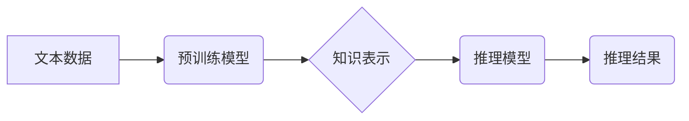

> 大语言模型，推理能力，认知障碍，知识表示，逻辑推理，常识推理

## 1. 背景介绍

近年来，大语言模型（LLM）在自然语言处理领域取得了令人瞩目的成就。从文本生成、翻译到问答和代码编写，LLM展现出强大的能力，甚至被认为是人工智能领域的一项重大突破。然而，尽管LLM在许多任务上表现出色，但它们在推理能力方面仍然存在着显著的局限性。

传统的AI系统通常依赖于明确的规则和逻辑推理来解决问题。而LLM则通过学习海量文本数据，建立起复杂的概率分布，从而生成文本并完成任务。这种基于统计学习的模式虽然在某些情况下表现出色，但它难以捕捉人类的逻辑思维和常识推理能力。

## 2. 核心概念与联系

**2.1  大语言模型 (LLM)**

大语言模型是指在海量文本数据上训练的深度学习模型，能够理解和生成人类语言。它们通常基于Transformer架构，拥有大量的参数，能够捕捉语言的复杂结构和语义关系。

**2.2  推理能力**

推理能力是指根据已知信息推导出新的知识或结论的能力。它包括逻辑推理、常识推理和因果推理等多种类型。

**2.3  认知障碍**

认知障碍是指智能体在理解、记忆、学习和推理等认知功能方面存在缺陷。在LLM领域，认知障碍指的是模型在某些推理任务上表现不佳，例如：

* **逻辑推理缺陷:** 难以解决涉及逻辑关系的推理问题，例如蕴含关系、矛盾关系等。
* **常识推理缺陷:** 缺乏人类的常识知识，难以根据常识推断出新的结论。
* **因果推理缺陷:** 难以理解事件之间的因果关系，难以预测事件的发生结果。

**2.4  知识表示与推理**

知识表示是指将知识以机器可理解的形式表示出来。有效的知识表示可以帮助LLM更好地理解和推理。常见的知识表示方法包括：

* **知识图谱:** 使用节点和边来表示实体和关系。
* **逻辑形式化:** 使用逻辑符号和规则来表示知识。
* **符号表示:** 使用符号来表示实体、属性和关系。

**Mermaid 流程图**



## 3. 核心算法原理 & 具体操作步骤

**3.1  算法原理概述**

LLM的推理能力主要依赖于其强大的语义理解和文本生成能力。通过学习海量文本数据，LLM能够捕捉语言的复杂结构和语义关系，并利用这些知识来进行推理。

常见的LLM推理算法包括：

* **基于检索的推理:** 将问题与知识库中的信息进行匹配，并根据匹配结果生成答案。
* **基于生成式的推理:** 使用生成模型生成推理过程中的中间结果，最终生成答案。
* **基于强化学习的推理:** 使用强化学习算法训练模型，使其能够在推理任务中获得更高的奖励。

**3.2  算法步骤详解**

以基于生成式的推理为例，其步骤如下：

1. **问题分析:** 将输入问题分解成多个子问题，并提取关键信息。
2. **知识检索:** 从知识库中检索与问题相关的知识。
3. **推理过程生成:** 使用生成模型生成推理过程中的中间结果，例如假设、推论等。
4. **答案生成:** 根据推理结果生成最终答案。

**3.3  算法优缺点**

**优点:**

* 能够处理复杂的问题，并生成多样的答案。
* 可以利用现有的知识库和数据进行推理。

**缺点:**

* 训练成本高，需要大量的计算资源和数据。
* 容易受到训练数据的影响，可能产生偏差或错误的推理结果。

**3.4  算法应用领域**

* **问答系统:** 回答用户的问题，提供相关信息。
* **对话系统:** 与用户进行自然语言对话，提供服务或娱乐。
* **文本摘要:** 生成文本的简短摘要。
* **机器翻译:** 将文本从一种语言翻译成另一种语言。

## 4. 数学模型和公式 & 详细讲解 & 举例说明

**4.1  数学模型构建**

LLM的推理能力可以看作是一个概率模型，它将问题和知识表示为向量，并使用神经网络计算它们之间的关系。

**4.2  公式推导过程**

例如，在基于检索的推理中，可以使用余弦相似度来衡量问题和知识库中信息的相似度：

$$
\text{相似度} = \frac{\mathbf{q} \cdot \mathbf{k}}{||\mathbf{q}|| ||\mathbf{k}||}
$$

其中：

* $\mathbf{q}$ 是问题的向量表示。
* $\mathbf{k}$ 是知识库中信息的向量表示。
* $\cdot$ 表示向量点积。
* $||\mathbf{q}||$ 和 $||\mathbf{k}||$ 分别表示向量 $\mathbf{q}$ 和 $\mathbf{k}$ 的长度。

**4.3  案例分析与讲解**

假设我们有一个问题：“苹果是水果吗？”，以及一个知识库包含以下信息：“苹果是一种水果”。

我们可以将问题和知识表示为向量，并使用余弦相似度计算它们的相似度。如果相似度较高，则模型认为问题和知识相关，并可以推断出答案为“是”。

## 5. 项目实践：代码实例和详细解释说明

**5.1  开发环境搭建**

* Python 3.7+
* PyTorch 或 TensorFlow
* NLTK 或 SpaCy

**5.2  源代码详细实现**

```python
import torch
from torch import nn

class LLMInferenceModel(nn.Module):
    def __init__(self, embedding_dim, hidden_dim):
        super(LLMInferenceModel, self).__init__()
        self.embedding = nn.Embedding(vocab_size, embedding_dim)
        self.lstm = nn.LSTM(embedding_dim, hidden_dim)
        self.fc = nn.Linear(hidden_dim, 1)

    def forward(self, input_ids):
        embeddings = self.embedding(input_ids)
        outputs, _ = self.lstm(embeddings)
        logits = self.fc(outputs[:, -1, :])
        return logits

# ... (其他代码)
```

**5.3  代码解读与分析**

* 该代码实现了一个简单的基于LSTM的LLM推理模型。
* 模型首先使用嵌入层将输入的文本ID转换为向量表示。
* 然后，使用LSTM层对向量表示进行编码，捕捉文本的语义信息。
* 最后，使用全连接层将编码后的信息映射到输出，预测推理结果。

**5.4  运行结果展示**

* 模型训练完成后，可以将问题输入模型，并观察模型的输出结果。
* 输出结果可以是概率分布，表示模型对不同答案的置信度。
* 也可以是直接的答案，例如“是”或“否”。

## 6. 实际应用场景

**6.1  问答系统**

LLM可以用于构建问答系统，回答用户的问题，提供相关信息。例如，可以构建一个医疗问答系统，帮助用户了解疾病信息和治疗方案。

**6.2  对话系统**

LLM可以用于构建对话系统，与用户进行自然语言对话，提供服务或娱乐。例如，可以构建一个聊天机器人，帮助用户完成日常任务，例如预约酒店或订餐。

**6.3  文本摘要**

LLM可以用于生成文本的简短摘要，例如新闻文章的摘要或会议记录的摘要。

**6.4  未来应用展望**

随着LLM技术的不断发展，其在推理能力方面的应用场景将会更加广泛。例如，可以用于：

* **自动推理:** 自动化推理过程，例如法律推理、医学诊断等。
* **智能决策:** 基于推理结果进行智能决策，例如投资决策、风险评估等。
* **个性化学习:** 根据用户的学习情况进行个性化推理和知识推荐。

## 7. 工具和资源推荐

**7.1  学习资源推荐**

* **书籍:**
    * 《深度学习》
    * 《自然语言处理》
* **在线课程:**
    * Coursera: 自然语言处理
    * edX: 深度学习

**7.2  开发工具推荐**

* **PyTorch:** 深度学习框架
* **TensorFlow:** 深度学习框架
* **Hugging Face Transformers:** 预训练模型库

**7.3  相关论文推荐**

* 《BERT: Pre-training of Deep Bidirectional Transformers for Language Understanding》
* 《GPT-3: Language Models are Few-Shot Learners》
* 《T5: Text-to-Text Transfer Transformer》

## 8. 总结：未来发展趋势与挑战

**8.1  研究成果总结**

近年来，LLM在推理能力方面取得了显著的进展，但仍然存在一些挑战。

**8.2  未来发展趋势**

* **更强大的模型:** 训练更大规模、更复杂的LLM模型，提高其推理能力。
* **更有效的训练方法:** 开发新的训练方法，例如强化学习，提高模型的推理效率和准确性。
* **更好的知识表示:** 研究更有效的知识表示方法，帮助LLM更好地理解和推理。

**8.3  面临的挑战**

* **数据稀缺:** 训练高质量的LLM模型需要大量的文本数据，而某些领域的文本数据非常稀缺。
* **可解释性:** LLM的推理过程通常是不可解释的，这使得其应用受到限制。
* **安全性和可靠性:** LLM可能存在安全性和可靠性问题，例如生成虚假信息或被恶意利用。

**8.4  研究展望**

未来，LLM的研究将继续朝着更强大、更智能、更安全的方向发展。


## 9. 附录：常见问题与解答

**9.1  LLM的推理能力与人类相比如何？**

LLM的推理能力虽然取得了显著进展，但仍然不如人类。人类能够进行更复杂的逻辑推理、常识推理和因果推理，并且能够根据上下文理解问题和生成更合理的答案。

**9.2  如何提高LLM的推理能力？**

可以通过以下方法提高LLM的推理能力：

* 训练更大规模、更复杂的模型。
* 开发新的训练方法，例如强化学习。
* 研究更有效的知识表示方法。
* 使用更多样化的训练数据。

**9.3  LLM的推理过程是否可解释？**

LLM的推理过程通常是不可解释的，这使得其应用受到限制。目前，研究人员正在探索如何提高LLM的解释性，例如使用可解释机器学习方法或生成推理过程的文本解释。


作者：禅与计算机程序设计艺术 / Zen and the Art of Computer Programming 
<end_of_turn>