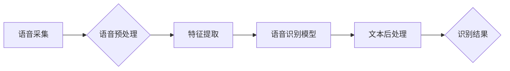

> 语音识别,语音信号处理,机器学习,深度学习,神经网络,语音识别模型,语音识别算法,语音识别代码

## 1. 背景介绍

语音识别技术作为人工智能领域的重要分支，近年来取得了长足的进步，已广泛应用于智能手机、智能家居、车联网、医疗保健等领域。它能够将语音信号转换为文本，为用户提供更加便捷、直观的交互体验。随着语音交互技术的不断发展，语音识别技术也面临着越来越高的要求，例如识别准确率、识别速度、识别多样性等。

## 2. 核心概念与联系

语音识别系统通常由以下几个模块组成：

* **语音采集模块:** 负责采集用户的语音信号。
* **语音预处理模块:** 对采集到的语音信号进行预处理，例如降噪、增益控制、分帧等，以提高语音信号的质量。
* **特征提取模块:** 从预处理后的语音信号中提取特征，例如梅尔频率倒谱系数 (MFCC)、线性预测系数 (LPC) 等，这些特征能够反映语音信号的声学特性。
* **语音识别模型:** 基于提取的语音特征，对语音信号进行识别，将语音信号转换为文本。
* **文本后处理模块:** 对识别结果进行后处理，例如纠错、拼写检查等，以提高识别结果的准确性。

**Mermaid 流程图:**



## 3. 核心算法原理 & 具体操作步骤

### 3.1  算法原理概述

语音识别算法的核心是将语音信号转换为文本。常用的语音识别算法包括：

* **隐马尔可夫模型 (HMM):** HMM 是一种统计模型，用于描述语音信号的时序特征。它假设语音信号是由一系列隐含状态组成的，每个状态对应一个音素或音节。
* **条件随机场 (CRF):** CRF 是一种概率模型，用于描述语音信号的上下文特征。它考虑了语音信号前后文的信息，提高了识别准确率。
* **深度学习:** 深度学习算法，例如循环神经网络 (RNN) 和卷积神经网络 (CNN)，能够学习语音信号的复杂特征，取得了更高的识别准确率。

### 3.2  算法步骤详解

以 HMM 为例，语音识别算法的步骤如下：

1. **语音信号预处理:** 对语音信号进行降噪、增益控制、分帧等处理，以提高语音信号的质量。
2. **特征提取:** 从预处理后的语音信号中提取特征，例如 MFCC、LPC 等。
3. **模型训练:** 使用训练数据训练 HMM 模型，学习语音信号的概率分布。
4. **语音识别:** 将新的语音信号输入到训练好的 HMM 模型中，根据模型的概率分布，预测语音信号对应的文本序列。

### 3.3  算法优缺点

**HMM:**

* **优点:** 算法简单易实现，计算效率高。
* **缺点:** 难以处理语音信号的复杂特征，识别准确率相对较低。

**CRF:**

* **优点:** 能够考虑语音信号的上下文特征，提高识别准确率。
* **缺点:** 算法复杂度较高，计算效率相对较低。

**深度学习:**

* **优点:** 能够学习语音信号的复杂特征，识别准确率高。
* **缺点:** 算法复杂度较高，训练数据量大，计算资源需求高。

### 3.4  算法应用领域

语音识别算法广泛应用于以下领域：

* **智能语音助手:** 例如 Siri、Alexa、Google Assistant 等，能够理解用户的语音指令，并执行相应的操作。
* **语音搜索:** 例如语音搜索引擎，能够理解用户的语音查询，并返回相关的搜索结果。
* **语音翻译:** 例如语音翻译软件，能够将语音信号翻译成其他语言。
* **语音识别系统:** 例如自动语音识别 (ASR) 系统，能够将语音信号转换为文本，用于各种应用场景，例如会议记录、语音转录等。

## 4. 数学模型和公式 & 详细讲解 & 举例说明

### 4.1  数学模型构建

**HMM 模型:**

HMM 模型由以下三个核心组成部分：

* **状态集 (S):** 表示语音信号可能存在的隐含状态集合。
* **观测集 (O):** 表示语音信号的观测值集合，例如 MFCC 特征。
* **状态转移概率矩阵 (A):** 描述不同状态之间的转移概率。
* **观测概率矩阵 (B):** 描述每个状态下观测值的概率。

**公式:**

* 状态转移概率: $a_{ij} = P(q_t = j | q_{t-1} = i)$
* 观测概率: $b_j(o_t) = P(o_t | q_t = j)$

**举例说明:**

假设语音信号可能存在三个隐含状态: 

* $S_1$: 辅音
* $S_2$: 元音
* $S_3$: 停顿

则状态转移概率矩阵 A 可以表示为:

```
A = [
    [0.7, 0.2, 0.1],
    [0.1, 0.8, 0.1],
    [0.2, 0.1, 0.7]
]
```

表示从状态 $S_1$ 转移到状态 $S_2$ 的概率为 0.2，从状态 $S_2$ 转移到状态 $S_3$ 的概率为 0.1 等。

### 4.2  公式推导过程

**Viterbi 算法:**

Viterbi 算法是一种用于寻找最优路径的动态规划算法，常用于 HMM 模型的解码过程。

**公式:**

* $V_t(i) = max_{j} [V_{t-1}(j) * a_{ji} * b_i(o_t)]$

**举例说明:**

假设语音信号的观测值序列为 $O = \{o_1, o_2, o_3\}$, 则 Viterbi 算法的解码过程可以表示为:

1. 初始化: $V_1(i) = b_i(o_1)$
2. 迭代: 对于 $t = 2, 3, ..., T$, 计算 $V_t(i)$
3. 最优路径: $q^* = argmax_{i} V_T(i)$

### 4.3  案例分析与讲解

**案例:**

假设语音信号的观测值序列为 $O = \{o_1, o_2, o_3\}$, 并且已训练好的 HMM 模型的参数。

**分析:**

使用 Viterbi 算法解码语音信号，可以得到最优路径 $q^* = \{i_1, i_2, i_3\}$, 其中 $i_1, i_2, i_3$ 分别表示最优路径上的状态。

**讲解:**

Viterbi 算法通过动态规划的方式，寻找最优路径，从而实现语音信号的识别。

## 5. 项目实践：代码实例和详细解释说明

### 5.1  开发环境搭建

* **操作系统:** Ubuntu 18.04
* **编程语言:** Python 3.6
* **深度学习框架:** TensorFlow 2.0
* **语音处理库:** Librosa

### 5.2  源代码详细实现

```python
import librosa
import numpy as np
from tensorflow.keras.models import Sequential
from tensorflow.keras.layers import LSTM, Dense

# 加载语音数据
audio_file = 'speech.wav'
y, sr = librosa.load(audio_file)

# 提取 MFCC 特征
mfccs = librosa.feature.mfcc(y=y, sr=sr, n_mfcc=40)

# 将 MFCC 特征转换为训练数据
X = mfccs.T
y = np.array([0, 1, 2]) # 假设语音信号有三种类别

# 建立深度学习模型
model = Sequential()
model.add(LSTM(units=128, return_sequences=True, input_shape=(X.shape[0], X.shape[1])))
model.add(LSTM(units=64))
model.add(Dense(units=3, activation='softmax'))

# 编译模型
model.compile(optimizer='adam', loss='sparse_categorical_crossentropy', metrics=['accuracy'])

# 训练模型
model.fit(X, y, epochs=10)

# 预测语音信号的类别
predictions = model.predict(X)
```

### 5.3  代码解读与分析

* **语音数据加载:** 使用 Librosa 库加载语音文件，并提取语音信号的采样率。
* **特征提取:** 使用 MFCC 特征提取语音信号的声学特性。
* **数据预处理:** 将 MFCC 特征转换为训练数据，并定义语音信号的类别。
* **模型构建:** 使用 TensorFlow 库构建深度学习模型，包括 LSTM 层和 Dense 层。
* **模型训练:** 使用 Adam 优化器和交叉熵损失函数训练模型。
* **模型预测:** 使用训练好的模型预测语音信号的类别。

### 5.4  运行结果展示

运行代码后，可以得到模型的训练结果和预测结果。

## 6. 实际应用场景

### 6.1  智能语音助手

智能语音助手，例如 Siri、Alexa、Google Assistant 等，能够理解用户的语音指令，并执行相应的操作，例如播放音乐、设置闹钟、查询天气等。

### 6.2  语音搜索

语音搜索引擎，例如 Google 语音搜索、百度语音搜索等，能够理解用户的语音查询，并返回相关的搜索结果。

### 6.3  语音翻译

语音翻译软件，例如 Google 翻译、微软 Translator 等，能够将语音信号翻译成其他语言。

### 6.4  未来应用展望

语音识别技术在未来将有更广泛的应用场景，例如：

* **医疗保健:** 用于语音诊断、远程医疗等。
* **教育:** 用于语音识别、语音辅助学习等。
* **金融:** 用于语音识别、语音支付等。
* **娱乐:** 用于语音游戏、语音互动等。

## 7. 工具和资源推荐

### 7.1  学习资源推荐

* **书籍:**
    * 《语音信号处理》
    * 《深度学习》
* **在线课程:**
    * Coursera: Speech Recognition
    * edX: Deep Learning Specialization

### 7.2  开发工具推荐

* **语音处理库:** Librosa, PyAudio
* **深度学习框架:** TensorFlow, PyTorch
* **语音识别引擎:** Kaldi, CMU Sphinx

### 7.3  相关论文推荐

* **Speech Recognition with Deep Neural Networks**
* **Acoustic Modeling Using Deep Belief Networks**
* **End-to-End Speech Recognition with Deep Neural Networks**

## 8. 总结：未来发展趋势与挑战

### 8.1  研究成果总结

语音识别技术近年来取得了长足的进步，特别是深度学习技术的应用，使得语音识别准确率大幅提升。

### 8.2  未来发展趋势

* **更准确的语音识别:** 随着深度学习技术的不断发展，语音识别准确率将进一步提升。
* **更鲁棒的语音识别:** 语音识别系统将能够更好地应对噪声、背景干扰等复杂环境。
* **更个性化的语音识别:** 语音识别系统将能够根据用户的语音特征进行个性化定制。
* **跨语言语音识别:** 语音识别系统将能够识别多种语言。

### 8.3  面临的挑战

* **数据标注:** 语音识别模型需要大量的标注数据，数据标注成本高昂。
* **计算资源:** 深度学习模型训练需要大量的计算资源。
* **模型解释性:** 深度学习模型的决策过程难以解释，这对于语音识别应用的信任度和安全性是一个挑战。

### 8.4  研究展望

未来研究方向包括:

* **无监督语音识别:** 减少对标注数据的依赖。
* **高效的语音